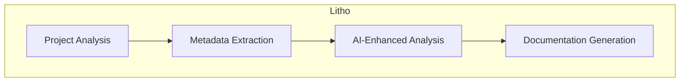
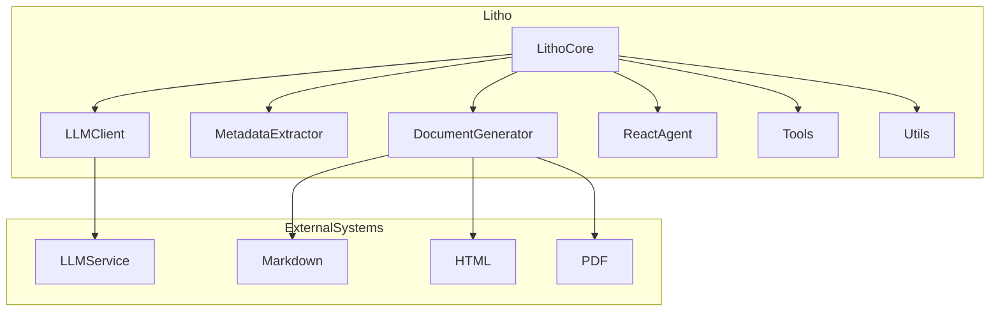

<p align="center">
  
</p>
<h3 align="center">Litho (deepwiki-rs)</h3>

<p align="center">
    <a href="./README.md">English</a>
    |
    <a href="./README_zh.md">中文</a>
</p>

<p align="center">🛠️ A high-performance, <strong>AI-driven</strong> architecture documentation generator based on <strong>Rust</strong>.</p>
<p align="center">📚 Automatically generates professional <strong>C4 architecture documentation</strong> for any software project.</p>
<p align="center">
  
  
</p>
<hr />

> 🚀 Help me develop this software better by [sponsoring on GitHub](https://github.com/sponsors/sopaco)


# 👋 What's Litho
**Litho** (also known as deepwiki-rs) is a powerful Rust-based tool designed to automate the generation of software architecture documentation. Leveraging advanced AI capabilities, Litho intelligently analyzes project structures, identifies core components, parses dependency relationships, and generates professional C4 architecture documentation automatically.

**Litho** is completely free and open-source, making it an ideal solution for teams looking to maintain up-to-date architecture documentation without the manual effort. By using large language models (LLMs), Litho provides insightful analysis and clear documentation that helps developers understand complex codebases more easily.

❤️ Like **Litho**? Star it 🌟 or [Sponsor Me](https://github.com/sponsors/sopaco)! ❤️

**Note: Installation and Usage Instructions**

📖 For installation details and configuration methods, please refer to the [**Documentation**](#documentation).

# 🌠 Key Features

- **Automated Documentation Generation**: Automatically generates comprehensive C4 architecture documentation by analyzing project code, reducing manual documentation efforts.
- **AI-Powered Analysis**: Utilizes large language models (LLMs) with ReAct pattern for intelligent analysis, accurately identifying core components and architectural patterns in projects.
- **Multi-Format Output**: Supports generating documentation in multiple formats including Markdown and HTML to meet different needs and scenarios.
- **Extensibility**: Modular design with a plugin system supports extension and customization for different project types and requirements.
- **Multi-Language Support**: Capable of analyzing projects written in various programming languages including Rust, Python, JavaScript/TypeScript, Java, C/C++, and Go.
- **Dependency Visualization**: Extracts and visualizes file and function dependency relationships to help understand codebase structure.
- **Component Identification**: Automatically identifies and analyzes core components within a project, calculating importance scores based on various metrics.
- **Architecture Detection**: Recognizes common architectural patterns such as MVC, layered architecture, and microservices.

# 🧠 How it works

**Litho** follows a systematic approach to generate architecture documentation:

1. **Project Analysis**: First, Litho scans the project structure, identifies files and directories, and performs initial analysis.
2. **Metadata Extraction**: The tool extracts detailed metadata including component information, dependency relationships, and structural details.
3. **AI-Enhanced Analysis**: Using large language models, Litho performs in-depth analysis of code components, their functionality, and relationships.
4. **Documentation Generation**: Finally, Litho generates comprehensive architecture documentation in the requested format(s), including diagrams and detailed descriptions.



# 🏗️ Architecture Overview

**Litho** is built with a modular architecture designed for extensibility and performance. The system consists of several key components working together:



## Core Components

- **LLM Client**: Handles communication with large language models for intelligent analysis.
- **Metadata Extractor**: Extracts project structure, dependencies, and component information.
- **Document Generator**: Transforms analyzed data into professional documentation in various formats.
- **ReAct Agent**: Implements the ReAct pattern for systematic exploration and analysis of codebases.
- **Tools**: Provides various utility tools for code analysis, architecture detection, and file exploration.
- **Utils**: Offers common utilities for file system operations, string processing, and more.

# 🖥 Getting Started

### Prerequisites
- [**Rust**](https://www.rust-lang.org) (version 2024 or later)
- [**Cargo**](https://doc.rust-lang.org/cargo/)
- Internet connection (for LLM integration)

### Installation

1. Clone the repository.
    ```sh
    git clone https://github.com/sopaco/deepwiki-rs.git
    ```
2. Step into the cloned project folder.
    ```sh
    cd deepwiki-rs
    ```
3. Build the project.
    ```sh
    cargo build --release
    ```
4. The compiled binary will be available in the `target/release` directory.

# 🚀 Usage

**Litho** provides a command-line interface for generating architecture documentation. Here are some basic usage examples:

### Basic Command

```sh
litho --project <path-to-project> --output <output-directory>
```

### Advanced Options

- Specify documentation format (Markdown or HTML):
  ```sh
  litho --project <path-to-project> --output <output-directory> --format markdown,html
  ```

- Configure LLM settings:
  ```sh
  litho --project <path-to-project> --output <output-directory> --llm-api <api-url> --llm-key <api-key>
  ```

- Customize component detection:
  ```sh
  litho --project <path-to-project> --output <output-directory> --config <path-to-config-file>
  ```

For more detailed usage information, run:
```sh
litho --help
```

# 🤝 Contribute

Help improve Litho by reporting bugs or submitting feature requests through [GitHub Issues](https://github.com/sopaco/deepwiki-rs/issues).

## Ways to Contribute

- Implement support for additional programming languages
- Enhance the component detection algorithms
- Add new documentation formats
- Improve the visualization of architecture diagrams
- Contribute to the internationalization of the project

# ⚛️ Developed with

- [rust](https://github.com/rust-lang/rust)
- [clap](https://github.com/clap-rs/clap)
- [tokio](https://github.com/tokio-rs/tokio)
- [serde](https://github.com/serde-rs/serde)
- [reqwest](https://github.com/seanmonstar/reqwest)
- [anyhow](https://github.com/dtolnay/anyhow)
- [thiserror](https://github.com/dtolnay/thiserror)

# 🪪 License
**MIT**. A copy of the license is provided in the [LICENSE](./LICENSE) file.

# 👨 About Me

> 🚀 Help me develop this software better by [sponsoring on GitHub](https://github.com/sponsors/sopaco)

An experienced internet veteran, having navigated through the waves of PC internet, mobile internet, and AI applications. Starting from an individual mobile application developer to a professional in the corporate world, I possess rich experience in product design and research and development. Currently, I am employed at [Kuaishou](https://en.wikipedia.org/wiki/Kuaishou), focusing on the R&D of universal front-end systems and AI exploration.

WeChat: dokhell

Email: dokhell@hotmail.com
