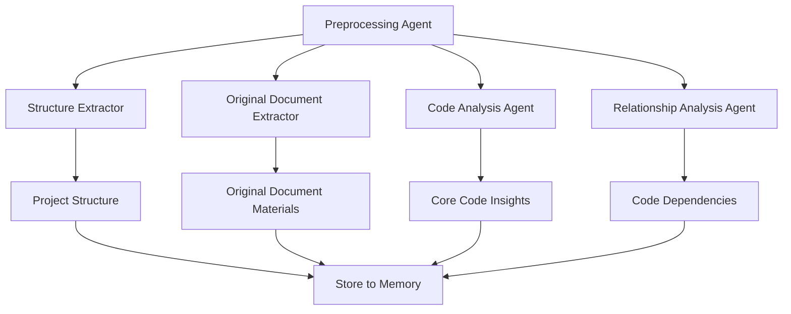
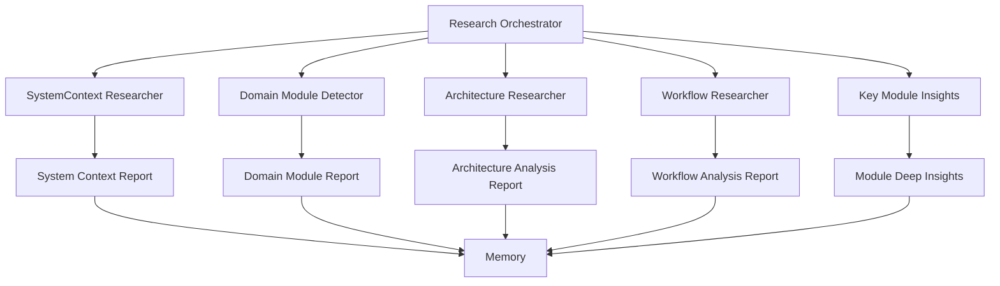
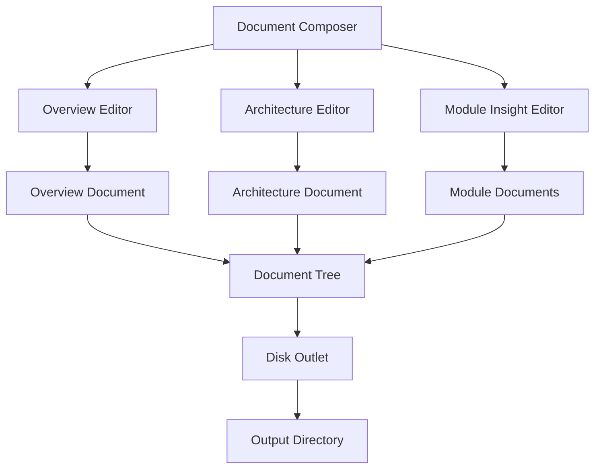
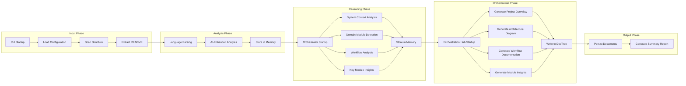
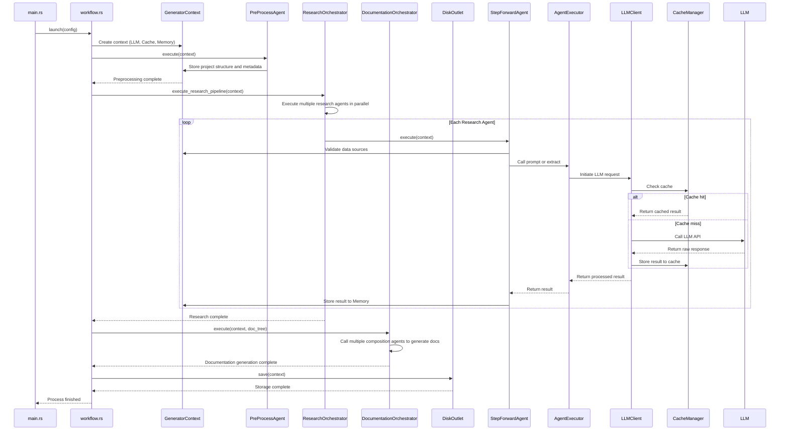

<p align="center">
<p align="center">
  
</p>
<h3 align="center">Litho (deepwiki-rs)</h3>

<p align="center">
    <a href="./README.md">English</a>
    |
    <a href="./README_zh.md">中文</a>
</p>

<p align="center">💪🏻 High-performance <strong>AI-driven</strong> intelligent document generator (DeepWiki-like) built with <strong>Rust</strong></p>
<p align="center">📚 Automatically generates high quality <strong>Repo-Wiki</strong> for any software projects</p>
<p align="center">
  <a href="./docs/1、项目概述.md"></a>
  <a href="https://crates.io/crates/deepwiki-rs"></a>
  <a href=""></a>
  
</p>
<hr />

> 🚀 Help me develop this software better by [sponsoring on GitHub](https://github.com/sponsors/sopaco)


# 👋 What's Litho
**Litho** (also known as **deepwiki-rs**) is a high-performance AI-driven documentation engine that automatically generates Repo-Wiki for your software projects. Built with Rust for performance and reliability, Litho helps teams maintain up-to-date technical documentation with minimal effort.

**Litho** employs a multi-engine workflow based on static code analysis and AI Multi-Agents, combining static code analysis with large language model (LLM) intelligence. The system uses specialized AI agents to conduct deep research on system context, architecture patterns, business workflows, and core module insights, ultimately generating comprehensive documentation including overview, architecture, and detailed technical topic documentation.

# 😺 Why use Litho
- Save hours/week on manual documentation
- Keep documentation in sync with code
- Get consistent, professional documentation
- Understand complex projects faster

🌟 **For:**
- Development teams of all sizes
- Open source projects
- Enterprise software developers
- Anyone who hates maintaining outdated docs!

❤️ Like **Litho**? Star it 🌟 or [Sponsor Me](https://github.com/sponsors/sopaco)! ❤️

**Thanks to the kind people**

[](https://github.com/sopaco/deepwiki-rs/stargazers)

# 🌠 Features & Capabilities

### Core Capabilities

- **AI Automated Documentation**: Generate project overview, architecture diagrams, and deep dives
- **Multi-Language Support**: 10+ languages including Rust, Python, JavaScript, Java, and more
- **C4 Model Compliance**: Professional architecture documentation standard
- **ReAct Pattern Integration**: Advanced AI reasoning for deep code analysis

### Advanced Features

- Parallel processing for large codebases
- Smart caching to reduce LLM calls
- Customizable output formats
- Extensible architecture for new language processors

## 💡 Problem Solved

**The documentation dilemma:**
- Outdated docs that don't match the code
- Time-consuming manual documentation
- Lack of architecture overview
- Inconsistent documentation styles

**Litho solves this by:**
- Continuously updating docs as code changes
- Generating consistent, professional documentation
- Providing both high-level overviews and detailed deep dives
- Automating the tedious work of documentation

# 🧠 How it works
[![zread](https://img.shields.io/badge/Ask_Zread-_.svg?style=flat&color=00b0aa&labelColor=000000&logo=data%3Aimage%2Fsvg%2Bxml%3Bbase64%2CPHN2ZyB3aWR0aD0iMTYiIGhlaWdodD0iMTYiIHZpZXdCb3g9IjAgMCAxNiAxNiIgZmlsbD0ibm9uZSIgeG1sbnM9Imh0dHA6Ly93d3cudzMub3JnLzIwMDAvc3ZnIj4KPHBhdGggZD0iTTQuOTYxNTYgMS42MDAxSDIuMjQxNTZDMS44ODgxIDEuNjAwMSAxLjYwMTU2IDEuODg2NjQgMS42MDE1NiAyLjI0MDFWNC45NjAxQzEuNjAxNTYgNS4zMTM1NiAxLjg4ODEgNS42MDAxIDIuMjQxNTYgNS42MDAxSDQuOTYxNTZDNS4zMTUwMiA1LjYwMDEgNS42MDE1NiA1LjMxMzU2IDUuNjAxNTYgNC45NjAxVjIuMjQwMUM1LjYwMTU2IDEuODg2NjQgNS4zMTUwMiAxLjYwMDEgNC45NjE1NiAxLjYwMDFaIiBmaWxsPSIjZmZmIi8%2BCjxwYXRoIGQ9Ik00Ljk2MTU2IDEwLjM5OTlIMi4yNDE1NkMxLjg4ODEgMTAuMzk5OSAxLjYwMTU2IDEwLjY4NjQgMS42MDE1NiAxMS4wMzk5VjEzLjc1OTlDMS42MDE1NiAxNC4xMTM0IDEuODg4MSAxNC4zOTk5IDIuMjQxNTYgMTQuMzk5OUg0Ljk2MTU2QzUuMzE1MDIgMTQuMzk5OSA1LjYwMTU2IDE0LjExMzQgNS42MDE1NiAxMy43NTk5VjExLjAzOTlDNS42MDE1NiAxMC42ODY0IDUuMzE1MDIgMTAuMzk5OSA0Ljk2MTU2IDEwLjM5OTlaIiBmaWxsPSIjZmZmIi8%2BCjxwYXRoIGQ9Ik0xMy43NTg0IDEuNjAwMUgxMS4wMzg0QzEwLjY4NSAxLjYwMDEgMTAuMzk4NCAxLjg4NjY0IDEwLjM5ODQgMi4yNDAxVjQuOTYwMUMxMC4zOTg0IDUuMzEzNTYgMTAuNjg1IDUuNjAwMSAxMS4wMzg0IDUuNjAwMUgxMy43NTg0QzE0LjExMTkgNS42MDAxIDE0LjM5ODQgNS4zMTM1NiAxNC4zOTg0IDQuOTYwMVYyLjI0MDFDMTQuMzk4NCAxLjg4NjY0IDE0LjExMTkgMS42MDAxIDEzLjc1ODQgMS42MDAxWiIgZmlsbD0iI2ZmZiIvPgo8cGF0aCBkPSJNNCAxMkwxMiA0TDQgMTJaIiBmaWxsPSIjZmZmIi8%2BCjxwYXRoIGQ9Ik00IDEyTDEyIDQiIHN0cm9rZT0iI2ZmZiIgc3Ryb2tlLXdpZHRoPSIxLjUiIHN0cm9rZS1saW5lY2FwPSJyb3VuZCIvPgo8L3N2Zz4K&logoColor=ffffff)](https://zread.ai/sopaco/deepwiki-rs)

**Litho**'s documentation generation process is divided into four distinct phases: preprocessing, research, composition, and output. Each phase is executed by specialized agents, forming a pipeline-style workflow.

## Four-Stage Processing Pipeline

1. **Preprocessing Stage**: Extracts project structure, analyzes code files with language-specific processors, and identifies core modules and dependencies.
2. **Research Stage**: Deploys multiple specialized AI agents to conduct deep analysis:
   - **System Context Researcher**: Analyzes overall system context and external integrations
   - **Architecture Researcher**: Identifies architectural patterns and design principles
   - **Workflow Researcher**: Reconstructs business processes and data flows
   - **Domain Module Detector**: Discovers and analyzes domain-specific modules
3. **Compose Stage**: Intelligent document editors synthesize research findings into professional documentation:
   - **Overview Editor**: Generates project overview and core functionality documentation
   - **Architecture Editor**: Creates comprehensive architecture documentation
   - **Key Modules Insight Editor**: Produces detailed core modules documentation
4. **Output Stage**: Formats and outputs the final documentation in the requested format.

### Preprocessing Stage

This stage is responsible for extracting basic metadata from the project to provide input for subsequent AI analysis.



### Research Stage

This stage conducts multi-level deep research on the project through multiple agents running in parallel.



### Composition and Output Stage

The final stage integrates research results into final documentation and persists it to disk.



# 🏗️ Architecture Overview

**Litho** features a sophisticated modular architecture designed for high performance, extensibility, and intelligent analysis. The system implements a multi-stage workflow with specialized AI agents and comprehensive caching mechanisms.



## Core Modules

- **Generator Workflow**: Orchestrates the entire four-stage documentation generation pipeline
- **Language Processor System**: Supports 10+ programming languages with dedicated processors for Rust, Python, JavaScript/TypeScript, Java, Kotlin, React, Vue, Svelte, and more
- **Multi-Agent Research System**: Specialized AI agents for deep project analysis using ReAct pattern
- **Intelligent Document Composers**: AI-powered editors that synthesize research findings into professional technical documentation
- **ReAct Executor LLM Client**: Advanced LLM integration supporting reasoning and action loops with tool usage
- **High-Speed Cache & Context Memory System**: Performance optimization with intelligent caching and memory management
- **File System Tools**: Comprehensive file exploration and reading capabilities for project analysis

## Core Process
Litho's execution process follows a clear pipeline pattern: `Preprocessing` → `Deep Research` → `Document Composition` → `Output Storage`. The entire process is driven by the `launch` function and injects all dependencies through `GeneratorContext`.



# 🖥 Getting Started

### Prerequisites
- [**Rust**](https://www.rust-lang.org) (version 2024 or later)
- [**Cargo**](https://doc.rust-lang.org/cargo/)
- Internet connection (for LLM integration)

### Installation

#### Option 1: Install from crates.io (Recommended)

The easiest way to install Litho is directly from crates.io:

```sh
cargo install deepwiki-rs
```

After installation, you can use `deepwiki-rs` command directly:

```sh
deepwiki-rs --help
```

#### Option 2: Build from Source

1. Clone the repository.
    ```sh
    git clone https://github.com/sopaco/deepwiki-rs.git
    ```
2. Step into the cloned project folder.
    ```sh
    cd deepwiki-rs
    ```
3. Build the project.
    ```sh
    cargo build --release
    ```
4. The compiled binary will be available in the `target/release` directory.

# 🚀 Usage

**Litho** provides a command-line interface for generating architecture documentation. Here are some basic usage examples:

### Basic Command

```sh
# Generate project knowledge & technical documentation for current directory
litho

# Analyze specific project directory
litho -p /path/to/your/project

# Specify output directory
litho -o ./architecture-docs

# Specify project name
litho --name "My Project"
```

### Documentation Generation

**Litho** generates professional project knowledge & technical documentation with the following structure:

- `1. Project Overview`: Project overview, core functionality, and technology stack analysis
- `2. Architecture Overview`: Comprehensive architecture design, core processes, and module breakdown
- `3. Workflow Overview`: Comprehensive architecture design, core processes, and module breakdown
- `4. Deep Dive/`: Detailed technical topic implementation documentation for each identified core modules topic
- `__Litho_Summary_Brief__.md`: Generation process summary brief
- `__Litho_Summary_Detail__.md`: Generation process execution details

```sh
# Generate complete project knowledge & technical documentation
litho -p ./my-project

# Generate with custom project name
litho --name "My Awesome Project" -o ./my-docs
```

### Advanced Options
- Configure LLM settings:
  ```sh
  litho --llm-api-base-url <api-url> --llm-api-key <api-key> --model-efficient <model-name> --model-powerful <model-name> --llm-provider <provider>
  ```

  Supported providers (default: `openai`):
  - `openai`: OpenAI's API
  - `mistral`: Mistral AI's API
  - `openrouter`: OpenRouter's API
  - `anthropic`: Anthropic's API
  - Compatible providers (OpenAI-compatible APIs): `moonshot`, `deepseek`, etc.

- Skip specific stages:
  ```sh
  litho --skip-preprocessing  # Skip preprocessing stage
  litho --skip-research      # Skip research stage
  litho --skip-documentation # Skip documentation stage
  ```

- Advanced configuration:
  ```sh
  litho --config <config-file> --max-tokens 4000 --temperature 0.7 --max-parallels 4 --no-cache --force-regenerate --enable-preset-tools
  ```

## 📁 Output Structure

Litho generates comprehensive project knowledge & technical documentation structure:

```
project-docs/
├── 1. Project Overview      # Project overview, core functionality, technology stack
├── 2. Architecture Overview # Overall architecture, core processes, module breakdown
├── 3. Workflow Overview     # Overall architecture, core processes, module breakdown
├── 4. Deep Dive/            # Detailed technical topic implementation documentation
│   ├── Topic1.md
│   ├── Topic2.md
│   └── ...
```

# 🤝 Contribute

Help improve Litho by reporting bugs or submitting feature requests through [GitHub Issues](https://github.com/sopaco/deepwiki-rs/issues).

## Ways to Contribute

- **Language Processor Development**: Add support for additional programming languages by implementing the `LanguageProcessor` trait
- **AI Agent Enhancement**: Improve existing research agents or develop new specialized analysis agents
- **Documentation Format Extension**: Add support for new output formats beyond Markdown and HTML
- **Performance Optimization**: Enhance caching strategies and parallel processing capabilities
- **Tool Integration**: Extend the ReAct pattern with additional tools for code analysis
- **Architecture Pattern Recognition**: Improve the detection of architectural patterns and design principles
- **International Support**: Contribute to multi-language documentation generation capabilities

# ⚛️ Developed with

- [rust](https://github.com/rust-lang/rust) - Systems programming language for performance and safety
- [rig-core](https://github.com/0xPlaygrounds/rig) - Rust library for building LLM-powered applications
- [tokio](https://github.com/tokio-rs/tokio) - Asynchronous runtime for Rust
- [clap](https://github.com/clap-rs/clap) - Command line argument parser
- [serde](https://github.com/serde-rs/serde) - Serialization framework
- [anyhow](https://github.com/dtolnay/anyhow) - Error handling
- [thiserror](https://github.com/dtolnay/thiserror) - Derive macros for error handling
- [walkdir](https://github.com/BurntSushi/walkdir) - Directory traversal
- [regex](https://github.com/rust-lang/regex) - Regular expressions
- [markdown](https://github.com/wooorm/markdown-rs) - Markdown processing

# 🪪 License
**MIT**. A copy of the license is provided in the [LICENSE](./LICENSE) file.

# 👨 About Me

> 🚀 Help me develop this software better by [sponsoring on GitHub](https://github.com/sponsors/sopaco)

An experienced internet veteran, having navigated through the waves of PC internet, mobile internet, and AI applications. Starting from an individual mobile application developer to a professional in the corporate world, I possess rich experience in product design and research and development. Currently, I am employed at [Kuaishou](https://en.wikipedia.org/wiki/Kuaishou), focusing on the R&D of universal front-end systems and AI exploration.

WeChat: dokhell

Email: dokhell@hotmail.com
