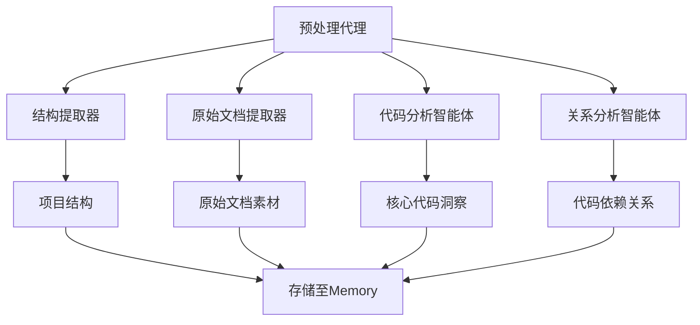
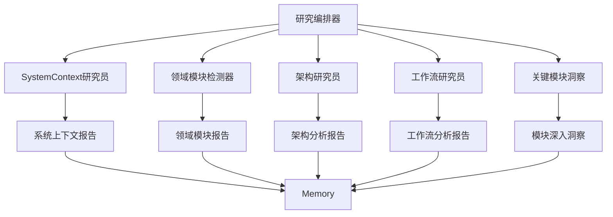
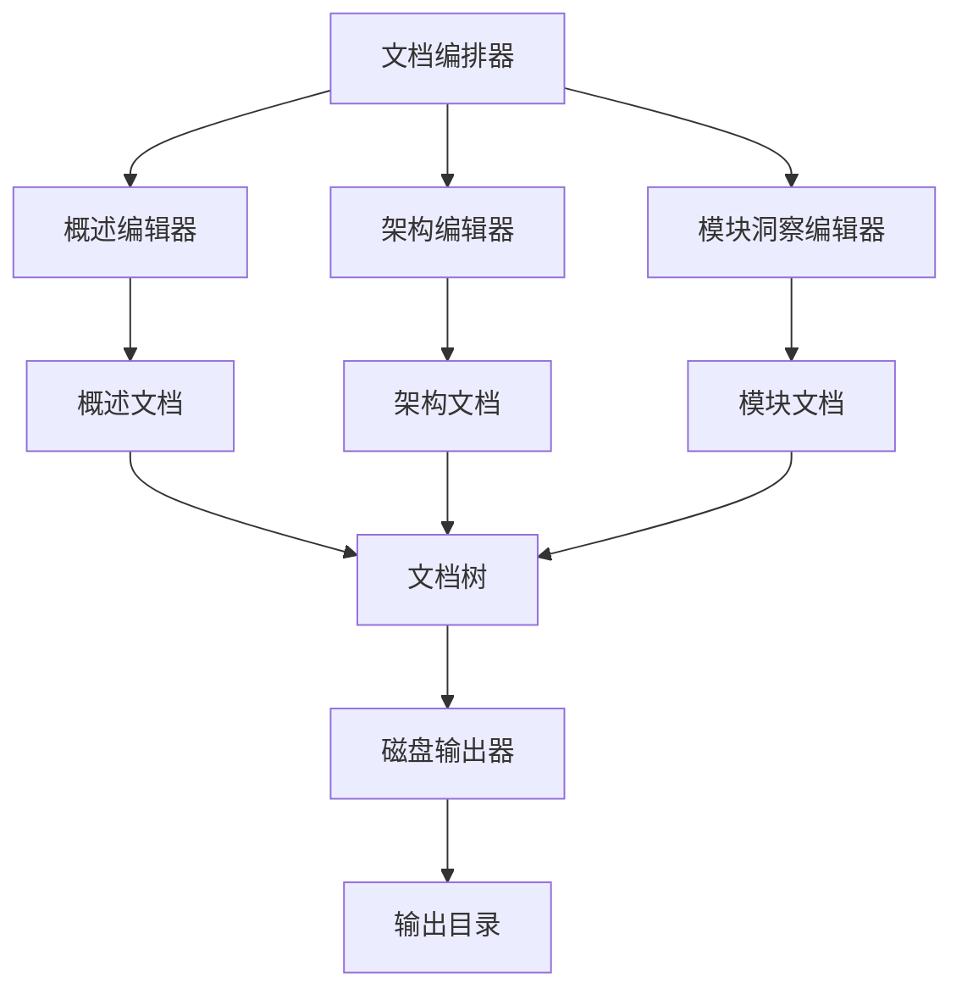
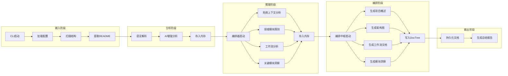
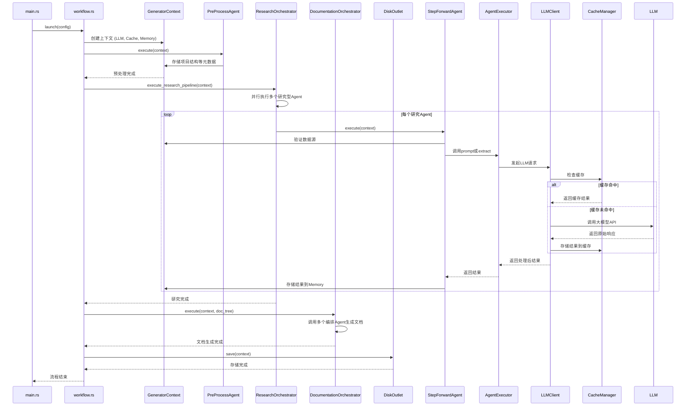

<p align="center">
  
</p>
<h3 align="center">Litho (deepwiki-rs)</h3>

<p align="center">
    <a href="./README.md">English</a>
    |
    <a href="./README_zh.md">中文</a>
</p>

<p align="center">💪🏻 基于<strong>Rust</strong>的高性能<strong>AI驱动</strong>文档智能生成引擎（类DeepWiki）</p>
<p align="center">📚 自动为任何软件项目生成专业的<strong>C4风格项目架构文档</strong></p>
<p align="center">
  <a href="./docs/1、项目概述.md"></a>
  <a href="https://crates.io/crates/deepwiki-rs"></a>
  <a href=""></a>
  
</p>
<hr />

# 👋 Litho是什么
**Litho**（也称为deepwiki-rs）是一个基于Rust的高性能AI文档生成引擎，能够自动为软件项目创建全面的技术说明文档。通过先进的AI分析能力，Litho智能地探索项目结构，识别核心模块，分析依赖关系，并生成专业的架构文档。

**Litho**采用基于静态代码分析 与 AI Multi-Agents的多引擎工作流，将静态代码分析与大型语言模型（LLM）智能相结合。系统使用专门的AI智能体对系统上下文、架构模式、业务工作流和核心模块洞察进行深度研究，最终生成包含概述、架构和详细的技术主题说明文档。

❤️ 喜欢 **Litho**? 点亮小星星 🌟 或 [赞助](https://github.com/sponsors/sopaco)! ❤️

# 🌠 功能与特性

- **AI驱动多阶段工作流**：实现四阶段流水线（预处理 → 研究 → 编排 → 输出），配备专门的AI智能体进行全面项目分析。
- **项目知识与技术说明文档生成**：生成专业的C4架构风格文档，包括项目概览、技术架构和详细的Deep Dive智能主题文档。
- **多智能体研究系统**：部署专门的AI智能体进行系统上下文分析、架构模式识别、业务工作流重建和核心模块洞察。
- **全面语言支持**：内置对10+种编程语言的处理器，包括Rust、Python、JavaScript/TypeScript、Java、Kotlin、React、Vue、Svelte等。
- **智能代码分析**：结合静态代码分析与LLM驱动的理解，提取项目结构、依赖关系和架构模式。
- **ReAct模式集成**：利用ReAct（推理+行动）模式进行系统化的代码库探索和分析。
- **缓存与性能优化**：包含智能缓存系统和并行处理能力，用于高效的大规模项目分析。
- **可扩展架构**：模块化设计，基于特征的语言处理器和智能体系统，支持轻松扩展新语言和分析能力。
- **专业文档输出**：生成具有适当结构、图表和详细模块分析的markdown和HTML文档。

# 🧠 工作原理

**Litho**的文档生成过程分为四个明确阶段：预处理、研究、编排、输出。每个阶段由专门的智能体（Agent）执行，形成流水线式的工作流。

## 四阶段处理流水线

1. **预处理阶段**：提取项目结构，使用特定语言处理器分析代码文件，识别核心模块和依赖关系。
2. **研究阶段**：部署多个专门的AI智能体进行深度分析：
   - **系统上下文研究员**：分析整体系统上下文和外部集成
   - **架构研究员**：识别架构模式和设计原则
   - **工作流研究员**：重建业务流程和数据流
   - **领域模块探测器**：发现和分析领域特定模块
3. **编排阶段**：智能文档编辑器将研究结果综合为专业文档：
   - **概述编辑器**：生成项目概述和核心功能文档
   - **架构编辑器**：创建全面的架构文档
   - **关键模块洞察编辑器**：生成详细的核心模块文档
4. **输出阶段**：格式化并输出所需格式的最终文档。

### 预处理阶段

该阶段负责从项目中提取基础元数据，为后续 AI 分析提供输入。



### 研究阶段

此阶段通过多个并行运行的智能体，对项目进行多层次深度调研。



### 编排与输出阶段

最后阶段将研究结果整合成最终文档，并持久化到磁盘。



# 🏗️ 架构概览

**Litho**具有复杂的模块化架构，专为高性能、可扩展性和智能分析而设计。系统实现了多阶段工作流，配备专门的AI智能体和全面的缓存机制。



## 核心模块

- **生成器工作流**：协调整个四阶段文档生成流水线
- **语言处理器系统**：支持10+种编程语言，为Rust、Python、JavaScript/TypeScript、Java、Kotlin、React、Vue、Svelte等提供专用处理器
- **多智能体研究系统**：使用ReAct模式进行深度项目分析的专门AI智能体
- **智能文档编排器**：AI驱动的编辑器，将研究结果综合为专业的技术说明文档
- **ReAct执行器LLM客户端**：先进的LLM集成，支持带工具使用的推理和行动循环
- **高速缓存与上下文记忆系统**：具有智能缓存和内存管理的性能优化
- **文件系统工具**：用于项目分析的全面文件探索和读取能力

## 核心流程
Litho 的执行流程遵循一个清晰的管道模式：`预处理` → `深度研究` → `文档编排` → `输出存储`。整个流程由 `launch` 函数驱动，通过 `GeneratorContext` 注入所有依赖。



# 🖥️ 快速开始

### 前提条件
- [**Rust**](https://www.rust-lang.org)（2024或更高版本）
- [**Cargo**](https://doc.rust-lang.org/cargo/)
- 互联网连接（用于LLM集成）

### 安装

#### 方式一：从crates.io安装（推荐）

最简单的安装方式是直接今crates.io安装：

```sh
cargo install deepwiki-rs
```

安装完成后，您可以直接使用 `deepwiki-rs` 命令：

```sh
deepwiki-rs --help
```

#### 方式二：从源码构建

1. 克隆仓库。
    ```sh
    git clone https://github.com/sopaco/deepwiki-rs.git
    ```
2. 进入克隆的项目文件夹。
    ```sh
    cd deepwiki-rs
    ```
3. 构建项目。
    ```sh
    cargo build --release
    ```
4. 编译后的二进制文件将位于`target/release`目录中。

# 🚀 使用方法

**Litho**提供命令行界面用于生成架构文档。以下是一些基本使用示例：

### 基本命令

```sh
# 为当前目录生成项目知识与技术说明文档
litho

# 分析特定项目目录
litho -p /path/to/your/project

# 指定输出目录
litho -o ./architecture-docs

# 指定项目名称
litho --name "我的项目"
```

### 文档生成

**Litho**生成专业的项目知识技术说明文档，结构如下：

- `1、项目概述`：项目概述、核心功能和技术栈分析
- `2、架构概览`：全面的架构设计、核心流程和模块分解
- `3、架构概览`：全面的架构设计、核心流程和模块分解
- `4、深入研究/`：每个识别出的核心模块的详细文档
- `__Litho_Summary_Brief__.md`：生成过程总结摘要
- `__Litho_Summary_Detail__.md`：生成过程执行详情

```sh
# 生成完整的项目知识与技术文档
litho -p ./my-project

# 使用自定义项目名称生成
litho --name "我的超棒项目" -o ./my-docs
```

### 高级选项

- 配置 LLM 设置：
  ```sh
  litho --llm-api-base-url <api-url> --llm-api-key <api-key> --model-efficient <model-name> --model-powerful <model-name> --llm-provider <provider>
  ```

  支持的提供商（默认：`openai`）：
  - `openai`: OpenAI 的 API
  - `mistral`: Mistral AI 的 API
  - `openrouter`: OpenRouter 的 API
  - `anthropic`: Anthropic 的 API
  - 兼容提供商（OpenAI 兼容的 API）：`moonshot`，`deepseek` 等

- 跳过特定阶段：
  ```sh
  litho --skip-preprocessing  # 跳过预处理阶段
  litho --skip-research      # 跳过研究阶段
  litho --skip-documentation # 跳过文档生成阶段
  ```

- 高级配置：
  ```sh
  litho --config <config-file> --max-tokens 4000 --temperature 0.7 --max-parallels 4 --no-cache --force-regenerate --enable-preset-tools
  ```

## 📁 输出结构

Litho生成全面的项目hi是与ishu方案文档结构：

```
project-docs/
├── 1、项目概述              # 项目概述、核心功能、技术栈
├── 2、架构概览          # 整体架构、核心流程、模块分解
├── 3、工作流程          # 整体架构、核心流程、模块分解
├── 4、深入研究/          # 详细的技术主题实现文档
│   ├── 主题1.md
│   ├── 主题2.md
│   └── ...
```

# 🤝 贡献

通过[GitHub Issues](https://github.com/sopaco/deepwiki-rs/issues)报告错误或提出功能请求，帮助改进Litho。

## 贡献方式

- **语言处理器开发**：通过实现`LanguageProcessor`特征为其他编程语言添加支持
- **AI智能体增强**：改进现有研究智能体或开发新的专门分析智能体
- **文档格式扩展**：添加对Markdown和HTML之外的新输出格式的支持
- **性能优化**：增强缓存策略和并行处理能力
- **工具集成**：使用额外的代码分析工具扩展ReAct模式
- **架构模式识别**：改进对架构模式和设计原则的检测
- **国际化支持**：为多语言文档生成能力做出贡献

# ⚛️ 使用以下技术开发

- [rust](https://github.com/rust-lang/rust) - 高性能和安全的系统编程语言
- [rig-core](https://github.com/0xPlaygrounds/rig) - 用于构建LLM驱动应用的Rust库
- [tokio](https://github.com/tokio-rs/tokio) - Rust异步运行时
- [clap](https://github.com/clap-rs/clap) - 命令行参数解析器
- [serde](https://github.com/serde-rs/serde) - 序列化框架
- [anyhow](https://github.com/dtolnay/anyhow) - 错误处理
- [thiserror](https://github.com/dtolnay/thiserror) - 错误处理派生宏
- [walkdir](https://github.com/BurntSushi/walkdir) - 目录遍历
- [regex](https://github.com/rust-lang/regex) - 正则表达式
- [markdown](https://github.com/wooorm/markdown-rs) - Markdown处理

# 🪪 许可证
**MIT**，协议的副本说明保留在[LICENSE](./LICENSE)文件中。

**🙏感谢大家的支持，你们是国产开源的历史见证者**

# 👨 关于我

> 🚀 通过 [在 GitHub 上赞助我](https://github.com/sponsors/sopaco)让这个软件更好的发展。

互联网老兵，经历PC互联网、移动互联网、AI应用三股浪潮，从早期的移动应用个人开发者角色入场，到现在的职场从业者角色，有丰富的产品设计与研发经验。现就职于快手，从事大前端体系以及AI探索方面的研发工作。

wx号：dokhell

邮箱：dokhell@hotmail.com
