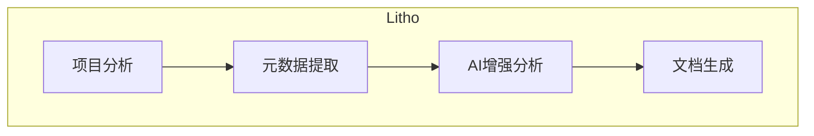
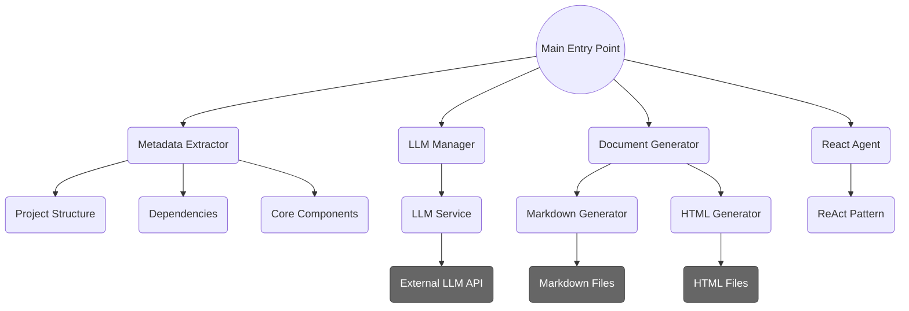
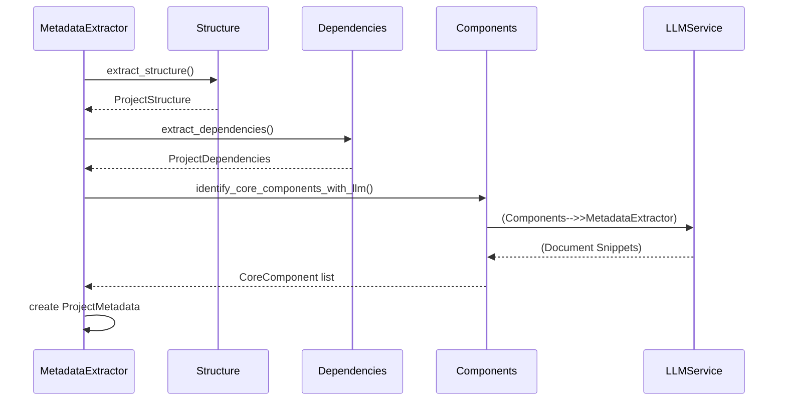

<p align="center">
  
</p>
<h3 align="center">Litho (deepwiki-rs)</h3>

<p align="center">
    <a href="./README.md">English</a>
    |
    <a href="./README_zh.md">中文</a>
</p>

<p align="center">💪🏻 基于<strong>Rust</strong>的高性能<strong>AI驱动</strong>文档智能生成引擎（类DeepWiki）</p>
<p align="center">📚 自动为任何软件项目生成专业的<strong>C4风格项目架构文档</strong></p>
<p align="center">
  <a href="https://crates.io/crates/deepwiki-rs"></a>
  <a href=""></a>
  
</p>
<hr />

> [!WARNING]
> ⚠️ 随着计划在未来几个月内的引擎架构重构和生态工具补充，后续更新将包含 较大的配置规范与生成效果的变更（Breaking Changes）。

> 🚀 通过 [在 GitHub 上赞助](https://github.com/sponsors/sopaco)让这个软件更好的发展。


# 👋 Litho是什么
**Litho**（也称为deepwiki-rs）是一个强大的基于Rust的工具，旨在自动化生成软件架构文档。利用先进的AI功能，Litho能够智能分析项目结构，识别核心组件，解析依赖关系，并自动生成专业的C4架构文档。

**Litho**完全免费且开源，是团队无需手动维护架构文档的理想解决方案。通过使用大型语言模型（LLM），Litho提供深入的分析和清晰的文档，帮助开发人员更轻松地理解复杂的代码库。

❤️ 喜欢 **Litho**? 点亮小星星 🌟 或 [赞助](https://github.com/sponsors/sopaco)! ❤️

# 🌠 功能与特性

- **自动化文档生成**：通过分析项目代码自动生成全面的C4架构文档，从此告别大量手动文档编写工作。
- **AI智能分析**：利用大型语言模型（LLM）和ReAct模式进行智能分析，准确识别项目中的功能流程、核心组件和架构和代码细节。
- **多格式输出**：支持生成Markdown和HTML等多种格式的文档，满足不同场景需求。
- **可扩展性**：模块化设计和插件系统支持扩展和定制，适应不同项目类型和需求。
- **多语言支持**：能够分析多种编程语言编写的项目，包括Rust、Python、JavaScript/TypeScript、Java、C/C++和Go等。
- **依赖可视化**：提取并可视化文件和函数依赖关系，帮助理解代码库结构。
- **组件识别**：自动识别和分析项目中的核心组件，基于各种指标计算重要性评分。
- **架构检测**：识别常见的架构模式，如MVC、分层架构和微服务等。

# 🧠 工作原理

**Litho**采用系统化方法生成架构文档：

1. **项目分析**：首先，Litho扫描项目结构，识别文件和目录，并进行初始分析。
2. **元数据提取**：工具提取详细的元数据，包括组件信息、依赖关系和结构细节。
3. **AI增强分析**：使用大型语言模型，Litho对代码组件、其功能和关系进行深入分析。
4. **文档生成**：最后，Litho以请求的格式生成全面的架构文档，包括图表和详细说明。



# 🏗️ 架构概览

**Litho**采用模块化架构设计，注重可扩展性和性能。系统由多个协同工作的关键组件组成：



## 核心组件

- **LLM客户端**：处理与大型语言模型的通信，实现智能分析。
- **元数据提取器**：提取项目结构、依赖关系和组件信息。
- **文档生成器**：将分析后的数据转换为各种格式的专业文档。
- **ReAct代理**：实现ReAct模式，用于系统地探索和分析代码库。
- **工具集**：提供各种实用工具，用于代码分析、架构检测和文件探索。
- **实用工具**：提供文件系统操作、字符串处理等通用实用功能。



# 🖥️ 快速开始

### 前提条件
- [**Rust**](https://www.rust-lang.org)（2024或更高版本）
- [**Cargo**](https://doc.rust-lang.org/cargo/)
- 互联网连接（用于LLM集成）

### 安装

1. 克隆仓库。
    ```sh
    git clone https://github.com/sopaco/deepwiki-rs.git
    ```
2. 进入克隆的项目文件夹。
    ```sh
    cd deepwiki-rs
    ```
3. 构建项目。
    ```sh
    cargo build --release
    ```
4. 编译后的二进制文件将位于`target/release`目录中。

# 🚀 使用方法

**Litho**提供命令行界面用于生成架构文档。以下是一些基本使用示例：

### 基本命令

```sh
litho --project <项目路径> --output <输出目录>
```

### 高级选项

- 指定文档格式（Markdown或HTML）：
  ```sh
  litho --project <项目路径> --output <输出目录> --format markdown,html
  ```

- 配置LLM设置：
  ```sh
  litho --project <项目路径> --output <输出目录> --llm-api <api-url> --llm-key <api-key>
  ```

- 自定义组件检测：
  ```sh
  litho --project <项目路径> --output <输出目录> --config <配置文件路径>
  ```

要获取更详细的使用信息，请运行：
```sh
litho --help
```

# 🤝 贡献

通过[GitHub Issues](https://github.com/sopaco/deepwiki-rs/issues)报告错误或提出功能请求，帮助改进Litho。

## 贡献方式

- 提供更多的LLM服务平台账号和Token额度，用于适配和优化各类大模型分析效果。
- 实现对各类技术栈分析效果的准确性
- 增强组件检测算法
- 添加新的文档格式
- 改进架构图表的可视化效果
- 为项目的国际化做出贡献

# ⚛️ 使用以下技术开发

- [rust](https://github.com/rust-lang/rust)
- [clap](https://github.com/clap-rs/clap)
- [tokio](https://github.com/tokio-rs/tokio)
- [serde](https://github.com/serde-rs/serde)
- [reqwest](https://github.com/seanmonstar/reqwest)
- [anyhow](https://github.com/dtolnay/anyhow)
- [thiserror](https://github.com/dtolnay/thiserror)

# 🪪 许可证
**MIT**，协议的副本说明保留在[LICENSE](./LICENSE)文件中。

**🙏感谢大家的支持，你们是国产开源的历史见证者**

# 👨 关于我

> 🚀 通过 [在 GitHub 上赞助我](https://github.com/sponsors/sopaco)让这个软件更好的发展。

互联网老兵，经历PC互联网、移动互联网、AI应用三股浪潮，从早期的移动应用个人开发者角色入场，到现在的职场从业者角色，有丰富的产品设计与研发经验。现就职于快手，从事大前端体系以及AI探索方面的研发工作。

wx号：dokhell

邮箱：dokhell@hotmail.com
