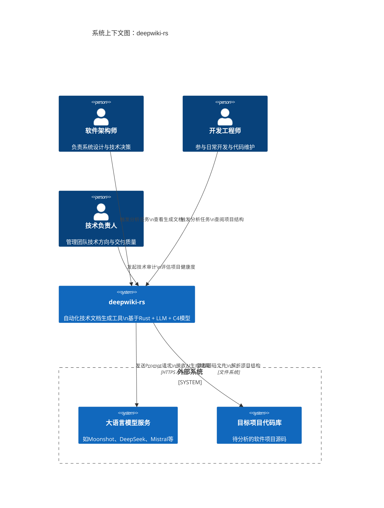

# 项目概述

## 1. 项目简介

### 项目名称与定位
**deepwiki-rs** 是一个基于 Rust 构建的命令行智能文档生成工具（CLI Tool），旨在通过多智能体协作架构和大语言模型（LLM）技术，自动化分析任意软件项目的源代码库，并生成高质量、结构化的技术文档。该工具特别适用于缺乏完善文档的遗留系统或复杂第三方项目，帮助团队快速理解系统架构与核心逻辑。

### 核心功能与业务价值
- **自动化文档生成**：无需人工编写，自动从代码中提取结构、依赖、模块划分及工作流信息。
- **C4 模型驱动**：输出符合 C4 架构建模标准的技术文档，涵盖系统上下文、容器图、组件图和代码级洞察。
- **多语言支持**：支持 Rust、TypeScript、JavaScript、Python、Java 等主流编程语言的语法解析。
- **降低知识传递成本**：显著减少新成员上手时间，提升团队协作效率与系统可维护性。
- **技术健康度评估**：为技术负责人提供项目复杂度与架构质量的量化参考。

### 技术特征概述
- **高性能后端语言**：采用 Rust 实现，确保高并发处理能力和内存安全性。
- **分层智能体架构**：以“预处理 → 研究 → 文档合成”三阶段流水线组织分析流程，职责清晰、扩展性强。
- **LLM 深度集成**：通过统一接口调用 Moonshot、DeepSeek、Mistral 等多种 LLM 服务，实现语义级代码理解与自然语言描述生成。
- **领域驱动设计（DDD）**：系统划分为多个高内聚、低耦合的领域模块，便于长期演进与维护。

---

## 2. 目标用户

| 用户角色 | 描述 | 使用场景 | 核心需求 |
|--------|------|---------|----------|
| **软件架构师** | 负责系统整体设计和技术决策的专业人员 | 快速理解遗留系统或第三方项目的整体架构；进行技术评审与重构规划 |<ul><li>获取系统上下文、核心工作流和关键模块的技术洞察</li><li>生成符合 C4 模型标准的架构文档</li><li>识别潜在的设计问题与技术债务</li></ul>|
| **开发工程师** | 参与日常开发工作的技术人员 | 新项目入职、参与跨团队协作、阅读非主责模块代码 |<ul><li>快速上手新项目，理解代码组织结构和依赖关系</li><li>识别核心功能模块和关键接口</li><li>减少因文档缺失导致的认知负担</li></ul>|
| **技术负责人** | 负责团队技术管理和项目交付的管理者 | 团队知识管理、新人培训、项目交接与技术审计 |<ul><li>评估项目复杂度和技术健康度</li><li>推动知识资产的标准化沉淀</li><li>提高团队新人入职效率</li></ul>|

---

## 3. 系统边界

### 系统范围定义
`deepwiki-rs` 的核心作用是作为一个**离线/本地运行的静态分析工具**，接收目标项目的源码作为输入，经过多阶段智能分析后输出结构化技术文档（如 Markdown 文件）。其职责聚焦于“代码理解 + 文档生成”，不涉及运行时监控、版本控制集成或实时协作编辑。

### 包含的核心组件
根据调研结果，系统内部包含以下关键组成部分：

| 组件类别 | 具体内容 |
|--------|--------|
| **代码解析能力** | 多语言代码解析器（Rust/TS/JS/Python/Java/Kotlin/Vue/React/Svelte） |
| **分析引擎** | 基于智能 Agent 的分层分析流水线：<br>• 预处理阶段（扫描结构、提取依赖）<br>• 研究阶段（识别领域模块、分析架构）<br>• 合成阶段（编排文档内容） |
| **文档生成机制** | C4 模型驱动的文档生成流水线，支持生成：<br>• 系统上下文图<br>• 容器与组件视图<br>• 工作流说明<br>• 关键模块洞察 |
| **LLM 交互系统** | 支持多种 LLM 提供商的统一客户端，具备缓存、重试、ReAct 推理模式等高级能力 |
| **状态与配置管理** | 内存状态管理器（Memory）、项目配置加载（Config） |

### 排除的外部依赖与功能
以下功能明确不在当前系统范围内：

| 排除项 | 说明 |
|-------|------|
| 图形化用户界面（GUI） | 当前为 CLI 工具，无 Web 或桌面前端 |
| 实时协作编辑功能 | 不提供多人协同编辑文档的能力 |
| 版本控制系统集成 | 不监听 Git hooks 或自动触发分析 |
| 私有化部署的 LLM 训练 | 仅使用已有 LLM API，不训练模型 |
| 运行时性能监控与 APM | 仅做静态代码分析，不采集运行时指标 |

---

## 4. 外部系统交互

### 外部系统列表与交互方式

| 外部系统 | 交互类型 | 描述 | 数据流向 |
|--------|--------|------|---------|
| **大语言模型服务**<br>（如 Moonshot、DeepSeek、Mistral） | API 调用 | 利用 LLM 执行代码语义理解、推理判断、自然语言生成任务 | `deepwiki-rs` → LLM API（HTTP 请求）<br>LLM → `deepwiki-rs`（JSON 响应） |
| **目标项目代码库** | 文件系统读取 | 分析的目标源码目录，作为输入数据源 | `deepwiki-rs` ← 本地文件系统（递归遍历） |

### 依赖关系分析
- **强依赖**：
  - LLM 服务是实现“语义增强分析”的必要条件，若无法访问将导致部分功能失效。
  - 目标代码库必须可读且路径正确，否则无法启动分析流程。
- **弱依赖/可选配置**：
  - 缓存机制可降低重复调用 LLM 成本，但非必需。
  - 配置文件（TOML）用于定制行为，若不存在则使用默认值。

---

## 5. 系统上下文图



### 关键交互流程说明
1. **用户发起分析命令**（如 `deepwiki-rs analyze ./my-project`）
2. 工具读取本地 `./my-project` 目录下的所有源码文件
3. 启动预处理阶段，提取项目结构、识别核心文件
4. 调用 LLM 对关键代码片段进行语义分析，生成 `CodeInsight`
5. 在研究阶段整合多源数据，识别领域模块与架构关系
6. 进入文档合成阶段，按 C4 模型组织内容并生成最终文档
7. 输出 `.md` 或 `.html` 格式的结构化文档至指定目录

### 架构决策说明
- **选择 CLI 而非 GUI**：优先保障分析能力的深度与稳定性，避免 UI 复杂性干扰核心逻辑。
- **内存共享而非数据库**：所有中间结果存储在内存中，适合单次批处理任务，简化架构。
- **插件化 LLM 接口**：通过 `Provider抽象层` 实现多厂商兼容，便于切换或扩展。
- **C4 模型作为输出规范**：确保生成文档具备专业性和通用性，易于被行业接受。

---

## 6. 技术架构概览

### 主要技术栈
| 类别 | 技术选型 |
|-----|--------|
| 编程语言 | Rust (async/.await) |
| 异步运行时 | Tokio |
| 配置格式 | TOML |
| 序列化 | Serde |
| 错误处理 | anyhow |
| 命令行解析 | clap |
| HTTP 客户端 | reqwest |
| 日志系统 | tracing / log |

### 架构模式
系统采用 **分层智能体架构（Layered Agent Architecture）**，遵循以下设计原则：

1. **三层流水线结构**
   - **Preprocessing（预处理）**：基础结构提取（文件树、依赖、注释）
   - **Research（研究）**：高层次推理（领域划分、架构识别）
   - **Compose（合成）**：文档编排与格式化输出

2. **领域模块划分**
   ```text
   ├── 配置与状态管理域     ← 基础设施支撑
   ├── 代码智能分析域       ← 数据采集层
   ├── 大语言模型交互域     ← AI能力接入
   ├── 领域架构分析域       ← 核心推理层
   └── 智能文档生成域       ← 输出表达层
   ```

3. **Agent 协作机制**
   - 每个阶段由一个或多个 Agent 执行具体任务
   - Agent 间通过共享内存（Memory）传递中间结果
   - 支持并行执行与失败重试策略

### 关键设计决策
| 决策点 | 选择 | 理由 |
|-------|------|------|
| 是否使用数据库 | ❌ 否 | 分析过程为一次性批处理，内存足以承载中间状态 |
| 是否内置 LLM | ❌ 否 | 依赖成熟云服务更高效，避免模型训练与运维开销 |
| 是否支持增量分析 | ⚠️ 待定 | 当前全量分析，未来可通过文件哈希+缓存优化 |
| 是否开放插件机制 | ✅ 是 | LLM Provider 和 Language Processor 均支持插件式扩展 |

---

### 总结
`deepwiki-rs` 是一个面向现代软件工程的知识自动化工具，它结合了静态代码分析、大语言模型推理与架构建模范式（C4），实现了从“代码到文档”的端到端转化。其设计充分考虑了准确性、可维护性与实用性，适用于各类需要快速沉淀技术资产的场景。随着对更多语言和架构风格的支持，该工具有望成为开发者知识管理的标准基础设施之一。