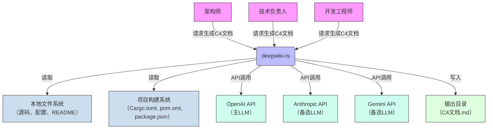

# 系统概览 (System Context)

## 1. 项目简介

**项目名称**：deepwiki-rs  
**项目类型**：命令行工具（CLI Tool）  
**生成时间**：2025年10月17日  

deepwiki-rs 是一个基于 Rust 构建的智能代码库分析与架构文档生成系统，旨在通过多智能体协作与大语言模型（LLM）驱动，实现从源代码到标准化 C4 架构文档的端到端自动化。系统无需人工干预，即可自动识别软件项目的系统上下文、领域模块、依赖关系、核心工作流程与外部接口，并生成符合 C4 模型规范的 Markdown 文档，显著提升复杂系统的技术理解效率。

### 核心功能与价值

deepwiki-rs 的核心价值在于将传统耗时数天的人工架构调研与文档编写过程，压缩至**分钟级自动化完成**，其业务价值体现在以下五个维度：

1. **效率跃升**：自动化提取系统边界、领域模块与接口定义，消除人工阅读代码、绘制图表、撰写文档的重复劳动。
2. **认知降维**：为新成员提供清晰、结构化、可追溯的系统全景视图，降低上手成本，缩短项目融入周期。
3. **架构一致性**：强制输出标准化 C4 文档，统一团队对系统结构的认知，减少“文档与代码脱节”的技术债务。
4. **决策支持**：为架构师提供可量化的系统复杂度评估、边界泄露检测与技术债务定位依据，支撑重构与集成规划。
5. **知识沉淀**：生成的文档作为可版本控制的资产，形成团队知识库，避免“人走文档亡”的信息孤岛问题。

### 技术特征概述

- **多智能体架构**：采用分层智能体协同模式（预处理 → 研究分析 → 文档生成），每个智能体专注单一职责，确保可插拔、可复用。
- **LLM 驱动智能**：深度集成 OpenAI、Anthropic、Gemini 等主流 LLM 提供商，通过 ReAct 框架实现工具调用、多轮推理与降级总结，保障分析鲁棒性。
- **多语言支持**：原生支持 Rust、Java、JavaScript、TypeScript、Python、Kotlin、Vue、React、Svelte 等 9 种主流语言的静态解析。
- **缓存与优化**：基于 MD5 哈希的智能缓存机制，避免重复分析；Token 压缩与估算技术显著降低 LLM 成本与延迟。
- **无状态设计**：不依赖数据库、网络服务或运行时环境，完全基于本地文件系统执行，部署轻量、安全、可离线运行。
- **Rust 语言实现**：利用 Rust 的内存安全、零成本抽象与异步性能，构建高性能、高可靠性的分析引擎。

---

## 2. 目标用户

deepwiki-rs 面向三类核心角色，服务于软件研发全生命周期中的“理解-评估-协作”场景。

| 用户角色 | 描述 | 核心需求 | 典型使用场景 |
|----------|------|----------|--------------|
| **架构师** | 负责系统整体架构设计与技术决策的资深工程师 | 自动化获取系统上下文和架构视图 识别关键领域模块与核心组件 可视化系统边界与外部依赖 生成符合 C4 模型的标准化文档 | 评估第三方开源项目架构可行性 接手遗留系统时快速建立认知地图 在技术评审中提供权威架构快照 |
| **技术负责人** | 管理代码质量、技术债务与团队知识传承的管理者 | 快速评估新项目的技术复杂度 发现潜在的架构违规或边界泄露 自动生成可追溯文档支持代码审查 统一团队对系统结构的认知 | 制定技术债务治理路线图 审查新成员提交的架构文档是否符合规范 在团队培训中作为“系统说明书”使用 |
| **开发工程师** | 需要快速熟悉项目结构、依赖关系和接口规范的团队成员 | 清晰的项目结构树和文件作用说明 接口定义与调用关系的快速查询 了解核心工作流程和关键路径 获取可执行的边界使用示例 | 新加入项目时快速定位核心模块 跨团队协作时理解接口契约 调试问题时追溯调用链与依赖关系 |

> **使用场景共性**：所有用户均在**缺乏文档或文档陈旧**的环境中工作，面临“代码即文档”的困境。deepwiki-rs 作为“架构感知代理”，在不改变现有开发流程的前提下，提供**即时、准确、可验证**的架构洞察。

---

## 3. 系统边界

deepwiki-rs 是一个**纯命令行、无状态、本地化**的分析工具，其系统边界严格限定于**源码分析与文档生成**，不涉及任何运行时、部署或服务化能力。

### ✅ 包含的核心组件（系统内）

| 组件类别 | 具体模块 | 功能说明 |
|----------|----------|----------|
| **配置管理** | `config.rs`, `types/project_structure.rs` | 加载并解析运行时配置（LLM提供商、缓存策略、文件过滤规则等），驱动整个分析流程 |
| **预处理域** | `preprocess/` | 递归扫描目录、解析9种语言源码、提取依赖与接口、推断代码用途、构建结构化语义模型（ProjectStructure, CodeInsight） |
| **研究分析域** | `research/` | 由 `ResearchOrchestrator` 编排多个智能体（系统上下文、领域模块、依赖图谱、工作流、边界分析）进行语义推理 |
| **LLM客户端域** | `llm/client/` | 封装 OpenAI、Anthropic、Gemini 的 API 调用，实现 ReAct 推理、工具调用、提示压缩、Token 估算与降级总结 |
| **文档生成域** | `compose/` | 由多个编辑器（OverviewEditor、ArchitectureEditor、BoundaryEditor 等）按顺序聚合研究结果，生成符合 C4 标准的 Markdown 文档 |
| **缓存与性能监控** | `cache/`, `memory/` | 缓存 prompt 与 LLM 响应，监控缓存命中率、token 节省、执行耗时，提升效率与可重复性 |

### ❌ 排除的外部依赖（系统外）

| 排除项 | 原因说明 |
|--------|----------|
| 源代码的编译与链接过程 | deepwiki-rs 不参与构建，仅读取源码与配置文件（如 Cargo.toml、pom.xml） |
| 应用程序的运行时执行环境 | 不启动、不调试、不监控任何被分析项目的运行进程 |
| CI/CD 流水线集成 | 不与 GitHub Actions、GitLab CI、Jenkins 等集成，无 webhook 或触发机制 |
| Web UI 或图形界面 | 纯命令行工具，无前端、无浏览器交互、无 REST API |
| 数据库存储或持久化服务 | 所有数据驻留内存或本地文件系统，无 SQL/NoSQL 依赖 |
| 网络服务暴露（如 HTTP API） | 不监听端口，不提供远程访问能力，完全本地运行 |
| 容器化部署脚本（Docker/K8s） | 不打包镜像，不生成 Helm Chart 或 K8s YAML，部署由用户自行管理 |

> **边界决策原则**：系统定位为“**架构分析引擎**”，而非“**开发平台**”或“**运维工具**”。其价值在于**信息提取与表达**，而非**执行或部署**。此边界确保了系统的轻量化、安全性与可移植性。

---

## 4. 外部系统交互

deepwiki-rs 通过**文件读写**与**API 调用**两种方式与外部系统交互，其依赖关系清晰、可控、可配置。

### 外部系统列表与交互详情

| 外部系统 | 交互类型 | 交互描述 | 依赖强度 | 备注 |
|----------|----------|----------|----------|------|
| **本地文件系统** | 文件读写 | 读取项目根目录下的源代码文件（.rs, .java, .py 等）、配置文件（Cargo.toml, package.json, pom.xml）、README、.gitignore 等；写入生成的 Markdown 文档至指定输出路径 | ⭐⭐⭐⭐⭐（高） | 系统的**唯一输入源与输出目标**，所有分析均基于本地文件系统快照 |
| **项目构建系统** | 文件读取 | 读取 `Cargo.toml`（Rust）、`pom.xml`（Java）、`package.json`（Node.js）等构建元数据，自动识别项目类型、依赖列表、包名，用于上下文推断 | ⭐⭐⭐⭐☆（高） | 用于区分项目语言栈，提升预处理准确性，非必需但显著增强语义理解 |
| **OpenAI API** | API 调用 | 主要 LLM 服务提供商，用于执行语义分析、提示推理、文档生成任务。通过 `OPENAI_API_KEY` 环境变量认证 | ⭐⭐⭐⭐⭐（高） | 默认提供商，性能与成本最优平衡，支持 GPT-4o、GPT-4-turbo 等模型 |
| **Anthropic API** | API 调用 | 备选 LLM 提供商，用于在 OpenAI 不可用、限流或成本过高时提供推理服务。支持 Claude 3 系列模型 | ⭐⭐⭐⭐☆（中） | 配置切换即可启用，实现高可用与成本弹性 |
| **Gemini API** | API 调用 | 备选 LLM 提供商，用于支持多供应商策略、模型性能对比与合规性要求（如数据驻留） | ⭐⭐⭐☆☆（中） | 用于 A/B 测试与策略冗余，非默认启用 |

### 依赖关系分析

- **强依赖**：本地文件系统是系统运行的**绝对前提**，无文件则无分析。
- **软依赖**：项目构建系统为**增强型输入**，缺失时系统仍可运行，但可能降低语言识别精度。
- **可选依赖**：LLM 提供商为**可配置替换**，系统支持多提供商策略，通过配置文件（`config.yaml`）动态切换，实现**供应商锁定规避**。
- **无网络依赖**：若所有 LLM 提供商均不可用，系统可降级为**仅使用缓存结果**或**输出空文档+警告**，保证基本可用性。

> **架构决策**：采用“**配置驱动的多提供商策略**”，避免对单一云服务商的依赖，提升系统韧性与合规灵活性。

---

## 5. 系统上下文图

以下是 deepwiki-rs 的 C4 SystemContext 图，描述了系统与外部参与者及系统的交互关系。

### 关键交互流程说明

1. **用户触发**：架构师/技术负责人/开发工程师在终端执行 `deepwiki-rs analyze --path ./my-project` 命令。
2. **输入采集**：系统扫描项目目录，读取源码、构建文件与元数据。
3. **智能分析**：系统内部调用 LLM 提供商（默认 OpenAI）执行多轮语义推理，生成结构化分析报告。
4. **文档生成**：将分析结果聚合为 C4 模型的 Markdown 文档（系统上下文图、容器图、组件图、工作流、边界接口等）。
5. **输出交付**：将文档写入指定目录，供用户版本控制、审查与分享。

### 架构决策说明

- **单点入口**：所有交互均通过 CLI 命令发起，确保行为可预测、可脚本化。
- **无状态交互**：与外部系统的交互均为“请求-响应”模式，无会话保持，支持并发执行。
- **失败隔离**：LLM 调用失败不影响文件读取与缓存复用，系统具备优雅降级能力。
- **输出标准化**：输出为纯 Markdown，兼容 Git、GitHub、GitLab、Confluence，实现“文档即代码”。

---

## 6. 技术架构概览

### 主要技术栈

| 层级 | 技术选型 | 说明 |
|------|----------|------|
| **核心语言** | Rust | 提供内存安全、零成本抽象、异步性能，构建高性能分析引擎 |
| **LLM 服务** | OpenAI API, Anthropic API, Gemini API | 多提供商策略，支持 GPT-4o、Claude 3、Gemini 1.5 |
| **推理框架** | ReAct（Reasoning + Acting） | 实现工具调用、多轮推理、迭代修正与降级总结 |
| **缓存机制** | MD5 哈希 + 文件系统 | 缓存 prompt 与 LLM 响应，支持压缩与过期策略 |
| **并发模型** | async/await + Tokio | 支持高并发文件扫描与并行 LLM 调用 |
| **数据结构** | serde_json + 通用内存存储 | 所有分析结果以 JSON Value 形式在内存中传递，支持任意类型 |
| **文档输出** | Markdown + Mermaid | 符合 C4 模型规范，可直接渲染为图表 |

### 架构模式

- **分层架构**：清晰划分为配置层、预处理层、研究层、文档层、缓存层，职责分离。
- **智能体模式**：每个分析任务（如领域检测、边界分析）封装为独立 Agent，实现插件化扩展。
- **策略模式**：LLM 提供商、缓存策略、文件过滤规则均通过配置动态切换。
- **管道-过滤器模式**：分析流程为线性流水线（预处理 → 研究 → 文档），数据通过统一内存上下文传递。
- **无状态服务**：系统无持久化状态，每次运行基于输入文件快照独立执行。

### 关键设计决策

| 决策 | 理由 | 影响 |
|------|------|------|
| **选择 Rust 作为实现语言** | 高性能、内存安全、无 GC 延迟，适合处理大规模代码库 | 系统启动快、内存占用低、可部署于资源受限环境 |
| **不使用数据库** | 避免部署复杂性，确保“开箱即用”与离线能力 | 用户无需安装 Redis/PostgreSQL，降低使用门槛 |
| **采用多 LLM 提供商** | 避免供应商锁定，提升可用性与成本弹性 | 企业可按合规要求选择本地化模型，支持 A/B 测试 |
| **输出为 Markdown 而非 PDF/HTML** | 便于版本控制、协作编辑、集成到 CI/CD | 文档可纳入 Git，支持 diff、review、自动化检查 |
| **缓存基于 prompt 哈希而非文件哈希** | 即使文件内容未变，若分析逻辑更新，缓存仍失效，确保结果准确性 | 避免“旧缓存误导新分析”，提升可信度 |
| **BoundaryEditor 不依赖 LLM** | 边界接口（CLI/Router/API）需精确无歧义，人工定义优于 AI 生成 | 确保开发者可直接复制粘贴使用，提升实用性 |

---

## 总结：deepwiki-rs 的架构定位

deepwiki-rs 不是一个“代码分析器”，而是一个**架构认知增强系统**。它通过自动化将隐性知识（代码结构）转化为显性知识（C4 文档），填补了现代软件工程中“架构文档缺失”的关键鸿沟。

其 C4 SystemContext 架构清晰、边界明确、依赖可控，具备**高可用、低耦合、强扩展**的特性，是面向未来智能软件工程的基础设施级工具。它不试图取代人类架构师，而是成为其**最强大的认知外设**——让复杂系统，一目了然。