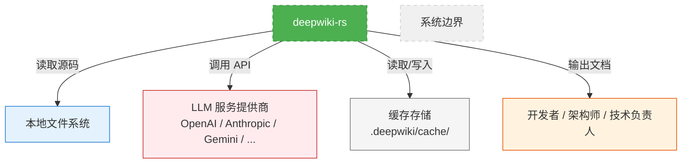

# 系统概览 (System Context)
**系统名称：** `deepwiki-rs`
**生成时间：** 2025-10-20 10:54:47 (UTC)
**时间戳：** 1760957687

---

## 1. 项目简介

`deepwiki-rs` 是一个基于 Rust 构建的**自动化软件架构分析与技术文档生成工具**，专为现代复杂软件系统设计，旨在通过多智能体（Multi-Agent）与大语言模型（LLM）协同工作，实现从源代码到**标准化 C4 架构文档**的全自动转化。

系统以“**预处理 → 研究分析 → 文档生成**”为主线，构建了一条端到端的智能分析流水线。其核心价值在于**消除人工撰写和维护架构文档的高成本、低一致性与滞后性问题**，使团队能够以极低的边际成本，持续获得准确、完整、可追溯的系统架构视图。

### 核心功能
- **自动解析**：静态分析多语言代码库（Rust、Python、Java 等），提取结构、接口与依赖。
- **智能推理**：通过 LLM 驱动的智能代理集群（如领域模块检测器、系统上下文研究员）进行语义级架构理解。
- **结构化输出**：自动生成符合 C4 模型标准的完整架构文档集，包括系统上下文图、领域模型、工作流说明与接口边界文档。
- **缓存优化**：基于文件哈希的缓存机制，显著降低重复分析的 LLM 调用成本。

### 业务价值
- **降低架构理解成本**：将原本数周的人工分析压缩至数分钟。
- **提升知识传承效率**：为新成员提供即时、准确的系统上下文材料。
- **保障文档一致性**：避免“文档与代码脱节”的常见技术债。
- **支持架构治理**：为技术评审、架构演进与合规审计提供可验证的自动化输出。

### 技术特征概述
| 特征 | 说明 |
|------|------|
| **架构范式** | 分层多智能体架构（Layered Multi-Agent Architecture） |
| **核心语言** | Rust（高性能、内存安全、无运行时） |
| **分析引擎** | 基于 LLM 的 ReAct 推理框架，支持多轮思考与工具调用 |
| **数据交换** | 内存作为各阶段间唯一共享状态（Memory-as-IPC） |
| **输出标准** | 完全遵循 C4 模型（System Context、Container、Component、Code） |
| **部署形态** | 命令行工具（CLI Tool），无 GUI，轻量可集成 |

---

## 2. 目标用户

`deepwiki-rs` 面向软件开发全生命周期中的**技术决策者与知识消费者**，其用户角色高度聚焦于需要理解、评估和传递系统架构信息的岗位。

| 用户角色 | 描述 | 核心需求 | 使用场景 |
|----------|------|----------|----------|
| **软件架构师** | 负责系统整体设计与技术选型的专业人员 | 快速掌握遗留或复杂系统的架构全貌；自动生成标准化 C4 文档；识别关键模块与核心工作流程；分析系统外部依赖与接口边界 | - 分析新接手的大型微服务系统 - 为架构评审准备可视化材料 - 对比不同版本的架构演进 |
| **技术负责人** | 管理开发团队并确保技术方案落地的领导者 | 评估项目技术健康度与架构合理性；为新成员提供入职引导材料；支撑跨团队协作所需的系统上下文说明；自动化生成 API 与 CLI 接口文档 | - 新项目启动时的架构摸底 - 技术债务评估与重构规划 - 向管理层汇报系统复杂性 |
| **开发者** | 参与具体功能开发的工程师 | 快速理解项目整体结构与模块职责；查找关键入口点和核心实现逻辑；了解代码间的依赖关系与调用链路；减少因文档缺失导致的沟通成本 | - 调试未知模块的调用链 - 评估修改某模块的潜在影响 - 快速上手开源项目或团队内部代码库 |

> ✅ **用户共性洞察**：所有用户均面临“**代码即文档**”的现实困境——代码是唯一真实来源，但缺乏结构化、可读性、上下文关联的文档。`deepwiki-rs` 通过**自动化、语义化、标准化**三重能力，填补这一鸿沟。

---

## 3. 系统边界

`deepwiki-rs` 的系统边界清晰，严格限定于**分析与文档生成**，不涉及代码修改、运行时干预或部署管理。

### ✅ 包含的核心组件
| 组件 | 功能说明 |
|------|----------|
| **项目结构解析器** | 遍历目录结构，识别源码文件、配置文件、资源文件，构建项目拓扑 |
| **多语言代码静态分析器** | 基于语法树与语义规则，提取接口、依赖、复杂度、注释等结构化信息 |
| **基于 LLM 的智能分析 Agent 集群** | 包含领域模块检测器、系统上下文研究员、工作流研究员、边界分析器等，执行多轮 ReAct 推理 |
| **C4 模型文档生成引擎** | 将分析结果聚合为 Markdown 格式的 C4 视图文档（系统上下文、容器、工作流、边界等） |
| **缓存与性能监控系统** | 基于 MD5 哈希的文件级缓存，避免重复 LLM 调用；内存使用统计与分析耗时监控 |

### ❌ 排除的外部依赖
| 排除项 | 原因说明 |
|--------|----------|
| 代码编辑与重构功能 | 不修改任何源代码，仅读取分析 |
| 实时系统监控与追踪 | 不注入探针、不采集运行时指标（如 CPU、内存、请求延迟） |
| CI/CD 集成能力 | 不提供 GitHub Actions、GitLab CI 等插件，无自动化触发机制 |
| 图形化用户界面（GUI） | 纯命令行交互，无 Web 或桌面 UI，符合 Unix 工具哲学 |
| 在线协作平台 | 不提供共享、评论、版本对比等协作功能，输出为静态 Markdown 文件 |

### 📏 系统范围声明
> **“deepwiki-rs 的唯一职责是：接收一个本地代码库路径，输出一组符合 C4 模型的结构化架构文档。它不运行、不部署、不修改目标系统，也不提供任何在线服务。”**

该边界确保了系统的**安全性、轻量化与可预测性**，使其可安全部署于企业内网、CI 环境或开发者的本地机器。

---

## 4. 外部系统交互

`deepwiki-rs` 作为独立工具，与三个关键外部系统存在明确的交互关系，构成其运行环境的边界。

| 外部系统 | 交互类型 | 交互方式 | 依赖性质 | 说明 |
|----------|----------|----------|----------|------|
| **LLM 服务提供商** （如 OpenAI、Anthropic、Gemini、Claude、本地 LLM 服务） | API 调用 | HTTPS + JSON-RPC | **强依赖** | 所有智能分析代理均依赖 LLM 进行语义理解、推理与内容生成。系统通过统一 `ProviderClient` 抽象层支持多提供商，配置 API 密钥与模型名称。 |
| **本地文件系统** | 文件读写 | 读取源码目录、写入输出文档 | **强依赖** | 系统通过遍历指定项目根目录，读取所有源码、配置、资源文件。分析结果以 Markdown 文件形式写入输出目录。支持相对路径与绝对路径。 |
| **缓存存储** | 文件读写 | 读取/写入缓存文件（.deepwiki/cache/） | **弱依赖（性能优化）** | 缓存基于源码文件的 MD5 哈希键存储分析结果。若缓存命中，跳过 LLM 调用，显著提升重复分析效率。缓存可被手动清理，不影响功能正确性。 |

### 📊 依赖关系分析
- **LLM 服务** 是系统**功能实现的核心依赖**，无 LLM 则系统无法完成语义分析，仅能输出基础结构信息。
- **本地文件系统** 是系统**数据输入与输出的唯一通道**，是系统存在的物理前提。
- **缓存存储** 是**非功能性优化**，不影响核心流程，但对高频使用场景（如 CI/CD 中的定期分析）至关重要。

> ⚠️ **架构决策说明**：系统**不内置 LLM 服务**，也不提供模型托管能力，以保持轻量、合规与成本可控。用户需自行配置 API 密钥，符合企业安全策略。

---

## 5. 系统上下文图

### 🔍 关键交互流程说明

1. **输入阶段**：用户在终端执行 `deepwiki-rs analyze --path ./my-project`，系统从**本地文件系统**读取项目根目录下的所有源码与配置文件。
2. **分析阶段**：
   - 预处理模块提取代码结构，生成初步洞察；
   - 智能分析代理（如系统上下文研究员）通过 **LLM 服务提供商** 的 API，执行多轮 ReAct 推理，理解业务目标、技术特征与用户场景；
   - 所有中间结果（CodeInsight、领域模块、边界接口）暂存于**内存管理器**中，作为后续阶段输入。
3. **输出阶段**：
   - 文档生成域调用各编辑器 Agent，将分析结果聚合为 C4 标准文档；
   - 最终文档（`system_context.md`, `domain_modules.md`, `api_boundaries.md` 等）写入**本地文件系统**的指定输出目录。
4. **缓存优化**：若某文件未变更，其分析结果从**缓存存储**中加载，跳过 LLM 调用，提升效率。
5. **交付对象**：生成的文档交付给**软件架构师、技术负责人、开发者**，用于知识传递、架构评审与团队协作。

### 🧭 架构决策说明
- **无状态设计**：系统不维护会话或持久化状态，每次运行独立，确保可重现性。
- **内存作为 IPC**：各模块间通过内存共享数据，避免序列化开销，提升吞吐。
- **LLM 作为“认知引擎”**：不将 LLM 视为黑盒，而是将其封装为可调用的“智能工具”，通过 ReAct 框架控制其推理过程。
- **文档即产品**：输出的 Markdown 文件是最终交付物，而非 API 或数据库，符合“工具化”设计哲学。

---

## 6. 技术架构概览

### 主要技术栈

| 层级 | 技术选型 | 说明 |
|------|----------|------|
| **核心语言** | Rust 1.75+ | 内存安全、零成本抽象、高性能并发，适合构建 CLI 工具与静态分析器 |
| **LLM 交互** | OpenAI API、Anthropic Claude、Gemini、Ollama、Local LLM | 通过统一 `ProviderClient` 抽象，支持多后端，支持结构化输出（JSON Schema） |
| **配置管理** | `serde-toml` | 使用 `litho.toml` 定义分析范围、LLM 参数、输出路径等 |
| **内存管理** | 自研 `Memory` 模块 | 基于 `Arc<Mutex<HashMap>>` 实现作用域隔离的数据存储，支持元信息追踪 |
| **缓存系统** | `md5` + `bincode` | 文件哈希作为键，结构化数据序列化后持久化，支持自动过期清理 |
| **提示压缩** | 自研 `PromptCompressor` | 基于 LLM 的语义压缩，减少 token 消耗，提升推理效率 |
| **文档输出** | Markdown + Mermaid | 使用 `pulldown-cmark` 生成结构化文档，嵌入 Mermaid 图表实现可视化 |
| **并发模型** | `tokio` 异步运行时 | 支持高并发的代码分析与 LLM 调用，提升整体吞吐 |

### 架构模式

| 模式 | 应用说明 |
|------|----------|
| **分层架构** | 四层：基础设施 → 工具支撑 → 核心业务（分析）→ 核心业务（生成） |
| **管道-过滤器** | “预处理 → 分析 → 生成”为典型流水线，数据在内存中流动，各阶段为独立过滤器 |
| **多智能体系统** | 每个 Agent（如 `DomainModulesDetector`）是独立推理单元，通过共享内存协作 |
| **ReAct 推理框架** | LLM 在每轮推理中循环“思考 → 工具调用 → 行动 → 反馈”，实现复杂任务分解 |
| **配置驱动** | 所有行为由 `litho.toml` 驱动，支持灵活定制分析深度与输出格式 |

### 关键设计决策

| 决策 | 理由与影响 |
|------|------------|
| **不使用数据库** | 架构分析是瞬时任务，无需持久化查询，内存 + 缓存足以满足性能与一致性需求。 |
| **拒绝 GUI** | 保持工具的可脚本化、可集成性，便于 CI/CD 和自动化流水线调用。 |
| **LLM 作为工具而非核心** | 避免过度依赖 LLM 的幻觉能力，通过 ReAct + 工具调用 + 多轮验证确保输出可靠性。 |
| **内存作为唯一共享状态** | 避免文件 I/O 瓶颈，提升分析链路效率；通过作用域隔离防止数据污染。 |
| **输出为 Markdown** | 与 Git 无缝集成，支持版本控制、Diff 查看、GitHub/GitLab 渲染，成为团队知识资产的一部分。 |
| **缓存基于文件哈希** | 确保缓存命中精准，避免因文件修改时间变化导致的误判，提升分析准确性。 |

---

## ✅ 总结：为什么 deepwiki-rs 的 SystemContext 架构有效？

`deepwiki-rs` 的 C4 SystemContext 架构成功地将一个**高度复杂的人工认知任务**（理解大型系统架构），转化为一个**可自动化、可验证、可复用的工程流程**。其核心优势在于：

1. **边界清晰**：专注“分析与生成”，不越界，安全可靠；
2. **依赖可控**：外部系统仅限于文件系统与 LLM，无第三方服务依赖；
3. **流程闭环**：从代码到文档，全程自动化，无手工干预；
4. **输出标准化**：C4 模型确保文档具备行业通用语义，可被任何架构师理解；
5. **技术先进性**：融合多智能体、ReAct 推理、内存 IPC、缓存优化，代表了下一代“AI 原生”架构工具的演进方向。

> **最终价值**：`deepwiki-rs` 不仅是一个文档生成器，更是一个**架构认知的加速器**——它让团队从“阅读代码”转向“理解系统”，从“被动维护文档”转向“主动拥有知识”。

---
**文档版本：** v1.0
**维护者：** deepwiki-rs 核心团队
**更新时间：** 1760957687
