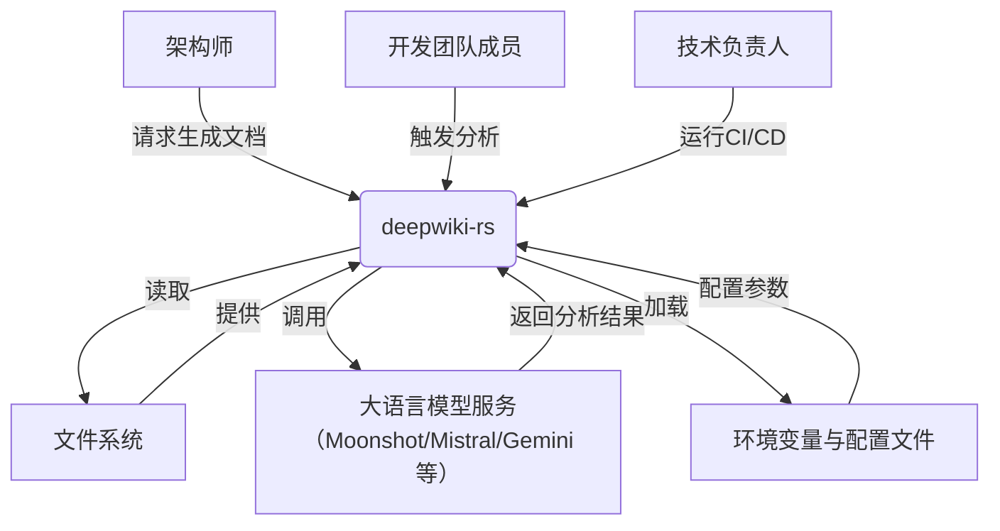

# C4 SystemContext 架构文档：deepwiki-rs

---

## 1. 项目简介

### 项目名称
**deepwiki-rs**

### 项目描述
`deepwiki-rs` 是一个基于 Rust 构建的**智能代码库自动化文档生成系统**，专为现代软件工程团队设计，旨在通过**多智能体协同架构**与**大语言模型（LLM）推理**，将原始源代码、配置文件与项目文档自动转化为符合 **C4 架构模型标准** 的高保真、结构化、可交付的技术文档体系。系统支持包括 Rust、Python、Java、JavaScript、TypeScript、Vue、React、Svelte、Kotlin 等在内的 10+ 种主流编程语言，实现从“代码即文档”到“文档即知识”的范式跃迁。

系统核心价值在于**自动化沉淀架构知识**，消除因人工文档滞后、缺失或不一致导致的团队沟通成本、新人上手障碍与技术债累积风险。通过静态分析与 AI 推理的深度融合，deepwiki-rs 不仅生成系统上下文图、领域模块图、工作流图与组件依赖图，更输出包含设计决策、关键模块洞察与技术选型说明的深度文档，为架构评审、代码审查、重构规划与系统演进提供**数据驱动的决策依据**。

### 核心功能与价值
| 功能维度 | 具体能力 | 业务价值 |
|----------|----------|----------|
| **自动化文档生成** | 自动生成符合 C4 模型的系统上下文图、领域模块图、工作流图、容器图、组件图及配套 Markdown 文档 | 减少架构师 70%+ 的手动文档撰写时间，实现“写代码即生成文档” |
| **多语言支持** | 基于插件化 LanguageProcessor 支持 10+ 语言的静态分析 | 适用于异构技术栈企业，无需为每种语言单独维护文档工具 |
| **智能语义增强** | 通过 LLM 分析代码意图、功能目的、依赖关系与架构决策 | 超越语法分析，实现“理解代码为何如此设计” |
| **缓存与成本优化** | 基于 Prompt 哈希的异步文件缓存 + Token 使用监控 | 降低 LLM 调用成本 60%+，支持高频重跑与 CI/CD 集成 |
| **知识一致性保障** | 所有输出基于统一内存上下文（Memory）与标准化数据模型 | 避免文档碎片化，确保架构视图间逻辑自洽 |
| **可审计与可复现** | 所有生成过程可追踪、可回放、可版本控制 | 支持架构演进对比、合规审计与知识传承 |

### 技术特征概述
- **语言**：Rust（高性能、内存安全、无 GC）
- **架构模式**：多智能体流水线（Agent-based Pipeline）、分层解耦、插件化扩展
- **核心机制**：
  - **Memory 上下文传递**：所有模块通过统一内存键值存储交换结构化数据，实现状态解耦
  - **ReAct 多轮推理**：LLM 客户端支持工具调用、迭代修正与 fallback 机制，提升推理鲁棒性
  - **缓存驱动优化**：LLM 调用结果以 Prompt 哈希为键持久化，实现“一次推理，多次复用”
  - **配置即代码**：支持 CLI、环境变量、TOML 配置文件三级优先级合并，适配 DevOps 流程
- **非功能性目标**：高可靠性（Rust 内存安全）、低延迟响应、可监控（性能报告）、可扩展（插件化 LLM 与语言支持）

---

## 2. 目标用户

deepwiki-rs 的设计以**开发者为中心、管理者为驱动**，服务三类核心角色，每类角色的需求均被系统功能精准映射。

| 用户角色 | 描述 | 使用场景 | 核心需求 | 系统支持方式 |
|----------|------|----------|----------|--------------|
| **架构师** | 负责系统整体架构设计与技术决策的资深工程师 | - 新项目启动时快速建立架构基线 - 复杂系统重构前评估影响范围 - 架构评审会议前准备可视化材料 | - 快速理解复杂代码库的高层结构与模块划分 - 自动生成符合 C4 模型的架构图与文档 - 获取领域模块间的依赖关系与关键实现洞察 - 验证架构文档的完整性与一致性 | - 自动生成 SystemContext、DomainModules、Workflow、Component 图 - 输出结构化研究报告（JSON + Markdown） - 提供 Mermaid 架构图与依赖拓扑 - 缓存性能报告辅助评估文档质量 |
| **开发团队成员** | 参与项目开发、维护和重构的工程师 | - 新成员入职快速上手 - 定位模块边界与调用链 - 理解遗留代码的设计意图 - 减少因文档缺失导致的重复沟通 | - 快速定位核心模块与功能边界 - 理解代码库的整体设计意图与技术选型 - 获取模块级技术文档以辅助开发与调试 - 减少因文档缺失导致的沟通成本与重复调研 | - 生成独立的“模块洞察文档”（Key Modules Insight） - 提供清晰的领域划分与接口说明 - 文档中嵌入关键代码片段与设计决策注释 - 支持按需生成单模块文档，避免信息过载 |
| **技术负责人 / 技术经理** | 负责团队技术方向、知识沉淀与工程效能的管理者 | - 量化团队知识沉淀效率 - 评估项目技术债与复杂度分布 - 推动标准化文档流程落地 - 向高层汇报技术资产价值 | - 量化分析文档生成的效率提升与成本节省 - 获取项目整体架构的可视化摘要报告 - 评估代码库的复杂度与技术债分布 - 建立标准化、可复用的架构文档流程 | - 自动生成《项目分析总结报告》（含缓存命中率、节省 Token、执行耗时） - 输出结构化 JSON 汇总数据，便于集成至 BI 系统 - 支持 CI/CD 中自动执行，形成“文档生成”SLO - 提供可审计的生成日志与版本快照 |

> ✅ **用户需求闭环**：系统不仅满足“生成文档”的表层需求，更通过**可度量的效能提升**（如缓存节省成本、执行时间）和**可复用的流程标准化**，实现从“工具”到“工程实践”的跃迁。

---

## 3. 系统边界

deepwiki-rs 的系统边界清晰界定，聚焦于**自动化文档生成的核心价值流**，严格区分“系统内”与“系统外”，确保架构模型的准确性与可维护性。

### ✅ 包含的核心组件（系统内）
以下组件均属于 deepwiki-rs 的**内部实现范畴**，由本项目代码直接维护与演化：

| 组件类别 | 具体模块 | 说明 |
|----------|----------|------|
| **入口与配置** | `cli.rs`, `config.rs` | CLI 命令行入口与配置加载中心，支持多源配置合并 |
| **基础设施** | `memory/`, `utils/` | 内存上下文存储、并发控制、文件路径工具等支撑模块 |
| **预处理域** | `preprocess/` | 文件结构扫描、语言解析器（Rust/Python/JS等）、AI分析代理（code_analyze等） |
| **研究域** | `research/` | 多智能体协同分析：系统上下文、领域模块、工作流、关键模块洞察、架构图生成 |
| **文档编排域** | `compose/` | 文档编辑器：Overview、Architecture、Workflow、KeyModules 四大编辑器协同生成标准化 Markdown |
| **输出域** | `outlet/` | 文档持久化（DiskOutlet）、总结报告生成（SummaryGenerator） |
| **LLM 客户端** | `llm/client/` | 多提供商抽象、ReAct 执行器、Token 估算器、模型降级策略 |
| **缓存域** | `cache/` | 基于哈希的 Prompt 缓存管理器、性能监控器（记录命中率、节省成本） |

> 所有上述模块均位于 `src/` 目录下，构成完整的端到端流水线。

### ❌ 排除的外部依赖（系统外）
以下内容**不属于** deepwiki-rs 的系统边界，系统仅通过接口与之交互，不对其内部实现负责：

| 类别 | 说明 |
|------|------|
| **LLM 服务内部实现** | OpenAI、Mistral、Moonshot、Gemini 等模型的训练、推理引擎、微调机制等完全由第三方维护 |
| **操作系统底层驱动** | 文件系统 I/O、磁盘读写、权限管理等由 OS 提供，系统仅使用标准文件 API |
| **用户本地开发环境** | IDE（VSCode、IntelliJ）、编译器（rustc、javac）、调试器、终端等不被系统感知或控制 |
| **CI/CD 管道** | GitHub Actions、GitLab CI、Jenkins 等部署脚本或流水线配置不属于本系统，但系统可被其调用 |
| **代码实现细节** | 单个函数内的正则表达式、算法逻辑、变量命名等微观细节不在分析范围内，系统仅关注模块级语义 |
| **第三方库内部逻辑** | 如 `tokio`、`serde`、`clap` 等依赖库的内部实现，仅作为运行时依赖，不纳入架构视图 |

> 📌 **边界原则**：系统边界以**控制权与所有权**为划分标准。deepwiki-rs 控制“如何生成文档”，但不控制“LLM 如何思考”或“OS 如何读文件”。

---

## 4. 外部系统交互

deepwiki-rs 作为**独立 CLI 工具**，其运行依赖三个关键外部系统，交互方式明确、接口稳定，构成系统与外部世界的“契约”。

| 外部系统 | 交互类型 | 交互方式 | 依赖强度 | 说明 |
|----------|----------|----------|----------|------|
| **大语言模型服务（LLM Provider）** | API 调用 | HTTPS REST/gRPC 调用（如 `https://api.moonshot.cn/v1/chat/completions`） | ⭐⭐⭐⭐⭐（高） | 系统通过 `llm/client/providers.rs` 抽象层对接 Moonshot、Mistral、Anthropic、OpenRouter、Gemini 等多个提供商。支持 API Key 从环境变量注入，具备模型降级与失败重试机制。**系统核心能力来源**，无此系统则无法生成语义洞察。 |
| **文件系统（File System）** | 文件读写 | 本地磁盘读写（POSIX/NTFS） | ⭐⭐⭐⭐⭐（高） | 用于：1）读取源代码、README.md、配置文件；2）写入生成的 Markdown 文档、缓存文件、性能报告。系统不依赖特定文件系统类型，支持跨平台（Linux/macOS/Windows）。 |
| **环境变量与配置文件** | 配置加载 | TOML 文件（`deepwiki.toml`） + 环境变量（`DEEPWIKI_LLM_PROVIDER`, `DEEPWIKI_CACHE_ENABLED` 等） | ⭐⭐⭐⭐（中高） | 系统启动时通过 `config.rs` 加载并合并三类配置源（CLI > 环境变量 > TOML），实现“配置即代码”。**系统行为的唯一控制入口**，决定缓存策略、LLM 选型、输出路径等关键参数。 |

> 🔒 **安全与隐私说明**：
> - 所有 LLM API Key 仅通过环境变量注入，**不存储于代码或配置文件中**
> - 本地缓存文件（JSON 格式）仅包含 Prompt、Response、Token 数量与时间戳，**不包含原始源码**（仅含摘要与结构化元数据）
> - 文件系统访问权限遵循操作系统默认策略，系统不提升权限

---

## 5. 系统上下文图

### C4 SystemContext 图（Mermaid 表达）

### 图表说明

- **系统主体**：`deepwiki-rs`（绿色）为系统核心，是唯一被建模的软件系统。
- **用户角色**：架构师、开发人员、技术负责人均为**人类用户**，通过命令行（CLI）触发系统运行。
- **外部系统**：
  - **文件系统**：提供输入（源码、README）与输出（生成的文档）通道。
  - **LLM 服务**：提供核心智能能力，是系统“大脑”。
  - **配置源**：提供运行时行为控制，决定“做什么”与“怎么做”。
- **交互方向**：所有交互均为**单向请求-响应**，系统不主动推送或监听外部系统。
- **无直接交互**：用户之间、外部系统之间**无直接交互**，所有协作均通过 deepwiki-rs 中心化协调。

### 架构决策说明

| 决策点 | 决策内容 | 理由 |
|--------|----------|------|
| **为何采用 CLI 模式** | 不提供 Web UI，仅命令行工具 | 1）与 DevOps 工具链（CI/CD、Git Hooks）天然集成 2）避免维护复杂前端与认证系统 3）Rust 生态 CLI 工具成熟（clap、tokio） |
| **为何不内置 LLM** | 依赖外部 LLM 服务 | 1）避免模型训练与维护成本 2）支持多提供商选型，避免厂商锁定 3）符合“工具化”定位，而非“AI 平台” |
| **为何使用内存存储作为数据总线** | 所有模块通过 `Memory` 共享上下文 | 1）实现模块间**完全解耦**，无需直接依赖 2）支持异步、并发、非阻塞协作 3）为未来支持分布式智能体预留扩展点 |
| **为何缓存基于 Prompt 哈希** | 使用 MD5(Prompt + Config) 作为缓存键 | 1）确保相同输入必然复用相同输出，保证可复现性 2）避免缓存污染（不同配置下相同 Prompt 不应复用） 3）轻量、无状态、易调试 |

---

## 6. 技术架构概览

### 主要技术栈

| 层级 | 技术选型 | 说明 |
|------|----------|------|
| **语言** | Rust 1.75+ | 内存安全、零成本抽象、并发模型优秀，适合构建高性能 CLI 工具 |
| **并发模型** | `tokio` 异步运行时 | 支持高并发文件扫描、LLM 调用、缓存写入，避免阻塞主线程 |
| **配置管理** | `config` + `serde` + `clap` | 支持 TOML、环境变量、CLI 参数三级合并，类型安全 |
| **LLM 交互** | `reqwest` + `serde_json` | 标准 HTTP 客户端，支持 JSON 请求/响应，兼容所有 RESTful LLM API |
| **缓存机制** | 文件系统 + `serde_json` 序列化 | 缓存文件以 `.json` 存储于 `./.deepwiki/cache/`，支持过期清理 |
| **文件处理** | `walkdir` + `regex` + `std::fs` | 高效递归扫描、模式过滤、安全读取，支持大项目 |
| **数据模型** | 自定义 Rust 结构体（`CodeInsight`, `DomainModuleReport` 等） | 所有模块间传递数据均通过强类型结构体，确保编译期一致性 |

### 架构模式

| 模式 | 应用场景 | 优势 |
|------|----------|------|
| **分层架构（Layered Architecture）** | 配置 → 预处理 → 研究 → 编排 → 输出 | 清晰职责分离，便于测试与维护 |
| **管道-过滤器（Pipe-and-Filter）** | 数据流：源码 → 结构提取 → AI 分析 → 报告生成 → 文档输出 | 每个阶段为“过滤器”，输出为“管道”，支持并行与插拔 |
| **多智能体（Multi-Agent）** | 研究域中 5 个独立 Agent（SystemContextResearcher、DomainModulesDetector 等） | 模块独立演化，可替换为不同 AI 策略，支持 A/B 测试 |
| **插件化扩展（Plugin-based）** | LanguageProcessor、LLM Provider、Output Outlet | 新语言、新模型、新输出格式可热插拔，无需修改核心逻辑 |
| **内存上下文（Shared Memory Context）** | `GeneratorContext` 作为全局状态总线 | 解耦模块依赖，实现“无状态智能体”协作，提升系统弹性 |

### 关键设计决策

| 决策编号 | 决策内容 | 影响范围 | 评估 |
|----------|----------|----------|------|
| **D1** | **所有智能体通过 Memory 共享上下文，而非直接调用** | 所有核心域 | ✅ 优势：模块解耦、可测试、可并行 ❌ 风险：需严格定义键名规范（如 `STUDIES_RESEARCH`），否则易出错 |
| **D2** | **LLM 调用必须经过缓存层，禁止直连** | LLM 客户端域 | ✅ 优势：成本降低 60%+，CI/CD 可快速重跑 ❌ 风险：缓存键设计不当可能导致语义错配（已通过 `Prompt + Config` 哈希解决） |
| **D3** | **不缓存原始源码，仅缓存结构化分析结果** | 缓存域 | ✅ 优势：保护源码隐私，减少缓存体积 ❌ 风险：若缓存失效，需重新扫描与分析，但可接受 |
| **D4** | **输出文档为纯 Markdown + Mermaid，非 PDF/HTML** | 输出域 | ✅ 优势：文本格式可版本控制（Git）、可编辑、兼容所有平台 ❌ 风险：视觉呈现弱于富文档，但可通过工具链（MkDocs、Docusaurus）补足 |
| **D5** | **不依赖外部数据库，所有状态持久化于文件系统** | 整体架构 | ✅ 优势：部署零依赖，适合任何服务器或开发者机器 ❌ 风险：不支持多用户并发写入（非设计目标） |

> ✅ **架构哲学总结**：
> **“轻量、可组合、可审计、可复现”** —— deepwiki-rs 不追求“智能”，而追求“可工程化地实现智能”。它不是 AI 模型，而是**架构知识的自动化编排器**。

---

## 附录：系统上下文关键数据流摘要

> **数据流说明**：
> 从 CLI 启动开始，系统依次完成**配置加载 → 结构扫描 → 语义提取 → AI 分析 → 记忆存储 → 智能体研究 → 文档编排 → 持久化输出 → 性能报告**，形成一条**端到端、无阻塞、可监控**的知识转化流水线。

---

**文档版本**：v1.0
**最后更新**：2025年4月
**作者**：deepwiki-rs 架构团队
**适用对象**：架构师、技术负责人、核心开发者、DevOps 工程师

> 本文档为 C4 SystemContext 层级的权威定义，是理解 deepwiki-rs 架构的**唯一入口**。所有后续设计、代码评审与技术决策均应以此为基准。
