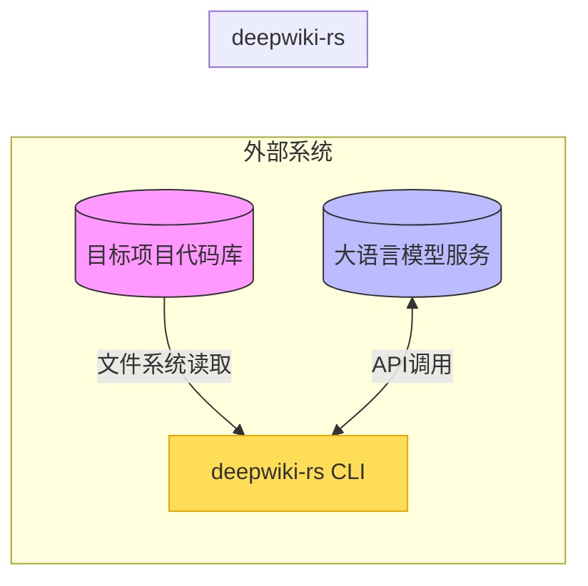
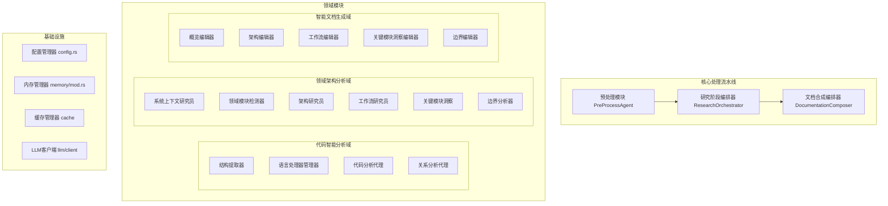
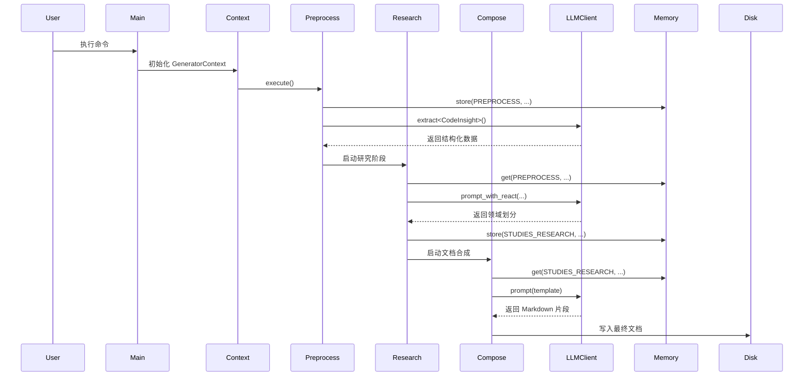
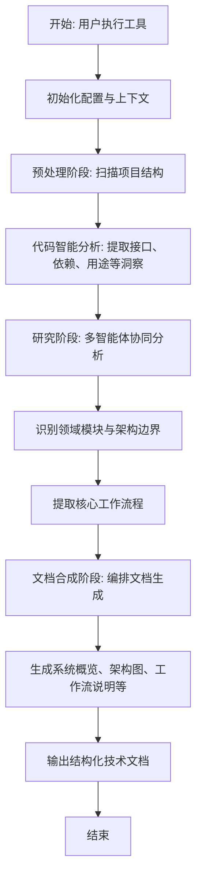
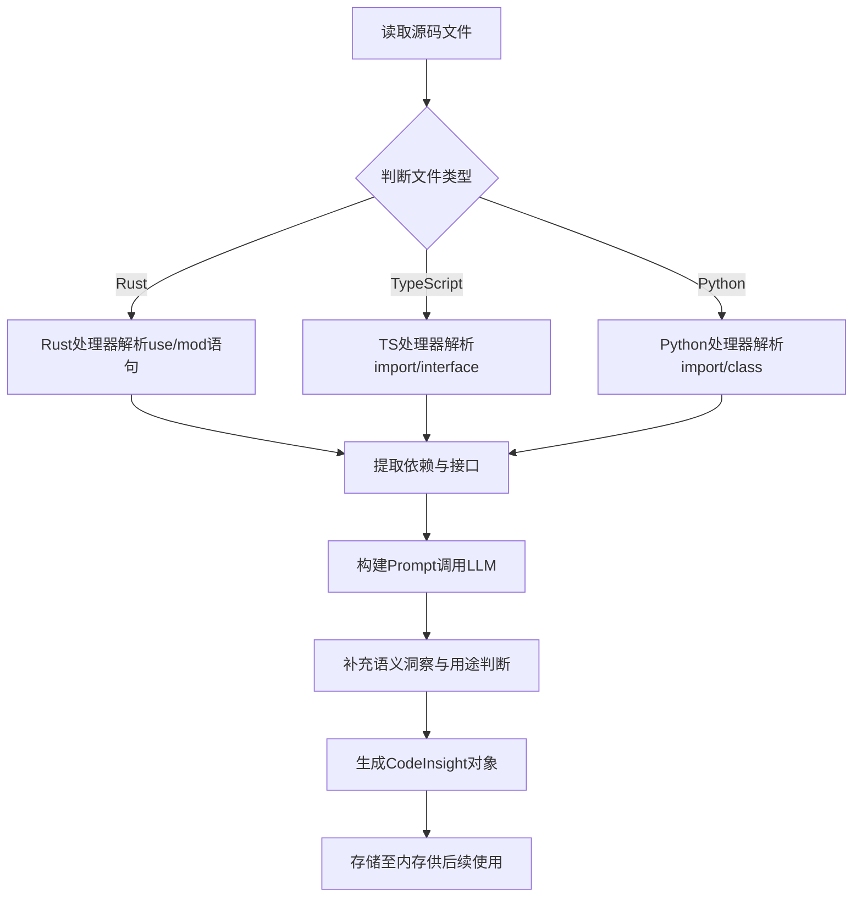
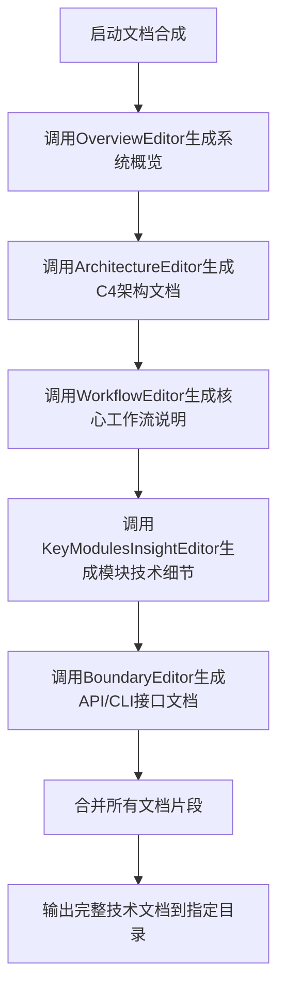
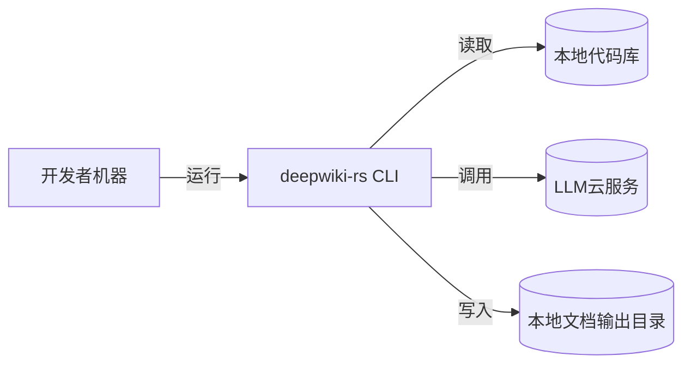

# 系统架构文档

## 1. 架构概览 (Architecture Overview)

### 架构设计理念

`deepwiki-rs` 是一个基于 **C4 模型驱动的智能技术文档生成系统**，其核心设计哲学是“**从代码中自动提炼架构知识**”。系统通过模拟人类专家理解软件系统的认知过程——即“观察 → 分析 → 归纳 → 表达”——构建了一个分层、流水线式的自动化分析引擎。

该系统以 **领域驱动设计（DDD）** 和 **多智能体协作架构（Multi-Agent Collaboration）** 为核心思想，将复杂的文档生成任务分解为多个职责清晰的领域模块。每个模块由专用的“智能体（Agent）”执行特定子任务，并通过共享内存机制协同工作，确保高内聚、低耦合。

整体架构遵循 **C4 模型的认知层次**：
- **C1（系统上下文）**：识别项目边界与用户角色
- **C2（容器视图）**：划分领域模块与交互关系
- **C3（组件视图）**：提取关键模块内部结构
- **C4（代码视图）**：解析具体实现细节

这种自顶向下、逐层细化的设计理念，使得生成的技术文档不仅结构规范，而且贴近真实架构师的思维方式。

### 核心架构模式

| 模式 | 描述 |
|------|------|
| **分层流水线架构（Pipeline Architecture）** | 系统采用 `预处理 → 研究 → 文档合成` 三阶段流水线，各阶段职责分离，数据依次传递，便于扩展和调试。 |
| **多智能体协作模式（Multi-Agent System）** | 每个功能单元被建模为独立 Agent（如 `DomainModulesDetector`、`ArchitectureEditor`），具备明确输入输出，支持并行/串行调度。 |
| **内存共享通信（Shared Memory Communication）** | 所有 Agent 通过统一的 `Memory` 管理器读写运行时状态，避免直接依赖，降低耦合度。 |
| **提示工程模板化（Prompt Templating）** | 使用结构化 Prompt 模板引导 LLM 输出标准化内容，提升结果一致性与可预测性。 |
| **ReAct 工具调用模式** | 在复杂推理任务中启用 ReAct 模式，允许 LLM 调用内置工具（如文件读取、结构提取）进行迭代思考。 |

### 技术栈概述

| 类别 | 技术选型 | 说明 |
|------|--------|------|
| 开发语言 | Rust | 高性能、内存安全、异步 I/O 支持，适合 CLI 工具与高吞吐场景 |
| 异步运行时 | Tokio | 提供高效的异步任务调度能力 |
| 命令行解析 | Clap | 强大的参数解析与帮助生成功能 |
| 错误处理 | Anyhow + thiserror | 统一错误类型与上下文追踪 |
| JSON Schema | schemars + serde_json | 支持结构化数据提取（LLM extract 模式） |
| 日志系统 | tracing + env_logger | 结构化日志输出，支持调试与性能监控 |
| 文件操作 | tokio::fs + walkdir | 异步文件遍历与读写 |
| 缓存管理 | HashMap + File-based Cache | 基于 Prompt Hash 的缓存复用机制 |

---

## 2. 系统上下文 (System Context)

### 系统定位与价值

`deepwiki-rs` 定位于 **自动化技术知识沉淀工具**，旨在解决现代软件开发中普遍存在的“文档缺失”、“知识孤岛”和“新人上手难”等问题。通过对任意代码库进行静态分析与语义理解，系统能够自动生成符合 C4 架构模型标准的高质量技术文档，显著降低团队的知识传递成本。

**业务价值体现**：
- ✅ **提升可维护性**：快速理解遗留系统或第三方项目
- ✅ **加速新人入职**：提供开箱即用的系统全景图
- ✅ **促进架构治理**：推动技术资产标准化沉淀
- ✅ **辅助技术决策**：为重构、迁移、评估提供依据

### 用户角色与场景

| 角色 | 典型使用场景 |
|------|-------------|
| **软件架构师** | 快速掌握新项目的整体架构，识别核心模块与技术债务 |
| **开发工程师** | 上手新项目时理解代码组织结构与关键接口 |
| **技术负责人** | 评估项目复杂度，推动团队知识资产积累 |
| **技术布道者** | 自动生成开源项目的入门指南与架构说明 |

### 外部系统交互



- **目标项目代码库**：作为输入源，系统通过文件系统扫描 `.rs`, `.ts`, `.py` 等源码文件。
- **大语言模型服务**：调用 Moonshot、DeepSeek、Mistral 等 LLM 提供商 API，用于代码语义理解、推理与文档生成。

### 系统边界定义

| 包含组件 | 功能说明 |
|---------|----------|
| 多语言代码解析器 | 支持 Rust/TS/JS/Python/Java/Kotlin/React/Vue/Svelte |
| 智能 Agent 分析引擎 | 预处理 → 研究 → 文档合成三阶段流水线 |
| C4 模型驱动文档生成 | 输出包含系统上下文、架构图、工作流等的标准文档 |
| LLM 交互与缓存管理 | 支持多种 LLM 提供商，具备重试、降级与缓存机制 |
| 配置与内存状态管理 | 全局配置加载与运行时数据共享 |

| 排除组件 | 原因说明 |
|---------|----------|
| 图形化用户界面（GUI） | 当前为 CLI 工具，未来可扩展 Web UI |
| 实时协作编辑功能 | 不涉及多人协同场景 |
| Git 集成 | 未集成版本控制系统钩子 |
| 私有化 LLM 训练 | 仅调用外部 API，不训练模型 |
| 运行时性能监控 | 无 APM 或分布式追踪能力 |

---

## 3. 容器视图 (Container View)

### 领域模块划分

系统划分为五大领域模块，涵盖核心业务逻辑、支撑服务与基础设施：

| 领域名称 | 类型 | 路径 | 重要性 | 复杂度 |
|--------|-----|------|-------|--------|
| 领域架构分析域 | 核心业务域 | `src/generator/research/agents/` | 9.5 | 9.0 |
| 智能文档生成域 | 核心业务域 | `src/generator/compose/agents/` | 9.0 | 8.5 |
| 代码智能分析域 | 核心业务域 | `src/generator/preprocess/extractors/` | 8.5 | 9.0 |
| 大语言模型交互域 | 工具支撑域 | `src/llm/client/` | 8.5 | 8.0 |
| 配置与状态管理域 | 基础设施域 | `src/config.rs`, `src/memory/mod.rs` | 8.0 | 7.0 |

### 领域模块架构



### 存储设计

#### 内存管理系统（Memory）

- **作用**：在运行时存储和检索序列化数据，实现跨阶段数据共享。
- **作用域隔离**：
  - `PREPROCESS`：预处理阶段输出（ProjectStructure, CodeInsight）
  - `STUDIES_RESEARCH`：研究阶段成果（DomainReport, Workflow）
  - `DOCUMENTATION`：文档生成中间态
  - `timing`：性能统计信息
- **功能接口**：
  - `store(scope, key, data)`：序列化存储对象
  - `get<T>(scope, key)`：反序列化读取对象
  - `list_keys()` / `has_data()`：元数据查询
  - 支持访问计数与大小统计

#### 缓存管理系统（Cache）

- **缓存粒度**：基于 Prompt Hash 缓存 LLM 调用结果
- **缓存策略**：
  - 自动失效机制（可配置 TTL）
  - 支持本地文件持久化
  - 可通过 `--no-cache` 参数禁用
- **性能优化**：避免重复调用相同语义请求，提升响应速度

### 领域模块间通信

| 来源领域 | 目标领域 | 通信方式 | 数据内容 |
|--------|--------|--------|--------|
| 代码智能分析域 | 领域架构分析域 | 内存共享 | CodeInsight[], ProjectStructure |
| 领域架构分析域 | 智能文档生成域 | 内存共享 | DomainReport, SystemContext |
| 所有领域 | 大语言模型交互域 | 服务调用 | Prompt 请求与响应 |
| 所有领域 | 配置与状态管理域 | 配置依赖 | config.rs 中的 exclude_rules, output_dir, model_name 等 |

> ⚠️ **通信原则**：所有跨领域交互均通过 `GeneratorContext` 上下文对象间接完成，禁止直接引用对方模块，保证松耦合。

---

## 4. 组件视图 (Component View)

### 核心功能组件

#### （1）`GeneratorContext` —— 全局上下文管理器

```rust
pub struct GeneratorContext {
    pub llm_client: LLMClient,
    pub config: Config,
    pub cache_manager: Arc<RwLock<CacheManager>>,
    pub memory: Arc<RwLock<Memory>>,
}
```

- **职责**：贯穿整个执行流程，提供统一的数据访问入口
- **线程安全**：使用 `Arc<RwLock<T>>` 实现异步读写保护
- **生命周期**：从 `main.rs` 初始化直至程序退出

#### （2）`PreProcessAgent` —— 预处理代理

- **路径**：`src/generator/preprocess/mod.rs`
- **职责**：
  - 扫描项目目录结构
  - 调用语言处理器提取语法元素
  - 调用 LLM 生成 CodeInsight
  - 分析模块依赖关系
- **关键子组件**：
  - `StructureExtractor`：识别核心文件与目录
  - `LanguageProcessorManager`：路由不同语言解析请求
  - `CodeAnalyze Agent`：生成单文件语义洞察

#### （3）`ResearchOrchestrator` —— 研究阶段编排器

- **路径**：`src/generator/research/orchestrator.rs`
- **职责**：
  - 按 C1-C4 层次顺序调度研究型 Agent
  - 整合多源分析结果
  - 输出结构化领域报告
- **执行顺序**：
  1. `SystemContextResearcher` → 确定项目类型与用户角色
  2. `DomainModulesDetector` → 划分高层次业务域
  3. `ArchitectureResearcher` → 生成 Mermaid 架构图
  4. `WorkflowResearcher` → 提取主干工作流
  5. `KeyModulesInsight` → 深入分析关键技术点

#### （4）`DocumentationComposer` —— 文档合成编排器

- **路径**：`src/generator/compose/mod.rs`
- **职责**：
  - 协调多个 Editor Agent 并行或串行执行
  - 维护文档生成流水线
  - 合并片段生成最终 Markdown
- **并发控制**：使用 `do_parallel_with_limit()` 控制最大并发数
- **轻量任务本地生成**：部分简单章节（如目录）无需调用 LLM

### 技术支撑组件

#### （1）`LLMClient` —— 统一 LLM 调用接口

- **路径**：`src/llm/client/mod.rs`
- **核心能力**：
  - `prompt()`：普通文本生成
  - `extract<T>()`：结构化 JSON 提取（配合 JsonSchema）
  - `prompt_with_react()`：支持工具调用的 ReAct 模式
- **容错机制**：
  - 自动重试 + 指数退避
  - 主备模型 fallback（befitting_model → fallover_model）
  - ReAct 达到最大深度后自动切换为 Summary Reasoning

#### （2）`Provider 抽象层` —— 多厂商插件化接入

- **路径**：`src/llm/client/providers.rs`
- **设计亮点**：
  - 统一抽象 `LLMProvider` trait
  - 动态初始化不同提供商客户端（Moonshot、DeepSeek 等）
  - 隐藏 API 差异，实现无缝切换

#### （3）`Memory` —— 运行时状态中枢

- **路径**：`src/memory/mod.rs`
- **特性**：
  - 按作用域组织数据（PREPROCESS / STUDIES_RESEARCH / DOCUMENTATION）
  - 支持嵌套作用域与继承
  - 提供统计接口（total_size, access_count）

### 组件职责划分

| 组件 | 输入 | 输出 | 是否调用 LLM |
|------|------|------|-------------|
| StructureExtractor | 项目根路径 | ProjectStructure | 否 |
| LanguageProcessor | 源码文件 | AST 片段（use/import） | 否 |
| CodeAnalyze Agent | 源码 + AST | CodeInsight（用途、复杂度） | 是 |
| DomainModulesDetector | CodeInsight[] | DomainReport | 是 |
| ArchitectureEditor | DomainReport | Mermaid 架构图 + 描述 | 是 |
| WorkflowEditor | SystemContext + CodeInsight | 核心工作流说明 | 是 |

### 组件交互关系



---

## 5. 关键流程 (Key Processes)

### 核心功能流程

#### 项目分析与文档生成流程



> 📌 **耗时统计**：每阶段耗时记录至 `Memory` 的 `timing` 作用域，用于性能分析。

### 技术处理流程

#### 代码洞察生成流程



#### 智能文档编排流程



### 数据流转路径

```text
[代码库]
   ↓ (文件扫描)
Preprocess → 提取结构 + LLM分析 → 生成 CodeInsight
   ↓ (存储至 MemoryScope::PREPROCESS)
Research → 整合上下文 + 领域探测 → 生成 DomainReport
   ↓ (存储至 MemoryScope::STUDIES_RESEARCH)
Compose → 调用 LLM + 模板渲染 → 生成 Markdown 文档
   ↓ (写入磁盘)
[输出文档]
```

### 异常处理机制

| 异常类型 | 处理策略 |
|--------|---------|
| 文件读取失败 | 跳过该文件，记录警告日志 |
| LLM 调用超时 | 自动重试（最多3次），指数退避 |
| LLM 返回无效格式 | 尝试 fallback_model，仍失败则降级为 summary reasoning |
| 内存溢出 | 触发清理策略，优先释放临时作用域 |
| 缓存损坏 | 自动重建缓存目录 |
| 配置错误 | 提供默认值或中断执行并提示修正 |

---

## 6. 技术实现 (Technical Implementation)

### 核心模块实现

#### （1）`CodeInsight` 数据结构设计

```rust
#[derive(Serialize, Deserialize, Debug)]
pub struct CodeInsight {
    pub file_path: String,
    pub language: String,
    pub dependencies: Vec<String>,
    pub exports: Vec<String>,
    pub complexity: f32,
    pub purpose: String,
    pub usage_patterns: Vec<String>,
    pub related_files: Vec<String>,
}
```

- **用途**：作为代码语义理解的基本单位，在各阶段间传递
- **序列化**：使用 `serde` 支持 JSON 存储与网络传输

#### （2）`DomainReport` 领域报告结构

```rust
pub struct DomainReport {
    pub domains: Vec<DomainModule>,
    pub relationships: Vec<Relationship>,
    pub context: SystemContext,
    pub architecture_style: Option<String>,
}
```

- **指导文档生成**：直接映射到 C4 容器视图中的“容器”与“关系”

### 关键算法设计

#### 多语言处理器路由算法

```rust
fn select_processor(file_path: &str) -> Box<dyn LanguageProcessor> {
    match Path::new(file_path).extension().and_then(|s| s.to_str()) {
        Some("rs") => Box::new(RustProcessor),
        Some("ts"|"tsx") => Box::new(TSProcessor),
        Some("js"|"jsx") => Box::new(JSProcessor),
        Some("py") => Box::new(PythonProcessor),
        Some("java") => Box::new(JavaProcessor),
        _ => Box::new(GenericTextProcessor),
    }
}
```

#### 并发文档生成控制

```rust
async fn do_parallel_with_limit<F, T>(
    tasks: Vec<F>,
    limit: usize,
) -> Vec<anyhow::Result<T>>
where
    F: Future<Output = anyhow::Result<T>> + Send,
    T: Send,
{
    stream::iter(tasks)
        .buffer_unordered(limit)
        .collect()
        .await
}
```

### 数据结构设计

| 结构体 | 用途 | 序列化 |
|-------|------|--------|
| `Config` | 存储用户配置项（model, output_dir, excludes） | TOML |
| `ProjectStructure` | 记录目录树、文件数量、语言分布 | JSON |
| `MemoryEntry` | 内存中存储的通用数据条目 | Bincode |
| `PromptTemplate` | 文档生成用的提示词模板 | Handlebars |

### 性能优化策略

| 策略 | 实现方式 |
|------|---------|
| **异步非阻塞 I/O** | 使用 `tokio::fs` 替代同步读写 |
| **LLM 调用缓存** | 基于 Prompt Hash 缓存响应结果 |
| **并发处理** | 多文件并行分析，文档片段并发生成 |
| **Prompt 压缩** | 使用 `prompt_compressor.rs` 减少 token 消耗 |
| **Token 预估** | 提前估算输入长度，防止超出模型限制 |

---

## 7. 部署架构 (Deployment Architecture)

### 运行环境要求

| 项目 | 要求 |
|------|------|
| 操作系统 | Linux / macOS / Windows（WSL推荐） |
| Rust 版本 | ≥ 1.70 |
| 内存 | ≥ 4GB（大型项目建议 8GB+） |
| 存储 | ≥ 1GB 可用空间（含缓存） |
| 网络 | 需访问 LLM API（支持代理配置） |

### 部署拓扑结构



> 💡 **部署模式**：当前为本地 CLI 工具，适用于个人或小团队使用。未来可通过 Web Server 化支持 CI/CD 集成。

### 扩展性设计

| 扩展点 | 扩展策略 |
|--------|----------|
| 新语言支持 | 实现新的 `LanguageProcessor` trait 并注册到管理器 |
| 新 LLM 提供商 | 实现 `LLMProvider` trait 并添加 provider enum variant |
| 新文档模板 | 添加 `.hbs` 模板文件并注册到 `PromptTemplate` |
| 新分析维度 | 开发新的 Research Agent 并接入 Orchestrator |
| Web 前端 | 新增 `web/` 模块，暴露 REST API 与前端页面 |

### 监控与运维

#### 内建可观测性能力

- **日志输出**：使用 `tracing` 输出结构化日志，支持 DEBUG/INFO/WARN/ERROR 级别
- **性能统计**：各阶段耗时自动记录至 `Memory::timing`
- **内存使用监控**：实时显示各作用域数据量
- **缓存命中率统计**：展示缓存复用效果

#### 运维建议

| 场景 | 建议 |
|------|------|
| CI/CD 集成 | 在 PR 流程中自动生成文档预览 |
| 团队知识库 | 将输出文档推送至 Confluence/GitBook |
| 敏感信息过滤 | 配置 `exclude_patterns` 避免泄露密钥 |
| 成本控制 | 设置 `max_tokens` 与 `cache_ttl` 控制 LLM 花费 |
| 故障排查 | 启用 `--verbose` 查看详细日志与中间数据 |

---

## 架构洞察与建议

### ✅ 架构优势总结

| 特性 | 说明 |
|------|------|
| **分层清晰** | 预处理 → 研究 → 合成，职责分离，易于扩展 |
| **领域驱动** | 以 C4 模型为指导思想，贴近真实架构认知过程 |
| **多智能体协作** | 每个 Agent 专注单一任务，通过 Memory 协同 |
| **高性能 Rust** | 异步 I/O、零成本抽象、内存安全保障高吞吐 |
| **灵活 LLM 集成** | 插件化 Provider 抽象，支持多厂商无缝切换 |
| **可观测性强** | 内建耗时统计、内存使用监控、日志输出 |

### 🔧 可优化方向建议

| 方向 | 建议 |
|------|------|
| **缓存粒度细化** | 增加 AST 缓存，避免重复解析相同文件 |
| **错误恢复机制** | 支持断点续跑，失败阶段可单独重试 |
| **文档模板定制** | 允许用户自定义 PromptTemplate 以适配企业规范 |
| **可视化前端** | 提供 Web UI 展示分析进度与文档预览 |
| **Git 集成插件** | 支持 PR 自动评论或提交文档变更 |

### 🛡️ 安全性设计

- **API 密钥保护**：支持从环境变量读取，不在配置文件明文存储
- **输入验证**：对用户传入路径做合法性校验，防止路径穿越
- **沙箱执行**：LLM 工具调用限制在项目目录内
- **敏感文件排除**：默认忽略 `.env`, `*.pem` 等高风险文件

---

> **结论**：`deepwiki-rs` 是一个高度结构化、领域驱动的智能文档生成系统。其采用“**预处理→研究→合成**”三阶段流水线，结合 **多智能体架构** 与 **C4 模型理念**，实现了从原始代码到专业文档的端到端自动化。系统通过 `GeneratorContext` 和 `Memory` 实现松耦合协同，利用 `LLMClient` 统一封装 AI 能力，整体架构具备良好的可维护性、扩展性与工程实践价值。

该系统不仅适用于新项目知识沉淀，更在**遗留系统重构、技术交接、新人入职培训**等场景中具有广泛应用前景。
