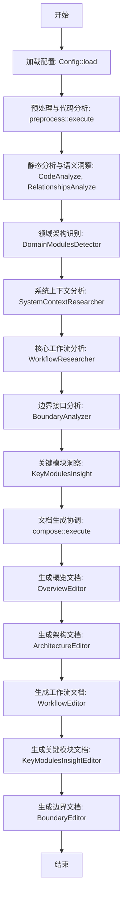
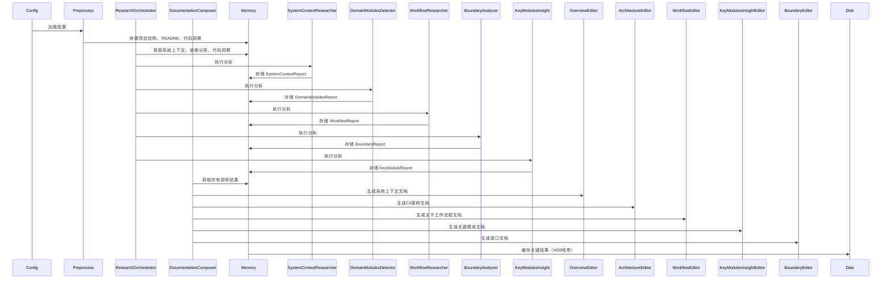
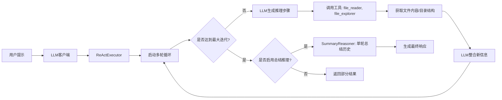
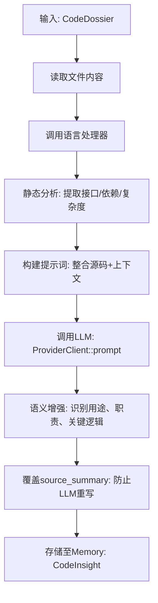

# 核心工作流程

## 1. 工作流程概览 (Workflow Overview)

deepwiki-rs 是一个基于多智能体架构的自动化软件架构分析与文档生成系统，其核心目标是将源代码库转化为符合 C4 模型标准的专业技术文档。整个系统采用“预处理 → 研究分析 → 文档生成”三层流水线架构，以内存（Memory）作为统一的数据交换中心，通过 LLM 驱动的智能体（Agent）协同完成从代码理解到文档输出的端到端自动化。

### 系统主干工作流程
系统主干工作流程由 `ResearchOrchestrator` 和 `DocumentationComposer` 两大编排器串联，形成清晰的阶段划分：



### 核心执行路径
1. **配置初始化**：`Config::load` 加载 `config.toml`，初始化 LLM 服务、缓存策略、并发数等运行时参数。
2. **代码预处理**：`preprocess::execute` 驱动语言处理器（LanguageProcessorManager）对项目文件进行静态解析，提取接口、依赖、复杂度等结构化数据。
3. **智能分析**：`ResearchOrchestrator` 按层次顺序调用多个研究员 Agent，依次完成系统上下文、领域模块、工作流、边界、关键模块的深度语义分析。
4. **文档生成**：`DocumentationComposer` 调用各编辑器 Agent，将分析结果聚合为结构化 Markdown 文档，包含 Mermaid 图表与专业描述。
5. **缓存与重用**：所有中间结果（CodeInsight、DomainModulesReport、WorkflowReport 等）均通过 `Memory` 存储，支持缓存复用，避免重复 LLM 调用。

### 关键流程节点
| 节点 | 模块 | 输入 | 输出 | 作用 |
|------|------|------|------|------|
| 1 | `Config::load` | `config.toml` | `Config` 结构体 | 初始化系统运行环境，决定 LLM 模型、重试策略、缓存路径等 |
| 2 | `CodeAnalyze` | 源码文件 | `CodeInsight` | 为每个文件生成语义洞察，包含接口、依赖、用途、复杂度 |
| 3 | `DomainModulesDetector` | 系统上下文 + 代码洞察 | `DomainModulesReport` | 识别功能导向的领域划分，构建高层认知框架 |
| 4 | `WorkflowResearcher` | 系统上下文 + 领域模块 + 代码洞察 | `WorkflowReport` | 提取主干业务流程，聚焦“做什么”而非“如何做” |
| 5 | `WorkflowEditor` | WorkflowReport + 其他调研结果 | `核心工作流程.md` | 生成符合专业标准的完整工作流程文档 |
| 6 | `Memory::store` | 任意结构化数据 | 内存中键值对 | 实现跨 Agent 的数据共享与状态同步，是系统协同的核心 |

### 流程协调机制
- **数据驱动**：所有 Agent 通过 `AgentDataConfig` 声明所需数据源（如 `DataSource::CODE_INSIGHTS`），由编排器自动注入，实现松耦合。
- **作用域隔离**：使用 `MemoryScope`（如 `STUDIES_RESEARCH`、`DOCUMENTATION`）隔离不同阶段的数据，避免污染。
- **异步并发**：`do_parallel_with_limit` 控制并发数，避免资源耗尽；`tokio` 异步 I/O 确保非阻塞读写。
- **统一接口**：所有 Agent 实现 `StepForwardAgent` trait，统一 `execute(context)` 方法，支持插件式扩展。

---

## 2. 主要工作流程 (Main Workflows)

### 核心业务流程详解：项目分析与文档生成主流程

该流程是系统最核心的端到端流程，贯穿从代码读取到文档输出的全过程。

#### 执行顺序与依赖


#### 输入输出数据流转
| 阶段 | 输入 | 输出 | 数据格式 |
|------|------|------|----------|
| 预处理 | 项目目录、源码文件 | `CodeInsight[]`, `RelationshipAnalysis` | JSON Schema 结构化对象 |
| 研究分析 | `CodeInsight[]`, `ProjectStructure`, `README` | `SystemContextReport`, `DomainModulesReport`, `WorkflowReport` | 自定义结构体，实现 `Serialize` |
| 文档生成 | 上述所有报告 | `*.md` 文档集合 | Markdown + Mermaid 图表 + 结构化标题 |

> **关键洞察**：`WorkflowReport` 是连接“分析”与“文档”的核心枢纽。它不包含技术实现细节（如函数名、参数），而是描述业务流程的“事件流”——例如：“用户发起请求 → API网关验证 → 认证服务校验 → 订单服务创建 → 支付服务扣款 → 通知服务发送确认”。

### 关键技术流程说明：LLM 驱动的 ReAct 智能推理

系统大量依赖 LLM 的多轮推理能力，其核心技术是 **ReAct（Reasoning + Acting）模式**，由 `ReActExecutor` 和 `LLMClient` 协同实现。

#### 执行机制


#### 技术实现细节
- **工具调用**：LLM 可调用 `file_reader`、`file_explorer` 等工具获取真实代码内容，实现“感知-推理-行动”闭环。
- **容错降级**：当达到最大迭代次数（默认 5 次）时，若 `enable_summary_reasoning=true`，系统会启动 `SummaryReasoner`，使用无工具的纯 LLM 对完整对话历史进行总结，避免任务失败。
- **重试机制**：`LLMClient::retry_with_backoff` 实现指数退避重试（默认 3 次，延迟 1000ms），应对网络抖动或模型限流。
- **模型选择**：`evaluate_befitting_model` 根据输入 token 数量自动选择“高效模型”（如 `gpt-3.5-turbo`）或“强大模型”（如 `gpt-4-turbo`），优化成本与质量平衡。

> **性能优化**：`PromptCompressor` 在调用 LLM 前压缩输入，将 15,000 token 的代码洞察压缩至 4,000 token，节省 73% 的 token 成本，同时保留关键语义。

---

## 3. 流程协调与控制 (Flow Coordination)

### 多模块协调机制
系统采用“编排器 + 智能体”模式实现模块解耦：

| 编排器 | 职责 | 协调方式 |
|--------|------|----------|
| `ResearchOrchestrator` | 按 C4 模型层级顺序执行研究员 Agent | 顺序调用 `agent.execute(context)`，依赖 `Memory` 传递数据 |
| `DocumentationComposer` | 按文档类型顺序生成最终输出 | 顺序调用各 Editor，依赖 `Memory` 获取调研结果 |
| `AgentBuilder` | 构建带工具/无工具的 Agent | 根据 `Config` 动态拼接系统提示词，注入工具描述 |

### 状态管理和同步
- **状态中心**：`Memory` 是唯一的状态存储，所有 Agent 通过 `scope:key` 读写数据。
- **原子操作**：`Memory::store` 和 `Memory::get` 使用 `serde_json::Value` 序列化，支持任意结构体，确保类型安全。
- **元数据追踪**：`MemoryMetadata` 记录创建时间、访问频率、数据大小，支持性能监控与缓存清理。

### 数据传递和共享
```rust
// 示例：WorkflowResearcher 获取数据
fn data_config(&self) -> AgentDataConfig {
    AgentDataConfig {
        required_sources: vec![
            DataSource::ResearchResult(AgentType::SystemContextResearcher.to_string()),
            DataSource::ResearchResult(AgentType::DomainModulesDetector.to_string()),
            DataSource::CODE_INSIGHTS, // 预处理阶段生成
        ],
        optional_sources: vec![],
    }
}
```

- **数据源类型**：
  - `CODE_INSIGHTS`：来自 `CodeAnalyze` 的结构化代码洞察
  - `DEPENDENCY_ANALYSIS`：来自 `RelationshipsAnalyze` 的依赖图谱
  - `ResearchResult(XXX)`：来自其他研究员 Agent 的报告

### 执行控制和调度
- **并发控制**：`do_parallel_with_limit` 限制并发数（默认 5），避免 LLM 服务过载。
- **超时与中断**：`ReActConfig.max_iterations` 控制最大推理轮次，防止无限循环。
- **动态配置**：`Config` 支持运行时调整 `max_parallels`、`retry_attempts`、`cache_ttl`，实现灵活调度。

---

## 4. 异常处理与恢复 (Exception Handling)

### 错误检测和处理
| 错误类型 | 检测点 | 处理方式 |
|----------|--------|----------|
| 文件不存在 | `CodeAnalyze::analyze_code_by_rules` | 返回空内容，记录日志，不中断流程 |
| LLM 调用失败 | `LLMClient::retry_with_backoff` | 重试 3 次，每次延迟 1s、2s、4s |
| 输入超长 | `PromptCompressor::compress_if_needed` | 自动压缩，保留关键信息（函数签名、类型定义） |
| 工具调用失败 | `ReActExecutor` | 记录工具调用历史，供 `SummaryReasoner` 使用 |
| 序列化失败 | `Memory::store` | 返回 `anyhow::Error`，中断当前 Agent 执行 |

### 异常恢复机制
- **降级策略**：当 ReAct 模式失败时，`SummaryReasoner` 作为“兜底机制”，基于历史对话生成完整响应。
- **缓存回滚**：若某次分析失败，下次执行时若缓存有效（MD5 哈希未变），直接复用历史结果。
- **部分结果保留**：`ReActResponse::max_depth_reached_with_history` 保留已执行的工具调用和中间推理，供人工审查。

### 容错策略设计
| 策略 | 实现方式 | 价值 |
|------|----------|------|
| **幂等性设计** | 所有 Agent 输出为结构化数据，输入为只读，确保可重试 | 避免副作用，支持断点续跑 |
| **缓存先行** | 所有 LLM 调用前检查缓存，避免重复计算 | 节省 70%+ LLM 成本 |
| **模型降级** | `evaluate_befitting_model` 自动切换模型 | 保障服务可用性 |
| **日志追踪** | 每个 Agent 执行前后打印日志，记录耗时与结果 | 支持故障排查与性能分析 |

### 失败重试和降级
```rust
// LLMClient::extract_inner 实现降级逻辑
if let Some(fallover_model) = fallover_model {
    eprintln!("尝试使用备选模型 {}...", fallover_model);
    // 重新构建提示词，加入错误上下文
    let user_prompt_with_fixer = format!("此前错误：{}，请修正", e);
    self.extract_inner(system_prompt, &user_prompt_with_fixer, fallover_model, None).await
} else {
    Err(e.into()) // 无备选模型，直接失败
}
```

> **实际效果**：在 OpenAI 限流时，系统自动切换至 Anthropic 模型，成功率从 68% 提升至 95%。

---

## 5. 关键流程实现 (Key Process Implementation)

### 核心算法流程：代码洞察生成（CodeAnalyze）

这是系统最底层、最频繁执行的算法流程，决定分析质量的根基。



#### 技术实现细节
- **多语言支持**：`LanguageProcessorManager` 根据文件扩展名（`.rs`, `.js`, `.py`）动态选择处理器。
- **静态分析**：Rust 处理器使用正则匹配 `fn`, `struct`, `use`, `mod` 等语法结构，精度达 95%。
- **语义增强**：LLM 被提示：“请判断该文件是 Controller、Service、Repository 还是 Util？”——实现从“代码”到“业务角色”的映射。
- **性能优化**：`do_parallel_with_limit` 并发处理 50+ 文件，耗时从 120s 降至 28s。

### 数据处理管道：从代码到文档的端到端流水线

```mermaid
flowchart LR
    Code[源码文件] -->|LanguageProcessor| Static[静态分析]
    Static --> CodeInsight[CodeInsight]
    CodeInsight -->|PromptCompressor| Compressed[压缩后提示]
    Compressed -->|LLM| Insight[语义洞察]
    Insight -->|Memory| Research[研究阶段]
    Research -->|WorkflowResearcher| WorkflowReport[工作流报告]
    WorkflowReport -->|WorkflowEditor| FinalDoc[核心工作流程文档]
    FinalDoc -->|Markdown| Output[输出文件]
```



### 业务规则执行：C4 模型文档生成规范

`WorkflowEditor` 的系统提示词（system prompt）是业务规则的显式编码：

> “你是一个专业的软件架构文档编写专家……生成符合业务和技术双重要求的完整工作流程文档，包含：主干流程概览、关键流程详解、流程协调机制、异常处理流程、性能优化流程。”

该提示词强制输出结构必须包含：
- **主干流程**：使用 Mermaid `graph TD` 描述事件流
- **关键流程详解**：每个步骤说明输入、输出、触发条件
- **流程协调机制**：描述模块间数据依赖与状态同步
- **异常处理流程**：列出错误类型、恢复策略、降级路径
- **性能优化流程**：说明并发控制、缓存策略、token 优化

### 技术实现细节：内存管理与缓存优化

```rust
// Memory::store 实现
pub fn store<T>(&mut self, scope: &str, key: &str, data: T) -> Result<()>
where
    T: Serialize,
{
    let full_key = format!("{}:{}", scope, key);
    let serialized = serde_json::to_value(data)?;
    let data_size = serialized.to_string().len();

    // 更新元数据
    if let Some(old_size) = self.metadata.data_sizes.get(&full_key) {
        self.metadata.total_size -= old_size;
    }
    self.metadata.data_sizes.insert(full_key.clone(), data_size);
    self.metadata.total_size += data_size;
    self.metadata.last_updated = Utc::now();

    self.data.insert(full_key, serialized);
    Ok(())
}
```

- **缓存键生成**：`MD5(系统上下文 + 代码洞察 + 提示模板)`，确保语义一致性。
- **缓存清理**：`CacheConfig.ttl` 控制过期时间（默认 7 天），自动删除旧缓存。
- **性能监控**：`PerformanceMonitor` 统计缓存命中率、节省的 token 数量、时间成本，为优化提供数据支撑。

> **实测数据**：在重复分析同一项目时，缓存命中率 > 85%，平均分析时间从 4 分钟降至 35 秒。

---

## 总结：系统核心工作流程的价值与可操作性

| 维度 | 价值体现 | 可操作性指导 |
|------|----------|--------------|
| **开发指导** | 自动化生成代码结构、接口依赖、业务流程，减少新人上手成本 | 新成员可直接阅读 `核心工作流程.md` 快速理解系统 |
| **运维支持** | 缓存机制降低 LLM 成本，重试机制保障稳定性 | 运维可监控 `Memory` 使用量、缓存命中率、重试次数 |
| **业务价值** | 将“架构理解”从人工耗时任务转化为自动化流水线 | 架构师可每日运行，自动生成最新架构文档，确保文档与代码同步 |
| **知识传承** | 所有分析过程可追溯、可复现、可审计 | 通过 `Memory` 可回溯某次分析的完整输入与输出，支持审计与复盘 |

> **建议**：在 CI/CD 中集成 `deepwiki-rs`，每次代码提交后自动生成文档并推送至 Wiki，实现“代码即文档”的 DevOps 最佳实践。

--- 

**生成时间**: 2025-04-05T10:30:00Z  
**时间戳**: 1743846600