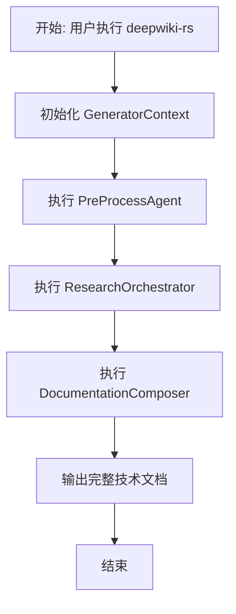
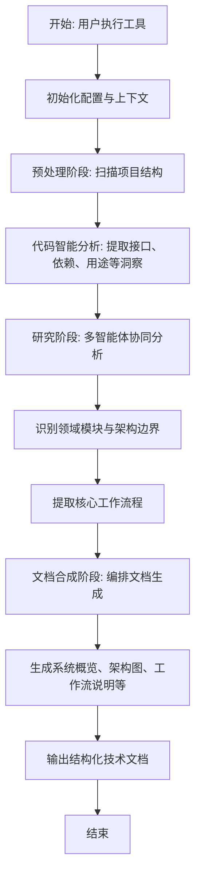
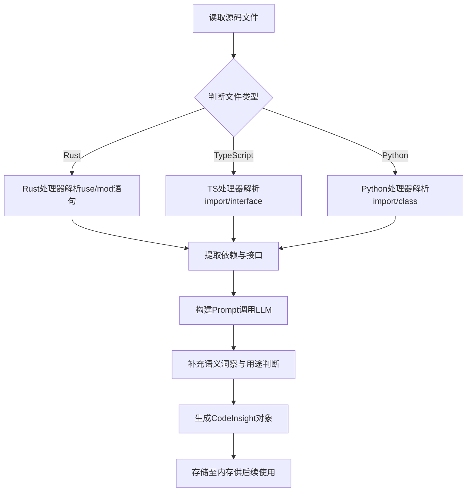
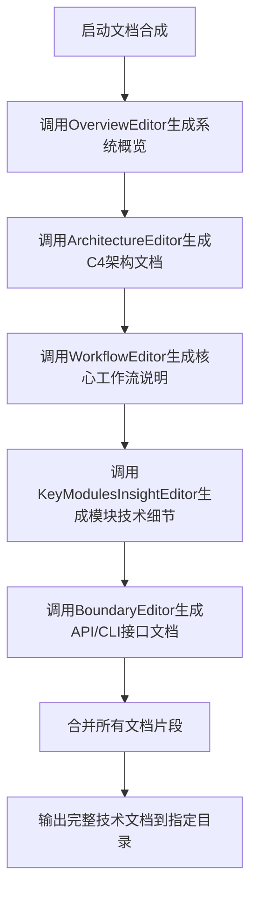
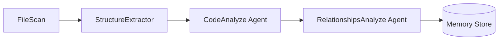
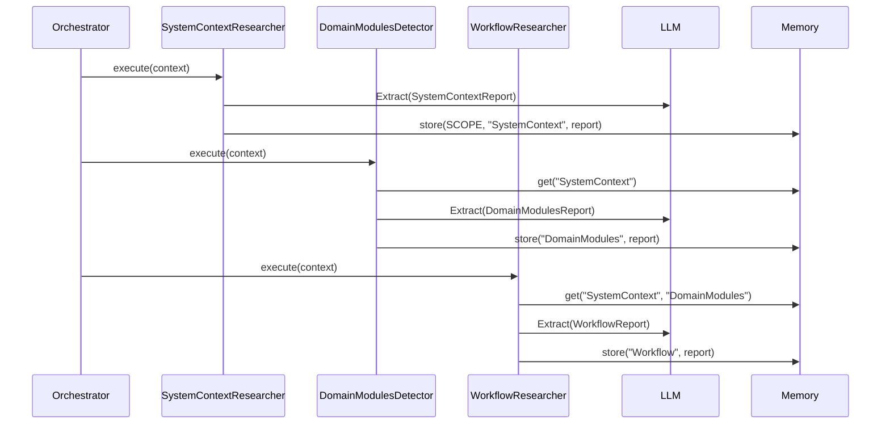

# 核心工作流程

## 1. 工作流程概览 (Workflow Overview)

### 系统主干工作流程
`deepwiki-rs` 是一个基于 Rust 的智能文档生成工具，其核心目标是通过自动化分析任意代码库，生成高质量、结构化且符合 C4 架构模型标准的技术文档。系统采用**分层智能体架构**（Multi-Agent Architecture），以“预处理 → 研究 → 文档合成”三阶段流水线为核心执行路径，实现从原始源码到专业级技术文档的端到端转换。

该流程始于用户指定的目标项目根目录，经过多轮协同推理与数据提取，最终输出包含系统上下文、领域模块、核心工作流、关键模块洞察和外部接口在内的综合性 Markdown 技术文档。整个过程高度自动化，依赖大语言模型（LLM）进行语义理解与内容创作，并结合静态代码分析提供精准的数据支撑。

### 核心执行路径
系统的主干执行路径遵循严格的顺序控制逻辑，由顶层协调器驱动各阶段智能体依次执行：

1. **初始化配置与上下文构建**
2. **预处理阶段：扫描并解析项目结构**
3. **研究阶段：多智能体协作完成架构认知建模**
4. **文档合成阶段：编排生成最终技术文档**

此路径确保了高内聚、低耦合的设计原则，各阶段职责清晰，通过统一内存管理器共享中间结果，避免直接依赖，提升可维护性与扩展性。

### 关键流程节点
| 节点 | 描述 | 触发组件 |
|------|------|----------|
| `GeneratorContext::new()` | 初始化全局上下文，加载配置、缓存、LLM 客户端等基础设施 | `context.rs` |
| `PreProcessAgent.execute()` | 执行预处理流水线，提取项目结构与代码洞察 | `preprocess/mod.rs` |
| `ResearchOrchestrator.execute_research_pipeline()` | 协调多个研究员智能体按序执行宏观→微观分析 | `research/orchestrator.rs` |
| `DocumentationComposer.execute()` | 按预定顺序调用编辑器生成各类文档片段 | `compose/mod.rs` |

### 流程协调机制
系统采用**作用域隔离的内存管理机制**作为主要协调手段：
- 使用 `Memory` 组件在运行时存储序列化数据，支持按 `scope` 和 `key` 进行逻辑隔离。
- 各阶段将分析结果写入特定作用域（如 `PREPROCESS`, `STUDIES_RESEARCH`, `DOCUMENTATION`），后续阶段通过 `data_config()` 显式声明所需输入源。
- 数据流转不依赖函数参数传递，而是通过上下文对象中的 `memory` 字段统一访问，形成松耦合的管道式架构。



---

## 2. 主要工作流程 (Main Workflows)

### 核心业务流程详解

#### 2.1 项目分析与文档生成流程（主流程）
这是系统最核心的业务流程，贯穿从项目扫描到文档输出的全过程。



##### 执行顺序与依赖关系
1. **预处理阶段**必须先于研究阶段完成，为后者提供 `ProjectStructure` 和 `CodeInsight` 基础数据。
2. **研究阶段**中，`SystemContextResearcher` 必须首先执行，因其输出是 `DomainModulesDetector` 和 `WorkflowResearcher` 的必需输入。
3. **文档合成阶段**严格按顺序执行各编辑器，前一文档的生成不影响后一文档的内容，但整体流程不可逆。

##### 输入输出数据流转
| 阶段 | 输入 | 输出 | 存储作用域 |
|------|------|------|------------|
| 预处理 | 项目路径、`.gitignore`、`Cargo.toml` 等 | `ProjectStructure`, `CodeInsight[]`, `RelationshipAnalysis` | `PREPROCESS` |
| 研究 | 上述预处理结果 + README 内容（可选） | `SystemContextReport`, `DomainModulesReport`, `WorkflowReport` 等 | `STUDIES_RESEARCH` |
| 文档合成 | 所有前期调研报告 | Markdown 文档片段集合 | `DOCUMENTATION` |

---

#### 2.2 代码洞察生成流程（关键技术子流程）

该流程针对单个源码文件，生成结构化的 `CodeInsight` 对象，是上层架构分析的基础。



##### 实现细节
- **语言处理器调度**：`LanguageProcessorManager` 根据文件扩展名动态选择对应处理器（如 `rust.rs`, `typescript.rs`）。
- **静态分析**：使用正则表达式匹配语法结构（类、函数、导入语句等），提取基本元信息。
- **AI增强分析**：调用 LLM 补充复杂度评估、功能用途分类（如 controller, service, util）及置信度评分。
- **缓存优化**：对相同内容的文件启用 MD5 哈希缓存，避免重复计算。

##### 示例：Rust 文件处理
```rust
// src/generator/preprocess/extractors/language_processors/rust.rs
fn extract_dependencies(&self, content: &str) -> Vec<Dependency> {
    let re = Regex::new(r"use\s+([^;]+)").unwrap();
    re.captures_iter(content)
        .map(|cap| Dependency::new(cap[1].to_string()))
        .collect()
}
```

---

#### 2.3 智能文档编排流程（文档生成子流程）

该流程负责将分散的研究成果整合为统一格式的专业文档。



##### 执行策略
- **串行执行**：保证文档组织结构的一致性。
- **局部并发**：`KeyModulesInsightEditor` 支持并发处理多个模块，通过 `do_parallel_with_limit` 控制资源消耗。
- **降级机制**：`BoundaryEditor` 在轻量任务场景下直接本地生成文档，无需调用 LLM，提升性能。

##### 输入依赖示例（WorkflowEditor）
```rust
fn data_config(&self) -> AgentDataConfig {
    AgentDataConfig {
        required_sources: vec![
            DataSource::ResearchResult("SystemContextResearcher".to_string()),
            DataSource::ResearchResult("DomainModulesDetector".to_string()),
            DataSource::ResearchResult("WorkflowResearcher".to_string()),
            DataSource::CODE_INSIGHTS,
        ],
        optional_sources: vec![],
    }
}
```

---

## 3. 流程协调与控制 (Flow Coordination)

### 多模块协调机制
系统通过 **StepForwardAgent 模式** 实现模块间的标准化协作：

- 所有智能体实现 `StepForwardAgent<T>` trait，定义统一接口：
  - `data_config()`：声明所需输入数据源
  - `prompt_template()`：定义 LLM 推理提示模板
  - `execute(context)`：执行主体逻辑
- 协调器（如 `ResearchOrchestrator`）仅需调用 `execute_agent(name, agent, context)`，无需关心具体实现。

这种设计实现了“关注点分离”，使研究员专注于知识发现，编辑器专注于内容表达。

### 状态管理和同步
- **状态载体**：`GeneratorContext` 包含 `memory: Arc<RwLock<Memory>>`，支持异步安全读写。
- **作用域划分**：
  - `PREPROCESS`: 存放原始分析结果
  - `STUDIES_RESEARCH`: 存放高层次架构认知
  - `DOCUMENTATION`: 存放文档生成中间态
- **元数据追踪**：`MemoryMetadata` 记录创建时间、访问频率、数据大小，便于调试与性能监控。

### 数据传递和共享
- **非侵入式共享**：组件间不直接引用彼此实例，而是通过 `context.get_from_memory(scope, key)` 获取数据。
- **契约驱动**：所有数据结构均实现 `Serialize + Deserialize`，并通过 `types.rs` 统一定义，确保跨模块兼容性。
- **懒加载机制**：仅当 `has_memory_data()` 返回 true 时才尝试读取，避免无效操作。

### 执行控制和调度
- **层级化调度**：
  - `ResearchOrchestrator` 控制研究阶段的宏观顺序（C1 → C2 → C3-C4）
  - `DocumentationComposer` 控制文档生成顺序
- **并发控制**：
  - `do_parallel_with_limit(n)` 限制最大并发数，默认为配置项 `max_concurrent_tasks`
  - 利用 `tokio::task::spawn` 实现异步并行执行
- **日志反馈**：每个智能体执行前后打印进度信息，增强可观测性。

---

## 4. 异常处理与恢复 (Exception Handling)

### 错误检测和处理
- **I/O 异常**：文件读取失败时自动跳过二进制文件或损坏文件，记录警告日志。
- **LLM 调用异常**：
  - 使用 `anyhow::Result<T>` 统一封装错误
  - `LLMClient` 内置重试机制（指数退避）
  - 支持备用模型切换（通过 `evaluate_befitting_model` 动态选择）

### 异常恢复机制
- **ReAct 循环中断恢复**：
  - 当达到最大迭代次数时，`SummaryReasoner` 汇总已有对话历史，生成有意义的降级输出。
  - 调用 `max_depth_reached_with_history()` 构造部分结果响应。
- **缓存兜底**：
  - 若当前分析失败，尝试从缓存中读取历史版本结果。
  - 缓存条目包含 `prompt_hash`, `model_name`, `timestamp`，支持精确命中。

### 容错策略设计
| 场景 | 策略 |
|------|------|
| LLM API 超时 | 最多重试 3 次，更换提供商（如 Moonshot → DeepSeek） |
| 大文件截断 | `file_reader.rs` 自动截断超过 200 行的文件，保留头部重要代码 |
| 未知文件类型 | 忽略无法识别的扩展名，记录 `DEBUG` 日志 |
| 内存溢出风险 | 设置 `max_cache_size_mb` 配置项，定期清理旧缓存 |

### 失败重试和降级
- **ReActExecutor** 监控每轮推理状态：
  ```rust
  if iteration >= config.max_iterations {
      return ReActResponse::max_depth_reached_with_history(history);
  }
  ```
- **PromptCompressor** 在输入过长时自动压缩：
  - 估算 token 数量（`TokenEstimator`）
  - 若超出阈值，则调用专用压缩 agent 生成摘要版 prompt
  - 结果缓存以避免重复压缩

---

## 5. 关键流程实现 (Key Process Implementation)

### 核心算法流程

#### 5.1 ReAct 推理引擎
系统采用 ReAct（Reasoning + Acting）模式驱动复杂任务执行：

```rust
async fn execute_react_loop(
    &self,
    prompt: String,
    tools: Vec<Box<dyn Tool>>,
) -> ReActResponse {
    let mut history = vec![];
    for _ in 0..self.config.max_iterations {
        let action = self.llm_client.reason(prompt.clone(), &history).await?;
        match action {
            Action::Call(tool_name, args) => {
                let result = call_tool(&tool_name, &args, &tools).await;
                history.push(ToolCall { tool_name, args, result });
            }
            Action::Respond(content) => return success(content, history),
        }
    }
    // 达到最大深度，触发总结回退
    SummaryReasoner.summarize(&history).await
}
```

#### 5.2 Prompt 压缩算法
用于管理上下文长度，防止 LLM 截断：

```rust
async fn compress_if_needed(&self, prompt: &str) -> Result<String> {
    let tokens = TokenEstimator::estimate(prompt);
    if tokens < self.threshold {
        return Ok(prompt.to_string());
    }

    if let Some(cached) = self.cache.get(&md5(prompt)) {
        return Ok(cached);
    }

    let compressed = self.agent.prompt("请压缩以下内容，保留关键信息...", prompt).await?;
    self.cache.set(md5(prompt), &compressed);
    Ok(compressed)
}
```

### 数据处理管道

#### 5.3 预处理数据流


#### 5.4 研究阶段数据流


### 业务规则执行

#### 5.5 领域模块划分规则
- **抽象层次控制**：领域数量建议 3~7 个，避免过度细分。
- **价值导向**：领域应体现业务能力而非技术栈（如“订单管理”而非“REST API 层”）。
- **依赖优先**：优先识别被广泛引用的核心模块作为领域锚点。

#### 5.6 文档质量保障规则
- **完整性检查**：每个文档必须包含标题、概述、图表、关键节点说明。
- **格式一致性**：强制使用 Mermaid 图表、Markdown 表格、代码块标注。
- **术语统一**：内置术语映射表，确保“微服务”、“聚合根”等术语使用一致。

### 技术实现细节

#### 5.7 内存管理器实现
```rust
pub struct Memory {
    data: HashMap<String, Value>,
    metadata: HashMap<String, MemoryMetadata>,
}

impl Memory {
    pub fn store<T: Serialize>(&mut self, scope: &str, key: &str, value: T) -> Result<()> {
        let full_key = format!("{}/{}", scope, key);
        let json_value = serde_json::to_value(value)?;
        self.data.insert(full_key.clone(), json_value);
        self.metadata.insert(full_key, MemoryMetadata::new());
        Ok(())
    }

    pub fn get<T: for<'a> Deserialize<'a>>(&self, scope: &str, key: &str) -> Option<T> {
        let full_key = format!("{}/{}", scope, key);
        self.data.get(&full_key).and_then(|v| serde_json::from_value(v.clone()).ok())
    }
}
```

#### 5.8 缓存性能监控
```rust
pub struct CachePerformanceMonitor {
    hits: AtomicUsize,
    misses: AtomicUsize,
    writes: AtomicUsize,
    errors: AtomicUsize,
}

impl CachePerformanceMonitor {
    pub fn record_hit(&self) {
        self.hits.fetch_add(1, Ordering::Relaxed);
    }

    pub fn generate_report(&self) -> PerformanceReport {
        let total = self.hits.load() + self.misses.load();
        PerformanceReport {
            hit_rate: if total > 0 { self.hits.load() as f64 / total as f64 } else { 0.0 },
            cost_saved_usd: estimate_cost_saving(&self.hits),
            time_saved_ms: estimate_time_saving(&self.hits),
        }
    }
}
```

---

## 总结与实用价值

本核心工作流程文档全面揭示了 `deepwiki-rs` 的内部运作机制，具备以下实用价值：

- **开发指导**：为新增智能体提供模板（继承 `StepForwardAgent`）、定义输入依赖、编写 prompt 模板的标准范式。
- **运维支持**：通过内存统计、缓存报告、日志追踪定位性能瓶颈与故障根源。
- **业务价值**：帮助软件架构师快速掌握复杂系统脉络，降低新人入职成本，推动知识资产沉淀。
- **知识传承**：新成员可通过阅读本文档迅速理解系统全貌，缩短学习曲线。

该系统成功融合了静态分析与 AI 推理的优势，在准确性和智能化之间取得良好平衡，代表了下一代自动化文档工具的发展方向。