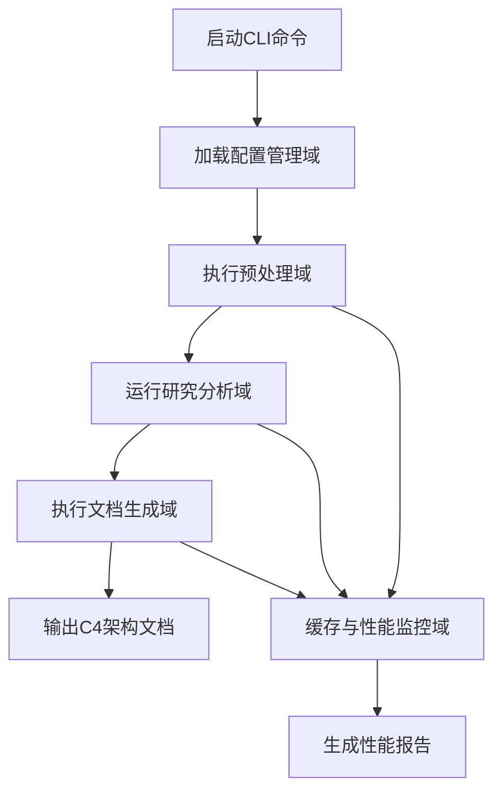
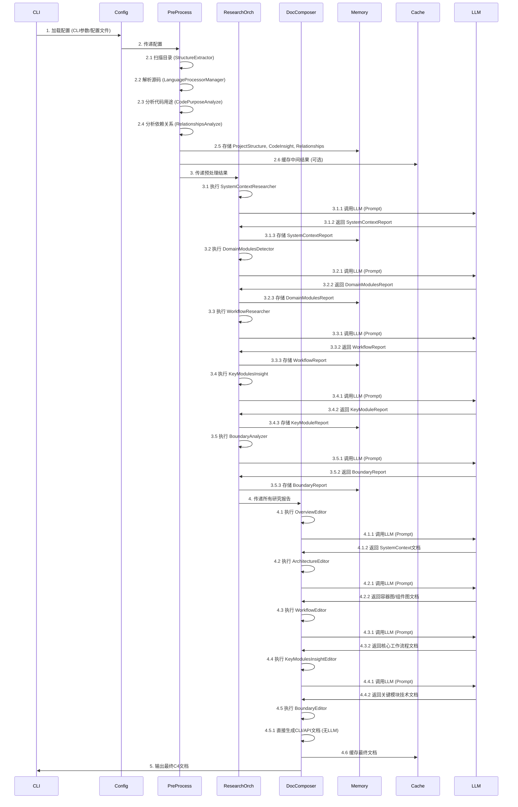
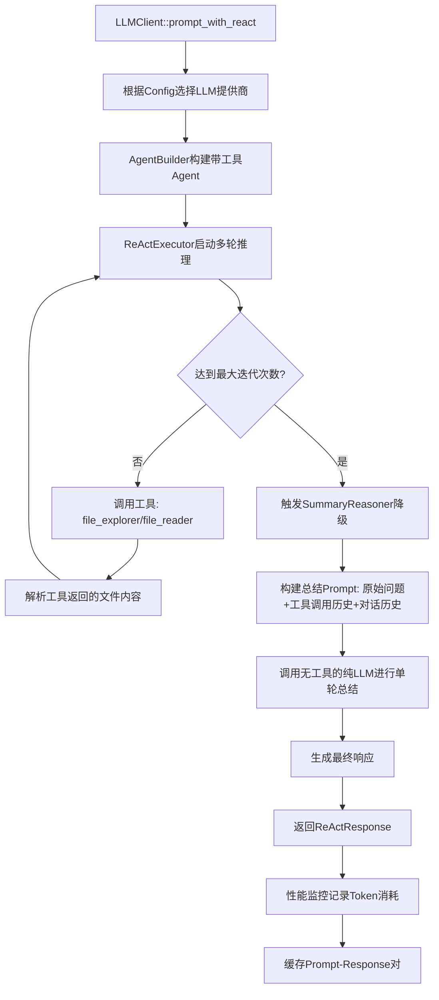
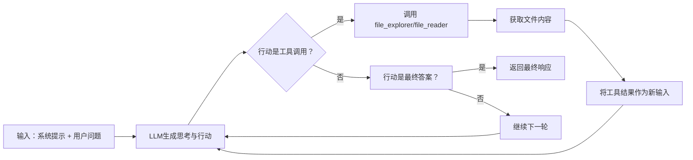

# 核心工作流程

## 1. 工作流程概览 (Workflow Overview)

deepwiki-rs 是一个基于多智能体架构的自动化软件分析与文档生成系统，其核心工作流程是一个高度结构化、分阶段、异步并行的端到端流水线，旨在将原始源代码库转化为符合 C4 架构模型的专业技术文档。该流程以配置为驱动，以 LLM 为智能引擎，以内存为数据中枢，以缓存为性能加速器，实现了从“代码”到“认知”的自动化跃迁。

### 系统主干工作流程
系统的主干工作流程遵循“配置 → 预处理 → 研究分析 → 文档生成”的四阶段闭环，其执行路径清晰、依赖明确，是整个系统价值的直接体现。



### 核心执行路径
1.  **入口点**：`main.rs` 或 `cli.rs` 启动 CLI，解析用户参数，加载 `config.rs` 中的运行时配置。
2.  **预处理**：`PreProcessAgent` 调用 `StructureExtractor` 扫描项目，`LanguageProcessorManager` 解析多语言源码，`CodeAnalyze` 和 `RelationshipsAnalyze` 智能推断代码用途与依赖，生成 `ProjectStructure`、`CodeInsight` 和 `RelationshipAnalysis`。
3.  **研究分析**：`ResearchOrchestrator` 按 C4 模型层次（宏观→中观→微观→边界）依次编排 `SystemContextResearcher`、`DomainModulesDetector`、`WorkflowResearcher`、`KeyModulesInsight` 和 `BoundaryAnalyzer` 等智能体，利用 LLM 对预处理数据进行语义推理，生成结构化研究报告。
4.  **文档生成**：`DocumentationComposer` 按顺序调用 `OverviewEditor`、`ArchitectureEditor`、`WorkflowEditor`、`KeyModulesInsightEditor` 和 `BoundaryEditor`，聚合所有研究报告，通过精心设计的 Prompt 模板引导 LLM 生成最终的 Markdown 格式 C4 文档。
5.  **缓存与监控**：在整个流程中，`Memory` 存储中间结果，`Cache` 缓存 LLM 的 Prompt-Response 对，`PerformanceMonitor` 实时统计缓存命中、Token 节省和执行耗时，形成闭环优化。

### 关键流程节点
| 节点 | 模块 | 输入 | 输出 | 价值 |
| :--- | :--- | :--- | :--- | :--- |
| **1. 配置加载** | `config.rs` | CLI 参数、TOML 文件 | `Config` 结构体 | **决策中枢**：决定所有下游行为（LLM提供商、并发数、缓存开关、文件过滤规则）。 |
| **2. 代码洞察生成** | `CodeAnalyze`, `RelationshipsAnalyze` | 项目文件列表、源码内容 | `CodeInsight`, `RelationshipAnalysis` | **数据基石**：将非结构化代码转化为结构化语义数据，是上层分析的唯一输入。 |
| **3. 领域模块识别** | `DomainModulesDetector` | `CodeInsight` | `DomainModulesReport` | **认知起点**：从技术代码中识别出业务导向的领域（如“订单”、“支付”），而非技术分层，是架构理解的核心。 |
| **4. 核心工作流提取** | `WorkflowResearcher` | `SystemContextReport`, `DomainModulesReport` | `WorkflowReport` | **流程灵魂**：定义系统“如何工作”，是开发者理解业务逻辑的关键。 |
| **5. LLM 推理执行** | `ReActExecutor`, `SummaryReasoner` | Prompt, 工具调用 | `ReActResponse` | **智能引擎**：通过 ReAct 多轮推理与总结回退，确保复杂任务的鲁棒性完成。 |
| **6. 文档生成** | `ArchitectureEditor`, `WorkflowEditor` | 各类研究报告 | Markdown C4 文档 | **价值终点**：将抽象分析转化为可交付、可传播、可复用的专业知识资产。 |

### 流程协调机制
系统通过一套精巧的“**统一接口 + 内存中枢 + 编排器**”机制实现模块间协调：
-   **统一接口**：所有智能体（Agent）均实现 `StepForwardAgent` trait，定义了 `execute(context: &GeneratorContext)` 方法，确保了模块的可插拔性和一致性。
-   **内存中枢**：`Memory` 模块是所有数据流转的中心。预处理阶段将结果写入 `MemoryScope::PREPROCESS`，研究阶段从 `Memory` 读取，文档生成阶段再次读取。这实现了数据的解耦与共享。
-   **编排器**：`ResearchOrchestrator` 和 `DocumentationComposer` 是两个核心的“流程控制器”。它们不执行具体分析，而是按预设顺序调用其他 Agent，确保了分析的层次性和文档的完整性。

---

## 2. 主要工作流程 (Main Workflows)

### 核心业务流程详解：项目架构分析与文档生成流程

这是系统最核心、最高价值的业务流程，其执行顺序和依赖关系如下：



**输入输出数据流转**：
-   **输入**：项目源码、README、构建文件（Cargo.toml, package.json等）、用户CLI参数。
-   **中间输出**：`ProjectStructure` (文件树)、`CodeInsight` (代码功能与复杂度)、`RelationshipAnalysis` (依赖图谱)、`SystemContextReport` (目标与边界)、`DomainModulesReport` (业务领域)、`WorkflowReport` (主干流程)、`KeyModuleReport` (技术细节)、`BoundaryReport` (外部接口)。
-   **最终输出**：一份完整的、符合 C4 模型标准的 Markdown 文档，包含系统上下文、容器图、组件图、代码图、部署图、核心工作流程和边界接口说明，并嵌入 Mermaid 图表。

### 关键技术流程说明：LLM智能体执行与推理流程

LLM 的执行是系统智能的核心，其流程由 `LLMClient` 统一管理，通过 `ReActExecutor` 和 `SummaryReasoner` 实现高鲁棒性。



**执行细节**：
1.  **工具调用**：`file_explorer` 和 `file_reader` 是 LLM 的“感官”。当 LLM 需要查看某个文件内容时，它会调用这些工具，系统会异步读取文件（支持过滤、截断、跳过二进制文件），并将结果作为上下文返回给 LLM。
2.  **ReAct 循环**：`ReActExecutor` 维护一个对话历史，每轮 LLM 生成一个“思考”（Reasoning）和一个“行动”（Action）。行动可以是工具调用或最终答案。循环持续直到达到 `max_iterations` 或 LLM 返回最终答案。
3.  **总结回退（Fallover）**：这是系统的关键容错机制。当达到最大迭代次数时，`SummaryReasoner` 不会简单地失败，而是将**所有已有的信息**（原始用户问题、系统提示、所有工具调用记录、完整的对话历史）打包成一个新的、更精炼的 Prompt，交给一个**无工具**的 LLM 进行单轮总结推理。这确保了即使任务未完全完成，也能输出一个有价值的、基于已有证据的结论，极大提升了系统的可用性。
4.  **Token 优化**：`PromptCompressor` 在生成 Prompt 前，会估算 Token 数量。若超过阈值，它会调用一个专门的 LLM Agent 对长文本进行语义压缩，保留关键信息（如函数签名、类型定义），从而避免因输入过长导致的 Prefill 阶段计算爆炸或输出 token 不足。

---

## 3. 流程协调与控制 (Flow Coordination)

deepwiki-rs 的流程协调机制是其架构设计的精髓，它通过“**接口标准化、数据中心化、编排自动化**”实现了高度的模块化和可维护性。

### 多模块协调机制
-   **基于 Trait 的接口抽象**：`StepForwardAgent` trait 定义了所有智能体的统一行为：`execute(&context)`。这使得 `ResearchOrchestrator` 和 `DocumentationComposer` 可以以完全相同的方式调用 `DomainModulesDetector`、`WorkflowResearcher` 或 `OverviewEditor`，无需关心其内部实现。这是一种典型的“策略模式”和“依赖倒置”。
-   **数据依赖声明**：每个 Agent 在初始化时，会通过 `AgentDataConfig` 明确声明其所需的数据源（`DataSource`）。例如，`WorkflowResearcher` 必须依赖 `SystemContextReport` 和 `DomainModulesReport`。如果这些数据在 `Memory` 中不存在，执行会失败，确保了流程的严谨性。
-   **编排器的“导演”角色**：`ResearchOrchestrator` 和 `DocumentationComposer` 是纯粹的“流程导演”。它们不参与分析，只负责按顺序调用 Agent。这种职责分离使得添加新的分析模块（如“安全漏洞检测”）变得极其简单：只需实现 `StepForwardAgent`，并在编排器中增加一行调用即可。

### 状态管理和同步
-   **内存状态**：`Memory` 模块是系统唯一的、全局的、线程安全的状态存储。它使用 `scope`（如 `PREPROCESS`, `RESEARCH`）和 `key`（如 `PROJECT_STRUCTURE`, `DOMAIN_MODULES`）的组合来唯一标识数据。所有 Agent 通过 `context.store_to_memory()` 和 `context.retrieve_from_memory()` 来读写状态，实现了无锁的、基于键值的同步。
-   **异步执行**：整个流程基于 `tokio` 异步运行时。`PreProcessAgent`、`ResearchOrchestrator` 和 `DocumentationComposer` 的 `execute` 方法都是 `async fn`，允许在等待 I/O（如文件读取、网络请求）时释放线程，极大提升了并发效率。
-   **原子计数**：`PerformanceMonitor` 使用 `Arc<AtomicU64>` 来安全地在多线程环境下统计缓存命中、未命中等事件，确保性能数据的准确性。

### 数据传递和共享
-   **单向传递**：数据流是单向的，从 `预处理` → `研究分析` → `文档生成`。每个阶段的输出是下一个阶段的输入，避免了循环依赖。
-   **内存作为共享总线**：`Memory` 是所有阶段共享数据的“总线”。预处理阶段将 `CodeInsight` 写入 `Memory`，研究阶段从 `Memory` 读取它，文档生成阶段再次读取它。这比通过函数参数传递大量结构体更高效、更清晰。
-   **缓存作为共享缓存**：`Cache` 模块在 `LLMClient` 层面工作。当一个 Prompt 被发送给 LLM 时，系统会先计算其 MD5 哈希。如果该哈希对应的 Response 已存在于缓存文件中，且未过期，则直接返回缓存结果，完全跳过 LLM 调用。这使得重复分析同一项目时，速度提升数十倍。

### 执行控制和调度
-   **并发控制**：`do_parallel_with_limit` 工具函数被广泛用于需要并行处理的场景（如 `KeyModulesInsight` 分析多个模块）。它通过 `tokio::task::spawn` 创建任务，并使用 `Semaphore` 限制最大并发数，防止因同时调用过多 LLM 而耗尽资源或触发 API 限流。
-   **配置驱动**：所有控制参数（最大迭代次数、最大并发数、缓存过期时间、重试次数）都来自 `Config`。这意味着用户可以通过修改一个 TOML 文件或 CLI 参数，轻松调整系统行为，无需修改代码。
-   **失败隔离**：`ResearchOrchestrator` 在执行每个 Agent 时，都会捕获其错误。如果一个 Agent 失败（如 `BoundaryAnalyzer` 因网络问题失败），它会记录错误但继续执行后续 Agent，确保整体流程的健壮性。

---

## 4. 异常处理与恢复 (Exception Handling)

系统设计了多层次、多维度的异常处理与恢复机制，确保在面对网络波动、API 限流、输入异常等复杂情况时，依然能提供有价值的输出。

### 错误检测和处理
-   **网络与 API 错误**：`LLMClient::retry_with_backoff` 是核心的重试机制。当 LLM API 调用失败（如超时、5xx 错误）时，它会自动重试 `retry_attempts` 次（默认3次），每次重试间隔 `retry_delay_ms`（默认1000ms），并打印详细日志。
-   **输入数据错误**：`StepForwardAgent` 在 `execute` 方法开始时，会检查 `AgentDataConfig` 中声明的 `required_sources` 是否存在于 `Memory` 中。如果缺失，会立即抛出 `anyhow::Error`，阻止后续错误的产生。
-   **工具调用错误**：`file_reader` 和 `file_explorer` 工具会处理文件不存在、权限不足、文件过大等情况，并返回结构化的错误信息，供 LLM 理解和处理。

### 异常恢复机制
-   **总结回退（Fallover）**：这是最核心的恢复机制。当 `ReActExecutor` 因达到最大迭代次数而中断时，`SummaryReasoner` 会介入，将所有已知信息汇总，生成一个“最佳猜测”的最终答案。这相当于系统在“无法完美完成任务”时，自动切换到“尽力而为”的模式。
-   **模型降级**：`LLMClient::extract_inner` 支持 `befitting_model` 和 `fallover_model`。如果首选模型（如 `gpt-4-turbo`）调用失败，系统会自动尝试备选模型（如 `claude-3-opus`），确保服务不中断。
-   **缓存降级**：如果缓存文件损坏或无法读取，系统会优雅地忽略缓存，重新执行分析流程，保证数据的最终一致性。

### 容错策略设计
-   **“失败但不崩溃”原则**：系统设计哲学是“**尽可能提供价值，而非追求完美**”。即使某个智能体失败，只要主干流程能继续，系统就会输出部分结果。
-   **幂等性设计**：`Cache` 和 `Memory` 的写入操作是幂等的。多次执行相同的分析流程，只要输入不变，输出结果就一致，这使得系统在失败后重试是安全的。
-   **日志与可观测性**：每个智能体的执行前后都会打印 `println!` 日志（如“🤖 执行 DomainModulesDetector 智能体分析...”），`PerformanceMonitor` 会生成详细的性能报告。这为故障排查提供了清晰的线索。

### 失败重试和降级
-   **重试策略**：`LLMClient` 的重试是指数退避的，避免了“重试风暴”。
-   **降级策略**：
    1.  **第一层降级**：`ReAct` 失败 → `SummaryReasoner` 降级。
    2.  **第二层降级**：首选 LLM 失败 → 备选 LLM 降级。
    3.  **第三层降级**：缓存失效 → 重新执行分析。
    4.  **第四层降级**：所有分析失败 → 输出一个包含错误信息的、最基础的文档框架。

---

## 5. 关键流程实现 (Key Process Implementation)

### 核心算法流程：ReAct 模式多轮推理

ReAct 模式是系统智能的基石，其核心算法流程如下：



**实现细节**：
-   **Prompt 构建**：系统提示词中会明确告诉 LLM：“你是一个软件架构分析师。你只能通过调用 `file_explorer` 和 `file_reader` 工具来获取文件内容。不要猜测文件内容。”
-   **工具调用解析**：`ReActExecutor` 会解析 LLM 返回的 JSON 格式工具调用（如 `{"name": "file_reader", "arguments": {"file_path": "src/main.rs"}}`），并调用对应的 Rust 函数。
-   **历史管理**：每一轮的“思考”和“行动”都会被追加到 `chat_history` 中，作为下一轮的上下文，确保 LLM 能够进行连贯的推理。

### 数据处理管道：预处理阶段

预处理阶段是一个典型的“管道-过滤器”架构：

```mermaid
graph LR
    A[项目根目录] --> B[StructureExtractor]
    B --> C[过滤忽略文件(.git, target, test)]
    C --> D[计算文件重要性分数]
    D --> E[识别核心代码文件]
    E --> F[LanguageProcessorManager]
    F --> G[RustProcessor]
    F --> H[JavaProcessor]
    F --> I[TypeScriptProcessor]
    F --> J[PythonProcessor]
    G --> K[提取use/mod, 函数, 结构体]
    H --> K
    I --> K
    J --> K
    K --> L[CodePurposeAnalyze]
    L --> M[规则映射: controller.rs -> Controller]
    L --> N[AI模型推断: 未知文件 -> Entity]
    M --> O[CodeInsight]
    N --> O
    O --> P[RelationshipsAnalyze]
    P --> Q[分析依赖图谱]
    Q --> R[生成RelationshipAnalysis]
    R --> S[写入Memory]
```

**技术实现**：
-   **多语言解析**：`LanguageProcessorManager` 使用策略模式，根据文件扩展名（`.rs`, `.java`, `.ts`）动态选择对应的处理器。每个处理器使用**预编译的正则表达式**进行高效匹配，避免了重量级的 AST 解析器，保证了速度。
-   **重要性评分**：`StructureExtractor` 通过文件路径（如 `src/main.rs` 评分高）、文件大小、是否为核心文件（如 `mod.rs`, `lib.rs`）等因素计算一个 0-1 的重要性分数，用于后续的优先级排序。
-   **AI 辅助推断**：对于无法通过规则判断的文件（如 `utils.rs`），`CodePurposeAnalyze` 会调用 LLM 进行语义分析，结合文件名和上下文，给出“Util”、“Entity”等分类。

### 业务规则执行：文档生成的“黄金模板”

文档生成域的每个 `Editor` 都遵循一个“黄金模板”来生成文档：

```rust
// 伪代码：ArchitectureEditor 的执行逻辑
async fn execute(&self, context: &GeneratorContext) -> Result<()> {
    // 1. 获取输入数据
    let system_context = context.retrieve_from_memory::<SystemContextReport>(...)?;
    let domain_modules = context.retrieve_from_memory::<DomainModulesReport>(...)?;
    let relationships = context.retrieve_from_memory::<RelationshipAnalysis>(...)?;
    
    // 2. 构建Prompt模板
    let system_prompt = include_str!("prompts/architecture_system_prompt.md");
    let opening_instruction = "请基于以下信息，生成一个符合C4模型的架构文档。";
    let closing_instruction = "请确保文档包含Mermaid图表，并使用中文输出。";
    
    // 3. 格式化数据
    let formatted_data = DataFormatter::new(config).format_project_structure(&project_structure) + 
                         format_code_insights(&code_insights) + 
                         format_relationships(&relationships);
    
    // 4. 调用LLM
    let response = self.llm_client.prompt(system_prompt, &format!("{}{}", opening_instruction, formatted_data)).await?;
    
    // 5. 写入输出
    write_file("docs/architecture.md", response)?;
}
```

**业务规则**：
-   **强制包含 Mermaid 图表**：所有 `Editor` 的 Prompt 模板中都明确要求输出 Mermaid 语法的图表。
-   **禁止虚构**：Prompt 模板中会强调“仅基于提供的信息，不要添加任何你不知道的内容”。
-   **输出格式化**：`DataFormatter` 会将 `CodeInsight` 按重要性排序，并限制显示数量，确保输出简洁。

### 技术实现细节：缓存与性能监控

-   **缓存实现**：`Cache` 模块使用 `MD5(prompt)` 作为键，将 `ReActResponse` 序列化为 JSON，存储在 `./.litho/cache/` 目录下的文件中。读取时，先计算哈希，再检查文件是否存在且未过期（由 `config.cache.expiration_hours` 控制）。
-   **性能监控**：`PerformanceMonitor` 使用 `Arc<AtomicU64>` 记录事件。每次缓存命中，`hit_count` 加一；每次 LLM 调用，`token_usage` 会通过 `TokenEstimator` 估算（基于字符数和语言比例：英文4字符/Token，中文1.5字符/Token）。最终，它会生成一份报告，如：“本次分析节省了 12,345 个 Token，相当于节省了 $0.08 的 LLM 成本，执行时间从 120s 降低到 15s。”
-   **Token 估算**：`TokenEstimator` 是一个无外部依赖的纯函数，它根据字符类型（中文、英文、其他）和预设比例进行粗略估算，为 `PromptCompressor` 和 `LLMClient` 提供了快速的决策依据。

综上所述，deepwiki-rs 的核心工作流程是一个融合了**工程化架构**、**AI智能推理**和**高性能工程**的典范。它不仅解决了“自动生成架构文档”的业务问题，更通过精妙的流程设计，将一个原本充满不确定性的 AI 任务，变成了一个稳定、可预测、可监控的工业级流水线。