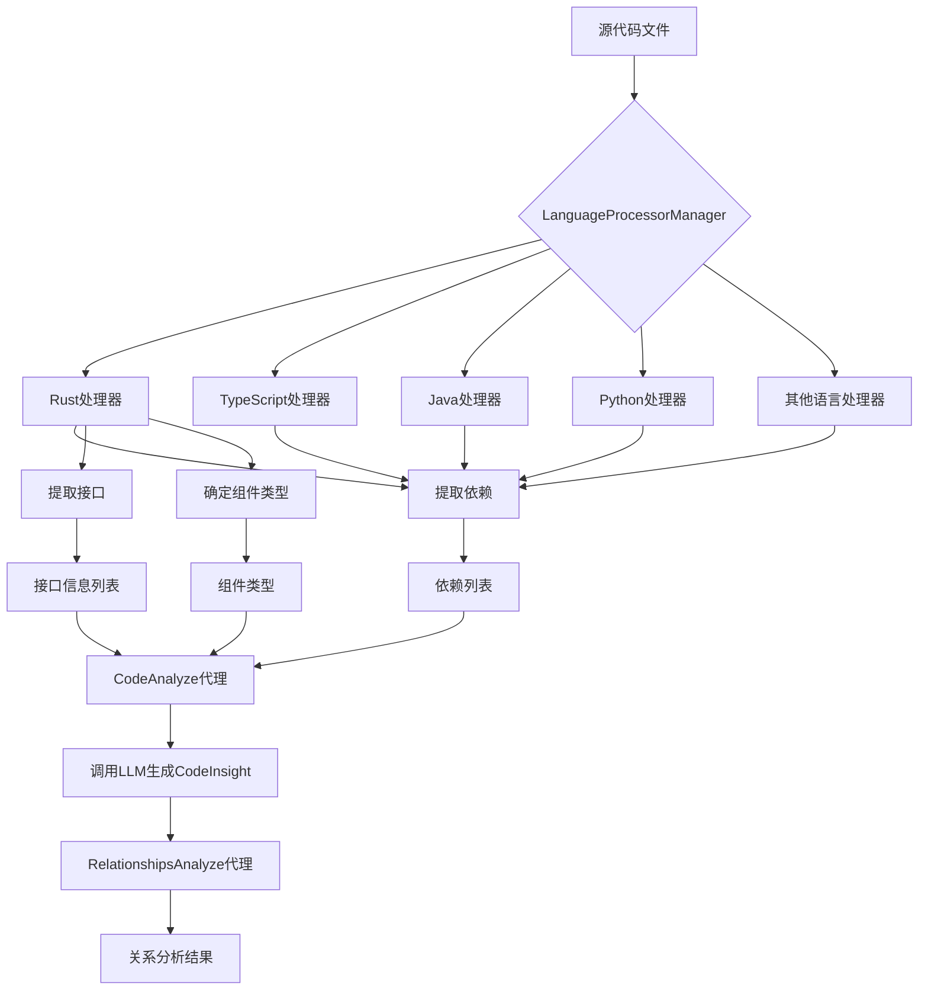
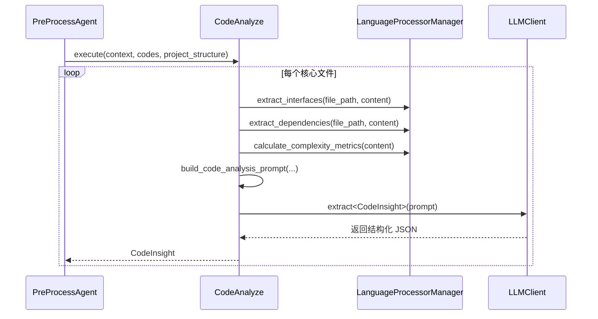

# 代码智能分析域技术实现文档

## 概述

本文档详细阐述 `deepwiki-rs` 项目中“**代码智能分析域**”（Code Intelligence Analysis Domain）的技术实现。该领域作为系统的核心业务模块之一，承担着对源代码进行深度解析、提取结构化信息并生成语义洞察的关键职责，为后续的架构研究与文档合成提供高质量的数据基础。

本模块通过多语言处理器协同工作，结合静态规则分析与大语言模型（LLM）语义增强，实现了对主流编程语言的自动化理解能力。其设计遵循高内聚、低耦合原则，具备良好的可扩展性与工程实践价值。

---

## 1. 模块定位与核心职责

### 1.1 模块基本信息
- **所属项目**：`deepwiki-rs`
- **模块名称**：代码智能分析域
- **路径位置**：`src/generator/preprocess/`
- **类型**：核心业务域
- **重要性评分**：8.5 / 10
- **复杂度评分**：9.0 / 10

### 1.2 核心职责
| 职责 | 描述 |
|------|------|
| **结构提取** | 扫描目标代码库目录结构，识别关键文件与目录，统计项目规模与组成。 |
| **语法解析** | 针对不同编程语言，使用正则表达式或轻量级语法分析器提取依赖、接口、函数等结构信息。 |
| **语义分析** | 借助 LLM 对核心文件进行功能判断、用途分类与责任描述，生成 `CodeInsight` 结构化洞察。 |
| **关系建模** | 分析模块间的依赖图谱，识别关键数据流与架构层次，输出整体关系视图。 |

### 1.3 输入与输出
| 类型 | 数据项 | 来源/去向 |
|------|--------|----------|
| **输入** | 目标项目代码库 | 文件系统读取 |
| | 全局配置（如排除规则、最大深度） | `Config` 模块 |
| **输出** | `ProjectStructure` | 写入 `MemoryScope::PREPROCESS` |
| | `Vec<CodeInsight>` | 写入 `MemoryScope::PREPROCESS` |
| | `RelationshipAnalysis` | 写入 `MemoryScope::PREPROCESS` |

---

## 2. 架构设计与组件构成

### 2.1 整体架构图（Mermaid）


### 2.2 关键子模块说明

#### （1）`LanguageProcessorManager` —— 多语言调度中枢
- **路径**：`src/generator/preprocess/extractors/language_processors/mod.rs`
- **作用**：统一管理所有语言处理器实例，根据文件扩展名动态路由请求。
- **实现机制**：
  - 定义 `LanguageProcessor` trait 接口规范行为。
  - 使用 `Box<dyn LanguageProcessor>` 实现运行时多态。
  - 初始化时预加载所有支持的语言处理器。
- **核心方法**：
  ```rust
  pub fn get_processor(&self, file_path: &Path) -> Option<&dyn LanguageProcessor>;
  pub fn extract_dependencies(...) -> Vec<Dependency>;
  pub fn extract_interfaces(...) -> Vec<InterfaceInfo>;
  ```

#### （2）`StructureExtractor` —— 项目结构扫描器
- **路径**：`src/generator/preprocess/extractors/structure_extractor.rs`
- **功能**：
  - 递归遍历项目根目录，构建完整的文件树。
  - 过滤测试文件、二进制文件及 `.gitignore` 规则中的条目。
  - 计算每个文件的重要性分数（基于路径、命名约定、内容模式）。
  - 输出 `ProjectStructure` 对象，包含文件/目录统计、大小分布等元信息。

#### （3）`CodeAnalyze` Agent —— 语义洞察生成器
- **路径**：`src/generator/preprocess/agents/code_analyze.rs`
- **流程**：
  1. 接收由 `StructureExtractor` 识别出的“重要文件”列表。
  2. 调用 `LanguageProcessorManager` 提取各文件的静态结构信息（依赖、接口、复杂度）。
  3. 构造 Prompt 并调用 LLM（如 Moonshot、DeepSeek），执行以下任务：
     - 判断文件用途（入口、API、工具类等）
     - 描述主要职责
     - 补充高级语义注释
  4. 将结果封装为 `CodeInsight` 对象集合。
- **并发控制**：使用 `do_parallel_with_limit()` 控制最大并发请求数，避免压垮 LLM 服务。

#### （4）`RelationshipsAnalyze` Agent —— 依赖关系分析器
- **路径**：`src/generator/preprocess/agents/relationships_analyze.rs`
- **输入**：`Vec<CodeInsight>`
- **处理逻辑**：
  - 按重要性排序 `CodeInsight`，优先保留高分项。
  - 构建精简版上下文摘要，防止 Prompt 超长。
  - 使用 `PromptCompressor` 自动压缩提示词长度。
  - 向 LLM 提问：“请分析这些组件之间的依赖关系和架构层次”。
- **输出**：`RelationshipAnalysis`，包含：
  - 核心依赖链
  - 架构层级划分
  - 循环依赖警告
  - 改进建议

---

## 3. 核心数据结构定义

### 3.1 `CodeDossier` —— 代码档案
位于 `src/types/code.rs`，表示单个代码文件的基本元信息。

```rust
#[derive(Debug, Serialize, Deserialize, Clone)]
pub struct CodeDossier {
    pub name: String,
    pub file_path: PathBuf,
    pub source_summary: String,           // 源码摘要（前N行）
    pub code_purpose: CodePurpose,        // 用途分类（枚举）
    pub importance_score: f64,            // 重要性评分 [0.0 ~ 1.0]
    pub description: Option<String>,
    pub functions: Vec<String>,
    pub interfaces: Vec<String>,
}
```

> **用途分类示例**：`Entry`, `Api`, `Model`, `Util`, `Test`, `Page`, `Widget` 等。

---

### 3.2 `CodeInsight` —— 代码洞察
在 `CodeDossier` 基础上补充 AI 分析结果。

```rust
#[derive(Debug, Serialize, Deserialize, Clone)]
pub struct CodeInsight {
    pub code_dossier: CodeDossier,
    pub detailed_description: String,
    pub responsibilities: Vec<String>,      // 主要职责列表
    pub interfaces: Vec<InterfaceInfo>,     // 接口详情
    pub dependencies: Vec<Dependency>,      // 依赖项
    pub complexity_metrics: CodeComplexity, // 复杂度指标
}
```

---

### 3.3 `Dependency` —— 依赖关系
```rust
#[derive(Debug, Clone, Serialize, Deserialize)]
pub struct Dependency {
    pub name: String,
    pub path: Option<String>,
    pub is_external: bool,                 // 是否外部依赖
    pub line_number: Option<usize>,
    pub dependency_type: String,           // use/import/from/etc.
    pub version: Option<String>,
}
```

---

### 3.4 `RelationshipAnalysis` —— 关系分析报告
位于 `src/types/code_releationship.rs`，用于描述系统级依赖图谱。

```rust
#[derive(Debug, Serialize, Deserialize, Clone)]
pub struct RelationshipAnalysis {
    pub core_dependencies: Vec<CoreDependency>,
    pub architecture_layers: Vec<ArchitectureLayer>,
    pub key_insights: Vec<String>,
}

#[derive(Debug, Serialize, Deserialize, Clone)]
pub struct CoreDependency {
    pub from: String,
    pub to: String,
    pub dependency_type: DependencyType,
    pub importance: u8,                    // 1~5 分
    pub description: Option<String>,
}

#[derive(Debug, Serialize, Deserialize, Clone)]
pub enum DependencyType {
    Import, FunctionCall, Inheritance, Composition, DataFlow, Module
}
```

---

## 4. 多语言支持实现细节

### 4.1 支持语言清单
| 语言 | 文件扩展名 | 处理器模块 |
|------|------------|-----------|
| Rust | `.rs` | `rust.rs` |
| TypeScript | `.ts`, `.tsx` | `typescript.rs` |
| JavaScript | `.js`, `.jsx` | `javascript.rs` |
| Python | `.py` | `python.rs` |
| Java | `.java` | `java.rs` |
| Kotlin | `.kt` | `kotlin.rs` |
| React | `.jsx`, `.tsx` | `react.rs` |
| Vue | `.vue` | `vue.rs` |
| Svelte | `.svelte` | `svelte.rs` |

### 4.2 统一接口：`LanguageProcessor` Trait
所有处理器必须实现该 trait：

```rust
pub trait LanguageProcessor: Send + Sync + std::fmt::Debug {
    fn supported_extensions(&self) -> Vec<&'static str>;
    fn extract_dependencies(&self, content: &str, file_path: &Path) -> Vec<Dependency>;
    fn determine_component_type(&self, file_path: &Path, content: &str) -> String;
    fn is_important_line(&self, line: &str) -> bool;
    fn language_name(&self) -> &'static str;
    fn extract_interfaces(&self, content: &str, file_path: &Path) -> Vec<InterfaceInfo>;
}
```

### 4.3 典型处理器实现对比

| 特征 | Rust | TypeScript | Python |
|------|------|------------|--------|
| **依赖提取** | `use` 和 `mod` 语句 | `import` / `from ... import` | `import` / `from` |
| **接口识别** | `fn`, `struct`, `trait`, `impl` | `function`, `interface`, `class`, `type` | `def`, `class` |
| **组件分类** | `main.rs`, `lib.rs`, `mod.rs` | `index.ts`, `.d.ts`, `*.test.ts` | `__init__.py`, `main.py`, `test_*.py` |
| **复杂度计算** | 圈复杂度 = 1 + if/while/for/match/case 数量 | 类似 | 类似 |

> 注：复杂度计算采用简化模型，未完全遵循标准圈复杂度算法。

---

## 5. 工作流程详解

### 5.1 总体执行流程
```text
[开始]
   ↓
初始化 GeneratorContext（含 Config、LLMClient、Cache、Memory）
   ↓
PreProcessAgent.execute()
   ├── StructureExtractor.extract_structure() → ProjectStructure
   ├── identify_core_codes() → Vec<CodeDossier>
   ├── CodeAnalyze.execute() → Vec<CodeInsight>
   └── RelationshipsAnalyze.execute() → RelationshipAnalysis
   ↓
将结果写入 Memory (PREPROCESS Scope)
   ↓
[结束，进入 Research 阶段]
```

### 5.2 代码洞察生成流程（Sequence Diagram）



---

## 6. 技术亮点与优势

| 特性 | 说明 |
|------|------|
| **插件化语言支持** | 新增语言只需实现 `LanguageProcessor` trait 并注册到 `LanguageProcessorManager`。 |
| **动静结合分析** | 静态规则提取结构 + LLM 补充语义，兼顾效率与准确性。 |
| **缓存友好设计** | 所有 LLM 调用均带 `cache_scope`，支持基于 Prompt Hash 的结果复用。 |
| **性能优化策略** | 并发控制、Prompt 压缩、重要性剪枝，有效降低 LLM 成本与时延。 |
| **可观测性强** | 输出中间结构（`ProjectStructure`, `CodeInsight`），便于调试与验证。 |

---

## 7. 可优化方向建议

| 方向 | 建议 |
|------|------|
| **AST 解析替代正则** | 当前依赖正则表达式存在误匹配风险，未来可引入各语言官方 AST 解析器提升精度。 |
| **增量分析机制** | 若仅修改部分文件，应避免重复分析未变更文件，提升响应速度。 |
| **本地模型辅助** | 引入小型本地模型（如 StarCoder）预筛候选文件，减少昂贵 LLM 调用次数。 |
| **用户反馈闭环** | 允许用户修正自动生成的 `code_purpose` 或 `responsibilities`，形成持续学习机制。 |
| **可视化预览** | 在 CLI 中增加 `--dry-run` 模式，展示将被分析的文件列表与初步分类结果。 |

---

## 结论

“代码智能分析域”是 `deepwiki-rs` 实现自动化文档生成的核心前置环节。它通过精心设计的多语言处理器架构与动静结合的分析策略，成功将原始代码转化为富含语义的结构化知识单元。该模块不仅支撑了上层架构推理与文档合成的需求，也为未来拓展至代码质量评估、安全审计等领域奠定了坚实基础。

其模块化、可扩展的设计理念体现了现代软件工程的最佳实践，是构建智能化开发工具链的重要范例。