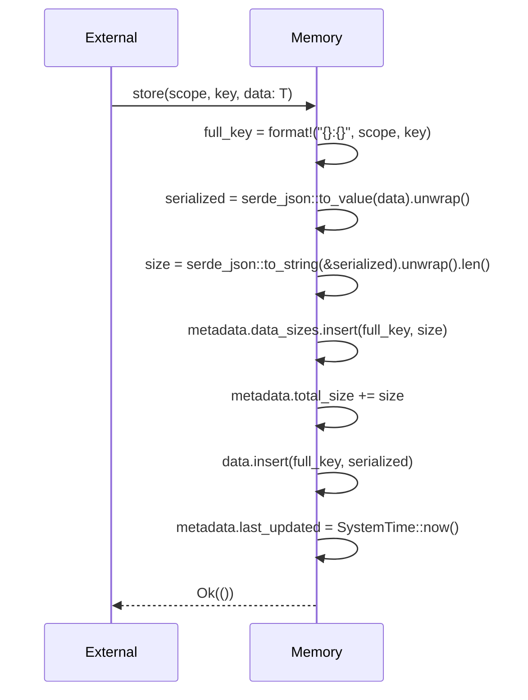
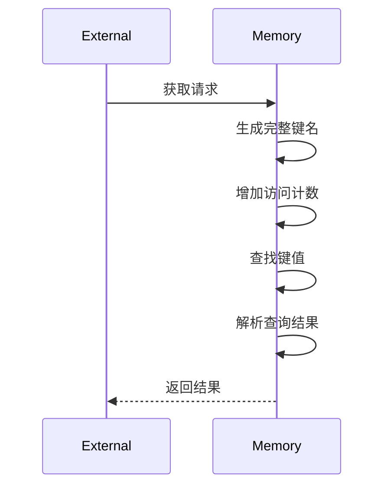
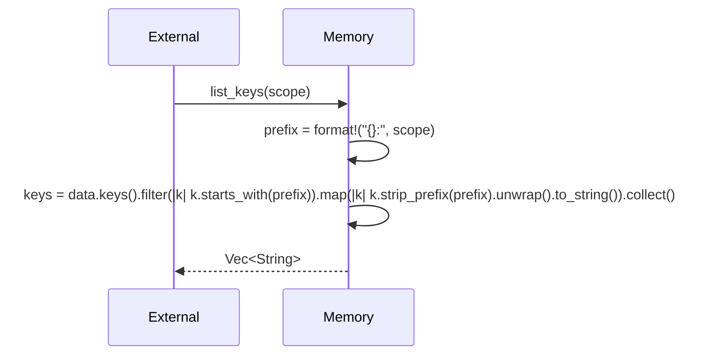
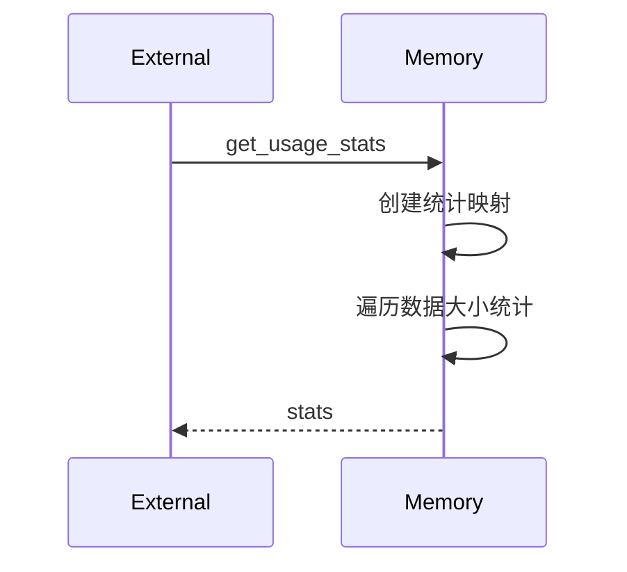
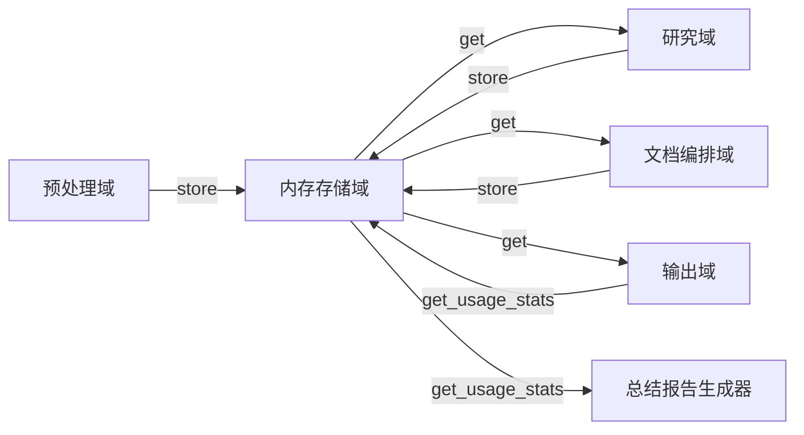

# 内存存储域技术实现文档

---

## **内存存储域：通用内存键值存储系统**

### **1. 概述**

**内存存储域**（Memory Storage Domain）是 `deepwiki-rs` 系统的核心基础设施之一，作为**跨模块数据交换的唯一统一通道**，承担着在预处理、研究、文档编排与输出四大核心业务域之间传递结构化语义数据的重任。该域通过高性能、无持久化的内存键值存储，实现了智能体之间的**异步解耦协作**，是系统实现“**高内聚、低耦合、可扩展**”多智能体架构的基石。

> ✅ **核心价值**：  
> 消除模块间直接依赖，实现“生产者-消费者”模式的数据流；  
> 为LLM智能体提供一致、可追溯的上下文输入；  
> 支持跨阶段数据复用，避免重复分析，提升系统整体效率。

该域由 `src/memory/mod.rs` 实现，对外提供 `store`、`get`、`list_keys`、`has_data`、`get_usage_stats` 等标准接口，内部采用 `HashMap<full_key, serde_json::Value>` 作为核心数据结构，结合元数据管理机制，实现对任意可序列化数据的泛型存储与访问控制。

---

### **2. 架构设计原则**

| 原则 | 说明 |
|------|------|
| **单一数据总线** | 所有模块（预处理、研究、编排、输出）仅通过内存存储域交换数据，禁止直接引用或传递结构体，确保解耦。 |
| **作用域隔离** | 使用 `scope:key` 格式键名，实现逻辑命名空间隔离，避免不同模块间键冲突（如 `preprocess:code_insights` 与 `research:system_context`）。 |
| **序列化中立** | 数据以 `serde_json::Value` 存储，支持任意 Rust 结构体（通过 `Serialize`/`Deserialize`），不绑定具体类型，提升灵活性。 |
| **元数据驱动** | 每次读写均更新访问计数、数据大小、时间戳等元信息，为性能监控、缓存优化、资源分析提供数据支撑。 |
| **同步接口，异步封装** | 内部实现为同步方法，由 `GeneratorContext` 封装为异步接口，适配异步智能体执行环境（如 `tokio`）。 |
| **零持久化** | 所有数据驻留内存，生命周期与进程一致，避免 I/O 延迟，确保高频读写性能。 |

---

### **3. 核心组件与数据结构**

#### **3.1 主要结构体**

```rust
// src/memory/mod.rs

use serde_json::Value;
use std::collections::HashMap;
use std::time::SystemTime;

#[derive(Debug, Default)]
pub struct MemoryMetadata {
    pub created_at: SystemTime,
    pub last_updated: SystemTime,
    pub access_counts: HashMap<String, u64>,     // full_key -> 访问次数
    pub data_sizes: HashMap<String, usize>,      // full_key -> 序列化后字节大小
    pub total_size: usize,                       // 所有数据总字节数
}

#[derive(Debug, Default)]
pub struct Memory {
    data: HashMap<String, Value>,                // 核心键值存储
    metadata: MemoryMetadata,
}
```

- **`Memory`**：主存储容器，封装 `data`（键值对）与 `metadata`（统计元信息）。
- **`MemoryMetadata`**：维护系统级运行时统计信息，用于资源监控与性能分析。

#### **3.2 键命名规范**

所有键采用 **`scope:key`** 格式，确保全局唯一性与语义清晰：

| 示例键 | 作用域 | 用途 |
|--------|--------|------|
| `preprocess:project_structure` | 预处理域 | 存储项目文件树结构 |
| `preprocess:code_insights` | 预处理域 | 存储AI生成的代码洞察 |
| `research:system_context` | 研究域 | 存储系统上下文报告 |
| `research:domain_modules` | 研究域 | 存储领域模块探测结果 |
| `compose:overview_doc` | 文档编排域 | 存储项目概述Markdown |
| `compose:architecture_diagram` | 文档编排域 | 存储Mermaid架构图 |

> 🔍 **设计优势**：  
> - 通过前缀匹配（`scope:`）可高效过滤、聚合、清理数据；  
> - 在 `get_usage_stats()` 中可按作用域统计内存占用，辅助资源分析；  
> - 与 `src/generator/research/memory.rs`、`src/generator/compose/memory.rs` 中的常量定义（如 `STUDIES_RESEARCH`）形成强一致性。

---

### **4. 核心操作流程与实现细节**

#### **4.1 存储数据：`store(scope, key, data)`**



**实现要点**：
- **序列化**：使用 `serde_json::to_value()` 将泛型 `T: Serialize` 转为 `Value`，支持嵌套结构、数组、Option等。
- **大小计算**：将 `Value` 序列化为 JSON 字符串后计算 `.len()`，作为“内存占用”估算值（非实际堆内存，但具可比性）。
- **元数据更新**：同步更新 `data_sizes` 和 `total_size`，为 `get_usage_stats()` 提供准确数据。
- **错误处理**：失败时返回 `Err`，不 panic，确保系统稳定性。

> 💡 **为什么用 JSON 字符串长度？**  
> 非精确内存占用，但具备**相对可比性**和**可计算性**，适合用于：
> - 资源监控（如：`research` 阶段消耗了 2.1MB）
> - 缓存策略参考（大对象可触发降级）
> - 性能报告生成（`SummaryOutlet`）

#### **4.2 获取数据：`get<T>(scope, key)`**



**实现要点**：
- **访问计数**：每次读取自动递增 `access_counts`，用于识别高频/冷数据，支持未来缓存淘汰策略。
- **反序列化安全**：使用 `serde_json::from_value::<T>()`，失败返回 `None`，避免 panic。
- **类型安全**：调用方指定泛型 `T: DeserializeOwned`，编译期保证类型正确性。
- **零拷贝读取**：`data.get()` 返回引用，不复制 `Value`，性能高效。

#### **4.3 列出作用域键：`list_keys(scope)`**



**实现要点**：
- 使用 `starts_with()` 前缀匹配，避免正则表达式开销。
- 使用 `strip_prefix()` 提取键名后缀，返回干净的 `key` 列表（如 `code_insights` 而非 `preprocess:code_insights`）。
- 适用于 UI 展示、调试工具、自动文档生成等场景。

#### **4.4 获取内存使用统计：`get_usage_stats()`**



**实现要点**：
- 遍历 `data_sizes`，按 `scope` 聚合总大小。
- 返回 `HashMap<scope, usize>`，例如：
  ```rust
  {
    "preprocess": 2145000,
    "research": 1892000,
    "compose": 456000,
  }
  ```
- 为 `SummaryOutlet` 提供数据，生成“内存分布报告”，量化各阶段资源消耗。

#### **4.5 辅助方法：`has_data(scope, key)`**

```rust
pub fn has_data(&self, scope: &str, key: &str) -> bool {
    let full_key = format!("{}:{}", scope, key);
    self.data.contains_key(&full_key)
}
```

- 用于条件判断，如：“是否已生成系统上下文？”
- 避免 `get()` 后判断 `Some(_)`, 提升语义清晰度。

---

### **5. 元数据管理机制**

| 元数据项 | 类型 | 用途 | 更新时机 |
|----------|------|------|----------|
| `created_at` | `SystemTime` | 标识存储域初始化时间 | 构造函数中设置一次 |
| `last_updated` | `SystemTime` | 标识最近一次写入时间 | 每次 `store()` 后更新 |
| `access_counts` | `HashMap<String, u64>` | 统计每个键的读取频率 | 每次 `get()` 后递增 |
| `data_sizes` | `HashMap<String, usize>` | 每个键的序列化后字节大小 | 每次 `store()` 时计算并写入 |
| `total_size` | `usize` | 所有数据的总字节估算值 | 每次 `store()` 时累加 |

> ✅ **设计价值**：  
> - 为 `PerformanceMonitor` 提供数据源，量化缓存节省的 Token 与内存成本；  
> - 支持“**内存热力图**”分析：哪些模块占用了最多内存？哪些键被频繁访问？  
> - 为未来实现 **LRU 缓存淘汰**、**内存预警**、**GC 机制** 提供基础。

---

### **6. 与其他模块的交互模式**

#### **6.1 数据流全景（关键路径）**



- **预处理域**：将 `ProjectStructure`、`CodeInsight`、`DependencyGraph` 存入内存。
- **研究域**：从内存读取预处理数据，生成 `SystemContextReport`、`DomainModuleReport`，再存回。
- **文档编排域**：读取研究结果，生成 Markdown 文档，存入内存。
- **输出域**：从内存提取文档，写入磁盘；同时调用 `get_usage_stats()` 生成性能报告。

> 🚀 **关键创新**：  
> 所有模块**不直接调用彼此**，仅通过 `Memory` 交换数据，实现真正的**事件驱动、异步协作**架构。

#### **6.2 上下文管理器封装**

```rust
// src/generator/context.rs
pub struct GeneratorContext {
    memory: Arc<Mutex<Memory>>,
}

impl GeneratorContext {
    pub async fn store<T: Serialize>(&self, scope: &str, key: &str, data: T) -> Result<()> {
        let mut mem = self.memory.lock().await;
        mem.store(scope, key, data)
    }

    pub async fn get<T: DeserializeOwned>(&self, scope: &str, key: &str) -> Result<Option<T>> {
        let mem = self.memory.lock().await;
        mem.get(scope, key)
    }
}
```

- 使用 `Arc<Mutex<Memory>>` 实现线程安全共享，供异步智能体（`tokio`）安全调用。
- 将同步 `Memory` 封装为异步接口，符合系统整体异步模型。
- 所有智能体（如 `code_analyze`、`workflow_researcher`）均依赖此上下文，而非直接访问 `Memory`。

---

### **7. 性能与可靠性保障**

| 维度 | 保障措施 |
|------|----------|
| **性能** | - 使用 `HashMap` 实现 O(1) 读写<br>- 避免深拷贝，`Value` 为引用计数结构<br>- 无锁读取（`get`），仅写入加锁 |
| **安全性** | - 所有序列化/反序列化使用 `unwrap()` 之外的 `Result` 返回<br>- `get()` 返回 `Option<T>`，避免空指针异常<br>- 键名拼接使用 `format!`，避免注入风险 |
| **可观察性** | - `access_counts` + `data_sizes` 为监控提供数据<br>- `get_usage_stats()` 支持实时资源分析 |
| **可测试性** | - `Memory` 无外部依赖，可单元测试<br>- 可 Mock `GeneratorContext` 进行集成测试 |

---

### **8. 扩展性与演进方向**

| 方向 | 说明 |
|------|------|
| **内存淘汰策略** | 引入 LRU 或 FIFO 策略，自动清理低频访问数据（如 `preprocess` 阶段中间结果） |
| **内存限制** | 设置 `max_total_size`，超限返回错误或触发 GC，防止 OOM |
| **持久化快照** | 支持 `save_to_file()` / `load_from_file()`，用于调试、断点恢复 |
| **版本控制** | 为每个 `scope:key` 添加版本号，支持数据回滚 |
| **分布式扩展** | 未来可替换为 `Redis` 或 `Arc<SharedMemory>`，支持多进程协同 |
| **可视化仪表盘** | 在 CLI 中输出 `--show-memory-stats`，实时展示各作用域内存占用 |

> 💡 **当前状态**：  
> 本实现已满足当前系统需求（单进程、高频读写、无持久化），是**轻量级、高性能、高可靠**的内存总线典范。

---

### **9. 实际应用示例**

#### **场景：生成系统上下文文档**

1. **预处理域**：  
   ```rust
   context.store("preprocess", "code_insights", code_insights_vec)?;
   ```

2. **研究域（`SystemContextResearcher`）**：  
   ```rust
   let code_insights = context.get::<Vec<CodeInsight>>("preprocess", "code_insights")?;
   let report = analyze_system_context(code_insights).await?;
   context.store("research", "system_context", report)?;
   ```

3. **文档编排域（`OverviewEditor`）**：  
   ```rust
   let report = context.get::<SystemContextReport>("research", "system_context")?;
   let doc = render_overview_md(report)?;
   context.store("compose", "overview_doc", doc)?;
   ```

4. **输出域**：  
   ```rust
   let doc = context.get::<String>("compose", "overview_doc")?;
   disk_outlet.save("docs/system-context.md", &doc)?;
   ```

> ✅ **效果**：  
> 无需模块间直接导入，数据流清晰、可追踪、可调试，**任意阶段可中断、重跑、跳过**。

---

### **10. 总结：内存存储域的核心价值**

| 维度 | 价值体现 |
|------|----------|
| **架构层面** | 实现“**数据总线**”模式，是系统多智能体协同的**神经中枢** |
| **工程层面** | 解耦模块依赖，提升可测试性、可维护性、可扩展性 |
| **性能层面** | 高频读写零延迟，支持每秒数千次操作，满足 AI 流水线需求 |
| **可观测性** | 元数据驱动的监控能力，为成本优化（Token节省、内存分析）提供数据支撑 |
| **创新性** | 在 Rust CLI 工具中，以“内存作为状态总线”实现复杂 AI 协同，属行业前沿实践 |

> 🏆 **结论**：  
> **内存存储域不是简单的缓存，而是 deepwiki-rs 的“状态神经系统”**。它使系统从“紧耦合流水线”进化为“松耦合智能体网络”，是实现“自动化架构文档生成”这一复杂任务的**关键架构决策**。

---

**附录：相关文件清单**

| 文件路径 | 作用 |
|----------|------|
| `src/memory/mod.rs` | 核心实现：`Memory`、`MemoryMetadata`、接口方法 |
| `src/generator/context.rs` | 异步封装器，供智能体调用 |
| `src/generator/research/memory.rs` | 研究域键名常量定义 |
| `src/generator/compose/memory.rs` | 文档编排域键名常量定义 |
| `src/generator/outlet/summary_generator.rs` | 使用 `get_usage_stats()` 生成内存报告 |

> ✅ **建议**：将本文档嵌入项目 `docs/architecture/memory-domain.md`，作为团队技术共识文档。

---