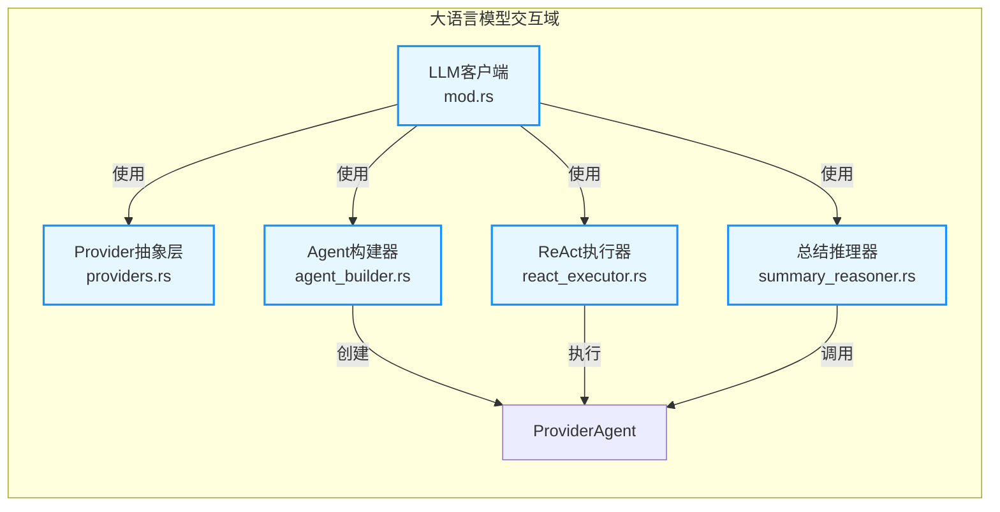
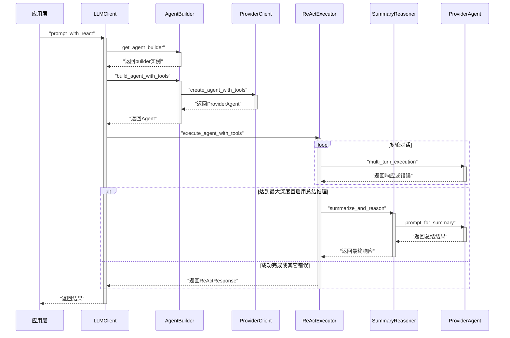
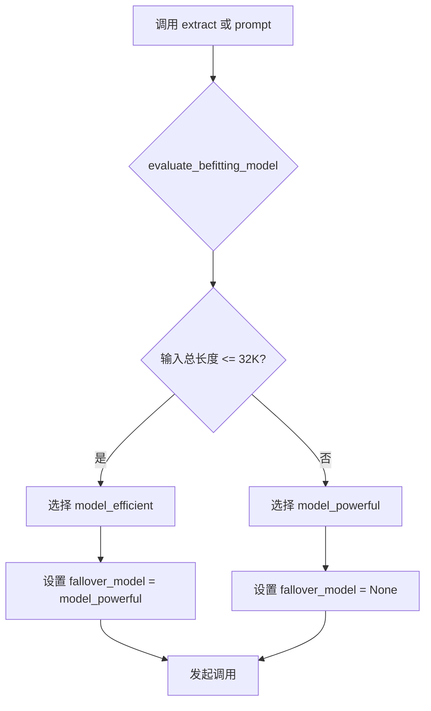

# **大语言模型交互域技术实现文档**

## 1. 概述

**大语言模型交互域**是 `deepwiki-rs` 项目的核心支撑模块，负责封装与多种大语言模型（LLM）服务提供商的复杂交互逻辑。该模块为上层业务领域（如代码智能分析、领域架构分析、智能文档生成）提供统一、可靠且功能丰富的调用接口。

其核心目标是：
- **抽象化**：屏蔽不同 LLM 提供商（如 Moonshot、DeepSeek、Mistral 等）的 API 差异。
- **智能化**：根据任务需求和输入长度，自动选择最合适的模型进行调用。
- **高可用性**：通过重试、降级和回退机制，确保在部分服务不稳定时仍能完成任务。
- **扩展性**：支持 ReAct（Reasoning and Acting）等高级交互模式，并集成工具以增强 Agent 的能力边界。

本技术文档将深入剖析该领域的设计原理、核心组件、关键流程及其实现细节。

---

## 2. 核心职责与定位

### 2.1 在系统中的角色
作为“**工具支撑域**”，大语言模型交互域不直接参与业务逻辑决策，而是为所有需要 AI 能力的“**核心业务域**”提供基础服务。它位于系统架构的基础设施层，与配置管理器、内存管理器并列，共同支撑上层应用。

### 2.2 主要职责
| 职责 | 说明 |
|------|------|
| **统一接口** | 提供 `extract`, `prompt`, `prompt_with_react` 等标准化方法，简化上层调用。 |
| **模型路由** | 根据输入文本长度，动态选择高效模型或强大模型，优化成本与性能。 |
| **容错处理** | 实现指数退避重试，并在主模型失败时自动切换至备选模型（fallover）。 |
| **ReAct 支持** | 执行多轮推理循环，允许 LLM 调用预设工具（如文件浏览、读取）来获取更多信息。 |
| **回退机制** | 当 ReAct 循环达到最大深度时，启用总结推理（Summary Reasoning）模式，利用已有上下文生成最终答案。 |
| **工具集成** | 将外部工具注入到 LLM Agent 中，扩展其解决复杂问题的能力。 |

---

## 3. 核心组件与实现

### 3.1 组件概览



### 3.2 关键组件详解

#### (1) **LLMClient (`src/llm/client/mod.rs`)**
**作用**：整个交互域的统一入口，对外暴露所有公共方法。

**核心特性**：
- **`extract<T>` 方法**：用于结构化数据提取。接收一个实现了 `JsonSchema` 的 Rust 结构体泛型 `T`，LLM 将输出符合该结构的 JSON 数据。此方法会自动评估输入长度，选择合适的模型，并在失败时尝试备选模型。
- **`prompt_with_react` 方法**：支持完整的 ReAct 多轮对话模式。内部会构建一个带有工具的 Agent，并启动 ReAct 执行器。若达到最大迭代次数，可触发总结推理回退。
- **`retry_with_backoff` 方法**：通用的异步重试逻辑，采用指数退避策略，由 `config.retry_attempts` 和 `config.retry_delay_ms` 控制。

**代码片段**：
```rust
// extract 方法的核心逻辑
pub async fn extract<T>(&self, system_prompt: &str, user_prompt: &str) -> Result<T>
where
    T: JsonSchema + for<'a> Deserialize<'a> + Serialize + Send + Sync + 'static,
{
    let (befitting_model, fallover_model) = 
        evaluate_befitting_model(&self.config.llm, system_prompt, user_prompt);
    
    // 内部递归调用，支持模型降级
    self.extract_inner(system_prompt, user_prompt, befitting_model, fallover_model).await
}
```

#### (2) **ProviderClient (`src/llm/client/providers.rs`)**
**作用**：封装不同 LLM 提供商的差异，实现插件化接入。

**实现方式**：
- 使用 Rust 的 `enum` 枚举类型定义 `ProviderClient`，每个变体对应一个具体的提供商客户端（如 `Moonshot(rig::providers::moonshot::Client)`）。
- 通过 `new()` 方法根据配置动态初始化相应的提供商实例。
- 提供 `create_agent()` 和 `create_agent_with_tools()` 方法，为不同提供商创建统一的 `ProviderAgent` 抽象。

**优势**：新增一个 LLM 提供商只需扩展枚举并实现相应逻辑，无需修改上层调用代码，符合开闭原则。

#### (3) **AgentBuilder (`src/llm/client/agent_builder.rs`)**
**作用**：负责构建和配置 LLM Agent，特别是处理工具的注入。

**工作流程**：
1. 接收 `system_prompt`。
2. 根据配置决定是否禁用预设工具。
3. 若启用，则创建 `file_explorer` 和 `file_reader` 工具实例。
4. 将工具和增强后的 `system_prompt` 传递给 `ProviderClient`，创建最终的 Agent。

**代码片段**：
```rust
pub fn build_agent_with_tools(&self, system_prompt: &str) -> ProviderAgent {
    if !llm_config.disable_preset_tools {
        let file_explorer = AgentToolFileExplorer::new(self.config.clone());
        let file_reader = AgentToolFileReader::new(self.config.clone());
        
        // 增强系统提示，鼓励调用工具
        let system_prompt_with_tools = format!(
            "{}\\n不要虚构不存在的代码，如果你需要了解更多项目的工程结构和源码内容，积极的调用工具来获得更多上下文补充",
            system_prompt
        );
        
        self.client.create_agent_with_tools(
            &llm_config.model_efficient,
            &system_prompt_with_tools,
            llm_config,
            &file_explorer,
            &file_reader,
        )
    } else {
        // ... 创建无工具的 Agent
    }
}
```

#### (4) **ReActExecutor (`src/llm/client/react_executor.rs`)**
**作用**：执行 ReAct 模式的多轮推理循环。

**关键逻辑**：
- 调用 `agent.multi_turn()` 方法，传入用户初始提示和最大迭代次数。
- 监听执行结果：
  - **成功**：返回完整响应。
  - **达到最大深度**：根据配置决定是否返回部分结果，并触发总结推理回退。
  - **其他错误**：抛出异常。

#### (5) **SummaryReasoner (`src/llm/client/summary_reasoner.rs`)**
**作用**：当 ReAct 模式因达到最大迭代次数而中断时，作为回退机制，生成最终答案。

**工作原理**：
1. 接收原始的 `system_prompt`、`user_prompt`、ReAct 对话历史和工具调用记录。
2. 构建一个新的、更复杂的提示词（`build_summary_prompt`），将所有已有信息整合进去。
3. 使用一个**无工具**的 Agent 发起一次单轮对话，要求其基于全部上下文进行总结和推理。

**提示词构建示例**：
```
# 原始任务背景
...

# 原始用户问题
...

# 已执行的工具调用记录
1. file_explorer({"action": "list_directory", "path": "src/generator"})
2. file_reader({"file_path": "src/generator/context.rs"})

# 详细对话历史与工具结果
...

# 总结推理任务
基于以上信息，虽然多轮推理过程因达到最大迭代次数而被截断，但请你根据已有的上下文信息...
```

---

## 4. 关键交互流程

### 4.1 ReAct 模式完整流程


### 4.2 智能模型选择流程


---

## 5. 集成的工具（Tools）

该模块集成了两个核心工具，极大地增强了 LLM Agent 的自主探索能力：

| 工具 | 文件路径 | 功能 |
|------|---------|------|
| **文件探索工具**<br>`AgentToolFileExplorer` | `src/llm/tools/file_explorer.rs` | 允许 Agent 列出目录、搜索文件、获取文件信息，相当于赋予了 LLM “眼睛”。 |
| **文件读取工具**<br>`AgentToolFileReader` | `src/llm/tools/file_reader.rs` | 允许 Agent 读取指定文件的内容，支持行号范围和最大行数限制，相当于赋予了 LLM “手”。 |

这些工具通过 `AgentBuilder` 被注入到 Agent 中，并在 `system_prompt` 中明确指示 LLM 可以主动调用它们来获取更多信息，从而形成一个闭环的“思考-行动-观察”循环。

---

## 6. 总结

大语言模型交互域是 `deepwiki-rs` 项目智能化能力的基石。它通过精心设计的分层架构和模块化组件，成功地将复杂的 LLM 交互逻辑封装起来，为上层业务提供了稳定、智能且强大的 AI 能力支持。

其核心价值体现在：
- **可靠性**：重试、降级、回退三重保障，极大提升了系统的鲁棒性。
- **智能性**：动态模型选择和 ReAct 模式，让 LLM 能够更有效地解决问题。
- **扩展性**：清晰的抽象和模块划分，便于未来集成更多 LLM 提供商和新工具。

该领域的设计充分体现了 Rust 语言在构建高性能、高可靠性系统方面的优势，是现代 AI 原生应用中一个优秀的工程实践范例。