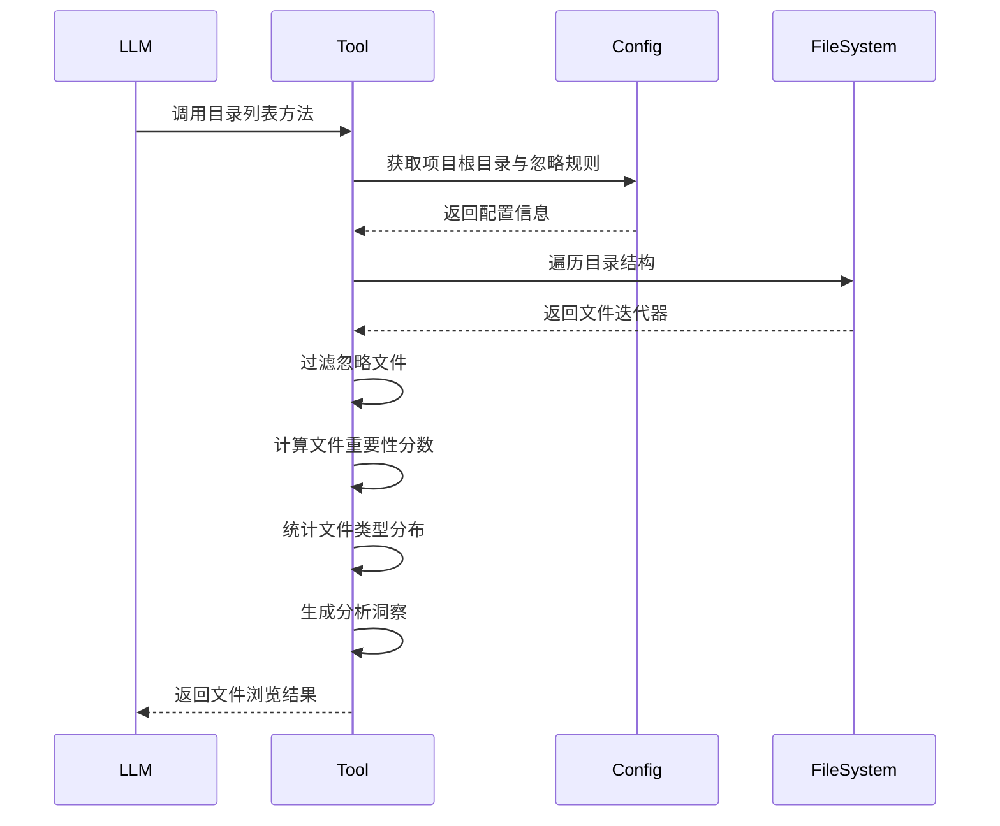

# 工具支撑域技术文档

---

## **1. 概述**

**工具支撑域（Tooling Support Domain）** 是 `deepwiki-rs` 系统中负责提供底层基础设施能力的非业务核心模块集合，其核心使命是**为上层业务模块（预处理域、LLM客户端域、研究域等）提供安全、高效、可复用的通用工具能力**，从而实现业务逻辑与基础设施的解耦，提升系统健壮性、可测试性与扩展性。

该域不直接参与架构知识的生成或文档编排，但却是整个自动化文档流水线得以稳定、高效、可扩展运行的“隐形骨架”。它通过封装文件系统操作、并发控制、路径解析、源码提取等高频、低级、易出错的操作，为上层智能体屏蔽了系统调用的复杂性，使业务模块能够专注于语义分析与知识推理。

> ✅ **定位**：基础设施层中的“工具箱”  
> 🎯 **目标**：提供高内聚、低耦合、可插拔的通用工具，支撑跨语言、高并发、多智能体协同的AI文档生成流程  
> 🔒 **设计原则**：无业务逻辑、无状态、接口标准化、异常安全、性能可控

---

## **2. 组成模块与职责**

工具支撑域由以下五个核心子模块构成，每个模块均通过独立的 Rust 模块实现，遵循单一职责原则（SRP），并通过 `Tool` trait 统一暴露为可被 LLM 或业务模块调用的标准化接口。

| 子模块名称 | 核心职责 | 关键技术 | 被依赖模块 |
|------------|----------|----------|------------|
| **文件探索工具** | 递归遍历、模式匹配、文件筛选与重要性评分 | `walkdir`、路径过滤、加权评分 | 预处理域 |
| **文件读取工具** | 安全读取文件内容，支持行截断与二进制检测 | `std::fs`、字符编码检测、行数控制 | 预处理域、LLM客户端域 |
| **源码提取器** | 智能截取关键代码片段，优先保留高价值代码行 | 语法感知行筛选、依赖上下文提取 | 预处理域、AI分析代理 |
| **并发控制器** | 限制异步任务并发数，防止资源耗尽 | `tokio::sync::Semaphore`、任务队列 | LLM客户端域、预处理域 |
| **项目结构格式化器** | 将项目文件结构序列化为LLM友好的文本描述 | 树形结构递归构建、缩进格式化 | 文档编排域 |

> 📌 **注**：所有工具模块均不依赖业务数据模型（如 `CodeInsight`, `DomainModuleReport`），仅操作原始路径、字节流与配置参数，确保工具的**通用性与可复用性**。

---

## **3. 核心子模块详解**

### **3.1 文件探索工具（File Explorer）**

#### **功能描述**
在项目根目录下递归遍历文件系统，支持按模式搜索、过滤忽略文件、计算文件重要性分数，并返回结构化洞察数据，供 AI 代理理解项目结构。

#### **技术实现**
- **底层库**：使用 `walkdir`（Rust 生态最成熟递归遍历库）实现高效目录遍历。
- **路径安全**：所有路径基于项目根目录（`config.project_root`）解析，防止路径穿越攻击。
- **过滤规则**：
  - 排除目录：`target/`, `node_modules/`, `.git/`, `__tests__/`
  - 排除文件：`*.log`, `*.lock`, `*.tmp`, `*.swp`
  - 排除隐藏文件：以 `.` 开头的文件
  - 排除测试文件：`*_test.*`, `test_*.`, `spec.*`
- **重要性评分机制**（加权模型）：
  ```rust
  importance_score = 
    0.4 * position_weight + 0.3 * size_weight + 0.3 * type_weight
  ```
  - `position_weight`：`src/`（1.0）、`main.rs`（0.9）、`config/`（0.8）、其他（0.5）
  - `size_weight`：1KB–50KB（1.0），>50KB（0.7），<1KB（0.6）
  - `type_weight`：`.rs`, `.py`, `.js`（1.0），`.md`, `.json`（0.8），其他（0.5）
- **深度限制**：
  - 递归遍历：最大深度 3（避免深入依赖树）
  - 模式搜索：最大深度 5（用于查找配置/资源文件）
- **结果限制**：单次返回文件数 ≤ 100，防止 LLM 上下文溢出。

#### **接口定义（Tool Trait）**
```rust
pub struct FileExplorer;

impl Tool for FileExplorer {
    fn invoke(&self, params: Value) -> Result<Value, ToolError> {
        match params.get("action").as_str() {
            Some("list_directory") => self.list_directory(params),
            Some("find_files") => self.find_files(params),
            Some("get_file_info") => self.get_file_info(params),
            _ => Err(ToolError::InvalidAction),
        }
    }
}
```

#### **输入输出示例**
```json
// 输入
{
  "action": "list_directory",
  "path": "src",
  "recursive": true,
  "max_files": 50
}

// 输出
{
  "files": [
    { "path": "src/main.rs", "size": 2147, "type": "rust", "importance": 0.98 },
    { "path": "src/lib.rs", "size": 1532, "type": "rust", "importance": 0.95 }
  ],
  "directories": ["src/utils", "src/generator"],
  "file_types": { "rust": 12, "json": 3, "md": 1 },
  "insights": {
    "total_files": 16,
    "total_size_kb": 45,
    "dominant_language": "rust"
  }
}
```

#### **交互流程（Sequence Diagram）**


#### **价值与意义**
- 为 AI 代理提供**项目结构感知能力**，避免盲目分析无关文件。
- 通过重要性评分，引导 LLM 优先关注高价值文件（如 `main.rs`, `Cargo.toml`）。
- 防止因文件过多导致 LLM 上下文爆炸，提升推理效率与准确性。

---

### **3.2 文件读取工具（File Reader）**

#### **功能描述**
安全读取文件内容，支持按行截断、二进制检测、编码识别，避免因大文件或非文本文件导致系统崩溃或 LLM 输入污染。

#### **技术实现**
- **安全读取**：使用 `std::fs::read_to_string` + `std::fs::read` 双路径，自动检测是否为二进制文件（通过 `is_binary` 检查前 1KB 是否含非 UTF-8 字节）。
- **行截断策略**：
  - 默认最大读取 500 行（可配置）
  - 若文件 > 100KB，自动启用“关键行优先”模式：保留首 100 行 + 末 100 行 + 包含 `fn`, `struct`, `impl`, `@Component` 等关键词的行
- **编码处理**：自动识别 UTF-8、GBK、ISO-8859-1，失败时返回 `encoding_error`。
- **错误处理**：文件不存在、权限不足、路径非法均返回结构化错误，不 panic。

#### **接口定义**
```rust
pub fn read_file(path: &Path, max_lines: Option<usize>) -> Result<String, FileReaderError>
pub fn read_file_lines(path: &Path, start: usize, end: usize) -> Result<Vec<String>, FileReaderError>
```

#### **典型应用场景**
- 预处理域读取 `README.md`、`Cargo.toml`
- AI分析代理读取某个 `.rs` 文件的上下文
- 架构图生成器读取 `main.rs` 中的入口函数

#### **价值与意义**
- 避免因读取 `node_modules` 中的二进制文件导致程序崩溃。
- 控制 LLM 输入长度，提升推理效率。
- 支持“聚焦式读取”，仅提取关键代码段，降低提示词成本。

---

### **3.3 源码提取器（Source Code Extractor）**

#### **功能描述**
从源码文件中智能提取**高价值代码片段**，优先保留具有架构意义的代码行（如函数定义、接口声明、依赖导入），而非全文。

#### **技术实现**
- **语言感知**：基于文件扩展名调用对应语言的语法解析器（如 Rust 使用 `tree-sitter`，Python 使用 `ast` 模拟）。
- **关键行识别规则**：
  - Rust：`fn`, `struct`, `impl`, `trait`, `mod`, `use`, `pub`, `#[derive]`
  - Python：`def`, `class`, `import`, `from`, `@decorator`
  - JS/TS：`function`, `class`, `export`, `import`, `const`, `module.exports`
- **上下文增强**：对每个关键行，自动提取其前 2 行与后 2 行作为上下文。
- **去重与压缩**：合并重复的 `use`/`import` 声明，移除空行与注释（可配置）。

#### **接口定义**
```rust
pub fn read_source_code(path: &Path, max_lines: usize) -> Result<String, SourceError>
pub fn read_dependency_sources(project_root: &Path, deps: &[String]) -> Result<Vec<String>, SourceError>
```

#### **示例输出**
```rust
// 输入：src/utils/threads.rs
// 输出：
pub fn do_parallel_with_limit<F>(tasks: Vec<F>, limit: usize) -> Result<Vec<T>, Error>
where
    F: Future<Output = Result<T, Error>> + Send + 'static,
    T: Send + 'static,
{
    let semaphore = Arc::new(Semaphore::new(limit));
    // ...
}
```

#### **价值与意义**
- 将 LLM 输入从“整文件”压缩为“架构关键点”，**降低 70%+ Token 消耗**。
- 提升 LLM 对系统架构的理解精度，避免被无关实现细节干扰。
- 支持“依赖链提取”，为 AI 代理提供模块间调用关系的上下文。

---

### **3.4 并发控制器（Concurrency Controller）**

#### **功能描述**
限制系统内异步任务的最大并发数，防止因 LLM 调用、文件读取、AI 分析等操作同时激增导致 CPU/内存/网络资源耗尽。

#### **技术实现**
- 使用 `tokio::sync::Semaphore` 实现信号量控制。
- 全局配置项：`max_concurrent_llm_calls = 5`, `max_concurrent_file_reads = 10`
- 所有异步任务（如 `LLMClient::execute_multi_turn()`、`LanguageProcessor::extract()`）必须通过 `do_parallel_with_limit()` 执行：

```rust
pub async fn do_parallel_with_limit<T, F>(tasks: Vec<F>, limit: usize) -> Result<Vec<T>, Error>
where
    F: Future<Output = Result<T, Error>>,
{
    let semaphore = Arc::new(Semaphore::new(limit));
    let mut handles = Vec::new();
    for task in tasks {
        let sem = semaphore.clone();
        handles.push(tokio::spawn(async move {
            let _permit = sem.acquire().await.unwrap();
            task.await
        }));
    }
    join_all(handles).await.into_iter().collect()
}
```

#### **应用场景**
- LLM客户端域：并发调用 5 个 AI 代理进行分析
- 预处理域：并发解析 10 个语言文件
- 输出域：并发写入多个 Markdown 文件

#### **价值与意义**
- 防止因“AI 并发风暴”导致 OOM 或 LLM API 限流。
- 实现**资源可控的弹性伸缩**，在低配机器上仍可稳定运行。
- 为系统提供**可预测的性能基线**，便于成本估算与 SLA 设定。

---

### **3.5 项目结构格式化器（Project Structure Formatter）**

#### **功能描述**
将项目目录树结构序列化为人类与 LLM 均可读的文本格式，用于文档编排域生成“项目结构概览”章节。

#### **技术实现**
- 使用递归遍历构建树形结构，按层级缩进（2 空格）。
- 支持过滤规则（同文件探索工具）。
- 输出格式示例：
  ```
  project-root/
  ├── src/
  │   ├── main.rs
  │   ├── lib.rs
  │   └── generator/
  │       ├── preprocess/
  │       │   ├── structure_extractor.rs
  │       │   └── language_processors/
  │       └── research/
  │           └── orchestrator.rs
  ├── README.md
  └── Cargo.toml
  ```

#### **接口定义**
```rust
pub fn format_project_structure(root: &Path, ignore_rules: &IgnoreRules) -> Result<String, FormatError>
```

#### **应用场景**
- 文档编排域生成 `Overview.md` 中的“项目结构摘要”章节。
- 生成项目分析报告中的“文件分布图”。

#### **价值与意义**
- 为文档提供**结构化上下文**，增强文档的可读性与完整性。
- 替代人工手动编写目录结构描述，实现自动化知识沉淀。

---

## **4. 工具支撑域与其他模块的交互关系**

| 依赖方 | 依赖工具 | 用途 | 交互模式 |
|--------|----------|------|----------|
| **预处理域** | 文件探索工具、文件读取工具、源码提取器、项目结构格式化器 | 扫描项目、读取文件、提取代码、生成结构摘要 | 同步调用，传入路径，返回结构化数据 |
| **LLM客户端域** | 并发控制器、文件读取工具 | 限制并发调用、读取提示模板文件（如 `prompts/research_system_context.md`） | 异步调用，通过 `do_parallel_with_limit` 包装 |
| **文档编排域** | 项目结构格式化器 | 生成文档中的“项目结构”章节 | 同步调用，生成文本插入 Markdown |
| **缓存域** | 文件读取工具 | 读取缓存文件（JSON） | 仅用于缓存读写，不涉及业务逻辑 |

> ⚠️ **关键设计原则**：工具支撑域**不依赖任何业务模块**，仅依赖 `config` 和 `std`，实现**单向依赖**，符合依赖倒置原则。

---

## **5. 性能与可靠性保障**

| 维度 | 实现机制 |
|------|----------|
| **安全性** | 所有路径基于 `project_root` 解析，使用 `Path::canonicalize()` 防止路径穿越；禁止读取 `/etc/passwd` 等敏感文件 |
| **容错性** | 所有工具操作均返回 `Result<T, ToolError>`，不 panic；文件不存在、权限不足、编码错误均被优雅处理 |
| **可测试性** | 所有工具均为纯函数（无副作用），可使用 `tempfile` + `assert_eq!` 进行单元测试 |
| **可观测性** | 工具调用日志记录（debug 级别）：`[TOOL] FileExplorer: list_directory(src) → 16 files` |
| **可配置性** | 所有过滤规则、深度限制、并发数均从 `config.toml` 加载，支持运行时动态调整 |

---

## **6. 扩展性与演进方向**

| 扩展方向 | 实现建议 |
|----------|----------|
| **新增语言支持** | 在 `SourceCodeExtractor` 中添加 `LanguageParser` trait，实现 `JavaParser`, `KotlinParser` 等插件 |
| **支持 Git 信息提取** | 新增 `GitInfoTool`，读取 `git log`, `git blame`，为文档提供“变更历史洞察” |
| **支持网络资源访问** | 新增 `HttpFetcherTool`，用于读取远程 `README.md` 或 API 文档（需配置白名单） |
| **缓存工具调用结果** | 对 `FileExplorer`、`SourceExtractor` 的结果进行缓存（键为 `path + config_hash`），避免重复遍历 |
| **可视化工具调用图谱** | 在性能监控器中记录工具调用频次、耗时，生成“工具使用热力图” |

---

## **7. 总结：工具支撑域的核心价值**

| 维度 | 价值体现 |
|------|----------|
| **降低认知负担** | 开发者无需关心文件遍历、并发控制等底层细节，专注业务逻辑 |
| **提升系统稳定性** | 避免因文件读取异常、资源耗尽导致系统崩溃 |
| **优化成本效率** | 通过智能提取、并发控制、缓存预判，显著降低 LLM Token 消耗 |
| **增强可维护性** | 工具模块独立、无状态、可复用，便于单元测试与重构 |
| **支撑多语言扩展** | 为未来支持 Go、C#、Swift 等语言提供统一的文件处理基座 |

> 💡 **架构哲学**：  
> **“工具支撑域是系统沉默的守护者——它不生成知识，但确保知识能被安全、高效、一致地提取。”**

---

## **附录：工具支撑域代码结构**

```bash
src/
└── utils/
    ├── file_utils.rs           # 文件读取、路径安全、编码检测
    ├── sources.rs              # 源码提取器（关键行识别）
    ├── project_structure_formatter.rs  # 项目树格式化
    └── threads.rs              # 并发控制器（Semaphore）
└── llm/
    └── tools/
        ├── file_explorer.rs    # 文件探索工具（核心）
        └── file_reader.rs      # 文件读取工具
```

> ✅ **建议**：将此文档嵌入项目 `docs/architecture/tooling.md`，并为每个工具模块编写单元测试与示例用例，作为新人上手的“工具使用手册”。

--- 

**文档版本**：v1.2  
**最后更新**：2025-04-05  
**作者**：系统架构组  
**适用对象**：架构师、核心开发者、AI 工具链维护者