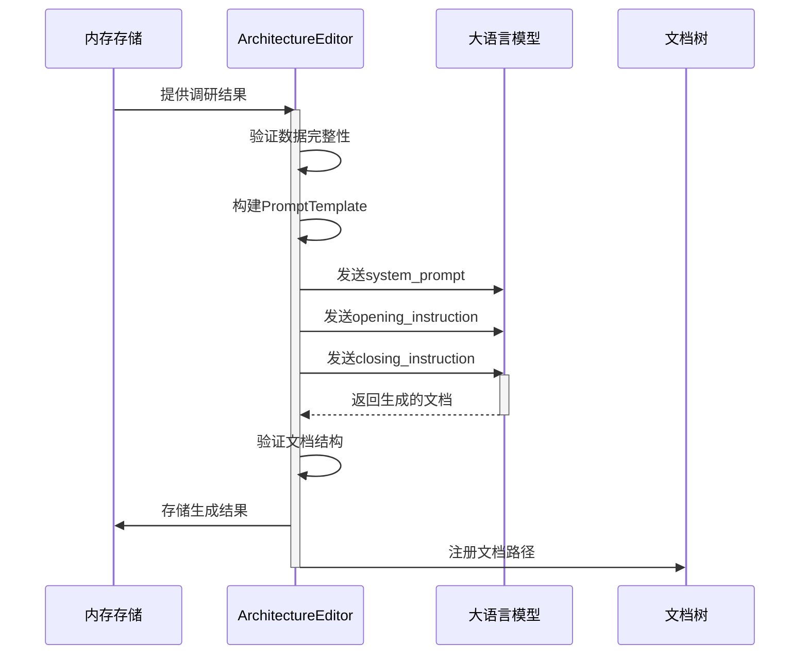
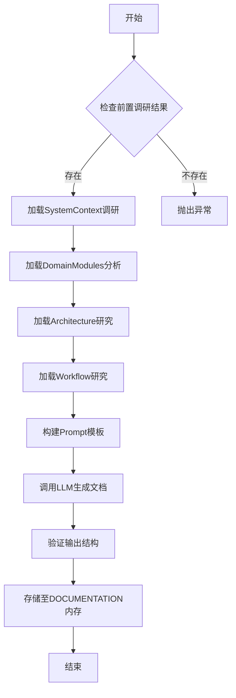

# 智能文档生成域技术实现文档

## 1. 模块概述

### 1.1 模块定位
**智能文档生成域**是 `deepwiki-rs` 项目的核心业务模块之一，负责将前期多智能体协同分析所得的结构化调研结果，转化为高质量、标准化的技术文档。该模块遵循 **C4 架构模型**（Context, Container, Component, Code）理念，通过多个专业化的“编辑器”智能体（Editor Agent），按预定流程生成涵盖系统上下文、架构视图、工作流、关键模块洞察和边界接口的综合性技术文档。

本模块体现了典型的“信息聚合与表达”职责，专注于文档内容的专业化组织与呈现，而非原始数据分析，实现了清晰的**职责分离**设计原则。

### 1.2 核心价值
- **自动化知识沉淀**：将代码库自动转化为可读性强、结构规范的技术文档。
- **提升团队协作效率**：为新成员快速上手、架构评审、技术交接提供权威参考。
- **保障文档一致性**：基于统一模板和标准生成文档，确保输出质量稳定、格式统一。
- **支持决策制定**：为软件架构师和技术负责人提供系统级洞察，辅助技术决策。

---

## 2. 核心组件与职责

智能文档生成域由一个**文档编排器**（DocumentationComposer）和多个**文档编辑器**（Editor Agents）构成，采用插件化、流水线式设计。

| 组件名称 | 文件路径 | 职责概要 |
|--------|--------|---------|
| `DocumentationComposer` | `src/generator/compose/mod.rs` | 文档合成阶段的总控模块，协调各编辑器按序执行 |
| `OverviewEditor` | `src/generator/compose/agents/overview_editor.rs` | 生成 C4 Context 层级的系统概览文档 |
| `ArchitectureEditor` | `src/generator/compose/agents/architecture_editor.rs` | 生成 C4 Container 层级的架构文档 |
| `WorkflowEditor` | `src/generator/compose/agents/workflow_editor.rs` | 生成核心业务与技术工作流程说明 |
| `KeyModulesInsightEditor` | `src/generator/compose/agents/key_modules_insight_editor.rs` | 并发生成各关键领域的深度技术洞察文档 |
| `BoundaryEditor` | `src/generator/compose/agents/boundary_editor.rs` | 生成 API/CLI 等外部接口调用文档 |

---

## 3. 核心机制详解

### 3.1 插件化架构设计

所有编辑器均实现统一的 `StepForwardAgent` trait，具备标准化接口：

```rust
trait StepForwardAgent {
    type Output;
    fn agent_type(&self) -> String;           // 返回代理类型标识
    fn memory_scope_key(&self) -> String;     // 指定内存作用域
    fn data_config(&self) -> AgentDataConfig; // 定义输入数据依赖
    fn prompt_template(&self) -> PromptTemplate; // 提供提示词模板
}
```

此设计实现了高度的**可扩展性**与**低耦合性**，新增文档类型仅需实现该 trait 即可被编排器自动集成。

### 3.2 数据流与交互模式

#### 输入源
编辑器从全局内存管理器（Memory）中读取前置研究阶段的成果，具体依赖关系如下：

| 编辑器 | 所需输入数据源 |
|------|--------------|
| `OverviewEditor` | SystemContext、DomainModulesDetector |
| `ArchitectureEditor` | SystemContext、DomainModules、ArchitectureResearcher、WorkflowResearcher |
| `WorkflowEditor` | SystemContext、DomainModules、WorkflowResearcher、CodeInsights |
| `KeyModulesInsightEditor` | 各领域模块的 KeyModuleReport |
| `BoundaryEditor` | BoundaryAnalysisReport（可选：ProjectStructure, CodeInsights, README） |

#### 输出目标
所有生成的文档内容最终：
1. 存储至 `MemoryScope::DOCUMENTATION` 内存作用域；
2. 注册到 `DocTree` 文档树结构中，用于后续持久化输出；
3. 由 `DiskOutlet` 统一写入文件系统。

#### 交互时序


---

## 4. 关键技术实现细节

### 4.1 Prompt 工程设计

本模块采用三段式 `PromptTemplate` 结构，精准引导大语言模型生成符合要求的内容：

| 段落 | 功能说明 |
|------|--------|
| `system_prompt` | 定义代理的专业身份与文档标准，如“你是一个专业的软件架构文档编写专家” |
| `opening_instruction` | 指导如何分析输入材料，明确分析维度与关注点 |
| `closing_instruction` | 严格规定输出格式、结构、图表要求及质量标准 |

#### 示例：ArchitectureEditor 的 Prompt 设计
- **System Prompt**：强调其作为“C4 架构文档专家”的角色，要求精通 UML、Mermaid 图表与架构术语。
- **Opening Instruction**：指导分析四大调研报告（系统上下文、领域模块、架构、工作流）。
- **Closing Instruction**：强制要求包含 7 大章节（架构概览、系统上下文、容器视图等），并使用 Mermaid 绘制多种图表。

这种结构化提示词工程显著提升了 LLM 输出的**一致性**与**专业性**。

### 4.2 并发控制机制

`KeyModulesInsightEditor` 支持对多个关键模块进行**并发文档生成**，以提高性能：

```rust
let analysis_futures = insight_reports.into_iter().map(|report| {
    let kmie = KeyModuleInsightEditor::new(report);
    Box::pin(async move { kmie.execute(context).await })
}).collect();

let results = do_parallel_with_limit(analysis_futures, max_parallels).await;
```

- 使用 `do_parallel_with_limit` 工具函数限制最大并发数（由配置项 `llm.max_parallels` 控制）；
- 避免因并发过高导致 LLM 接口限流或资源耗尽；
- 实现了高效且可控的并行处理能力。

### 4.3 特殊实现：BoundaryEditor

`BoundaryEditor` 是唯一**不依赖 LLM 生成**的编辑器，其实现方式独特：

- **自定义 `execute` 方法**：直接解析 `BoundaryAnalysisReport` 对象，通过字符串拼接生成 Markdown 文档；
- **本地逻辑生成**：适用于结构化强、模式固定的接口文档（CLI/API）；
- **优势**：避免不必要的 LLM 调用，提升性能与确定性；
- **输出内容**包括：
  - CLI 命令参数、选项、示例；
  - API 端点、请求/响应格式、认证方式；
  - 集成建议与最佳实践。

---

## 5. 执行流程

### 5.1 总体流程
文档合成阶段由 `DocumentationComposer` 按固定顺序调度各编辑器：

```rust
impl DocumentationComposer {
    pub async fn execute(...) -> Result<()> {
        overview_editor.execute(...).await?;
        architecture_editor.execute(...).await?;
        workflow_editor.execute(...).await?;
        key_modules_insight_editor.execute(...).await?;
        boundary_editor.execute(...).await?;
        Ok(())
    }
}
```

此顺序确保了文档从宏观到微观、从整体到局部的逻辑连贯性。

### 5.2 流程图


---

## 6. 技术优势总结

| 特性 | 说明 |
|------|------|
| **职责分离** | 文档生成与数据分析解耦，各编辑器专注单一任务 |
| **标准化输出** | 基于 C4 模型与统一 Prompt 模板，确保文档专业性与一致性 |
| **高可扩展性** | 插件化 Agent 设计，易于新增文档类型 |
| **性能优化** | 支持并发生成，对简单文档采用本地生成避免 LLM 开销 |
| **强健的数据依赖管理** | 明确声明输入源，保障数据完整性 |
| **可视化集成** | 强制要求 Mermaid 图表，增强文档可读性 |

---

## 7. 可优化方向建议

| 方向 | 建议 |
|------|------|
| **模板可定制化** | 允许用户通过配置文件自定义 `PromptTemplate`，适配企业内部文档规范 |
| **缓存机制增强** | 对已生成的文档片段进行缓存，避免重复调用 LLM |
| **错误恢复机制** | 支持断点续跑，单个编辑器失败不影响整体流程 |
| **多语言支持扩展** | 当前目标语言由配置决定，可进一步优化国际化文档生成能力 |
| **文档版本对比** | 在增量分析模式下，支持生成变更差异报告 |

---

## 结论

智能文档生成域作为 `deepwiki-rs` 项目的“表达中枢”，成功地将分散的分析成果整合为结构完整、专业规范的技术文档。其采用的**分层编辑器架构**、**精细化 Prompt 工程**与**灵活的执行策略**，不仅保证了输出质量，也为系统的可维护性与可扩展性奠定了坚实基础。该模块的设计思想对于构建自动化知识管理系统具有重要的参考价值。