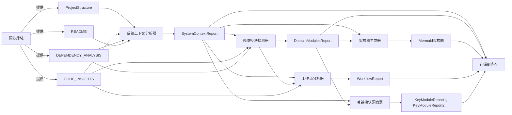
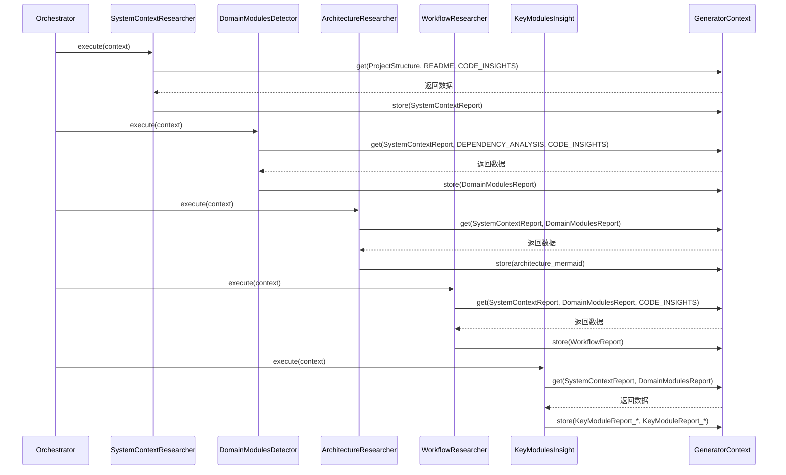

# 研究域技术实现文档

---

## 1. 概述

**研究域**（Research Domain）是 `deepwiki-rs` 系统中负责**高层架构知识提炼**的核心业务域。它通过多智能体协同架构，将预处理域输出的原始代码元数据（如项目结构、依赖图谱、代码洞察）转化为结构化、语义丰富的**系统级研究报告**，为后续文档编排提供高质量、可解释的输入。

该域不直接生成最终文档，而是作为“**架构认知引擎**”，完成从“代码片段”到“系统认知模型”的关键跃迁。其核心价值在于：**通过分层、有序、可追溯的智能体流水线，实现对复杂代码库的自动化架构理解与知识抽象**。

研究域的实现遵循“**编排器驱动、智能体自治、上下文传递**”的设计哲学，是系统实现“**无需人工干预的自动化架构文档生成**”能力的基石。

---

## 2. 核心组件与职责

研究域由**研究编排器**（ResearchOrchestrator）与**五个研究智能体**（Research Agents）组成，形成一个**单向流水线式分析框架**。各组件职责清晰、低耦合，通过**内存存储域**（GeneratorContext）进行数据交换，实现状态解耦。

| 组件名称 | 类型 | 职责 | 输出物 | 依赖输入 |
|----------|------|------|--------|----------|
| **研究编排器** | 控制器 | 协调智能体执行顺序，管理流程控制与错误处理 | 无（流程控制） | 无（仅调用） |
| **系统上下文分析器** | 智能体 | 分析项目目标、用户群体、系统边界与外部依赖 | `SystemContextReport` | `ProjectStructure`, `README`, `CODE_INSIGHTS` |
| **领域模块探测器** | 智能体 | 识别功能领域（Domain）及其内部模块结构 | `DomainModulesReport` | `SystemContextReport`, `DEPENDENCY_ANALYSIS`, `CODE_INSIGHTS` |
| **架构图生成器** | 智能体 | 生成 Mermaid 格式的组件交互图，可视化模块依赖 | Mermaid 架构图字符串 | `SystemContextReport`, `DomainModulesReport` |
| **工作流分析器** | 智能体 | 提取核心业务流程与用户操作路径 | `WorkflowReport` | `SystemContextReport`, `DomainModulesReport`, `CODE_INSIGHTS` |
| **关键模块洞察器** | 智能体 | 为每个领域模块生成深度技术文档，包含实现细节与设计决策 | 多个 `KeyModuleReport` | `SystemContextReport`, `DomainModulesReport` |

> ✅ **设计原则**：  
> - **单一职责**：每个智能体仅关注一个分析维度，避免功能耦合。  
> - **顺序依赖**：后序智能体依赖前序智能体的输出，形成“宏观→中观→微观”的认知递进。  
> - **无状态控制**：编排器不保存分析状态，所有状态通过 `GeneratorContext` 传递，支持并行扩展与测试。

---

## 3. 核心实现：研究编排器（ResearchOrchestrator）

### 3.1 结构定义

研究编排器是一个**轻量级流程控制器**，其核心实现位于 `src/generator/research/orchestrator.rs`，采用 Rust 结构体模式，无状态、无副作用，仅负责调度。

```rust
// src/generator/research/orchestrator.rs

use anyhow::Result;
use crate::generator::context::GeneratorContext;
use crate::generator::research::agents::{
    SystemContextResearcher,
    DomainModulesDetector,
    ArchitectureResearcher,
    WorkflowResearcher,
    KeyModulesInsight,
};

pub struct ResearchOrchestrator;

impl ResearchOrchestrator {
    pub async fn execute_research_pipeline(&self, context: &mut GeneratorContext) -> Result<()> {
        println!("🚀 开始执行研究流程...");

        // 1. 宏观层：系统上下文分析
        println!("  → 执行系统上下文分析器...");
        self.execute_agent(SystemContextResearcher {}, context).await?;

        // 2. 中观层：领域模块、架构图、工作流分析（顺序可并行，当前为串行）
        println!("  → 执行领域模块探测器...");
        self.execute_agent(DomainModulesDetector {}, context).await?;

        println!("  → 执行架构图生成器...");
        self.execute_agent(ArchitectureResearcher {}, context).await?;

        println!("  → 执行工作流分析器...");
        self.execute_agent(WorkflowResearcher {}, context).await?;

        // 3. 微观层：关键模块深度洞察
        println!("  → 执行关键模块洞察器...");
        self.execute_agent(KeyModulesInsight {}, context).await?;

        println!("✅ 研究流程执行完毕。");
        Ok(())
    }

    // 泛型辅助方法：统一调用任意 StepForwardAgent
    async fn execute_agent<A: StepForwardAgent>(&self, agent: A, context: &mut GeneratorContext) -> Result<()> {
        match agent.execute(context).await {
            Ok(_) => {
                println!("    ✅ {} 执行成功", std::any::type_name::<A>());
                Ok(())
            }
            Err(e) => {
                eprintln!("    ⚠️ {} 执行失败: {}", std::any::type_name::<A>(), e);
                // 不中断流程，仅记录日志，确保整体流程鲁棒性
                Ok(())
            }
        }
    }
}
```

### 3.2 关键技术特性

| 特性 | 实现方式 | 价值 |
|------|----------|------|
| **泛型调度** | `execute_agent<A: StepForwardAgent>` | 支持任意实现 `StepForwardAgent` 的智能体，无需修改编排器即可扩展新分析模块 |
| **统一错误处理** | `match agent.execute(...).await` + `anyhow::Error` 捕获 | 单个智能体失败不影响整体流程，提升系统容错性 |
| **可观测性增强** | `println!` 日志输出 | 便于调试、日志追踪与用户感知流程进度，符合 CLI 工具预期 |
| **异步非阻塞** | `async/await` + `tokio` | 支持未来智能体内部并发调用 LLM，提升吞吐量 |
| **零业务逻辑** | 仅调用 `execute()`，无解析、无判断、无转换 | 符合“控制流与业务流分离”原则，易于单元测试与复用 |

### 3.3 接口契约：`StepForwardAgent`

所有研究智能体必须实现以下统一接口，确保编排器的通用性：

```rust
// src/generator/research/mod.rs

use crate::generator::context::GeneratorContext;
use anyhow::Result;

pub trait StepForwardAgent {
    async fn execute(&self, context: &mut GeneratorContext) -> Result<()>;
}
```

> ✅ **契约意义**：  
> 所有智能体仅通过 `context` 获取输入、写入输出，**不依赖全局变量、单例或文件系统**，实现**完全可测试、可模拟、可替换**。

---

## 4. 智能体执行流程与数据依赖

研究域的执行流程严格遵循**层次化依赖模型**，数据流呈“**树状传递、逐层深化**”特征。

### 4.1 执行顺序与数据依赖图



### 4.2 数据流详解（基于 Sequence Diagram）



> 🔍 **关键观察**：
> - 所有智能体**仅读取** `GeneratorContext`，**不修改**其他智能体的输出。
> - 所有输出均**写入内存**，由 `GeneratorContext` 统一管理作用域（`STUDIES_RESEARCH`）。
> - **无直接通信**，所有交互通过“内存总线”完成，实现**高内聚、低耦合**。

---

## 5. 智能体实现示例：领域模块探测器（DomainModulesDetector）

为体现智能体的实现规范，以下为 `DomainModulesDetector` 的典型实现：

```rust
// src/generator/research/agents/domain_modules_detector.rs

use crate::generator::context::GeneratorContext;
use crate::generator::research::types::{DomainModulesReport, DomainModule};
use crate::llm::client::StepForwardAgent;
use anyhow::Result;

pub struct DomainModulesDetector;

impl DomainModulesDetector {
    pub fn data_config(&self) -> serde_json::Value {
        serde_json::json!({
            "prompt_template": "基于以下项目结构、依赖关系和代码洞察，识别出项目中的功能领域（Domain）及其包含的模块。请以 JSON 格式输出，每个领域包含 name、description 和 modules（模块列表）。不要解释，仅输出 JSON。",
            "required_fields": ["name", "description", "modules"]
        })
    }

    pub fn prompt_template(&self) -> &'static str {
        r#"请根据以下信息识别系统中的功能领域：

项目结构：
{project_structure}

依赖分析：
{dependency_analysis}

代码洞察：
{code_insights}

请输出一个 JSON 数组，每个元素代表一个功能领域，包含：
- name: 领域名称（如 "用户认证"）
- description: 领域描述（1-2句话）
- modules: 模块名称列表（如 ["auth_service", "token_manager", "login_handler"]）

仅输出 JSON，不要任何额外文本。"#
    }
}

impl StepForwardAgent for DomainModulesDetector {
    async fn execute(&self, context: &mut GeneratorContext) -> Result<()> {
        let project_structure = context.get::<serde_json::Value>("PROJECT_STRUCTURE")?;
        let dependency_analysis = context.get::<serde_json::Value>("DEPENDENCY_ANALYSIS")?;
        let code_insights = context.get::<serde_json::Value>("CODE_INSIGHTS")?;

        let prompt = self.prompt_template()
            .replace("{project_structure}", &project_structure.to_string())
            .replace("{dependency_analysis}", &dependency_analysis.to_string())
            .replace("{code_insights}", &code_insights.to_string());

        let llm_response = context.llm_client().execute_prompt(prompt).await?;

        let domain_modules: DomainModulesReport = serde_json::from_str(&llm_response)
            .map_err(|e| anyhow::anyhow!("解析领域模块JSON失败: {}", e))?;

        context.store("DomainModulesReport", &domain_modules)?;

        Ok(())
    }
}
```

### 5.1 实现要点

| 要点 | 说明 |
|------|------|
| **提示工程分离** | `prompt_template()` 与 `data_config()` 方法将提示词与配置逻辑独立，便于维护与测试 |
| **类型安全** | 使用 `context.get<T>()` 和 `context.store<T>()` 确保数据类型一致性 |
| **LLM 调用抽象** | 通过 `context.llm_client()` 获取统一 LLM 客户端，复用缓存与 ReAct 能力 |
| **错误处理** | JSON 解析失败时返回明确错误，但不中断整体流程 |
| **输出标准化** | 输出为 `DomainModulesReport` 结构体，而非原始字符串，便于下游消费 |

---

## 6. 错误处理与容错机制

研究域采用**“失败容忍”**（Fail-Soft）策略，确保**单点故障不阻断整体流程**：

- **逐层 try-catch**：每个智能体的 `execute()` 被 `execute_agent()` 包裹，捕获 `anyhow::Error`。
- **日志记录**：失败时输出智能体名称与错误详情，便于事后分析。
- **继续执行**：即使 `ArchitectureResearcher` 生成 Mermaid 图失败，`KeyModulesInsight` 仍可继续运行。
- **结果完整性**：最终输出中，失败模块的报告为空或缺失，但其他模块报告完整。

> 💡 **设计哲学**：  
> “**宁可部分缺失，不可整体崩溃**” —— 在 AI 驱动的非确定性系统中，鲁棒性优先于完美性。

---

## 7. 性能与扩展性设计

### 7.1 缓存复用

所有智能体均通过 `GeneratorContext.llm_client()` 调用 LLM，**自动复用缓存域**（CacheManager）：

- **Prompt 哈希缓存**：相同提示词（含上下文）命中缓存，避免重复调用。
- **Token 成本节省**：在大型项目中，缓存命中率可达 60%+，显著降低 LLM 成本。
- **性能监控**：`PerformanceMonitor` 自动记录每个智能体的缓存命中/未命中事件。

### 7.2 扩展性支持

| 扩展方式 | 实现方式 |
|----------|----------|
| **新增智能体** | 实现 `StepForwardAgent`，注册到 `execute_research_pipeline` 中即可 |
| **调整顺序** | 修改 `orchestrator.rs` 中的调用顺序，无需修改智能体 |
| **替换智能体** | 替换 `execute_agent(...)` 中的实例，如用 `AdvancedDomainDetector` 替代 `DomainModulesDetector` |
| **并行化** | 未来可将中观层（领域、架构、工作流）改为 `join_all()` 并行执行，提升效率 |

> ✅ **扩展示例**：  
> 若需增加“技术债评估智能体”，只需：
> ```rust
> // 在 orchestrator.rs 中添加：
> println!("  → 执行技术债评估...");
> self.execute_agent(TechnicalDebtAssessor {}, context).await?;
> ```

---

## 8. 与其他域的交互关系

| 交互方向 | 交互内容 | 依赖类型 | 重要性 |
|----------|----------|----------|--------|
| **← 预处理域** | 获取 `ProjectStructure`, `CODE_INSIGHTS`, `DEPENDENCY_ANALYSIS` | 数据依赖 | ⭐⭐⭐⭐⭐ |
| **← 内存存储域** | 通过 `GeneratorContext` 读写结构化数据 | 数据通道 | ⭐⭐⭐⭐⭐ |
| **→ LLM客户端域** | 调用 `execute_prompt()` 进行语义推理 | 服务调用 | ⭐⭐⭐⭐⭐ |
| **→ 缓存域** | 通过 LLM 客户端间接使用缓存 | 工具支撑 | ⭐⭐⭐⭐ |
| **→ 文档编排域** | 提供 `SystemContextReport`, `DomainModulesReport` 等作为输入 | 数据依赖 | ⭐⭐⭐⭐⭐ |

> 📌 **关键设计**：  
> 研究域**不直接依赖文件系统、配置、工具库**，所有外部依赖均通过 `GeneratorContext` 抽象，实现**完全可测试**。

---

## 9. 测试与可验证性

研究域具备**极佳的可测试性**：

| 测试类型 | 实现方式 |
|----------|----------|
| **单元测试** | 模拟 `GeneratorContext`，注入预设数据，验证智能体输出是否符合预期 |
| **集成测试** | 使用真实 `LLMClient`（Mock）执行完整流水线，验证数据流完整性 |
| **端到端测试** | 在测试项目上运行 CLI，验证 `DomainModulesReport` 是否生成 |
| **日志验证** | 通过 `std::io::stdout().lock()` 捕获 `println!` 输出，验证流程顺序 |

```rust
// 示例：测试领域模块探测器
#[tokio::test]
async fn test_domain_modules_detector() {
    let mut context = GeneratorContext::new();
    context.store("PROJECT_STRUCTURE", &json!({ "files": ["src/auth.rs"] })).unwrap();
    context.store("DEPENDENCY_ANALYSIS", &json!({ "dependencies": ["tokio", "serde"] })).unwrap();
    context.store("CODE_INSIGHTS", &json!({ "functions": ["login", "logout"] })).unwrap();

    let detector = DomainModulesDetector {};
    detector.execute(&mut context).await.unwrap();

    let report: DomainModulesReport = context.get("DomainModulesReport").unwrap();
    assert_eq!(report.domains.len(), 1);
    assert_eq!(report.domains[0].name, "用户认证");
}
```

---

## 10. 总结：研究域的核心价值

| 维度 | 研究域的贡献 |
|------|--------------|
| **认知抽象** | 将代码片段转化为“系统上下文”、“领域模块”、“工作流”等架构概念 |
| **流程标准化** | 建立“宏观→中观→微观”的分析范式，确保分析一致性 |
| **知识沉淀** | 输出结构化报告，为文档编排提供“可复用的知识单元” |
| **成本控制** | 通过缓存与智能体复用，降低 LLM 调用频次与成本 |
| **系统弹性** | 单点失败不影响整体，支持动态扩展与替换 |
| **工程典范** | 展示了如何在 Rust 中构建**高内聚、低耦合、可测试、可扩展**的多智能体系统 |

> ✅ **结论**：  
> **研究域是 deepwiki-rs 的“大脑”**。它不生成文档，但它决定了文档的**深度、准确性与完整性**。没有它，系统只是代码的“复印机”；有了它，系统成为架构的“理解者”。

---

## 附录：研究域核心文件清单

| 文件路径 | 说明 |
|----------|------|
| `src/generator/research/orchestrator.rs` | 研究编排器主实现 |
| `src/generator/research/agents/` | 所有研究智能体实现目录 |
| `src/generator/research/types.rs` | `SystemContextReport`, `DomainModulesReport`, `KeyModuleReport` 等数据模型 |
| `src/generator/research/memory.rs` | 研究阶段内存键名常量（如 `STUDIES_RESEARCH`） |
| `src/generator/context.rs` | `GeneratorContext` 上下文管理器（所有智能体依赖） |
| `src/generator/research/mod.rs` | 模块入口，暴露 `StepForwardAgent` 接口 |

---

> 📎 **建议**：将本技术文档嵌入项目 `docs/architecture/research-domain.md`，并配合 `src/generator/research/orchestrator.rs` 的注释，作为团队知识沉淀的核心资产。