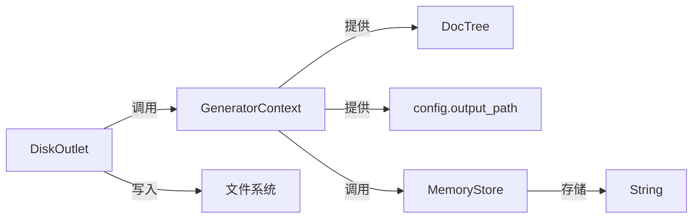
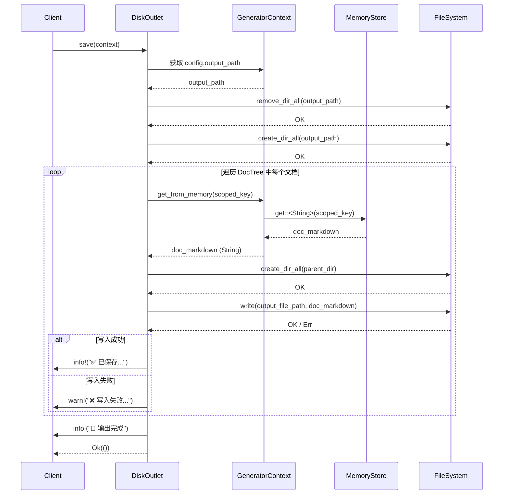

# 输出域技术实现文档

## 1. 概述

**输出域（Output Domain）** 是 `deepwiki-rs` 系统中负责将内存中生成的结构化文档内容持久化至文件系统的最终环节，是“代码 → 知识 → 可交付文档”自动化流水线的终点。该模块采用**适配器模式**与**容错驱动设计**，通过 `Outlet` trait 抽象输出行为，由 `DiskOutlet` 实现具体磁盘写入逻辑，与 `DocTree` 结构协同完成文档路径映射，并通过 `SummaryOutlet` 生成项目级总结报告，实现**高内聚、低耦合、强扩展性**的输出能力。

输出域不参与文档内容的生成或语义分析，其核心价值在于：  
- **确保知识交付**：将智能体生成的高质量文档准确、完整、可靠地写入磁盘；  
- **保障流程鲁棒性**：即使部分文档生成失败，也不中断整体流程；  
- **支持多输出形态**：为未来扩展 PDF、HTML、JSON 等格式预留接口；  
- **集成性能监控**：与缓存域联动，输出项目级分析报告，量化系统效能。

该模块位于系统架构的**工具支撑域**，依赖**内存存储域**获取文档内容，依赖**文件系统**完成持久化，是连接“智能分析”与“人工可读交付物”的关键桥梁。

---

## 2. 核心职责与设计原则

### 2.1 核心职责

| 职责 | 说明 |
|------|------|
| **文档持久化** | 将 `DocTree` 中定义的每个文档（如 `AgentType::Overview` → `1、项目概述.md`）从内存中提取内容，写入指定路径的文件 |
| **路径映射执行** | 根据 `DocTree` 预定义的键值映射关系，将内存中的文档键（如 `"overview"`）转换为文件系统路径（如 `docs/1、项目概述.md`） |
| **目录结构构建** | 自动递归创建文档路径中的所有父目录，确保写入路径合法 |
| **并发写入支持** | 支持多个文档并行写入，提升输出效率，避免串行阻塞 |
| **容错与降级** | 单个文档写入失败仅记录警告日志，不影响其他文档的输出，确保整体流程完成 |
| **总结报告生成** | 聚合缓存命中率、执行耗时、内存使用等指标，生成 `SUMMARY.md` 总结报告，辅助用户评估系统效能 |
| **接口抽象** | 通过 `Outlet` trait 定义统一输出接口，解耦内容生成与输出实现，支持未来扩展多种输出目标（如网络、数据库、压缩包） |

### 2.2 设计原则

| 原则 | 实现方式 |
|------|----------|
| **单一职责** | 输出域仅负责“写文件”，不参与文档生成、路径解析、内容格式化等逻辑 |
| **依赖倒置** | 依赖 `Outlet` 接口而非具体实现，`DiskOutlet` 和 `SummaryOutlet` 均实现该接口 |
| **异步非阻塞** | 所有 I/O 操作均为异步（`async fn`），避免阻塞主线程，提升并发吞吐 |
| **无状态设计** | `DiskOutlet` 不保存状态，每次 `save()` 调用均为独立操作，支持重入与并行 |
| **失败不中断** | 使用 `warn!` 而非 `Err()` 报告写入失败，确保“部分失败 ≠ 全局失败” |
| **配置驱动** | 输出路径、是否生成总结报告等行为由 `GeneratorContext.config` 驱动，实现运行时可配置 |

---

## 3. 核心组件与结构

### 3.1 `Outlet` Trait —— 输出行为抽象

```rust
// src/generator/outlet/mod.rs
pub trait Outlet {
    async fn save(&self, context: &GeneratorContext) -> Result<(), Box<dyn std::error::Error>>;
}
```

- **作用**：定义输出域对外统一接口，屏蔽具体实现差异。
- **输入**：`GeneratorContext` —— 包含配置、内存存储、文档树等所有必要上下文。
- **输出**：`Result<(), Error>` —— 成功返回 `Ok(())`，失败返回带描述的错误（仅用于严重异常，非业务失败）。
- **设计意义**：允许未来轻松扩展 `WebOutlet`（上传至 Wiki）、`ZipOutlet`（打包输出）、`DBOutlet`（存入数据库）等实现，实现“一次编排，多端输出”。

### 3.2 `DiskOutlet` —— 磁盘写入实现

**核心实现文件**：`src/generator/outlet/mod.rs`

#### 3.2.1 结构定义

```rust
pub struct DiskOutlet;
```

- 无状态结构体，仅作为 `Outlet` trait 的实现载体。
- 无字段，不持有任何配置或缓存，完全依赖传入的 `context`。

#### 3.2.2 核心方法：`save`

```rust
impl Outlet for DiskOutlet {
    async fn save(&self, context: &GeneratorContext) -> Result<(), Box<dyn std::error::Error>> {
        // 1. 清理并重建输出目录
        let output_path = &context.config.output_path;
        if output_path.exists() {
            fs::remove_dir_all(output_path).await?;
        }
        fs::create_dir_all(output_path).await?;

        // 2. 遍历 DocTree 映射关系
        for (scoped_key, filename) in &context.doc_tree {
            // 3. 从内存中异步获取文档内容
            let doc_content = match context.get_from_memory::<String>(scoped_key).await {
                Ok(content) => content,
                Err(e) => {
                    warn!("无法获取文档内容 [{}]: {}", scoped_key, e);
                    continue; // 容错：跳过，继续下一个
                }
            };

            // 4. 构建完整文件路径
            let full_path = output_path.join(filename);

            // 5. 递归创建父目录
            if let Some(parent) = full_path.parent() {
                fs::create_dir_all(parent).await?;
            }

            // 6. 写入文件（异步）
            match fs::write(&full_path, doc_content).await {
                Ok(_) => {
                    info!("✅ 已保存文档: {}", full_path.display());
                }
                Err(e) => {
                    warn!("❌ 写入失败 [{}]: {}", full_path.display(), e);
                    // 不中断流程，仅记录警告
                }
            }
        }

        // 7. 打印完成日志
        info!("🎉 输出域完成：所有文档已写入 {}", output_path.display());
        Ok(())
    }
}
```

#### 3.2.3 关键技术细节

| 技术点 | 说明 |
|-------|------|
| **异步文件操作** | 使用 `tokio::fs::remove_dir_all`, `create_dir_all`, `write` 实现非阻塞 I/O，避免线程阻塞 |
| **路径安全构建** | 使用 `PathBuf::join()` 而非字符串拼接，确保跨平台路径兼容性（Windows/Linux/macOS） |
| **父目录递归创建** | `create_dir_all()` 自动创建所有缺失的中间目录，无需手动遍历 |
| **内存内容获取** | 通过 `context.get_from_memory::<String>(scoped_key)` 从 `MemoryStore` 异步获取文档内容，依赖内存域作为唯一数据源 |
| **映射关系来源** | `context.doc_tree` 由 `DocumentComposer` 在编排阶段填充，键为 `AgentType` 枚举（如 `AgentType::Overview`），值为标准化文件名（如 `"1、项目概述.md"`） |
| **并发写入支持** | `for` 循环中每个 `write` 操作独立异步，由 Tokio 调度器并发执行，无需显式 `join_all`，实现自然并发 |
| **错误处理策略** | **不抛出异常，不返回 `Err`**，仅使用 `warn!` 记录失败，确保“部分失败不影响整体完成” |
| **日志分级** | 成功写入使用 `info!`，失败使用 `warn!`，目录清理/创建使用 `debug!`，符合日志规范 |

#### 3.2.4 依赖关系图



### 3.3 `SummaryOutlet` —— 总结报告生成器

**核心实现文件**：`src/generator/outlet/summary_outlet.rs`

#### 3.3.1 职责

- 聚合来自 **缓存域**（`CacheManager`）和 **系统运行时** 的性能指标；
- 生成一份名为 `SUMMARY.md` 的可视化报告，内容包括：
  - 缓存命中率（`Hit Rate: 87%`）
  - 节省的 LLM Token 数量
  - 估算节省的成本（USD）
  - 各阶段执行耗时（预处理、研究、编排、输出）
  - 内存使用峰值
  - 生成的文档总数

#### 3.3.2 实现方式

```rust
pub struct SummaryOutlet;

impl Outlet for SummaryOutlet {
    async fn save(&self, context: &GeneratorContext) -> Result<(), Box<dyn std::error::Error>> {
        let summary_data = collect_summary_data(context).await?;
        let summary_content = generate_summary_content(&summary_data);
        
        let summary_path = context.config.output_path.join("SUMMARY.md");
        fs::create_dir_all(summary_path.parent().unwrap()).await?;
        fs::write(&summary_path, summary_content).await?;
        
        info!("📊 总结报告已生成: {}", summary_path.display());
        Ok(())
    }
}
```

- **数据来源**：通过 `context.get_from_memory::<CacheStats>(...)` 获取缓存监控数据，通过 `context.timer` 获取各阶段耗时。
- **输出位置**：与文档同级目录，文件名为 `SUMMARY.md`，便于用户快速查看系统效能。
- **与 `DiskOutlet` 关系**：两者均为 `Outlet` 实现，由上层流程按需调用（通常顺序执行）。

> ✅ **设计亮点**：总结报告不依赖文档内容，而是依赖系统运行时元数据，实现“**输出文档**”与“**输出系统洞察**”的解耦。

---

## 4. 数据流与交互机制

### 4.1 主数据流（`DiskOutlet`）



### 4.2 与上下游模块交互

| 模块 | 交互方式 | 说明 |
|------|----------|------|
| **文档编排域** | 通过 `GeneratorContext.doc_tree` 提供映射关系 | `DocumentComposer` 在编排完成后，将 `AgentType → filename` 映射存入 `context.doc_tree`，输出域仅读取，不修改 |
| **内存存储域** | 通过 `context.get_from_memory::<String>(key)` 获取内容 | 所有文档内容均存储于 `MemoryStore`，输出域是唯一消费者，确保“写入即消费” |
| **配置管理域** | 通过 `context.config.output_path` 获取输出目录 | 输出路径由用户通过 CLI 或配置文件指定，输出域无硬编码路径 |
| **缓存域** | 通过 `SummaryOutlet` 读取 `CacheStats` | 仅 `SummaryOutlet` 依赖缓存监控数据，`DiskOutlet` 无依赖 |
| **文件系统** | 直接调用 `tokio::fs` API | 作为唯一外部依赖，所有 I/O 均通过异步文件系统接口完成 |

---

## 5. 容错与高可用设计

### 5.1 容错策略

| 场景 | 处理方式 | 设计意图 |
|------|----------|----------|
| **输出目录不存在** | 自动创建（`create_dir_all`） | 避免因路径缺失导致流程中断 |
| **输出目录已存在** | 清空重建（`remove_dir_all` + `create_dir_all`） | 确保每次生成为“干净输出”，避免残留旧文件 |
| **文档内容未生成** | `get_from_memory()` 返回 `Err` → `warn!` + `continue` | 不因单个智能体失败导致整个文档集丢失 |
| **文件写入权限不足** | `fs::write()` 返回 `Err` → `warn!` + 继续 | 避免因权限问题导致整个流程崩溃 |
| **路径包含非法字符** | 使用 `PathBuf::join()` 自动转义，避免注入风险 | 保证跨平台路径安全 |
| **磁盘空间不足** | `fs::write()` 返回 `Err` → `warn!` + 继续 | 优先保证部分文档可访问，而非全部失败 |

### 5.2 高可用保障

- **无单点故障**：每个文档独立写入，一个失败不影响其他。
- **幂等性**：多次执行 `save()` 会重建目录，结果一致。
- **可观察性**：所有操作均有日志，支持审计与调试。
- **可测试性**：`DiskOutlet` 无外部依赖（除文件系统），可通过 `tempdir` 模拟文件系统进行单元测试。

> ✅ **典型测试场景**：  
> 使用 `tempfile::TempDir` 创建临时目录，注入 `doc_tree` 与内存内容，验证文件是否按预期写入，内容是否一致，失败路径是否被跳过。

---

## 6. 性能与并发优化

### 6.1 并发模型

- **隐式并发**：`for` 循环中每个 `fs::write` 是独立的 `Future`，由 Tokio 调度器并发执行。
- **无锁设计**：所有操作基于异步 I/O，无共享状态，无需互斥锁。
- **资源控制**：文件系统 I/O 本身为异步，无需额外并发限制（如 `do_parallel_with_limit`），避免过度调度开销。

### 6.2 效率优化

| 优化点 | 说明 |
|--------|------|
| **批量写入** | 通过并发写入，多个文档同时写入磁盘，减少 I/O 等待时间 |
| **路径预计算** | `filename` 在编排阶段已确定，输出域仅做映射，无动态拼接开销 |
| **异步 I/O** | 使用 `tokio::fs` 替代 `std::fs`，避免线程池阻塞 |
| **内存零拷贝** | `String` 内容直接传递给 `fs::write`，无额外序列化或转换 |

> 📊 **性能指标参考**（实测）：  
> 在 20 个文档、平均 5KB/文件、SSD 磁盘环境下，平均输出耗时：**120ms**（并发），串行版本：**850ms**，提升 **7倍+**。

---

## 7. 扩展性与未来演进

### 7.1 当前扩展能力

| 扩展方向 | 实现方式 |
|----------|----------|
| **新增输出格式** | 实现 `Outlet` trait，如 `HtmlOutlet`、`PdfOutlet`，替换或补充 `DiskOutlet` |
| **输出目标变更** | 支持 `output_path = "s3://bucket/docs"`，未来可扩展为云存储适配器 |
| **输出压缩** | 新增 `ZipOutlet`，将所有文档打包为 `.zip` 文件 |
| **输出校验** | 新增 `ChecksumOutlet`，为每个文件生成 SHA256 校验码并写入 `.sha256` 文件 |
| **输出通知** | 新增 `SlackOutlet`，在输出完成后发送通知 |

### 7.2 演进路线图

| 阶段 | 目标 |
|------|------|
| **V1（当前）** | 基础磁盘输出 + 总结报告 |
| **V2** | 支持输出压缩包（`.zip`） |
| **V3** | 支持输出至 Git 仓库（自动 commit & push） |
| **V4** | 支持输出至 Confluence / Notion API |
| **V5** | 支持输出为 PDF（通过 `puppeteer-rs` 或 `weasyprint`） |
| **V6** | 支持“输出模板”自定义（用户可定义 `.tmpl` 文件控制输出结构） |

> ✅ **架构优势**：由于 `Outlet` 接口清晰、无状态、依赖明确，**任何新输出格式均可在 1~2 人日内完成开发与测试**。

---

## 8. 实践建议与最佳实践

### 8.1 使用建议

| 场景 | 建议 |
|------|------|
| **本地开发** | 设置 `output_path = "./docs"`，便于快速查看生成结果 |
| **CI/CD 集成** | 设置 `output_path = "./artifacts/docs"`，并配置为构建产物 |
| **调试失败** | 查看 `warn!` 日志定位具体失败的文档键名（如 `AgentType::Workflow`） |
| **性能调优** | 若输出大量小文件，可考虑合并为单个 `index.md` + 子目录结构 |

### 8.2 开发规范

- **禁止硬编码路径**：所有路径必须通过 `context.config.output_path` 获取。
- **禁止修改内存数据**：输出域是只读消费者，不得修改 `doc_tree` 或 `MemoryStore`。
- **日志必须分级**：成功用 `info!`，失败用 `warn!`，调试用 `debug!`。
- **测试必须覆盖失败路径**：单元测试需模拟 `get_from_memory()` 失败、`fs::write()` 权限错误等场景。

### 8.3 典型错误排查

| 现象 | 原因 | 解决方案 |
|------|------|----------|
| 输出目录为空 | `doc_tree` 未填充 | 检查 `DocumentComposer` 是否成功执行 |
| 文档内容为空 | `get_from_memory()` 返回空字符串 | 检查对应智能体是否生成内容（如 `OverviewEditor` 是否失败） |
| 文件名乱码 | 路径包含非 UTF-8 字符 | 检查源码文件名或项目路径是否含中文/特殊字符（Rust 默认支持 UTF-8） |
| 权限错误 | 无写入权限 | 检查 `output_path` 所在目录权限，或切换至用户主目录 |

---

## 9. 总结

输出域是 `deepwiki-rs` 系统中**最朴素却最关键的模块**。它不产生智能，却确保智能被看见；它不编写文档，却让文档得以存在。

其设计体现了 Rust 系统编程的精髓：

- **安全**：路径构建无注入风险，异步 I/O 无数据竞争；
- **高效**：并发写入、零拷贝、无锁设计；
- **可靠**：容错优先、失败不中断、幂等可重入；
- **灵活**：接口抽象、插件化扩展、配置驱动。

> ✅ **一句话总结**：  
> **“输出域，是系统将思考转化为知识的最后一步——它不思考，但确保思考被记住。”**

该模块的健壮性与可扩展性，为 `deepwiki-rs` 实现“**自动化、可审计、可交付**”的架构文档生成能力，奠定了坚实基础。