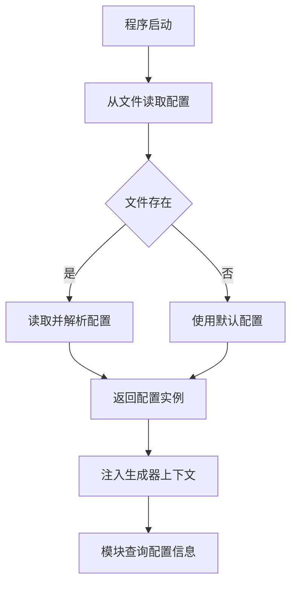
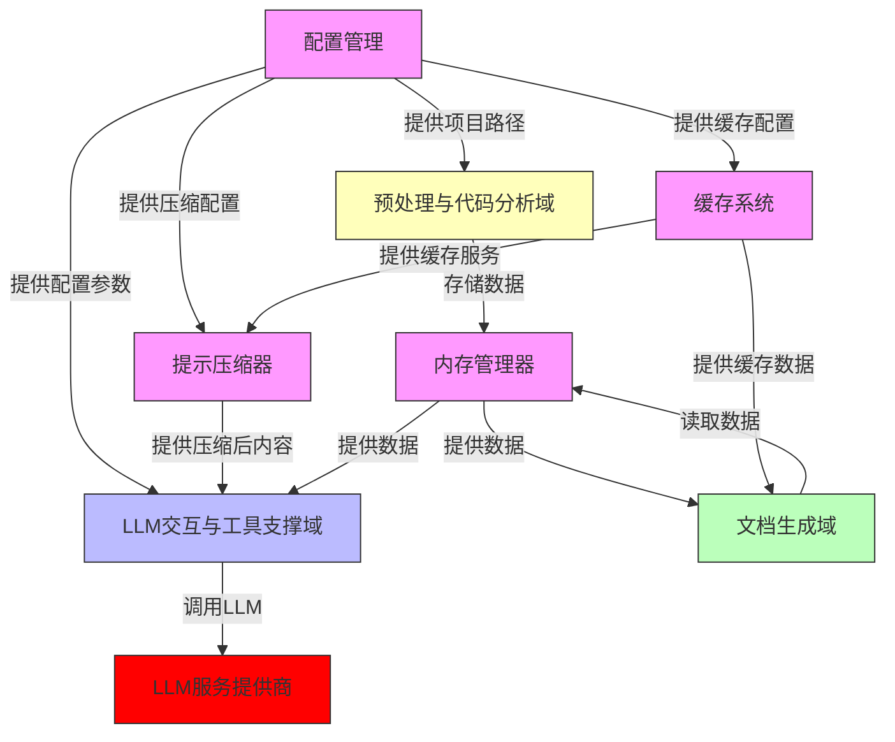

# 配置与基础设施域技术文档

## 文档信息
- **生成时间**: 2025-10-20 19:06:00 (UTC+8)
- **文档版本**: 1.0
- **所属项目**: deepwiki-rs
- **文档作者**: 系统架构分析助手

---

## 概述

配置与基础设施域是 `deepwiki-rs` 系统的基石，负责为整个自动化架构分析流水线提供稳定、可配置、高性能的运行环境。该域不直接参与代码语义分析或文档生成，但其设计质量直接决定了系统的可靠性、可维护性和扩展性。它通过**配置管理**、**内存管理**、**缓存系统**和**提示压缩**四大核心组件，实现了从静态配置加载到动态运行时数据管理的完整闭环。

该域的设计遵循“**基础设施即代码**”和“**关注点分离**”原则，将系统运行参数、状态管理、性能优化等非业务逻辑与核心分析引擎解耦，使智能分析代理域能够专注于语义推理，而无需关心密钥获取、缓存失效或Token估算等底层细节。其模块化设计确保了各组件可独立演进，例如，缓存策略的调整不会影响配置解析逻辑。

---

## 核心组件详解

### 1. 配置管理 (`src/config.rs`)

配置管理是系统启动时的首要依赖，负责定义和加载应用程序的全部运行时参数。

#### 数据模型设计
- **`Config`**: 主配置结构体，包含项目路径、输出目录、分析规则、LLM配置和缓存配置等核心字段。
- **`LLMConfig`**: 专用于大语言模型服务的配置，包含提供商、API密钥、模型选择、超时重试等关键参数。
- **`CacheConfig`**: 缓存系统配置，控制缓存的启用状态、目录路径和过期时间。
- **`LLMProvider`**: 枚举类型，通过 `serde` 的 `rename` 属性实现与TOML配置文件中字符串的双向映射，支持 `openai`, `moonshot`, `deepseek`, `mistral`, `openrouter`, `anthropic`, `gemini` 七种主流LLM提供商。

#### 关键实现特性
- **自动推断项目名称**: `infer_project_name()` 方法采用**策略模式**，按优先级顺序尝试从多种项目元数据文件中提取名称：
  1. `Cargo.toml` (Rust)
  2. `package.json` (Node.js)
  3. `pyproject.toml` (Python)
  4. `pom.xml` (Java Maven)
  
  每个 `extract_from_*` 方法均采用**轻量级字符串匹配**而非完整解析器，以保证在大型项目中快速执行，避免引入复杂依赖。
- **环境变量集成**: `LLMConfig` 的 `api_key` 字段虽在配置文件中声明，但其实际值可由环境变量 `LITHO_LLM_API_KEY` 提供，实现了安全的密钥管理，避免敏感信息硬编码。
- **默认值完备**: 所有结构体均实现 `Default` trait，确保即使配置文件缺失或不完整，系统也能启动并运行在合理默认值下（如 `LLMProvider::OpenAI`）。
- **错误处理**: 使用 `anyhow` 库统一处理文件I/O和TOML解析错误，提供清晰的错误上下文。

#### 交互流程

### 2. 内存管理器 (`src/memory/mod.rs`)

内存管理器是系统各模块间数据交换的**中央枢纽**，采用**作用域隔离**的设计，解决了多智能体协同分析中的状态共享难题。

#### 核心设计
- **基于 `serde_json::Value` 的通用存储**: 支持任意可序列化数据结构，无需为每个Agent定义特定的内存结构。
- **作用域 (Scope) 机制**: 通过 `scope:key` 格式（如 `preprocess:code_insights`, `research:domain_modules`）实现逻辑隔离，确保不同阶段的数据互不干扰。
- **元数据追踪**: 每个存储项均附带创建时间、最后更新时间、访问次数和数据大小，为性能分析和调试提供数据支持。

#### 关键方法
- `store(scope, key, data)`: 将数据序列化后存储。
- `get<T>(scope, key)`: 从指定作用域反序列化并返回数据。
- `list_keys(scope)`: 列出作用域内所有键，用于调试。
- `get_usage_stats()`: 统计各作用域的内存占用，辅助资源管理。

#### 价值
内存管理器是“**内存为中心的数据交换机制**”这一架构原则的直接体现，它消除了模块间直接依赖，使系统具备极强的可扩展性。新增一个研究员Agent，只需将其结果存入特定作用域，下游的文档生成器即可自动发现并使用。

### 3. 缓存系统 (`src/cache/mod.rs`)

缓存系统通过**文件系统缓存**显著降低LLM调用成本，是系统性能优化的核心。

#### 核心机制
- **MD5哈希键**: 以输入Prompt的MD5哈希值作为缓存键，确保相同请求的响应被精确复用。
- **过期策略**: 基于 `expire_hours` 配置自动清理过期缓存，避免数据陈旧。
- **性能监控**: 内置 `CachePerformanceMonitor`，记录缓存命中率、写入次数和错误，为优化提供数据依据。
- **双接口设计**:
  - `set(category, prompt, data)`: 通用缓存。
  - `set_with_tokens(category, prompt, data, token_usage)`: 高精度缓存，同时记录Token消耗，用于准确的成本统计。

#### 与提示压缩的协同
缓存系统与 `PromptCompressor` 紧密协作。压缩后的Prompt结果会被缓存，当再次遇到相同长文本时，可直接复用已压缩的版本，避免重复的LLM压缩调用，形成“**压缩-缓存**”的双重优化闭环。

### 4. 提示压缩器与Token估算器 (`src/utils/prompt_compressor.rs`, `src/utils/token_estimator.rs`)

这两个组件共同构成了LLM调用的“**智能瘦身**”系统，旨在应对大模型Token限制和高昂的调用成本。

#### Token估算器
- **多语言支持**: 区分中文、英文和其它字符，采用不同的token估算比例（中文约1.5字符/Token，英文约4字符/Token），估算精度远高于简单的字符计数。
- **基础开销**: 考虑系统Prompt和格式化开销（默认50 Token），使估算更贴近真实场景。
- **轻量级**: 无外部依赖，纯Rust实现，可快速集成。

#### 提示压缩器
- **阈值触发**: 当输入文本Token数超过 `compression_threshold` (默认65536) 时，自动触发压缩。
- **智能压缩**: 调用LLM本身进行语义级压缩，而非简单截断，保留关键信息（如函数签名、类型定义）。
- **缓存复用**: 压缩结果被缓存，极大提升重复分析任务的效率。
- **压缩报告**: 返回详细的压缩摘要，包括原始/压缩Token数、压缩比和摘要信息，便于审计。

#### 价值
该组合使系统能够**安全地处理超大型代码库**。即使一个项目包含数万行代码，系统也能通过压缩和缓存，将单次LLM调用的Token消耗控制在合理范围内，确保分析流程的稳定性和经济性。

---

## 模块间关系与依赖

- **配置管理**是所有其他组件的配置源头。
- **内存管理器**是数据流的中心，连接预处理、智能分析和文档生成三大核心域。
- **缓存系统**和**提示压缩器**是性能优化的双引擎，它们服务于LLM交互域和预处理域，共同降低系统运行成本。

---

## 总结与最佳实践

配置与基础设施域的成功在于其**务实而优雅**的设计哲学：

1. **不重复造轮子**: 采用 `serde`、`toml`、`anyhow` 等成熟库，而非自研序列化或错误处理。
2. **性能优先**: 在项目名推断、Token估算等高频操作中，选择简单高效的字符串匹配而非复杂解析。
3. **安全第一**: 通过环境变量管理密钥，通过文件过滤避免读取二进制文件。
4. **可观测性**: 所有核心组件（缓存、压缩、内存）均内置性能监控，为系统调优提供数据支持。
5. **可扩展性**: 模块化设计允许独立升级，例如，未来可轻松替换 `md5` 为 `sha256`，或增加新的LLM提供商。

该域是 `deepwiki-rs` 能够稳定、高效、低成本地处理大型项目分析任务的**隐形功臣**。其设计为构建复杂AI工具链提供了绝佳的基础设施范式。