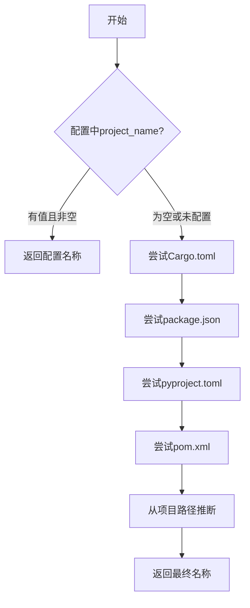

# 配置与状态管理域技术实现文档

## 1. 概述

配置与状态管理域是 `deepwiki-rs` 系统的基础设施核心，为整个分析流水线提供全局配置加载、运行时状态共享和元数据追踪能力。该领域由两个关键子模块构成：**配置管理器（Config）** 和 **内存管理器（Memory）**。

- **配置管理器** 负责解析用户定义的 `litho.toml` 配置文件，或使用默认值构建系统运行参数。
- **内存管理器** 实现了一个基于作用域隔离的内存共享机制，作为各智能体（Agent）间传递结构化数据的核心枢纽。

二者共同支撑了“预处理→研究→文档合成”三阶段流水线的松耦合协作，确保系统具备良好的可维护性、扩展性和可观测性。

---

## 2. 配置管理器（Config）

### 2.1 核心职责

配置管理器 (`src/config.rs`) 是系统的全局配置中心，主要承担以下职责：

- **配置加载**：从指定路径读取 TOML 格式的配置文件，并反序列化为结构化的 `Config` 对象。
- **默认值注入**：通过实现 `Default` trait 提供开箱即用的默认配置，降低用户使用门槛。
- **项目名称推断**：当配置中未显式指定 `project_name` 时，自动从主流项目配置文件（如 `Cargo.toml`, `package.json` 等）中提取项目名。
- **LLM 提供商抽象**：定义 `LLMProvider` 枚举并实现字符串转换逻辑，支持命令行参数灵活指定模型服务。

### 2.2 数据结构设计

配置系统采用分层结构体设计，清晰划分关注点：

```rust
pub struct Config {
    // 基础信息
    pub project_name: Option<String>,
    pub project_path: PathBuf,
    pub output_path: PathBuf,
    pub internal_path: PathBuf,

    // 分析策略
    pub analyze_dependencies: bool,
    pub identify_components: bool,
    pub max_depth: u8,
    pub core_component_percentage: f64,
    pub max_file_size: u64,

    // 文件过滤规则
    pub include_tests: bool,
    pub include_hidden: bool,
    pub excluded_dirs: Vec<String>,
    pub excluded_files: Vec<String>,
    pub excluded_extensions: Vec<String>,
    pub included_extensions: Vec<String>,

    // LLM 配置
    pub llm: LLMConfig,

    // 缓存配置
    pub cache: CacheConfig,

    // 元数据路径
    pub architecture_meta_path: Option<PathBuf>,
}
```

其中嵌套了 `LLMConfig` 和 `CacheConfig` 结构体，分别封装大语言模型调用参数与缓存行为设置。

#### LLMProvider 枚举

系统支持多种 LLM 服务商，通过 `LLMProvider` 枚举统一抽象：

```rust
#[derive(Debug, Deserialize, Serialize, Clone, PartialEq)]
pub enum LLMProvider {
    #[serde(rename = "moonshot")]
    Moonshot,
    #[serde(rename = "deepseek")]
    DeepSeek,
    #[serde(rename = "mistral")]
    Mistral,
    #[serde(rename = "openrouter")]
    OpenRouter,
    #[serde(rename = "anthropic")]
    Anthropic,
    #[serde(rename = "gemini")]
    Gemini,
}
```

该枚举实现了 `Display` 和 `FromStr` trait，允许在配置文件与命令行参数中以字符串形式表示提供商类型，增强了系统的灵活性与易用性。

### 2.3 配置加载流程

配置加载遵循标准的文件 I/O 与反序列化流程：

1. 使用 `std::fs::File::open()` 打开配置文件；
2. 将内容读取为字符串；
3. 调用 `toml::from_str()` 解析为 `Config` 结构体实例；
4. 若失败则返回带有上下文信息的错误。

```rust
impl Config {
    pub fn from_file(path: &PathBuf) -> Result<Self> {
        let mut file = File::open(path)?;
        let mut content = String::new();
        file.read_to_string(&mut content)?;
        let config: Config = toml::from_str(&content)?;
        Ok(config)
    }
}
```

此过程依赖 `serde` 和 `toml` 库完成高效的序列化/反序列化操作。

### 2.4 智能项目名称推断机制

为了提升用户体验，系统实现了多级项目名称推断策略。其执行逻辑如下：



具体实现位于 `infer_project_name()` 方法中，依次调用以下函数尝试提取：

- `extract_from_cargo_toml()`: 解析 Rust 项目的 `Cargo.toml` 文件，在 `[package]` 段落下查找 `name` 字段。
- `extract_from_package_json()`: 解析 Node.js 项目的 `package.json`，查找 `"name": "..."` 键值对。
- `extract_from_pyproject_toml()`: 支持 Python 的 `pyproject.toml`，兼容 `[project]` 和 `[tool.poetry]` 两种格式。
- `extract_from_pom_xml()`: 解析 Java Maven 项目的 `pom.xml`，优先匹配 `<name>` 标签，其次为 `<artifactId>`。

若所有尝试均失败，则回退至从 `project_path` 的目录名推断项目名称。

### 2.5 默认配置策略

所有配置结构体均实现了 `Default` trait，确保即使无外部配置文件也能正常运行。例如，默认 LLM 设置如下：

```rust
impl Default for LLMConfig {
    fn default() -> Self {
        Self {
            provider: LLMProvider::Moonshot,
            api_key: std::env::var("LITHO_LLM_API_KEY").unwrap_or_default(),
            api_base_url: "https://api-inference.modelscope.cn/v1".into(),
            model_efficient: "Qwen/Qwen3-Next-80B-A3B-Instruct".into(),
            model_powerful: "Qwen/Qwen3-235B-A22B-Instruct-2507".into(),
            max_tokens: 131072,
            temperature: 0.1,
            retry_attempts: 5,
            retry_delay_ms: 5000,
            timeout_seconds: 300,
            disable_preset_tools: false,
            max_parallels: 3,
        }
    }
}
```

这种设计体现了“约定优于配置”的原则，极大简化了初始部署流程。

---

## 3. 内存管理器（Memory）

### 3.1 核心职责

内存管理器 (`src/memory/mod.rs`) 是系统内部的数据交换中枢，其核心功能包括：

- **作用域隔离存储**：按逻辑阶段划分数据作用域（如 `PREPROCESS`, `STUDIES_RESEARCH`），避免命名冲突。
- **结构化数据共享**：允许不同智能体通过键值方式存取序列化后的 JSON 数据。
- **元数据追踪**：记录每项数据的创建时间、访问次数、大小等统计信息。
- **性能监控支持**：提供内存使用情况汇总接口，用于分析各阶段资源消耗。

### 3.2 数据结构设计

`Memory` 结构体包含两个核心字段：

```rust
pub struct Memory {
    data: HashMap<String, Value>,           // 存储实际数据
    metadata: MemoryMetadata,               // 存储元信息
}
```

#### MemoryMetadata 元数据

`MemoryMetadata` 记录了详细的运行时统计信息：

```rust
pub struct MemoryMetadata {
    pub created_at: DateTime<Utc>,          // 创建时间
    pub last_updated: DateTime<Utc>,        // 最后更新时间
    pub access_counts: HashMap<String, u64>,// 各键的访问次数
    pub data_sizes: HashMap<String, usize>, // 各键的数据大小（字节）
    pub total_size: usize,                  // 总占用空间
}
```

这些元数据不仅可用于调试和性能优化，也为后续实现缓存淘汰策略提供了基础。

### 3.3 关键 API 接口

#### `store(scope, key, data)`

将任意可序列化数据存储到指定作用域下：

```rust
pub fn store<T>(&mut self, scope: &str, key: &str, data: T) -> Result<()>
where
    T: Serialize,
{
    let full_key = format!("{}:{}", scope, key);
    let serialized = serde_json::to_value(data)?;
    let data_size = serialized.to_string().len();

    // 更新元数据
    if let Some(old_size) = self.metadata.data_sizes.get(&full_key) {
        self.metadata.total_size -= old_size;
    }
    self.metadata.data_sizes.insert(full_key.clone(), data_size);
    self.metadata.total_size += data_size;
    self.metadata.last_updated = Utc::now();

    self.data.insert(full_key, serialized);
    Ok(())
}
```

采用 `scope:key` 的命名模式实现作用域隔离。

#### `get::<T>(scope, key)`

从指定作用域获取并反序列化数据：

```rust
pub fn get<T>(&mut self, scope: &str, key: &str) -> Option<T>
where
    T: for<'a> Deserialize<'a>,
{
    let full_key = format!("{}:{}", scope, key);

    // 更新访问计数
    *self.metadata.access_counts.entry(full_key.clone()).or_insert(0) += 1;

    self.data
        .get(&full_key)
        .and_then(|value| serde_json::from_value(value.clone()).ok())
}
```

注意此处对 `access_counts` 进行了原子递增，便于后续进行热点数据分析。

#### `list_keys(scope)` 与 `has_data(scope, key)`

辅助查询接口，用于动态发现可用数据：

```rust
pub fn list_keys(&self, scope: &str) -> Vec<String> { /* ... */ }
pub fn has_data(&self, scope: &str, key: &str) -> bool { /* ... */ }
```

#### `get_usage_stats()`

返回按作用域分组的内存使用统计，可用于生成性能报告：

```rust
pub fn get_usage_stats(&self) -> HashMap<String, usize> { /* ... */ }
```

---

## 4. 在整体架构中的角色与交互

### 4.1 与其他领域的依赖关系

根据调研材料，配置与状态管理域作为基础设施，被多个核心领域所依赖：

| 依赖方 | 依赖类型 | 使用场景 |
|-------|--------|---------|
| 代码智能分析域 | 配置依赖 | 读取 `excluded_dirs`, `max_file_size` 等过滤规则 |
| 大语言模型交互域 | 配置依赖 | 获取 `llm.api_key`, `model_efficient` 等调用参数 |
| 智能文档生成域 | 配置依赖 | 使用 `output_path`, `target_language` 控制输出行为 |
| 所有分析阶段 | 状态共享 | 通过 `Memory` 存储和读取中间结果（如 `CodeInsight`, `DomainReport`） |

### 4.2 GeneratorContext 上下文对象集成

所有模块通过共享一个全局的 `GeneratorContext` 对象访问配置与状态服务：

```rust
pub struct GeneratorContext {
    pub llm_client: LLMClient,
    pub config: Config,
    pub cache_manager: Arc<RwLock<CacheManager>>,
    pub memory: Arc<RwLock<Memory>>,
}
```

其中 `memory` 字段使用 `Arc<RwLock<Memory>>` 包装，确保在异步多任务环境下安全地并发读写，体现了 Rust 在内存安全与并发编程方面的优势。

---

## 5. 总结

配置与状态管理域虽复杂度不高（评分为 7.0），但其重要性高达 8.0，是维系整个系统稳定运行的基石。其设计亮点在于：

1. **简洁而强大的配置系统**：基于 TOML 的层级化配置 + 智能推断机制，兼顾灵活性与易用性。
2. **高效的状态共享机制**：轻量级内存存储配合作用域隔离，有效解耦各智能体之间的通信。
3. **完善的可观测性支持**：内置元数据追踪与统计接口，为系统调优提供数据支撑。
4. **Rust 特性的充分利用**：通过 `serde` 实现高性能序列化，利用 `Arc<RwLock<T>>` 保障线程安全。

该模块的设计充分体现了“简单、可靠、可扩展”的工程哲学，为上层复杂的智能分析流程提供了坚实可靠的底层支撑。