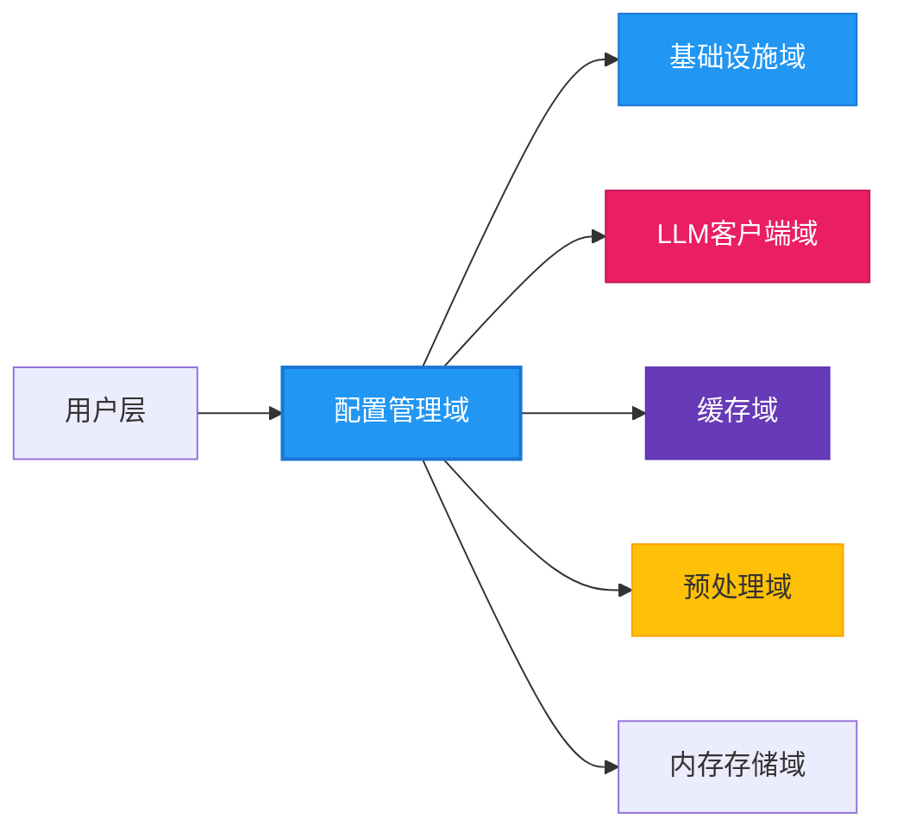
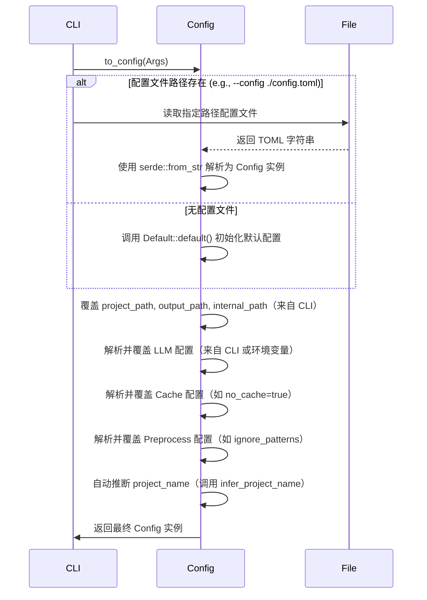

# 配置管理域技术文档

---

## **1. 概述**

**配置管理域**是 `deepwiki-rs` 系统的**唯一启动入口与全局配置中枢**，负责系统所有运行时参数的加载、解析、合并与标准化。作为基础设施域的核心组件，它为整个系统提供**统一、可追溯、可降级**的配置模型，是实现“**零配置可运行**”与“**多环境自适应**”架构目标的基石。

该模块不包含任何业务逻辑，但却是所有后续模块（LLM客户端、预处理、缓存、输出等）依赖的**配置契约**。其设计遵循“**配置即代码、优先级明确、扩展性优先**”原则，通过结构化数据模型与声明式配置机制，实现从用户输入到系统行为的精准映射。

> ✅ **核心价值**：  
> - 作为系统启动的**唯一入口点**，确保初始化行为一致  
> - 支持**四层配置优先级**（CLI > 配置文件 > 环境变量 > 默认值），实现灵活部署  
> - 自动推断项目名称，降低用户配置负担  
> - 所有配置项序列化为标准结构体，实现跨域共享与类型安全  

---

## **2. 架构设计**

### **2.1 模块定位与层级关系**



- **输入源**：环境变量、TOML配置文件、CLI命令行参数
- **输出物**：标准化的 `Config` 实例，供全系统消费
- **依赖关系**：
  - **被依赖**：LLM客户端、缓存域、预处理域、输出域均依赖其提供的配置项
  - **无依赖**：自身不依赖任何其他业务模块，完全自包含，符合“启动前置”原则

### **2.2 核心设计原则**

| 原则 | 说明 | 实现方式 |
|------|------|----------|
| **单一职责** | 仅负责配置加载与合并，不参与业务逻辑 | 无业务方法，仅提供 `Config` 结构体与 `from_file()`、`to_config()` 等纯数据转换函数 |
| **优先级明确** | 配置覆盖顺序严格定义 | CLI > 配置文件 > 环境变量 > 默认值，通过 `merge()` 方法逐层覆盖 |
| **降级可用** | 无配置文件时仍可运行 | 实现 `Default` trait，提供完整默认配置 |
| **类型安全** | 所有配置项强类型化 | 使用 Rust 结构体 + Serde 反序列化，编译期校验 |
| **可扩展性** | 支持新增配置项无需重构 | 所有结构体派生 `Deserialize`，新增字段自动兼容 |
| **可追溯性** | 配置来源可追踪 | 每个配置项记录其来源（file/env/cli/default） |

---

## **3. 核心数据模型**

### **3.1 主配置结构体：`Config`**

```rust
#[derive(Debug, Clone, Serialize, Deserialize, Default)]
pub struct Config {
    pub project_path: PathBuf,
    pub output_path: PathBuf,
    pub internal_path: PathBuf,
    pub project_name: Option<String>,
    pub llm: LLMConfig,
    pub cache: CacheConfig,
    pub preprocess: PreprocessConfig,
    pub output: OutputConfig,
}
```

> ✅ **设计说明**：
> - 所有字段均为 `Option<T>` 或默认值，确保**部分缺失不报错**
> - `project_path` 默认为当前工作目录，`output_path` 默认为 `./docs`
> - `project_name` 为**可推断字段**，若未显式配置，系统自动从项目根目录探测 `Cargo.toml`、`package.json` 等文件

### **3.2 子配置模块**

#### **3.2.1 LLM 配置：`LLMConfig`**

```rust
#[derive(Debug, Clone, Serialize, Deserialize)]
pub struct LLMConfig {
    pub provider: LLMProvider,
    pub api_key: Option<String>,
    pub base_url: Option<String>,
    pub model: Option<String>,
    pub temperature: Option<f64>,
    pub max_tokens: Option<u32>,
    pub timeout_seconds: u64,
}
```

- `provider`：枚举类型，支持 `Moonshot`, `Mistral`, `OpenRouter`, `Gemini`, `Anthropic` 等
- `api_key` / `base_url`：支持从环境变量 `LLM_API_KEY`、`LLM_BASE_URL` 自动注入
- `timeout_seconds`：默认 30s，防止 LLM 响应超时阻塞主线程

#### **3.2.2 缓存配置：`CacheConfig`**

```rust
#[derive(Debug, Clone, Serialize, Deserialize)]
pub struct CacheConfig {
    pub enabled: bool,
    pub cache_dir: PathBuf,
    pub ttl_minutes: u64,
    pub enable_monitoring: bool,
    pub max_cache_size_mb: u64,
}
```

- `enabled`：默认 `true`，可通过 `--no-cache` CLI 参数禁用
- `cache_dir`：默认为 `./.deepwiki/cache`，支持相对/绝对路径
- `ttl_minutes`：缓存过期时间，默认 1440 分钟（24小时）
- `enable_monitoring`：是否启用性能监控器，用于生成总结报告

#### **3.2.3 预处理配置：`PreprocessConfig`**

```rust
#[derive(Debug, Clone, Serialize, Deserialize)]
pub struct PreprocessConfig {
    pub ignore_patterns: Vec<String>,
    pub max_concurrent_files: usize,
    pub supported_languages: Vec<Language>,
    pub extract_code_lines: bool,
}
```

- `ignore_patterns`：默认 `[".git/", "target/", "node_modules/", "*.log"]`
- `max_concurrent_files`：默认 16，受工具支撑域的并发控制器约束
- `supported_languages`：默认支持 `Rust`, `Python`, `JavaScript`, `TypeScript`, `Java`, `Kotlin`, `Vue`, `React`, `Svelte`

#### **3.2.4 输出配置：`OutputConfig`**

```rust
#[derive(Debug, Clone, Serialize, Deserialize)]
pub struct OutputConfig {
    pub format: OutputFormat,
    pub include_summary: bool,
    pub compress_output: bool,
}
```

- `format`：当前仅支持 `Markdown`，预留 `PDF`、`HTML` 扩展接口
- `include_summary`：是否生成性能总结报告，默认 `true`

---

## **4. 配置加载与合并流程**

### **4.1 配置优先级模型（四层覆盖）**


| 层级 | 来源 | 覆盖规则 | 示例 |
|------|------|----------|------|
| 1. 默认 | `Default::default()` | 最低优先级，仅作兜底 | `project_path = "."` |
| 2. 配置文件 | `config.toml` | 覆盖默认值 | `project_name = "my-project"` |
| 3. 环境变量 | `LLM_API_KEY`, `CACHE_TTL` | 覆盖文件与默认值 | `export LLM_PROVIDER=Mistral` |
| 4. CLI参数 | `--project-name`, `--no-cache` | **最高优先级** | `deepwiki --llm-provider Moonshot --no-cache` |

> 💡 **实现机制**：  
> 所有配置项通过 `merge()` 方法按优先级顺序合并，采用**不可变更新**（immutable update）策略，避免状态污染。

### **4.2 加载流程（序列图）**



### **4.3 项目名称自动推断机制**

为降低用户配置负担，系统在 `infer_project_name()` 中按优先级探测以下文件：

| 项目类型 | 探测文件 | 获取字段 | 示例 |
|----------|----------|----------|------|
| Rust | `Cargo.toml` | `package.name` | `[package] name = "my-rust-app"` |
| Node.js | `package.json` | `name` | `{"name": "my-node-app"}` |
| Python | `pyproject.toml` | `project.name` | `[project] name = "my-python-app"` |
| Java | `pom.xml` | `<artifactId>` | `<artifactId>my-java-app</artifactId>` |

> ✅ **实现细节**：
> - 使用 `std::fs::read_to_string` 读取文件
> - 使用 `toml`、`serde_json`、`quick-xml` 等解析器
> - 若多个文件存在，按上述顺序取第一个有效值
> - 若均失败，使用项目根目录名作为 `project_name`

---

## **5. 关键实现细节**

### **5.1 配置枚举：`LLMProvider`**

```rust
#[derive(Debug, Clone, PartialEq, Eq, Serialize, Deserialize)]
pub enum LLMProvider {
    Moonshot,
    Mistral,
    OpenRouter,
    Gemini,
    Anthropic,
}

impl FromStr for LLMProvider {
    type Err = String;
    fn from_str(s: &str) -> Result<Self, Self::Err> {
        match s.to_lowercase().as_str() {
            "moonshot" => Ok(LLMProvider::Moonshot),
            "mistral" => Ok(LLMProvider::Mistral),
            "openrouter" => Ok(LLMProvider::OpenRouter),
            "gemini" => Ok(LLMProvider::Gemini),
            "anthropic" => Ok(LLMProvider::Anthropic),
            _ => Err(format!("Unsupported LLM provider: {}", s)),
        }
    }
}

impl Display for LLMProvider {
    fn fmt(&self, f: &mut std::fmt::Formatter<'_>) -> std::fmt::Result {
        write!(f, "{}", match self {
            LLMProvider::Moonshot => "moonshot",
            LLMProvider::Mistral => "mistral",
            LLMProvider::OpenRouter => "openrouter",
            LLMProvider::Gemini => "gemini",
            LLMProvider::Anthropic => "anthropic",
        })
    }
}
```

> ✅ **设计亮点**：
> - 支持 **CLI 参数字符串**（如 `--llm-provider mistral`）与 **TOML 枚举值**（`provider = "mistral"`）双向转换
> - `FromStr` 实现确保配置文件或 CLI 输入错误时**提前报错**，而非运行时崩溃
> - `Display` 实现用于日志输出与性能报告

### **5.2 环境变量自动注入**

系统在 `Config::from_env()` 中自动读取以下环境变量并覆盖对应字段：

| 环境变量 | 对应字段 | 说明 |
|----------|----------|------|
| `LLM_API_KEY` | `llm.api_key` | 用于认证 LLM 服务 |
| `LLM_BASE_URL` | `llm.base_url` | 自定义 API 网关地址 |
| `LLM_PROVIDER` | `llm.provider` | 字符串转枚举 |
| `LLM_MODEL` | `llm.model` | 指定模型名称 |
| `CACHE_TTL` | `cache.ttl_minutes` | 缓存过期时间（分钟） |
| `NO_CACHE` | `cache.enabled` | 若存在则设为 `false` |

> ✅ **实现方式**：
> ```rust
> if let Ok(val) = env::var("LLM_PROVIDER") {
>     if let Ok(provider) = val.parse::<LLMProvider>() {
>         config.llm.provider = provider;
>     }
> }
> ```

### **5.3 默认配置完整性**

`Default` trait 实现提供**完整、安全、可运行**的默认值，确保即使无任何配置文件，系统仍可启动：

```rust
impl Default for Config {
    fn default() -> Self {
        Self {
            project_path: PathBuf::from("."),
            output_path: PathBuf::from("./docs"),
            internal_path: PathBuf::from("./.deepwiki"),
            project_name: None,
            llm: LLMConfig {
                provider: LLMProvider::Mistral, // 默认提供商
                api_key: None,
                base_url: None,
                model: None,
                temperature: Some(0.3),
                max_tokens: Some(2048),
                timeout_seconds: 30,
            },
            cache: CacheConfig {
                enabled: true,
                cache_dir: PathBuf::from("./.deepwiki/cache"),
                ttl_minutes: 1440,
                enable_monitoring: true,
                max_cache_size_mb: 100,
            },
            preprocess: PreprocessConfig {
                ignore_patterns: vec![
                    ".git/".to_string(),
                    "target/".to_string(),
                    "node_modules/".to_string(),
                    "*.log".to_string(),
                ],
                max_concurrent_files: 16,
                supported_languages: vec![
                    Language::Rust,
                    Language::Python,
                    Language::JavaScript,
                    Language::TypeScript,
                    Language::Java,
                    Language::Kotlin,
                    Language::Vue,
                    Language::React,
                    Language::Svelte,
                ],
                extract_code_lines: true,
            },
            output: OutputConfig {
                format: OutputFormat::Markdown,
                include_summary: true,
                compress_output: false,
            },
        }
    }
}
```

> ✅ **意义**：  
> 用户执行 `deepwiki .` 即可启动分析，无需任何配置文件，极大提升易用性。

---

## **6. 与其他模块的交互**

| 模块 | 依赖配置项 | 用途 | 交互方式 |
|------|------------|------|----------|
| **LLM客户端域** | `llm.provider`, `llm.api_key`, `llm.model` | 初始化提供商客户端、设置认证 | 通过 `Config::llm` 字段注入 |
| **缓存域** | `cache.enabled`, `cache.cache_dir`, `cache.ttl_minutes` | 控制缓存开关、路径、过期策略 | 通过 `Config::cache` 传入 `CacheManager::new()` |
| **预处理域** | `preprocess.ignore_patterns`, `preprocess.max_concurrent_files`, `preprocess.supported_languages` | 控制文件扫描范围、并发数、语言支持 | 传递给 `StructureExtractor` 和 `LanguageProcessorManager` |
| **输出域** | `output.format`, `output.include_summary` | 决定输出格式与是否生成总结报告 | 传递给 `DiskOutlet` 和 `SummaryGenerator` |
| **内存存储域** | 无直接依赖 | 但所有上下文键名（如 `STUDIES_RESEARCH`）由配置驱动的模块定义 | 通过 `Config` 间接影响上下文结构 |

> ⚠️ **注意**：配置管理域**不主动调用**其他模块，仅作为**配置提供者**，符合“依赖倒置”原则。

---

## **7. 可扩展性与演进设计**

### **7.1 新增配置项的规范**

当需新增配置项时，遵循以下步骤：

1. 在 `Config` 或子结构体中添加字段（类型为 `Option<T>`）
2. 实现 `Serialize` / `Deserialize`（自动继承）
3. 在 `Default` 中设置合理默认值
4. 在 CLI 解析器中添加对应参数（如 `--new-flag`）
5. 在环境变量中添加对应变量（如 `NEW_FLAG`）
6. 在文档中更新配置说明

> ✅ **优势**：新增字段**无需修改已有逻辑**，旧版本配置文件仍可加载（Serde 自动忽略未知字段）。

### **7.2 未来演进方向**

| 方向 | 说明 |
|------|------|
| **配置验证器** | 引入 `Validate` trait，对 `api_key` 是否为空、`cache_dir` 是否可写等进行运行时校验 |
| **配置热重载** | 监听配置文件变更，动态更新运行时配置（适用于长期运行服务） |
| **配置模板生成** | 提供 `deepwiki --generate-config` 命令，自动生成完整 `config.toml` 模板 |
| **配置分层** | 支持 `global.toml`、`project.toml`、`env.toml` 多级配置合并 |
| **配置文档化** | 自动生成配置字段的 Markdown 文档（基于 `serde` 注解） |

---

## **8. 实用性与最佳实践**

### **8.1 推荐配置文件示例（`config.toml`）**

```toml
project_path = "./my-rust-project"
output_path = "./docs/generated"
internal_path = "./.deepwiki"

[llm]
provider = "moonshot"
api_key = "sk-xxx"
model = "moonshot-v1-128k"
temperature = 0.2
timeout_seconds = 60

[cache]
enabled = true
cache_dir = "./.deepwiki/cache"
ttl_minutes = 1440
enable_monitoring = true
max_cache_size_mb = 200

[preprocess]
ignore_patterns = [".git/", "target/", "node_modules/", "*.log", "test/"]
max_concurrent_files = 20
supported_languages = ["Rust", "Python", "JavaScript"]

[output]
format = "Markdown"
include_summary = true
compress_output = false
```

### **8.2 CLI 使用示例**

```bash
# 使用默认配置
deepwiki .

# 指定项目路径与输出目录
deepwiki --project-path ./my-app --output-path ./docs

# 禁用缓存，使用特定 LLM
deepwiki --no-cache --llm-provider mistral --model mistral-small

# 设置环境变量（推荐用于 CI/CD）
export LLM_API_KEY=xxx
export LLM_PROVIDER=Moonshot
deepwiki .
```

### **8.3 故障排查指南**

| 问题 | 原因 | 解决方案 |
|------|------|----------|
| `Error: Unsupported LLM provider: "openai"` | CLI 输入错误 | 使用 `--llm-provider openrouter`（当前不支持 OpenAI） |
| `Cache directory not writable` | 权限不足 | 检查 `cache_dir` 路径是否存在且可写，或使用 `--cache-dir /tmp/deepwiki` |
| `Project name not inferred` | 项目根目录无 `Cargo.toml` 等文件 | 手动指定 `--project-name my-project` |
| `LLM API key is empty` | 未设置环境变量或配置文件 | 检查 `LLM_API_KEY` 是否导出，或在 `config.toml` 中填写 |

---

## **9. 总结**

**配置管理域**虽为系统中最“平凡”的模块，却是 `deepwiki-rs` 实现**高可用、高可维护、高可扩展**架构的**关键支柱**。其设计体现了 Rust 生态中“**零成本抽象**”与“**声明式配置**”的精髓：

- ✅ **类型安全**：所有配置项编译期校验  
- ✅ **灵活覆盖**：四层优先级，适应从开发到生产的所有场景  
- ✅ **自动推断**：减少用户认知负担，提升体验  
- ✅ **无依赖**：独立、可测试、可复用  
- ✅ **可演进**：新增配置项零侵入  

> 📌 **建议**：  
> 在团队协作中，应将 `config.toml` 作为项目架构文档的一部分纳入版本控制，确保团队成员使用一致的分析策略。  
> 同时，建议在 CI/CD 流程中通过 `deepwiki --no-cache --llm-provider mistral` 确保分析结果可重现。

---

**下一模块建议阅读**：[内存存储域 —— 系统的唯一数据总线](#)  
**相关文件**：  
- `src/config.rs` —— 核心配置结构体与加载逻辑  
- `src/cli.rs` —— CLI 参数解析与 `to_config()` 实现  
- `src/types/config.rs` —— 配置模型定义（如 `LLMProvider`）  
- `config.example.toml` —— 配置模板参考（项目根目录）