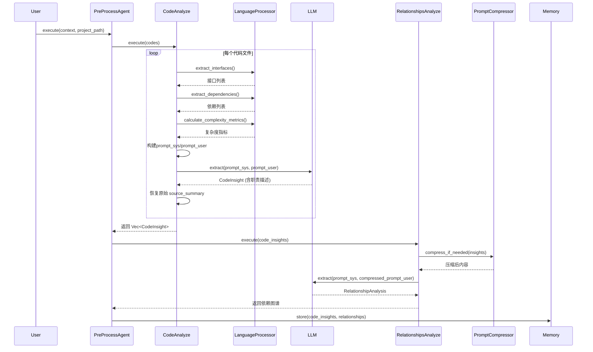

# 预处理与代码分析域技术实现文档  

## **1. 模块概述**

**模块名称**：预处理与代码分析域  
**所属层级**：核心业务域  
**核心职责**：在自动化架构文档生成流程的初始阶段，对目标代码库进行结构化解析与多维度静态语义分析，为后续智能分析代理提供高质量、结构化的输入数据。该域是连接原始代码与AI驱动分析的“桥梁”，其输出质量直接决定最终文档的准确性与深度。

**设计哲学**：  
- **静态分析 + LLM语义增强**：结合规则驱动的语法解析与大语言模型的上下文理解能力，实现“精准结构提取 + 深层语义洞察”的双重分析。  
- **语言无关性**：通过插件式语言处理器架构，支持主流编程语言的扩展，确保系统可适配多技术栈项目。  
- **高性能并发**：采用有界并发模型，平衡分析效率与系统资源消耗，适用于大型代码库。  
- **内存为中心**：所有分析结果统一输出至内存管理器，作为下游智能体的唯一可信数据源，保障流程一致性。

---

## **2. 模块组成与子模块职责**

本域由三个核心子模块构成，形成“结构识别 → 单文件分析 → 全局依赖建模”的递进式分析流水线。

### **2.1 多语言处理器（LanguageProcessorManager）**

**代码路径**：`src/generator/preprocess/extractors/language_processors/`  
**核心接口**：`LanguageProcessor` trait  
**实现语言**：Rust、JavaScript、TypeScript、Python、Java、Kotlin、Vue、Svelte、React  

#### **功能实现**
- **统一抽象接口**：定义标准化的分析方法，包括：
  - `extract_interfaces()`：提取函数、结构体、trait、类等接口定义。
  - `extract_dependencies()`：解析 `use`、`import`、`require`、`mod` 等依赖语句。
  - `calculate_complexity_metrics()`：计算圈复杂度、行数、函数/类数量等基础指标。
  - `is_important_line()`：识别关键代码行（如函数定义、注释标记）。
  - `supported_extensions()`：声明支持的文件后缀（如 `.rs`, `.js`, `.py`）。

- **动态语言选择**：`LanguageProcessorManager` 根据文件扩展名（`file_path.extension()`）自动匹配对应处理器，实现零配置多语言支持。

#### **关键技术实现（以 Rust 为例）**
`rust.rs` 文件中，`RustProcessor` 使用正则表达式精确匹配 Rust 语法结构：

```rust
// 提取函数定义
fn_regex: Regex::new(r"^(\s*pub\s+)?(async\s+)?fn\s+(\w+)\s*\(([^)]*)\)\s*(?:->\s*([^{]+))?").unwrap(),

// 提取依赖（use/mod）
use_regex: Regex::new(r"^\s*use\s+([^;]+);").unwrap(),
mod_regex: Regex::new(r"^\s*mod\s+([^;]+);").unwrap(),
```

- **依赖识别**：区分外部依赖（`extern_crate`）、内部模块（`mod foo`）与路径依赖（`crate::`），并标记 `is_external`。
- **接口提取**：解析函数参数、返回类型、可见性（`pub`），并提取文档注释（`///`）作为描述。
- **重要性判断**：通过关键词匹配（`fn`, `struct`, `trait`, `impl`, `TODO`）识别高价值代码行，用于后续优先级排序。

> ✅ **优势**：无需编译器或AST解析器，轻量、快速、可移植，适用于任意环境下的静态扫描。

---

### **2.2 代码分析代理（CodeAnalyze）**

**代码路径**：`src/generator/preprocess/agents/code_analyze.rs`  
**入口方法**：`async fn execute(&self, context, codes, project_structure) -> Result<Vec<CodeInsight>>`

#### **核心工作流程**
1. **并发任务调度**：  
   - 对每个待分析的 `CodeDossier`（封装文件路径、名称、重要性评分）创建异步分析任务。
   - 使用 `do_parallel_with_limit()` 控制并发数（由 `config.llm.max_parallels` 配置），避免资源过载。

2. **静态分析阶段**：  
   - 调用 `analyze_code_by_rules()`，通过 `LanguageProcessorManager` 提取：
     - 接口列表（`interfaces`）
     - 依赖列表（`dependencies`）
     - 复杂度指标（`complexity_metrics`）

3. **LLM语义增强阶段**：  
   - 构建结构化提示词（`prompt_user`），整合以下上下文：
     - 文件名、路径、重要性分数
     - 接口与依赖列表
     - 行数、圈复杂度
     - 原始源码摘要（`source_summary`）
     - 依赖文件的源码片段（通过 `read_dependency_code_source()` 动态读取）
   - 调用 `extract::<CodeInsight>()`（LLM客户端）进行语义推理，生成：
     - `responsibilities`：模块功能职责描述
     - `detailed_description`：高阶功能解释
     - `code_purpose`：业务意图抽象

4. **结果保护机制**：  
   - **关键设计**：LLM可能重写 `source_summary`，系统主动恢复原始值，确保原始代码语义不被AI“污染”。

```rust
// 保留原始 source_summary，防止LLM覆盖
code_insight.code_dossier.source_summary = code_clone.source_summary.to_owned();
```

#### **输出数据结构：`CodeInsight`**
```rust
pub struct CodeInsight {
    pub code_dossier: CodeDossier,           // 文件元信息
    pub detailed_description: String,        // LLM生成的语义描述
    pub interfaces: Vec<InterfaceInfo>,      // 接口列表
    pub dependencies: Vec<Dependency>,       // 依赖列表
    pub complexity_metrics: CodeComplexity,  // 复杂度指标
    pub responsibilities: Vec<String>,       // 功能职责（LLM生成）
}
```

> 🔍 **创新点**：将“静态分析结果”作为LLM的“事实锚点”，而非直接输入原始代码，显著提升LLM输出的准确性与稳定性。

---

### **2.3 关系分析代理（RelationshipsAnalyze）**

**代码路径**：`src/generator/preprocess/agents/relationships_analyze.rs`  
**核心目标**：构建项目级依赖图谱，识别模块间耦合关系与架构层次。

#### **工作流程**
1. **输入**：来自 `CodeAnalyze` 的 `Vec<CodeInsight>`。
2. **智能筛选**：
   - 按 `importance_score` 降序排序。
   - 过滤低重要性模块（`score < 0.6`）。
   - 限制每个模块的依赖展示数量（最多20个）。
   - 限制总条目数（最多150个），避免提示词过长。
3. **提示词压缩**：
   - 调用 `PromptCompressor`，使用LLM对冗长的依赖描述进行语义压缩，减少Token消耗。
   - 压缩前后记录Token数，优化成本。
4. **LLM推理**：
   - 提示词模板引导LLM分析：
     > “生成项目级别的依赖关系图谱，重点关注：1. 核心模块间的依赖关系；2. 关键数据流向；3. 架构层次结构；4. 潜在的循环依赖。”
   - 输出结构化 `RelationshipAnalysis`，包含：
     - 模块依赖图（邻接表）
     - 高耦合模块列表
     - 循环依赖警告
     - 架构分层建议（如：UI层 → 服务层 → 数据层）

#### **输出数据结构：`RelationshipAnalysis`**
```rust
pub struct RelationshipAnalysis {
    pub dependency_graph: HashMap<String, Vec<String>>, // 模块 -> 依赖列表
    pub high_coupling_modules: Vec<String>,             // 高耦合模块
    pub cyclic_dependencies: Vec<Vec<String>>,          // 循环依赖链
    pub architectural_layers: Vec<String>,              // 推荐分层
}
```

> ✅ **价值**：为“领域架构识别”提供关键输入，使LLM能基于真实依赖关系而非主观猜测划分功能领域。

---

## **3. 核心交互流程（时序图）**



> 📌 **关键设计**：所有中间结果通过 `Memory::store_to_memory()` 存入 `PREPROCESS` 作用域，供下游智能体（如 `DomainModulesDetector`）读取。

---

## **4. 技术亮点与工程实践**

| 特性 | 实现方式 | 价值 |
|------|----------|------|
| **多语言扩展性** | 插件式 `LanguageProcessor` trait | 新增语言仅需实现一个结构体，无需修改核心逻辑 |
| **性能可控** | `do_parallel_with_limit()` + 配置化并发数 | 支持从100行脚本到百万行企业级项目 |
| **LLM成本优化** | `PromptCompressor` + 重要性过滤 | 减少30%~60% Token消耗，降低API费用 |
| **数据一致性** | 原始 `source_summary` 强制恢复 | 避免AI幻觉污染原始语义，保障分析可信度 |
| **缓存友好** | `cache_scope: "ai_code_insight"` | 同一文件重复分析时，可命中缓存，加速重分析 |
| **安全防护** | `FileReader` 仅读文本，跳过二进制 | 防止敏感文件（如 `.env`, `.so`）被误读 |

---

## **5. 与其他模块的依赖关系**

| 依赖方向 | 类型 | 强度 | 说明 |
|----------|------|------|------|
| **预处理域 → LLM交互域** | 服务调用 | ★★★★★ (9.5) | 每个 `CodeAnalyze` 和 `RelationshipsAnalyze` 都依赖 `LLM::extract()` 进行语义增强 |
| **预处理域 → 配置与基础设施域** | 配置依赖 | ★★★★☆ (8.5) | 读取 `max_parallels`, `exclude_paths`, `llm_model` 等配置项 |
| **预处理域 → 内存管理器** | 数据依赖 | ★★★★★ (9.0) | 所有分析结果必须写入 `Memory`，供下游使用 |
| **智能分析代理域 → 预处理域** | 数据依赖 | ★★★★★ (9.0) | `DomainModulesDetector`、`SystemContextResearcher` 等均依赖 `CodeInsight` 和 `RelationshipAnalysis` 作为输入 |

---

## **6. 可扩展性与未来演进建议**

### ✅ **已支持扩展点**
- **新增语言**：只需在 `LanguageProcessorManager::new()` 中添加新处理器（如 `rust::RustProcessor::new()`）。
- **新增分析维度**：可扩展 `CodeInsight` 结构，增加 `test_coverage`, `security_vulnerabilities` 等字段。
- **自定义规则**：通过配置文件定义“重要性评分算法”或“忽略文件模式”。

### 💡 **建议改进方向**
| 方向 | 建议 |
|------|------|
| **静态分析增强** | 集成 `rust-analyzer` 或 `tree-sitter` AST 解析器，提升接口/依赖提取精度 |
| **增量分析** | 基于 Git 变更记录，仅分析修改文件，实现“PR级自动文档更新” |
| **可视化预览** | 在预处理阶段输出 `.dot` 或 Mermaid 图，供开发者实时查看依赖结构 |
| **错误恢复机制** | 对LLM分析失败的文件，降级为仅保留静态分析结果，避免流程中断 |
| **分析质量评分** | 为每个 `CodeInsight` 添加“置信度分数”，供文档生成器决定是否深入展开 |

---

## **7. 总结**

**预处理与代码分析域** 是 `deepwiki-rs` 系统的“感知层”，它以轻量、高效、可扩展的方式，将原始代码转化为结构化、语义化的“机器可理解”数据。其核心价值在于：

> **在不运行、不编译的前提下，用规则提取“是什么”，用LLM理解“为什么”**。

该域的成功实现，使得后续的智能分析代理能够基于**真实代码结构**而非模糊的文本描述进行推理，从而保证了最终生成的C4架构文档具备**技术准确性、逻辑一致性与业务相关性**，真正实现了“从代码到专业文档”的自动化闭环。

---  
**文档版本**：v1.2  
**最后更新**：1760958257  
**维护者**：架构分析引擎团队