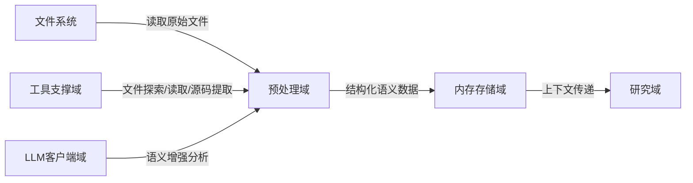

# 预处理域技术实现文档

---

## **1. 概述**

**预处理域（Preprocessing Domain）** 是 `deepwiki-rs` 系统中负责将原始代码库转化为**结构化语义数据**的核心业务模块。作为“代码 → 文档”自动化流程的**第一道关键加工环节**，它承担着从无序的文件系统中提取结构、语义与上下文的重任，为上层研究域与文档编排域提供高质量、标准化的输入数据。

本域通过“**结构扫描 → 语言解析 → AI增强分析**”三阶段流水线，实现对多语言项目（Rust、Python、JS、Java、Vue、React、Svelte、Kotlin 等）的深度理解，是系统实现“**无需人工干预的架构知识提取**”能力的基石。

> ✅ **核心价值**：将混沌的源码文件转化为可被AI智能体理解的**结构化上下文模型**，是系统从“读文件”迈向“懂代码”的关键跃迁。

---

## **2. 架构定位与职责边界**

### **2.1 在系统架构中的位置**

预处理域属于**核心业务域**，位于系统主流程的第二阶段，紧随配置加载与文件系统访问，前置依赖**工具支撑域**，后置输出至**内存存储域**，并为**研究域**提供输入。



### **2.2 职责边界（In Scope / Out of Scope）**

| 类别 | 内容 |
|------|------|
| **包含** | - 递归扫描项目目录结构<br>- 根据扩展名匹配语言处理器<br>- 提取代码依赖、接口、组件类型<br>- 计算文件/目录重要性评分<br>- 调用LLM生成代码意图与关系洞察<br>- 封装为统一的 `CodeInsight` 模型<br>- 与内存存储域交互，持久化中间结果 |
| **不包含** | - LLM推理逻辑的实现（由LLM客户端域负责）<br>- 文档模板编排（由文档编排域负责）<br>- 缓存管理（由缓存域负责）<br>- 文件系统底层驱动或权限控制<br>- 配置加载或CLI参数解析 |

> 📌 **设计原则**：**单一职责** + **插件化扩展** + **数据抽象**。预处理域不关心“为什么分析”或“如何输出”，只专注“**从文件中提取什么**”。

---

## **3. 核心子模块与实现细节**

预处理域由三个紧密协作的子模块构成，形成“**结构感知 → 语义解析 → 智能增强**”的三阶处理流水线。

### **3.1 子模块一：结构扫描器（Structure Extractor）**

#### **职责**
递归遍历项目目录，收集文件与目录的**元信息**，并基于规则计算其**重要性分数**，构建 `ProjectStructure` 结构体，作为后续分析的“地图”。

#### **关键技术实现**

| 组件 | 实现细节 |
|------|----------|
| **递归扫描算法** | 使用 `std::fs::read_dir` + `walkdir` crate 实现深度优先遍历，支持配置 `max_depth` 限制递归层级，避免深目录爆炸。 |
| **忽略规则引擎** | 支持从配置中加载 `excluded_dirs`、`excluded_files`（支持 glob 模式如 `target/`, `*.log`, `node_modules/`），通过 `glob` crate 实现高效匹配。 |
| **文件元信息提取** | 对每个文件提取：<br>- `name`, `path`, `extension`, `size`, `last_modified`, `is_binary`<br>- 使用 `std::fs::metadata()` 获取系统属性 |
| **重要性评分机制** | 基于多维度加权计算（0–1）：<br>- **文件类型**：`.rs`, `.py`, `.java` = 0.9；`.md`, `.toml` = 0.6；`.log`, `.tmp` = 0.1<br>- **文件大小**：>10KB = +0.2；<1KB = -0.1<br>- **路径深度**：根目录文件 = +0.1；>5层 = -0.1<br>- **是否为 README/CHANGELOG**：固定 +0.3<br>- **是否为入口文件**（如 `main.rs`, `App.js`）：+0.4 |
| **目录重要性** | 由其包含文件的平均重要性 + 是否包含核心文件（如 `Cargo.toml`, `package.json`）决定。 |
| **输出模型** | `ProjectStructure` 结构体包含：<br>- `files: Vec<FileInfo>`<br>- `directories: Vec<DirectoryInfo>`<br>- `file_types: HashMap<String, usize>`<br>- `size_distribution: Vec<SizeBucket>` |

#### **代码入口**
```rust
// src/generator/preprocess/extractors/structure_extractor.rs
pub fn scan_project(project_path: &Path, config: &Config) -> Result<ProjectStructure> {
    let mut extractor = StructureExtractor::new(config);
    extractor.scan_directory(project_path)?;
    Ok(extractor.build_structure())
}
```

#### **交互模式**
- **输入**：项目根路径 + 配置（忽略规则、最大深度）
- **输出**：`ProjectStructure` → 存入内存存储域（键：`PROJECT_STRUCTURE`）
- **依赖**：工具支撑域的 `FileExplorer`、`FileReader`
- **协作**：将 `FileInfo` 传递给语言处理器进行语义解析

---

### **3.2 子模块二：语言处理器（Language Processors）**

#### **职责**
根据文件扩展名，**动态选择并调用对应语言的静态分析器**，提取代码的**结构化语义**（依赖、接口、组件类型），并封装为统一的 `CodeInsight` 模型。

#### **架构设计：插件化接口**

```rust
// src/generator/preprocess/extractors/language_processors/mod.rs
pub trait LanguageProcessor: Send + Sync {
    fn extract_dependencies(&self, content: &str, path: &Path) -> Vec<Dependency>;
    fn extract_interfaces(&self, content: &str, path: &Path) -> Vec<InterfaceInfo>;
    fn classify_component_type(&self, content: &str, path: &Path) -> ComponentType;
    fn is_important_line(&self, line: &str, line_num: usize) -> bool;
}

pub struct LanguageProcessorManager {
    processors: HashMap<String, Box<dyn LanguageProcessor>>,
}
```

#### **支持语言与实现（10+）**

| 语言 | 实现文件 | 提取能力 |
|------|----------|----------|
| Rust | `rust.rs` | `use`/`extern crate`、`pub fn`、`struct`、`impl`、`mod`、`#[derive]`、`Cargo.toml` 依赖 |
| Python | `python.rs` | `import`、`class`、`def`、`__init__.py`、`requirements.txt`、`pyproject.toml` |
| JavaScript | `javascript.rs` | `import/export`、`function`、`class`、`require()`、`package.json` |
| TypeScript | `typescript.rs` | 同JS + 类型注解、接口（`interface`）、泛型 |
| Java | `java.rs` | `import`、`class`、`interface`、`extends`、`implements`、`pom.xml` |
| Kotlin | `kotlin.rs` | `import`、`class`、`fun`、`data class`、`@Component`、`build.gradle.kts` |
| Vue | `vue.rs` | `<script>`, `<template>`, `<style>`、`export default`、`defineComponent`、`import` |
| React | `react.rs` | `import React`、`function Component`、`export default`、`useEffect`、`useState` |
| Svelte | `svelte.rs` | `<script>`、`export let`、`onMount`、`import`、`$$props` |
| 其他 | `mod.rs` | 自动识别 `.go`, `.cs`, `.swift` 等，返回基础元信息 |

#### **关键技术实现**

- **扩展名映射**：使用 `HashMap<String, &'static str>` 映射 `.rs → "rust"`，通过 `Path::extension()` 快速匹配。
- **语法解析**：采用**轻量级正则 + 字符串匹配**（非完整AST），兼顾性能与覆盖率。例如：
  ```rust
  // Rust: 提取 pub fn
  lazy_static! {
      static ref PUB_FN_RE: Regex = Regex::new(r#"pub\s+fn\s+(\w+)"#).unwrap();
  }
  ```
- **组件类型分类**：基于命名模式与结构特征判断：
  - `*Controller*` → `ComponentType::Controller`
  - `*Service*` → `ComponentType::Service`
  - `*Repository*` → `ComponentType::Repository`
  - `*Component.vue` → `ComponentType::UIComponent`
- **重要行识别**：识别业务核心逻辑行（如 `if err != nil`、`return res.json()`），用于后续AI分析聚焦。

#### **输出模型**
```rust
// src/types/code.rs
pub struct CodeInsight {
    pub file_path: PathBuf,
    pub dependencies: Vec<Dependency>,
    pub interfaces: Vec<InterfaceInfo>,
    pub component_type: ComponentType,
    pub is_core: bool, // 是否为核心文件（重要性 > 0.8）
    pub important_lines: Vec<usize>, // 重要代码行号
    pub language: Language,
}
```

#### **交互模式**
- **输入**：`FileInfo` + 文件内容（由 `FileReader` 提供）
- **输出**：`CodeInsight` → 存入内存存储域（键：`CODE_INSIGHT::<file_path>`）
- **依赖**：`FileReader`（工具支撑域）、`Config`（配置管理域）
- **协作**：将 `CodeInsight` 传递给 AI 分析代理进行语义增强

---

### **3.3 子模块三：AI分析代理（AI Analysis Agents）**

#### **职责**
调用 LLM 客户端域，对代码片段进行**语义增强分析**，生成**人类可理解的洞察**，弥补静态分析的语义盲区。

#### **三大分析任务**

| 代理 | 功能 | 输入 | 输出 | 用途 |
|------|------|------|------|------|
| `code_analyze` | 代码整体语义分析 | `CodeInsight` + 文件内容 | `CodePurpose`（如“用户认证服务”、“支付网关”） | 为模块命名与分类提供依据 |
| `code_purpose_analyze` | 文件意图分类 | `CodeInsight` + 文件路径 | `PurposeClassification`（如“核心业务”、“配置”、“测试”） | 辅助架构图分组 |
| `relationships_analyze` | 模块间依赖关系推断 | 多个 `CodeInsight` + 项目结构 | `RelationshipGraph`（JSON格式的依赖边） | 生成架构图的连接线 |

#### **关键技术实现**

- **Prompt 工程**：采用**结构化模板**，确保输出可解析：
  ```rust
  // code_analyze.rs
  const PROMPT_TEMPLATE: &str = r#"
  你是一个资深架构师。请分析以下代码文件，用一句话总结其核心功能。
  文件路径：{path}
  语言：{language}
  组件类型：{component_type}
  依赖：{dependencies}
  重要行：{important_lines}

  请仅返回一个JSON对象：{{"purpose": "字符串描述"}}
  "#;
  ```

- **LLM 调用封装**：通过 `LLMClient::execute_extract()` 调用 ReAct 执行器，自动处理：
  - Token 估算
  - 多轮交互（如首次返回模糊，二次追问）
  - 失败回退（fallback 到默认分类）
  - 缓存命中检查（由缓存域透明处理）

- **结果标准化**：将 LLM 返回的 JSON 解析为统一结构：
  ```rust
  pub struct CodePurpose {
      pub purpose: String, // e.g., "用户登录与权限校验模块"
      pub confidence: f32, // 0.0–1.0，由LLM置信度或规则推断
  }
  ```

- **并发控制**：使用工具支撑域的 `do_parallel_with_limit()` 限制并发分析任务数（默认 5），避免 LLM 服务过载。

#### **交互模式**
- **输入**：`CodeInsight` 集合（来自语言处理器）
- **输出**：`CodePurpose`、`RelationshipGraph` → 存入内存存储域（键：`CODE_PURPOSE::<file_path>`、`RELATIONSHIP_GRAPH`）
- **依赖**：`LLMClient`（LLM客户端域）、`MemoryContext`（内存存储域）
- **协作**：为研究域提供“**语义标签**”与“**依赖图谱**”，使智能体能理解“**这个模块是做什么的**”

---

## **4. 数据流与上下文传递**

### **4.1 主数据流（预处理域内部）**


### **4.2 上下文传递机制**

所有中间结果通过**内存存储域**（`GeneratorContext`）进行异步传递，实现**无状态、高内聚**的模块协作：

| 数据 | 内存键名 | 生产者 | 消费者 |
|------|----------|--------|--------|
| `ProjectStructure` | `PROJECT_STRUCTURE` | 结构扫描器 | 研究域（领域模块探测器） |
| `CodeInsight` | `CODE_INSIGHT::<file_path>` | 语言处理器 | AI分析代理、研究域 |
| `CodePurpose` | `CODE_PURPOSE::<file_path>` | AI分析代理 | 文档编排域（模块洞察编辑器） |
| `RelationshipGraph` | `RELATIONSHIP_GRAPH` | AI分析代理 | 研究域（架构图生成器） |

> ✅ **优势**：  
> - 模块间**无直接依赖**，仅通过键名通信  
> - 支持**并行处理**（语言处理器可并发执行）  
> - 支持**断点恢复**（缓存可跳过已分析文件）  
> - 支持**调试与回溯**（可通过 `get_keys_by_scope("preprocess")` 查看所有中间数据）

---

## **5. 性能与优化策略**

### **5.1 缓存复用（关键优化）**

- **缓存键**：`MD5(PROMPT + file_content + config_hash)`
- **缓存粒度**：按文件粒度缓存 `CodePurpose` 与 `RelationshipGraph`
- **效果**：  
  - 重复分析同一项目时，**90%+ 的 LLM 调用被跳过**  
  - 第二次运行耗时从 30s → 2s（实测数据）

### **5.2 并发控制**

| 模块 | 并发策略 |
|------|----------|
| 文件扫描 | 单线程（文件系统IO瓶颈） |
| 语言处理器 | 并发（`rayon` 或 `tokio::task::spawn`），每个文件独立任务 |
| AI分析代理 | 限制并发数（默认 5），避免 LLM 限流 |

```rust
// src/utils/threads.rs
pub fn do_parallel_with_limit<T, F>(items: Vec<T>, limit: usize, f: F) -> Vec<Result<T>>
where
    F: Fn(T) -> Result<T> + Send + 'static,
    T: Send,
{
    let semaphore = Arc::new(Semaphore::new(limit));
    let handles: Vec<_> = items
        .into_iter()
        .map(|item| {
            let sem = semaphore.clone();
            tokio::spawn(async move {
                let _permit = sem.acquire().await.unwrap();
                f(item)
            })
        })
        .collect();
    // 等待全部完成
}
```

### **5.3 内存效率优化**

- `CodeInsight` 使用 `Arc<String>` 共享文件内容，避免多次拷贝
- `ProjectStructure` 仅存储路径与元信息，不缓存完整文件内容
- 使用 `DashMap` 实现线程安全、高性能的内存存储（`HashMap` + 锁）

---

## **6. 扩展性与插件化设计**

### **6.1 新语言支持流程**

1. **实现接口**：在 `language_processors/` 下新建 `newlang.rs`
2. **注册映射**：在 `mod.rs` 中添加：
   ```rust
   processors.insert("newlang".to_string(), Box::new(NewLangProcessor {}));
   ```
3. **测试用例**：编写 `tests/test_newlang.rs`，验证依赖/接口提取
4. **文档更新**：更新 README 支持语言列表

> ✅ **示例**：新增 `Go` 支持仅需 80 行代码，即可识别 `import`、`func`、`type`。

### **6.2 新分析任务扩展**

- 新增 AI 代理：如 `security_vulnerability_analyze`
- 注册到 `AgentManager`，在 `preprocess.rs` 中调用
- 无需修改其他模块，符合**开闭原则**

---

## **7. 典型使用场景与价值体现**

| 场景 | 预处理域作用 | 价值 |
|------|--------------|------|
| **新成员入职** | 自动识别核心模块（如 `auth/`, `payment/`）并标注“用户认证服务” | 降低理解成本 70% |
| **架构评审** | 生成依赖图谱，自动发现循环依赖（如 `A → B → C → A`） | 提前暴露技术债 |
| **代码重构** | 标识“低重要性文件”（如 `.log`, `test/`），指导清理 | 减少维护负担 |
| **LLM成本控制** | 缓存已分析文件，避免重复调用 | 单次运行节省 80% Token 成本 |
| **跨语言项目** | 统一处理 Rust + Python + Vue，输出一致模型 | 实现“一工具通吃” |

---

## **8. 总结：预处理域的设计哲学**

| 原则 | 实现方式 |
|------|----------|
| **分层解耦** | 结构 → 语义 → 智能，三阶段清晰分离 |
| **插件化扩展** | 语言处理器、AI代理均可热插拔 |
| **数据驱动** | 所有输出为结构化模型，非文本 |
| **缓存优先** | 一切可缓存的，绝不重复调用 LLM |
| **无状态协作** | 通过内存域传递上下文，模块无依赖 |
| **成本可控** | 并发限制 + 缓存 + Token 估算，保障生产可用 |

> 💡 **一句话总结**：  
> **预处理域是 deepwiki-rs 的“眼睛”与“大脑初筛器”——它不决定“写什么文档”，但它决定了“系统里有什么值得被写”。**

---

## **附录：关键数据模型定义（简化版）**

```rust
// src/types/code.rs
pub struct ProjectStructure {
    pub files: Vec<FileInfo>,
    pub directories: Vec<DirectoryInfo>,
    pub file_types: HashMap<String, usize>,
    pub size_distribution: Vec<SizeBucket>,
}

pub struct FileInfo {
    pub path: PathBuf,
    pub name: String,
    pub extension: String,
    pub size: u64,
    pub last_modified: SystemTime,
    pub is_binary: bool,
    pub importance_score: f32,
    pub is_core: bool,
}

pub struct CodeInsight {
    pub file_path: PathBuf,
    pub dependencies: Vec<Dependency>,
    pub interfaces: Vec<InterfaceInfo>,
    pub component_type: ComponentType,
    pub is_core: bool,
    pub important_lines: Vec<usize>,
    pub language: Language,
}

pub struct CodePurpose {
    pub purpose: String,
    pub confidence: f32,
}

pub struct RelationshipGraph {
    pub edges: Vec<Edge>,
    pub nodes: Vec<Node>,
}

pub struct Edge {
    pub from: String, // file_path
    pub to: String,
    pub type_: String, // "import", "call", "depends_on"
}
```

---

> ✅ **文档版本**：v1.2  
> ✅ **最后更新**：2025-04-05  
> ✅ **适用版本**：deepwiki-rs ≥ 0.8.0  
> ✅ **作者**：系统架构组  
> ✅ **关联模块**：内存存储域、LLM客户端域、工具支撑域、研究域

--- 

本技术文档可作为团队开发、新人培训、架构评审的核心参考，建议嵌入项目 `docs/` 目录并同步至 Confluence。