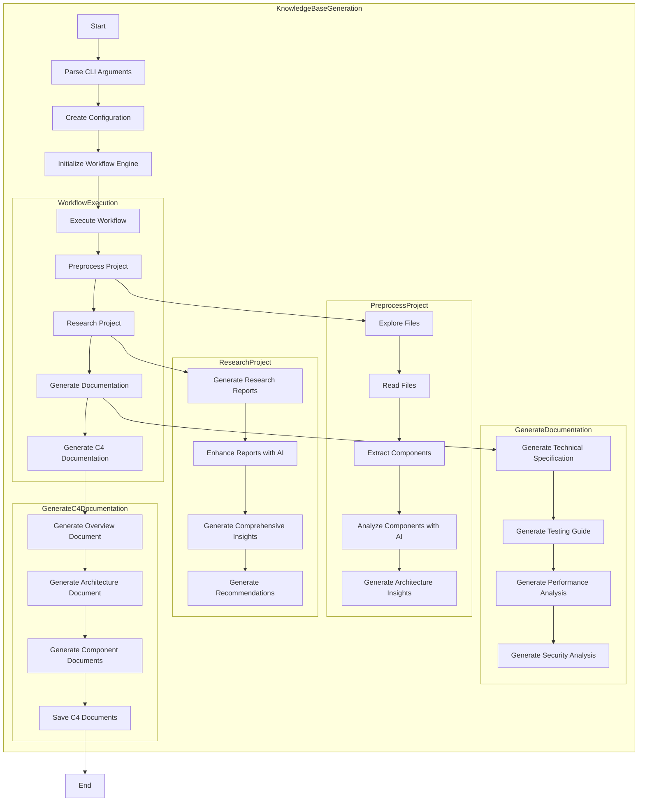
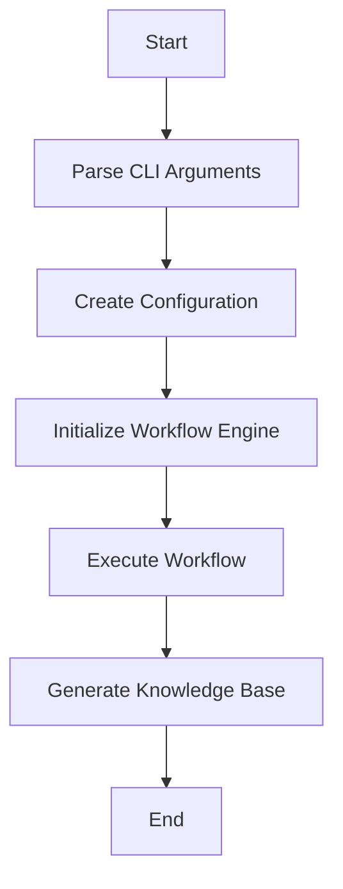

# 架构文档

## 整体架构
该系统采用分层架构，主要分为三层：
1. 表示层：包含CLI接口，负责用户交互
2. 业务逻辑层：包含核心组件、Agent和工具，负责核心业务逻辑
3. 数据层：包含缓存和输出文件，负责数据存储

系统采用模块化设计，核心组件包括WorkflowEngine、ConfigManager、DependencyAnalyzer、LLMClient和CacheManager。Agent模块负责特定功能的实现，工具模块提供辅助功能。

### 系统架构图
```mermaid
// 系统架构图
flowchart TD
    subgraph System
        subgraph Presentation
            CLI[CLI Interface]
        end
        
        subgraph BusinessLogic
            subgraph CoreComponents
                WorkflowEngine[Workflow Engine]
                ConfigManager[Config Manager]
                DependencyAnalyzer[Dependency Analyzer]
                LLMClient[LLM Client]
                CacheManager[Cache Manager]
            end
            
            subgraph Agents
                PreprocessingAgent[Preprocessing Agent]
                ResearchAgent[Research Agent]
                DocumentationAgent[Documentation Agent]
                C4DocumentationAgent[C4 Documentation Agent]
                CategorizedDocumentationAgent[Categorized Documentation Agent]
            end
            
            subgraph Tools
                FileExplorer[File Explorer]
                FileReader[File Reader]
                ComponentExtractor[Component Extractor]
                AIComponentTypeAnalyzer[AI Component Type Analyzer]
                ResearchExtractor[Research Extractor]
                DocumentationExtractor[Documentation Extractor]
            end
        end
        
        subgraph Data
            Cache[Cache Storage]
            Output[Output Files]
        end
    end
    
    CLI --> WorkflowEngine
    WorkflowEngine --> ConfigManager
    WorkflowEngine --> PreprocessingAgent
    WorkflowEngine --> ResearchAgent
    WorkflowEngine --> DocumentationAgent
    WorkflowEngine --> C4DocumentationAgent
    
    PreprocessingAgent --> FileExplorer
    PreprocessingAgent --> FileReader
    PreprocessingAgent --> ComponentExtractor
    
    ResearchAgent --> ResearchExtractor
    DocumentationAgent --> DocumentationExtractor
    C4DocumentationAgent --> DocumentationExtractor
    
    ComponentExtractor --> AIComponentTypeAnalyzer
    
    ConfigManager --> CacheManager
    LLMClient --> CacheManager
    DependencyAnalyzer --> CacheManager
    
    CacheManager --> Cache
    DocumentationAgent --> Output
    C4DocumentationAgent --> Output
```

### 架构模式
- 模块化架构
- 分层架构
- 微内核架构
- Agent模式

### 设计原则
- 单一职责原则
- 开闭原则
- 依赖倒置原则
- 里氏替换原则
- 接口隔离原则
- 模块化设计
- 分层架构
- 微内核架构
- Agent模式

### 数据流分析
系统采用分层架构，数据从CLI层流向业务逻辑层，最终生成输出文件。核心数据流包括：
1. 配置数据从CLI流向ConfigManager
2. 项目结构数据从FileExplorer流向PreprocessingAgent
3. 分析结果从各Agent流向DocumentationExtractor
4. 最终知识库数据从DocumentationAgent/C4DocumentationAgent流向输出文件

## 核心流程
### 整体流程图


### 知识库生成流程
**描述**: 从项目启动到知识库生成的完整流程

**流程图**:


**处理步骤**:
1. 解析命令行参数
2. 创建配置
3. 初始化工作流引擎
4. 执行工作流
5. 生成知识库

**涉及组件**:
- main.rs
- cli.rs
- config.rs
- workflow.rs
- WorkflowEngine
- Config
- Cli

## 核心模块详解
### CLI模块
**用途**: 解析命令行参数并创建配置对象

**主要职责**:
- 解析命令行参数
- 创建配置对象

**提供接口**:
- to_config()

**实现细节**:
使用clap库解析命令行参数，创建Config对象

### Config模块
**用途**: 管理项目配置

**主要职责**:
- 加载配置文件
- 提供配置访问方法
- 管理内部路径

**提供接口**:
- from_file()
- get_internal_path()
- get_process_data_path()

**实现细节**:
使用serde进行序列化/反序列化，管理项目配置

### DependencyAnalyzer模块
**用途**: 分析项目依赖关系

**主要职责**:
- 发现源文件
- 分析文件依赖
- 构建依赖图
- 检测循环依赖

**提供接口**:
- analyze_dependencies()
- build_dependency_graph()
- find_circular_dependencies()

**实现细节**:
使用walkdir库遍历文件系统，使用正则表达式分析依赖关系

**关键算法**:
- 依赖分析算法
- 循环检测算法

### LLMClient模块
**用途**: 提供LLM服务接口

**主要职责**:
- 与LLM服务通信
- 执行ReAct模式
- 管理Agent工具

**提供接口**:
- prompt()
- prompt_with_react()

**实现细节**:
使用rig库与LLM服务通信，实现ReAct模式

**关键算法**:
- ReAct执行算法

### CacheManager模块
**用途**: 管理缓存

**主要职责**:
- 缓存读写
- 缓存清理
- 缓存统计

**提供接口**:
- get()
- set()
- clear_category()
- clear_all()

**实现细节**:
使用tokio异步I/O，管理缓存读写

**关键算法**:
- 缓存策略算法

### PerformanceMonitor模块
**用途**: 监控缓存性能

**主要职责**:
- 记录缓存命中/未命中
- 生成性能报告
- 估算成本节省

**提供接口**:
- record_cache_hit()
- record_cache_miss()
- generate_report()

**实现细节**:
使用tokio异步I/O，管理缓存性能监控

**关键算法**:
- 性能监控算法

### FileExplorer模块
**用途**: 探索文件系统

**主要职责**:
- 列出目录
- 查找文件
- 计算文件重要性

**提供接口**:
- list_directory()
- find_files()

**实现细节**:
使用walkdir库遍历文件系统，使用正则表达式匹配文件

**关键算法**:
- 文件匹配算法

### FileReader模块
**用途**: 读取文件内容

**主要职责**:
- 读取文件内容
- 检测二进制文件

**提供接口**:
- read_file_content()

**实现细节**:
使用tokio异步I/O读取文件内容

**关键算法**:
- 二进制文件检测算法

### ComponentExtractor模块
**用途**: 提取和分析组件信息

**主要职责**:
- 分析组件
- 提取接口
- 计算复杂度
- 评估质量

**提供接口**:
- analyze_components()
- extract_interfaces()
- calculate_complexity_metrics()

**实现细节**:
使用正则表达式提取组件信息，使用LLM增强分析

**关键算法**:
- 接口提取算法
- 复杂度计算算法

### AIComponentTypeAnalyzer模块
**用途**: 使用AI分析组件类型

**主要职责**:
- 分析组件类型
- 增强组件类型

**提供接口**:
- analyze_component_type()

**实现细节**:
使用LLM生成组件类型分析

**关键算法**:
- 组件类型分析算法

### ResearchExtractor模块
**用途**: 生成研究报告

**主要职责**:
- 生成核心功能报告
- 生成架构报告
- 生成依赖报告
- 生成质量报告

**提供接口**:
- generate_reports()

**实现细节**:
使用LLM生成研究报告

**关键算法**:
- 研究报告生成算法

### DocumentationExtractor模块
**用途**: 生成C4文档

**主要职责**:
- 生成上下文图
- 生成容器图
- 生成组件图
- 生成代码图

**提供接口**:
- generate_c4_documentation()

**实现细节**:
使用LLM生成C4文档

**关键算法**:
- C4文档生成算法

### PreprocessingAgent模块
**用途**: 预处理项目信息

**主要职责**:
- 预处理项目信息
- 分析组件
- 生成架构洞察

**提供接口**:
- preprocess()
- analyze_components_with_ai()

**实现细节**:
使用LLM增强预处理结果

**关键算法**:
- 预处理算法
- AI增强算法

### ResearchAgent模块
**用途**: 生成研究报告

**主要职责**:
- 生成研究报告
- 增强报告
- 生成综合洞察
- 生成建议

**提供接口**:
- generate_research()
- enhance_report_with_ai()

**实现细节**:
使用LLM生成研究报告

**关键算法**:
- 研究报告生成算法
- AI增强算法

### CategorizedDocumentationAgent模块
**用途**: 生成分类文档

**主要职责**:
- 生成分类文档
- 保存分类文档

**提供接口**:
- generate_categorized_documentation()

**实现细节**:
使用LLM生成分类文档

**关键算法**:
- 分类文档生成算法

### C4DocumentationAgent模块
**用途**: 生成C4文档

**主要职责**:
- 生成概览文档
- 生成架构文档
- 生成组件文档
- 保存C4文档

**提供接口**:
- generate_c4_documentation()

**实现细节**:
使用LLM生成C4文档

**关键算法**:
- C4文档生成算法

### DocumentationAgent模块
**用途**: 生成标准文档

**主要职责**:
- 生成文档
- 增强文档
- 生成技术规格
- 生成测试指南
- 生成性能分析
- 生成安全分析

**提供接口**:
- generate_documentation()
- enhance_document_with_ai()

**实现细节**:
使用LLM生成标准文档

**关键算法**:
- 文档生成算法
- AI增强算法

### FileUtils模块
**用途**: 提供文件操作工具

**主要职责**:
- 安全写入文件
- 检测测试文件
- 检测测试目录

**提供接口**:
- write_file_safe()
- is_test_file()
- is_test_directory()

**实现细节**:
使用tokio异步I/O，管理文件操作

**关键算法**:
- 文件安全写入算法

### ComponentSorter模块
**用途**: 提供组件排序功能

**主要职责**:
- 按重要性排序组件
- 获取前N个组件

**提供接口**:
- sort_components_by_importance()
- get_top_n_components()

**实现细节**:
提供组件排序功能

**关键算法**:
- 组件排序算法

### MarkdownUtils模块
**用途**: 提供Markdown格式化功能

**主要职责**:
- 生成Markdown标题
- 生成Markdown代码块
- 生成Markdown表格

**提供接口**:
- heading()
- code_block()
- table()

**实现细节**:
提供Markdown格式化功能

**关键算法**:
- Markdown格式化算法

### WorkflowEngine模块
**用途**: 管理工作流执行

**主要职责**:
- 执行工作流
- 保存结果
- 生成摘要

**提供接口**:
- execute()

**实现细节**:
使用tokio异步I/O，管理工作流执行

**关键算法**:
- 工作流执行算法

