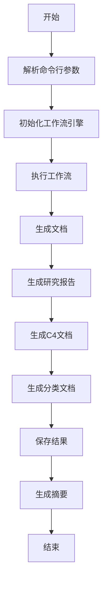
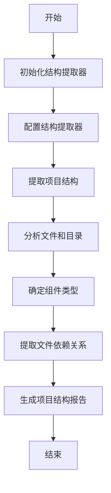
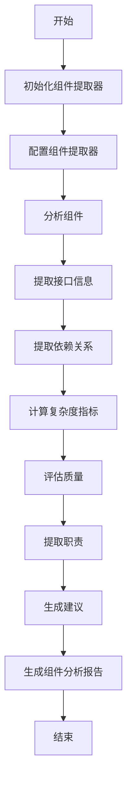
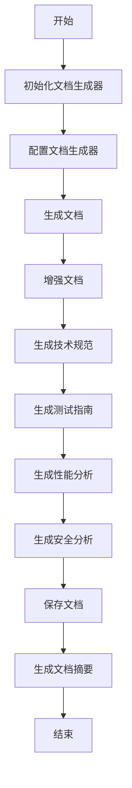
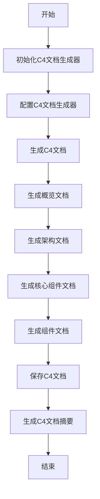
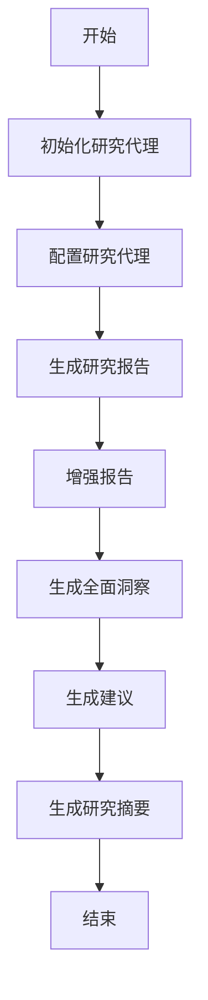
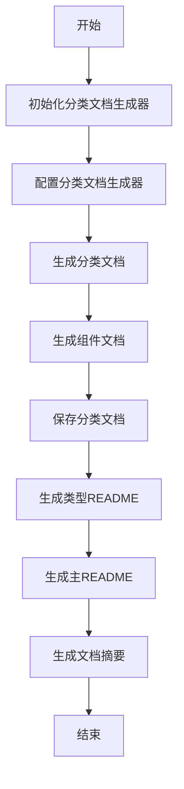
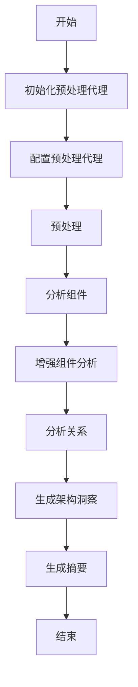

# 架构文档

## 整体架构
该项目采用模块化架构，分为多个核心模块，每个模块负责特定的功能。项目使用Rust语言，并采用TOML配置文件。主要模块包括依赖分析、LLM客户端、缓存管理、文件操作、文档生成、研究报告生成、组件分析等。项目采用分层架构，数据流主要围绕LLMClient、CacheManager和各种代理组件进行。

### 系统架构图
```mermaid
systemDiagram
    direction TB
    
    [CLI] --> [WorkflowEngine]
    [WorkflowEngine] --> [DocumentationAgent]
    [WorkflowEngine] --> [PreprocessingAgent]
    [WorkflowEngine] --> [ResearchAgent]
    [WorkflowEngine] --> [C4DocumentationAgent]
    [WorkflowEngine] --> [CategorizedDocumentationAgent]
    
    [DocumentationAgent] --> [LLMClient]
    [DocumentationAgent] --> [CacheManager]
    [DocumentationAgent] --> [FileUtils]
    
    [PreprocessingAgent] --> [LLMClient]
    [PreprocessingAgent] --> [CacheManager]
    [PreprocessingAgent] --> [FileExplorer]
    [PreprocessingAgent] --> [FileReader]
    
    [ResearchAgent] --> [LLMClient]
    [ResearchAgent] --> [CacheManager]
    
    [C4DocumentationAgent] --> [LLMClient]
    [C4DocumentationAgent] --> [CacheManager]
    [C4DocumentationAgent] --> [DocumentationExtractor]
    
    [CategorizedDocumentationAgent] --> [LLMClient]
    [CategorizedDocumentationAgent] --> [CacheManager]
    [CategorizedDocumentationAgent] --> [FileUtils]
    
    [LLMClient] --> [ReActExecutor]
    [LLMClient] --> [AgentBuilder]
    [LLMClient] --> [PerformanceMonitor]
    
    [CacheManager] --> [PerformanceMonitor]
    
    [StructureExtractor] --> [LanguageProcessorManager]
    [StructureExtractor] --> [ComponentTypeEnhancer]
    [StructureExtractor] --> [LLMClient]
    
    [ComponentExtractor] --> [CacheManager]
    [ComponentExtractor] --> [ComponentTypeEnhancer]
    
    [ResearchExtractor] --> [CacheManager]
    
    [DocumentationExtractor] --> [CacheManager]
    [DocumentationExtractor] --> [MarkdownUtils]
    
    [LanguageProcessorManager] --> [TypeScriptProcessor]
    [LanguageProcessorManager] --> [JavaProcessor]
    [LanguageProcessorManager] --> [ReactProcessor]
    [LanguageProcessorManager] --> [RustProcessor]
    [LanguageProcessorManager] --> [VueProcessor]
    [LanguageProcessorManager] --> [JavaScriptProcessor]
    [LanguageProcessorManager] --> [KotlinProcessor]
    [LanguageProcessorManager] --> [PythonProcessor]
    [LanguageProcessorManager] --> [SvelteProcessor]
    
    [FileExplorer] --> [Config]
    [FileReader] --> [Config]
    [MarkdownUtils] --> [Config]
    [StructureExtractor] --> [Config]
    [ComponentExtractor] --> [Config]
    [ResearchExtractor] --> [Config]
    [DocumentationExtractor] --> [Config]
    [LLMClient] --> [Config]
    [CacheManager] --> [Config]
    [PerformanceMonitor] --> [Config]
    
    [Config] --> [ConfigFile]
    
    [CLI] --> [Config]
    
    style [CLI] fill:#f9f,stroke:#333
    style [WorkflowEngine] fill:#bbf,stroke:#333
    style [DocumentationAgent] fill:#bfb,stroke:#333
    style [PreprocessingAgent] fill:#bfb,stroke:#333
    style [ResearchAgent] fill:#bfb,stroke:#333
    style [C4DocumentationAgent] fill:#bfb,stroke:#333
    style [CategorizedDocumentationAgent] fill:#bfb,stroke:#333
    style [LLMClient] fill:#fbf,stroke:#333
    style [ReActExecutor] fill:#fbf,stroke:#333
    style [AgentBuilder] fill:#fbf,stroke:#333
    style [PerformanceMonitor] fill:#fbf,stroke:#333
    style [CacheManager] fill:#f9f,stroke:#333
    style [FileExplorer] fill:#f9f,stroke:#333
    style [FileReader] fill:#f9f,stroke:#333
    style [FileUtils] fill:#f9f,stroke:#333
    style [StructureExtractor] fill:#f9f,stroke:#333
    style [ComponentExtractor] fill:#f9f,stroke:#333
    style [ResearchExtractor] fill:#f9f,stroke:#333
    style [DocumentationExtractor] fill:#f9f,stroke:#333
    style [LanguageProcessorManager] fill:#f9f,stroke:#333
    style [TypeScriptProcessor] fill:#f9f,stroke:#333
    style [JavaProcessor] fill:#f9f,stroke:#333
    style [ReactProcessor] fill:#f9f,stroke:#333
    style [RustProcessor] fill:#f9f,stroke:#333
    style [VueProcessor] fill:#f9f,stroke:#333
    style [JavaScriptProcessor] fill:#f9f,stroke:#333
    style [KotlinProcessor] fill:#f9f,stroke:#333
    style [PythonProcessor] fill:#f9f,stroke:#333
    style [SvelteProcessor] fill:#f9f,stroke:#333
    style [MarkdownUtils] fill:#f9f,stroke:#333
    style [Config] fill:#9f9,stroke:#333
    style [ConfigFile] fill:#9f9,stroke:#333
```

### 架构模式
- 模块化架构
- 分层架构
- 微内核架构

### 设计原则
- 单一职责原则
- 开闭原则
- 依赖倒置原则
- 接口隔离原则
- 里氏替换原则

### 数据流分析
数据流主要围绕LLMClient、CacheManager和各种代理组件进行。数据从文件系统通过FileExplorer和FileReader被读取，然后由各种代理组件处理和增强。LLMClient用于与外部LLM服务通信，而CacheManager用于缓存和检索数据。数据流通常是从文件系统到代理组件，然后到LLMClient，最后返回到代理组件进行进一步处理和存储。

## 核心流程
### 整体流程图


### 项目结构提取
**描述**: 项目结构提取流程

**流程图**:


**处理步骤**:
1. 初始化结构提取器
2. 配置结构提取器
3. 提取项目结构
4. 分析文件和目录
5. 确定组件类型
6. 提取文件依赖关系
7. 生成项目结构报告

**涉及组件**:
- StructureExtractor
- LanguageProcessorManager
- ComponentTypeEnhancer
- LLMClient
- Config

### 组件分析
**描述**: 组件分析流程

**流程图**:


**处理步骤**:
1. 初始化组件提取器
2. 配置组件提取器
3. 分析组件
4. 提取接口信息
5. 提取依赖关系
6. 计算复杂度指标
7. 评估质量
8. 提取职责
9. 生成建议
10. 生成组件分析报告

**涉及组件**:
- ComponentExtractor
- CacheManager
- ComponentTypeEnhancer

### 文档生成
**描述**: 文档生成流程

**流程图**:


**处理步骤**:
1. 初始化文档生成器
2. 配置文档生成器
3. 生成文档
4. 增强文档
5. 生成技术规范
6. 生成测试指南
7. 生成性能分析
8. 生成安全分析
9. 保存文档
10. 生成文档摘要

**涉及组件**:
- DocumentationAgent
- LLMClient
- CacheManager
- FileUtils

### C4文档生成
**描述**: C4文档生成流程

**流程图**:


**处理步骤**:
1. 初始化C4文档生成器
2. 配置C4文档生成器
3. 生成C4文档
4. 生成概览文档
5. 生成架构文档
6. 生成核心组件文档
7. 生成组件文档
8. 保存C4文档
9. 生成C4文档摘要

**涉及组件**:
- C4DocumentationAgent
- LLMClient
- CacheManager
- DocumentationExtractor
- FileUtils

### 研究报告生成
**描述**: 研究报告生成流程

**流程图**:


**处理步骤**:
1. 初始化研究代理
2. 配置研究代理
3. 生成研究报告
4. 增强报告
5. 生成全面洞察
6. 生成建议
7. 生成研究摘要

**涉及组件**:
- ResearchAgent
- LLMClient
- CacheManager

### 分类文档生成
**描述**: 分类文档生成流程

**流程图**:


**处理步骤**:
1. 初始化分类文档生成器
2. 配置分类文档生成器
3. 生成分类文档
4. 生成组件文档
5. 保存分类文档
6. 生成类型README
7. 生成主README
8. 生成文档摘要

**涉及组件**:
- CategorizedDocumentationAgent
- LLMClient
- CacheManager
- FileUtils

### 预处理
**描述**: 预处理流程

**流程图**:


**处理步骤**:
1. 初始化预处理代理
2. 配置预处理代理
3. 预处理
4. 分析组件
5. 增强组件分析
6. 分析关系
7. 生成架构洞察
8. 生成摘要

**涉及组件**:
- PreprocessingAgent
- LLMClient
- CacheManager
- FileExplorer
- FileReader

## 核心模块详解
### dependency_analyzer.rs
**用途**: 分析项目的依赖关系

**主要职责**:
- 分析项目的依赖关系
- 构建依赖图
- 检测循环依赖

**提供接口**:
- DependencyAnalyzerTool
- DependencyAnalyzerArgs
- Dependency

**实现细节**:
使用anyhow::Result进行错误处理，使用serde进行序列化和反序列化。使用HashMap和HashSet进行数据存储。使用PathBuf进行路径处理。使用正则表达式进行模式匹配。

**关键算法**:
- 依赖分析
- 循环依赖检测
- 模块分析

### types.rs
**用途**: 定义LLM客户端使用的数据类型

**主要职责**:
- 定义消息格式
- 定义请求和响应格式

**提供接口**:
- ChatMessage
- ChatRequest
- ChatResponse

**实现细节**:
使用serde进行序列化和反序列化。

**关键算法**:
- 消息格式化

### error.rs
**用途**: 定义LLM客户端的错误类型

**主要职责**:
- 定义错误类型
- 实现错误转换

**提供接口**:
- LLMError

**实现细节**:
使用thiserror::Error进行错误定义。

**关键算法**:
- 错误分类

### react.rs
**用途**: 定义ReAct模式相关的类型和配置

**主要职责**:
- 定义ReAct配置
- 定义ReAct响应

**提供接口**:
- ReActConfig
- ReActResponse

**实现细节**:
使用serde进行序列化和反序列化。

**关键算法**:
- ReAct模式配置

### mod.rs
**用途**: 提供统一的LLM服务接口

**主要职责**:
- 创建LLM客户端
- 提供LLM服务接口

**提供接口**:
- LLMClient

**实现细节**:
使用anyhow::Result进行错误处理，使用serde进行序列化和反序列化。使用rig库进行LLM客户端功能。

**关键算法**:
- LLM客户端

### react_executor.rs
**用途**: 执行ReAct模式的多轮对话逻辑

**主要职责**:
- 执行ReAct循环逻辑

**提供接口**:
- ReActExecutor

**实现细节**:
使用anyhow::Result进行错误处理，使用rig库进行LLM客户端功能。

**关键算法**:
- ReAct执行器

### agent_builder.rs
**用途**: 构建不同类型的Agent

**主要职责**:
- 构建Agent

**提供接口**:
- AgentBuilder

**实现细节**:
使用anyhow::Result进行错误处理，使用rig库进行LLM客户端功能。

**关键算法**:
- Agent构建器

### performance_monitor.rs
**用途**: 监控缓存性能

**主要职责**:
- 记录缓存命中和未命中
- 生成性能报告

**提供接口**:
- CachePerformanceMonitor

**实现细节**:
使用anyhow::Result进行错误处理，使用serde进行序列化和反序列化。使用HashMap进行数据存储。使用AtomicU64和Arc进行性能监控。

**关键算法**:
- 性能监控

### mod.rs
**用途**: 管理缓存

**主要职责**:
- 初始化缓存
- 管理缓存条目
- 生成性能报告

**提供接口**:
- CacheManager

**实现细节**:
使用anyhow::Result进行错误处理，使用serde进行序列化和反序列化。使用md5进行哈希。使用PathBuf进行路径处理。

**关键算法**:
- 缓存管理

### config.rs
**用途**: 管理配置

**主要职责**:
- 从文件加载配置
- 获取路径

**提供接口**:
- Config

**实现细节**:
使用anyhow::{Context, Result}进行错误处理，使用serde进行序列化和反序列化。使用PathBuf进行路径处理。

**关键算法**:
- 配置管理

### preprocessing_agent.rs
**用途**: 预处理项目数据

**主要职责**:
- 预处理
- 分析组件
- 生成摘要

**提供接口**:
- PreprocessingAgent

**实现细节**:
使用anyhow::Result进行错误处理，使用serde进行序列化和反序列化。使用std::time::Instant进行时间测量。

**关键算法**:
- 预处理

### file_explorer.rs
**用途**: 提供文件浏览功能

**主要职责**:
- 列出目录
- 查找文件
- 生成洞察

**提供接口**:
- AgentToolFileExplorer

**实现细节**:
使用anyhow::Result进行错误处理，使用rig::tool::Tool进行工具定义。使用serde进行序列化和反序列化。使用HashMap进行数据存储。

**关键算法**:
- 文件浏览

### file_reader.rs
**用途**: 提供文件读取功能

**主要职责**:
- 读取文件内容

**提供接口**:
- AgentToolFileReader

**实现细节**:
使用anyhow::Result进行错误处理，使用rig::tool::Tool进行工具定义。使用serde进行序列化和反序列化。

**关键算法**:
- 文件读取

### c4_documentation_agent.rs
**用途**: 生成C4文档

**主要职责**:
- 生成C4文档
- 生成概览文档
- 生成架构文档
- 生成组件文档

**提供接口**:
- C4DocumentationAgent

**实现细节**:
使用anyhow::Result进行错误处理，使用serde进行序列化和反序列化。使用schemars::JsonSchema进行JSON模式定义。使用std::time::Instant进行时间测量。

**关键算法**:
- C4文档生成

### research_agent.rs
**用途**: 生成研究报告

**主要职责**:
- 生成研究报告
- 增强报告
- 生成全面洞察
- 生成建议

**提供接口**:
- ResearchAgent

**实现细节**:
使用anyhow::Result进行错误处理，使用serde进行序列化和反序列化。使用std::time::Instant进行时间测量。

**关键算法**:
- 研究报告生成

### categorized_documentation_agent.rs
**用途**: 生成分类文档

**主要职责**:
- 生成分类文档
- 生成组件文档
- 生成类型README
- 生成主README

**提供接口**:
- CategorizedDocumentationAgent

**实现细节**:
使用anyhow::Result进行错误处理，使用serde进行序列化和反序列化。使用HashMap进行数据存储。使用PathBuf进行路径处理。

**关键算法**:
- 分类文档生成

### documentation_agent.rs
**用途**: 生成文档

**主要职责**:
- 生成文档
- 增强文档
- 生成技术规范
- 生成测试指南
- 生成性能分析
- 生成安全分析

**提供接口**:
- DocumentationAgent

**实现细节**:
使用anyhow::Result进行错误处理，使用serde进行序列化和反序列化。使用std::time::Instant进行时间测量。

**关键算法**:
- 文档生成

### file_utils.rs
**用途**: 提供文件操作功能

**主要职责**:
- 写入文件
- 检查文件类型

**提供接口**:
- FileUtils

**实现细节**:
使用std::path::Path进行路径处理。使用anyhow::Result进行错误处理。使用tokio::fs进行文件操作。

**关键算法**:
- 文件操作

### markdown_utils.rs
**用途**: 提供Markdown格式化功能

**主要职责**:
- 生成Markdown元素

**提供接口**:
- MarkdownUtils

**实现细节**:
使用serde进行序列化和反序列化。

**关键算法**:
- Markdown格式化

### mod.rs
**用途**: 执行工作流

**主要职责**:
- 执行工作流
- 保存结果
- 生成摘要

**提供接口**:
- WorkflowEngine

**实现细节**:
使用anyhow::Result进行错误处理。使用std::time::Instant进行时间测量。使用tokio::fs进行文件操作。

**关键算法**:
- 工作流引擎

### main.rs
**用途**: 程序入口

**主要职责**:
- 解析命令行参数
- 执行工作流

**提供接口**:
- Cli

**实现细节**:
使用clap::Parser进行命令行解析。使用std::time::Instant进行时间测量。

**关键算法**:
- 命令行解析

### component_types.rs
**用途**: 定义组件类型

**主要职责**:
- 映射组件类型

**提供接口**:
- ComponentTypeMapper

**实现细节**:
使用serde进行序列化和反序列化。使用schemars::JsonSchema进行JSON模式定义。使用std::fmt进行格式化。

**关键算法**:
- 组件类型映射

### component_extractor.rs
**用途**: 提取和分析组件

**主要职责**:
- 分析组件
- 提取接口信息
- 提取依赖关系
- 计算复杂度指标
- 评估质量
- 提取职责
- 生成建议

**提供接口**:
- ComponentExtractor

**实现细节**:
使用anyhow::Result进行错误处理，使用serde进行序列化和反序列化。使用PathBuf进行路径处理。

**关键算法**:
- 组件提取

### ai_analysis_types.rs
**用途**: 定义AI分析类型

**主要职责**:
- 定义AI分析类型

**提供接口**:
- AIComponentAnalysis
- CodeQualityAssessment
- DependencyAnalysis
- AIArchitectureInsights
- DesignPrincipleAssessment
- AIProjectSummary
- AIRelationshipAnalysis
- ComponentRelationship
- CouplingAnalysis

**实现细节**:
使用schemars::JsonSchema进行JSON模式定义。使用serde进行序列化和反序列化。

**关键算法**:
- AI分析

### ai_component_type_analyzer.rs
**用途**: 分析和增强组件类型

**主要职责**:
- 分析组件类型
- 增强组件类型

**提供接口**:
- AIComponentTypeAnalysis
- AIComponentTypeAnalyzer
- ComponentTypeEnhancer

**实现细节**:
使用anyhow::Result进行错误处理，使用serde进行序列化和反序列化。使用schemars::JsonSchema进行JSON模式定义。

**关键算法**:
- 组件类型分析

### ai_research_types.rs
**用途**: 定义研究增强类型

**主要职责**:
- 定义研究增强类型

**提供接口**:
- AIResearchEnhancement
- AIComprehensiveInsights
- AIRecommendations

**实现细节**:
使用serde进行序列化和反序列化。使用schemars::JsonSchema进行JSON模式定义。

**关键算法**:
- 研究增强

### research_extractor.rs
**用途**: 生成研究报告

**主要职责**:
- 生成研究报告
- 生成核心功能报告
- 生成架构报告
- 生成依赖报告
- 生成质量报告

**提供接口**:
- ResearchExtractor

**实现细节**:
使用anyhow::Result进行错误处理，使用serde进行序列化和反序列化。使用HashMap进行数据存储。

**关键算法**:
- 研究报告生成

### documentation_extractor.rs
**用途**: 生成文档

**主要职责**:
- 生成C4文档
- 生成概览文档
- 生成架构文档
- 生成API文档
- 生成开发指南
- 生成部署指南

**提供接口**:
- DocumentationExtractor

**实现细节**:
使用anyhow::Result进行错误处理，使用serde进行序列化和反序列化。

**关键算法**:
- 文档生成

### typescript.rs
**用途**: 处理TypeScript文件

**主要职责**:
- 提取依赖关系
- 确定组件类型

**提供接口**:
- TypeScriptProcessor

**实现细节**:
使用regex::Regex进行正则表达式匹配。使用std::path::Path进行路径处理。

**关键算法**:
- TypeScript处理

### java.rs
**用途**: 处理Java文件

**主要职责**:
- 提取依赖关系
- 确定组件类型

**提供接口**:
- JavaProcessor

**实现细节**:
使用regex::Regex进行正则表达式匹配。使用std::path::Path进行路径处理。

**关键算法**:
- Java处理

### react.rs
**用途**: 处理React文件

**主要职责**:
- 提取依赖关系
- 确定组件类型

**提供接口**:
- ReactProcessor

**实现细节**:
使用regex::Regex进行正则表达式匹配。使用std::path::Path进行路径处理。

**关键算法**:
- React处理

### mod.rs
**用途**: 管理语言处理器

**主要职责**:
- 获取处理器
- 提取依赖关系
- 确定组件类型

**提供接口**:
- LanguageProcessorManager

**实现细节**:
使用std::path::Path进行路径处理。使用serde进行序列化和反序列化。

**关键算法**:
- 语言处理器管理

### rust.rs
**用途**: 处理Rust文件

**主要职责**:
- 提取依赖关系
- 确定组件类型

**提供接口**:
- RustProcessor

**实现细节**:
使用regex::Regex进行正则表达式匹配。使用std::path::Path进行路径处理。

**关键算法**:
- Rust处理

### vue.rs
**用途**: 处理Vue文件

**主要职责**:
- 提取依赖关系
- 确定组件类型

**提供接口**:
- VueProcessor

**实现细节**:
使用regex::Regex进行正则表达式匹配。使用std::path::Path进行路径处理。

**关键算法**:
- Vue处理

### javascript.rs
**用途**: 处理JavaScript文件

**主要职责**:
- 提取依赖关系
- 确定组件类型

**提供接口**:
- JavaScriptProcessor

**实现细节**:
使用regex::Regex进行正则表达式匹配。使用std::path::Path进行路径处理。

**关键算法**:
- JavaScript处理

### kotlin.rs
**用途**: 处理Kotlin文件

**主要职责**:
- 提取依赖关系
- 确定组件类型

**提供接口**:
- KotlinProcessor

**实现细节**:
使用regex::Regex进行正则表达式匹配。使用std::path::Path进行路径处理。

**关键算法**:
- Kotlin处理

### python.rs
**用途**: 处理Python文件

**主要职责**:
- 提取依赖关系
- 确定组件类型

**提供接口**:
- PythonProcessor

**实现细节**:
使用regex::Regex进行正则表达式匹配。使用std::path::Path进行路径处理。

**关键算法**:
- Python处理

### svelte.rs
**用途**: 处理Svelte文件

**主要职责**:
- 提取依赖关系
- 确定组件类型

**提供接口**:
- SvelteProcessor

**实现细节**:
使用regex::Regex进行正则表达式匹配。使用std::path::Path进行路径处理。

**关键算法**:
- Svelte处理

### ai_documentation_types.rs
**用途**: 定义文档增强类型

**主要职责**:
- 定义文档增强类型

**提供接口**:
- AIDocumentEnhancement
- DocumentSection
- AITechnicalSpecification
- TechStackAnalysis
- ArchitectureStandards
- CodingStandards
- QualityStandards
- AITestingGuide
- TestingStrategy
- TestType
- TestTool
- CoverageTargets
- AIPerformanceAnalysis
- PerformanceOverview
- PerformanceBottleneck
- OptimizationRecommendation
- AISecurityAnalysis
- SecurityOverview
- SecurityRisk
- SecurityRecommendation
- ComplianceCheck

**实现细节**:
使用serde进行序列化和反序列化。使用schemars::JsonSchema进行JSON模式定义。

**关键算法**:
- 文档增强

### structure_extractor.rs
**用途**: 提取项目结构

**主要职责**:
- 提取项目结构
- 分析文件和目录
- 确定组件类型
- 提取文件依赖关系

**提供接口**:
- StructureExtractor

**实现细节**:
使用anyhow::Result进行错误处理。使用futures::future::BoxFuture进行异步处理。使用serde进行序列化和反序列化。使用HashMap进行数据存储。使用std::fs::Metadata进行文件元数据处理。使用PathBuf进行路径处理。

**关键算法**:
- 项目结构提取

### cli.rs
**用途**: 解析命令行参数

**主要职责**:
- 解析命令行参数
- 转换为配置

**提供接口**:
- Cli

**实现细节**:
使用crate::config::Config进行配置管理。使用clap::Parser进行命令行解析。使用PathBuf进行路径处理。

**关键算法**:
- 命令行解析

