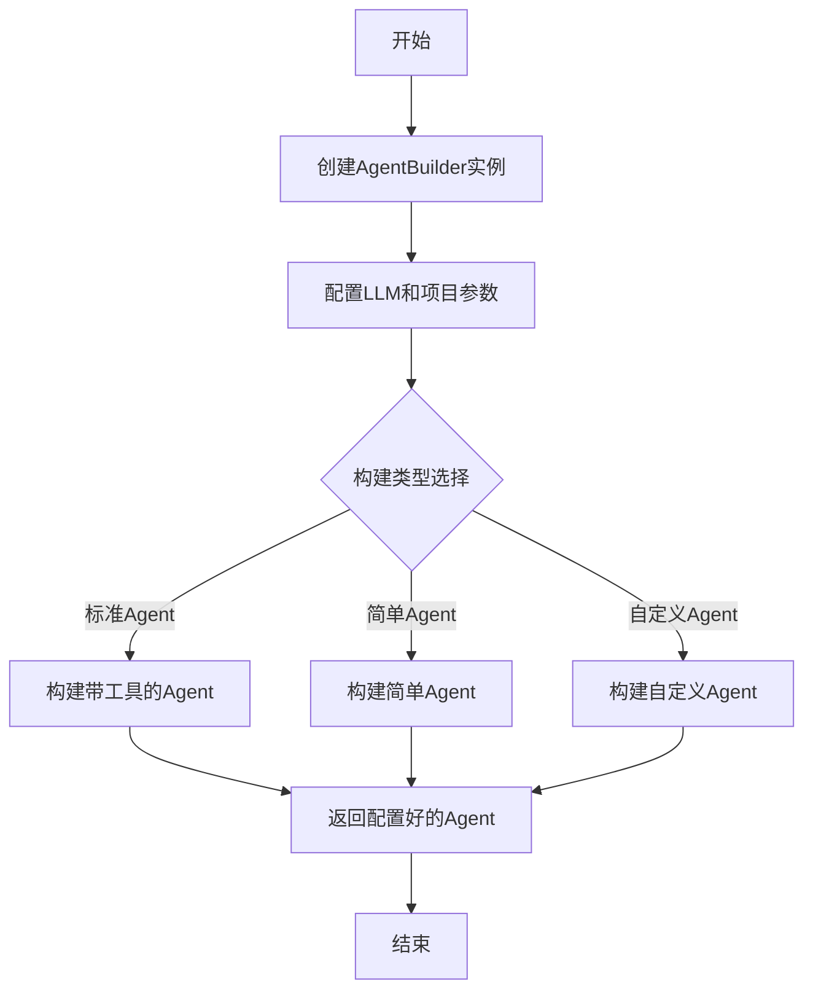

# agent_builder.rs 模块

## 模块功能与作用
AgentBuilder组件负责构建和配置LLM Agent。它提供了多种构建方法，包括带工具的标准Agent、简单Agent和自定义Agent。组件通过AgentBuilder结构体管理LLM客户端和配置，并提供了构建Agent的各种方法。

### 主要职责
- 构建和配置LLM Agent
- 管理LLM客户端和配置
- 提供多种Agent构建方法

## 工作流程
### 工作流程图

### 步骤 1: 创建AgentBuilder实例
**输入**:
- &Client
- &Config

**输出**:
- AgentBuilder实例

**实现细节**:
通过new方法创建AgentBuilder实例，传入LLM客户端和配置。

### 步骤 2: 配置LLM和项目参数
**输入**:
- LLM配置
- 项目配置

**输出**:
- 配置参数

**实现细节**:
通过llm_config和project_config方法配置LLM和项目参数。

### 步骤 3: 构建带工具的Agent
**输入**:
- 系统提示

**输出**:
- 配置好的Agent

**实现细节**:
通过build_agent_with_tools方法构建带工具的标准Agent。

### 步骤 4: 构建简单Agent
**输入**:
- 无

**输出**:
- 配置好的Agent

**实现细节**:
通过build_simple_agent方法构建简单Agent。

### 步骤 5: 构建自定义Agent
**输入**:
- 自定义参数

**输出**:
- 配置好的Agent

**实现细节**:
通过build_custom_agent方法构建自定义Agent。

## 内部架构与结构
### 代码结构分析
**类型定义**:
- AgentBuilder

**关键函数/方法**:
- new
- build_agent_with_tools
- build_simple_agent
- build_custom_agent
- llm_config
- project_config

**设计模式**:
- Builder
- Factory Method

**数据流分析**:
数据流主要围绕AgentBuilder结构体进行，通过构造函数和构建方法传递和处理配置信息和LLM客户端实例。

**算法复杂度**:
基于代码分析，算法复杂度主要体现在Agent构建和配置过程中，特别是工具集成和参数设置部分。

### 主要类/结构
- AgentBuilder

### 关键方法
- new
- build_agent_with_tools
- build_simple_agent
- build_custom_agent
- llm_config
- project_config

### 数据结构
- AgentBuilder结构体
- Config结构体
- LLMConfig结构体

### 设计模式
- Builder模式
- Factory Method模式

### 算法分析
- Agent构建算法
- 工具集成算法

### 性能特征
性能特征主要体现在Agent构建和配置的效率上，特别是工具集成和参数设置的效率。

### 错误处理
错误处理主要通过Rust的Result类型进行，在方法签名中可以看到返回类型为Result类型，但具体实现未在提供的代码片段中显示。

## 依赖关系
- rig::client::CompletionClient
- rig::providers::mistral::{Client, CompletionModel}
- crate::agents::agent_tools::file_explorer::AgentToolFileExplorer
- crate::agents::agent_tools::file_reader::AgentToolFileReader
- crate::config::{Config, LLMConfig}

## 提供的接口
- new
- build_agent_with_tools
- build_simple_agent
- build_custom_agent
- llm_config
- project_config
- AgentBuilder

