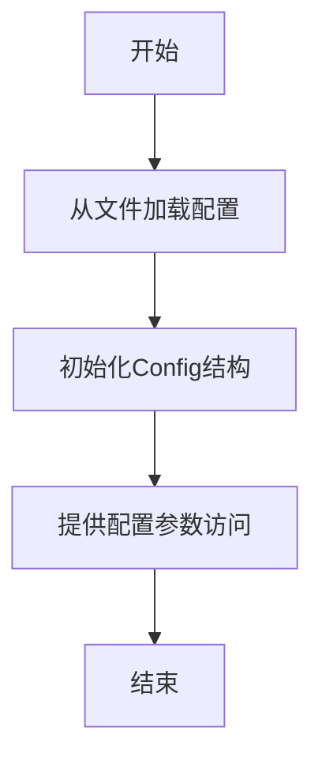

# config.rs 模块

## 模块功能与作用
该组件负责管理应用程序的配置信息，包括项目路径、输出路径、文档格式等设置。它提供了从文件加载配置的功能，并管理各种配置参数。

### 主要职责
- 管理应用程序配置
- 从文件加载配置
- 提供配置参数访问

## 工作流程
### 工作流程图

### 步骤 1: 从文件加载配置
**输入**:
- 配置文件路径

**输出**:
- Config结构体实例

**实现细节**:
使用std::fs::File和std::io::Read读取文件内容

### 步骤 2: 初始化Config结构
**输入**:
- 文件内容

**输出**:
- 初始化的Config结构

**实现细节**:
反序列化文件内容到Config结构

### 步骤 3: 提供配置参数访问
**输入**:
- Config结构体实例

**输出**:
- 配置参数值

**实现细节**:
通过结构体方法提供对各种配置参数的访问

## 内部架构与结构
### 代码结构分析
**类型定义**:
- Config
- LLMConfig
- CacheConfig

**接口实现/继承关系**:
- serde::Deserialize
- serde::Serialize

**关键函数/方法**:
- from_file
- get_internal_path
- get_process_data_path
- get_temp_path

**设计模式**:
- Singleton

### 主要类/结构
- Config
- LLMConfig
- CacheConfig

### 关键方法
- from_file
- get_internal_path
- get_process_data_path
- get_temp_path

### 数据结构
- PathBuf
- Vec<String>

### 设计模式
- Singleton

### 算法分析
- 简单文件I/O操作
- 路径处理

### 性能特征
中等，主要依赖文件I/O操作

### 错误处理
使用 anyhow 库进行错误处理

## 依赖关系
- anyhow
- serde
- std::fs
- std::io
- std::path

## 提供的接口
- from_file
- get_internal_path
- get_process_data_path
- get_temp_path
- Config
- LLMConfig
- CacheConfig

