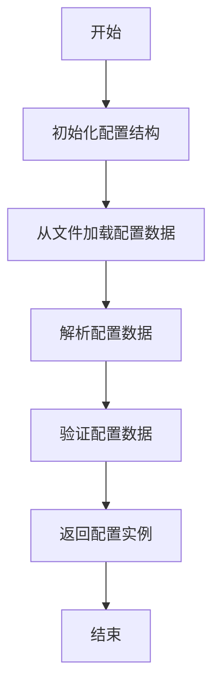

# config.rs 模块

## 模块功能与作用
该组件是一个配置管理模块，负责处理应用程序的配置数据。它定义了多个结构体来表示不同类型的配置，并提供了从文件加载配置的功能。

### 主要职责
- 管理应用程序配置
- 提供配置数据结构
- 从文件加载配置

## 工作流程
### 工作流程图

### 步骤 1: 初始化配置结构
**输入**:
- 无

**输出**:
- 配置结构实例

**实现细节**:
创建配置结构的实例

### 步骤 2: 从文件加载配置数据
**输入**:
- 文件路径

**输出**:
- 文件内容

**实现细节**:
使用文件路径读取配置文件内容

### 步骤 3: 解析配置数据
**输入**:
- 文件内容

**输出**:
- 解析后的配置数据

**实现细节**:
将文件内容解析为配置结构

### 步骤 4: 验证配置数据
**输入**:
- 解析后的配置数据

**输出**:
- 验证结果

**实现细节**:
检查配置数据的有效性

### 步骤 5: 返回配置实例
**输入**:
- 验证后的配置数据

**输出**:
- 配置实例

**实现细节**:
返回配置结构的实例

## 内部架构与结构
### 代码结构分析
**类型定义**:
- Config
- LLMConfig
- CacheConfig

**枚举/常量定义**:
- null

**接口实现/继承关系**:
- null

**关键函数/方法**:
- null

**设计模式**:
- null

**数据流分析**:
null

**算法复杂度**:
null

### 主要类/结构
- Config
- LLMConfig
- CacheConfig

### 关键方法
- from_file
- get_internal_path
- get_process_data_path

### 数据结构
- PathBuf
- Vec<String>

### 设计模式
- null

### 算法分析
- null

### 性能特征
null

### 错误处理
null

## 依赖关系
- anyhow
- serde
- std::fs
- std::io
- std::path

## 提供的接口
- from_file
- get_internal_path
- get_process_data_path
- Config
- LLMConfig
- CacheConfig

