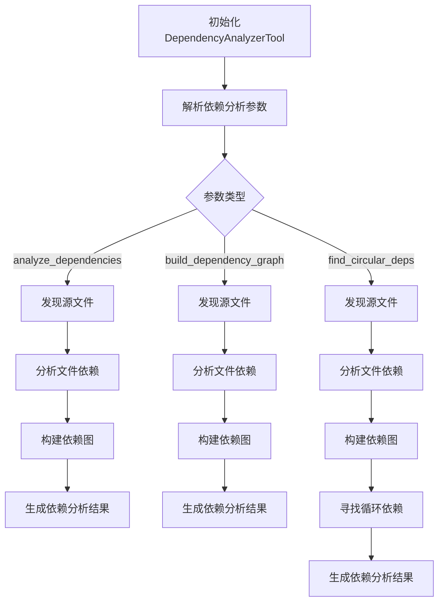

# dependency_analyzer.rs 模块

## 模块功能与作用
该组件用于分析项目中的依赖关系，支持多种编程语言（如Rust、Python、JavaScript、Java）。它可以发现源文件，分析文件依赖，构建依赖图，寻找循环依赖，并生成依赖分析结果。

### 主要职责
- 分析项目中的依赖关系
- 支持多种编程语言的依赖分析
- 构建依赖图
- 寻找循环依赖
- 生成依赖分析结果

## 工作流程
### 工作流程图

### 步骤 1: 初始化DependencyAnalyzerTool
**输入**:
- 项目根路径

**输出**:
- DependencyAnalyzerTool实例

**实现细节**:
创建DependencyAnalyzerTool实例，设置项目根路径。

### 步骤 2: 解析依赖分析参数
**输入**:
- 命令行参数或配置文件

**输出**:
- DependencyAnalyzerArgs实例

**实现细节**:
解析命令行参数或配置文件，初始化DependencyAnalyzerArgs。

### 步骤 3: 发现源文件
**输入**:
- 项目根路径

**输出**:
- 源文件列表

**实现细节**:
遍历项目目录，发现所有源文件。

### 步骤 4: 分析文件依赖
**输入**:
- 源文件列表

**输出**:
- 文件依赖关系

**实现细节**:
根据文件类型调用相应的分析方法（如analyze_rust_dependencies、analyze_python_dependencies等）。

### 步骤 5: 构建依赖图
**输入**:
- 文件依赖关系

**输出**:
- 依赖图

**实现细节**:
使用分析得到的依赖关系构建依赖图。

### 步骤 6: 寻找循环依赖
**输入**:
- 依赖图

**输出**:
- 循环依赖列表

**实现细节**:
使用深度优先搜索（DFS）算法寻找依赖图中的循环。

### 步骤 7: 生成依赖分析结果
**输入**:
- 依赖图
- 循环依赖列表

**输出**:
- DependencyAnalyzerResult实例

**实现细节**:
将分析结果封装到DependencyAnalyzerResult中。

## 内部架构与结构
### 代码结构分析
**类型定义**:
- DependencyAnalyzerTool
- DependencyAnalyzerArgs
- Dependency
- ModuleInfo
- DependencyAnalyzerResult

**枚举/常量定义**:
- dependency_type: 包含"import", "include", "require"等依赖类型

**接口实现/继承关系**:
- DependencyAnalyzerTool
- DependencyAnalyzerArgs
- Dependency
- ModuleInfo
- DependencyAnalyzerResult

**关键函数/方法**:
- new
- analyze_dependencies
- discover_source_files
- analyze_file_dependencies
- detect_language
- analyze_rust_dependencies
- analyze_python_dependencies
- analyze_js_dependencies
- analyze_java_dependencies
- build_dependency_graph
- analyze_modules
- find_circular_dependencies
- dfs_find_cycles
- extract_external_dependencies
- calculate_dependency_metrics
- generate_dependency_insights
- execute

**设计模式**:
- 结构型模式：适配器模式（可能用于不同语言依赖分析）
- 行为型模式：策略模式（用于不同语言的依赖分析策略）

**数据流分析**:
组件从项目根路径开始，通过发现源文件，分析文件依赖，构建依赖图，并最终生成依赖分析结果。数据流主要涉及依赖关系的收集、存储和分析。

**算法复杂度**:
由于组件涉及图遍历（如寻找循环依赖）和依赖关系分析，算法复杂度可能较高，特别是在处理大型项目时。

### 主要类/结构
- DependencyAnalyzerTool
- DependencyAnalyzerArgs
- Dependency
- ModuleInfo
- DependencyAnalyzerResult

### 关键方法
- analyze_dependencies
- build_dependency_graph
- find_circular_dependencies
- dfs_find_cycles

### 数据结构
- HashMap用于存储依赖关系
- HashSet用于存储模块信息
- PathBuf用于处理文件路径

### 设计模式
- 适配器模式
- 策略模式

### 算法分析
- 图遍历算法（如DFS）用于寻找循环依赖
- 正则表达式用于分析不同语言的依赖关系

### 性能特征
组件可能在处理大型项目时性能下降，特别是在构建依赖图和寻找循环依赖时。

### 错误处理
使用anyhow库进行错误处理，提供了Result类型来处理可能的错误。

## 依赖关系
- anyhow
- serde
- std::collections
- std::path
- regex

## 提供的接口
- DependencyAnalyzerTool
- DependencyAnalyzerArgs
- Dependency
- ModuleInfo
- DependencyAnalyzerResult

