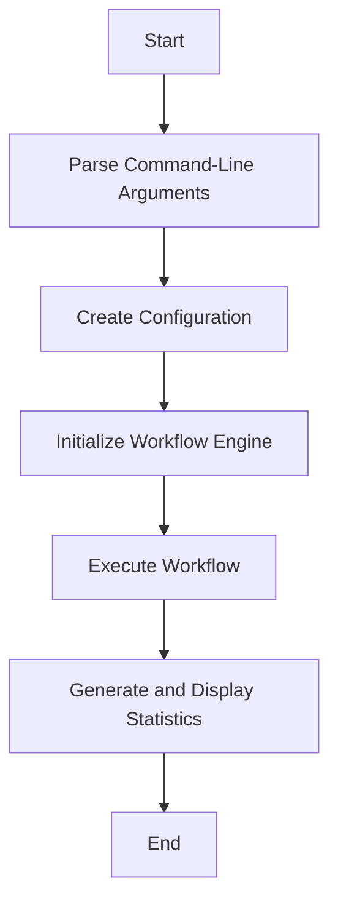

# main.rs 模块

## 模块功能与作用
The main.rs component serves as the entry point for the application. It initializes the workflow engine, parses command-line arguments, and executes the workflow to generate a knowledge base from a project.

### 主要职责
- Parse command-line arguments
- Create configuration
- Initialize the workflow engine
- Execute the workflow
- Generate and display statistics

## 工作流程
### 工作流程图

### 步骤 1: Parse command-line arguments
**输入**:
- Command-line arguments

**输出**:
- Cli object

**实现细节**:
The Cli::parse method is used to parse command-line arguments.

### 步骤 2: Create configuration
**输入**:
- Cli object

**输出**:
- Config object

**实现细节**:
The Cli::to_config method is used to create a configuration object from the Cli object.

### 步骤 3: Initialize workflow engine
**输入**:
- Config object

**输出**:
- WorkflowEngine object

**实现细节**:
The WorkflowEngine::new method is used to create a new instance of the workflow engine.

### 步骤 4: Execute workflow
**输入**:
- WorkflowEngine object

**输出**:
- Result object

**实现细节**:
The WorkflowEngine::execute method is used to execute the workflow.

### 步骤 5: Generate and display statistics
**输入**:
- Result object

**输出**:
- Console output

**实现细节**:
The main function generates and displays statistics about the workflow execution.

## 内部架构与结构
### 代码结构分析
**关键函数/方法**:
- main
- Cli::parse
- Cli::to_config
- WorkflowEngine::new
- WorkflowEngine::execute

**设计模式**:
- Singleton
- Factory Method

**数据流分析**:
The data flow is linear and straightforward. The main function orchestrates the workflow by calling methods in a sequential manner.

**算法复杂度**:
O(1)

### 主要类/结构
- Cli
- WorkflowEngine

### 关键方法
- main
- Cli::parse
- Cli::to_config
- WorkflowEngine::new
- WorkflowEngine::execute

### 数据结构
- Config
- Cli
- WorkflowEngine
- Result

### 设计模式
- Singleton
- Factory Method

### 算法分析
- The component uses a linear algorithm to execute the workflow steps sequentially.

### 性能特征
The performance is characterized by the time taken to execute the workflow, which is measured using std::time::Instant.

### 错误处理
The component uses the anyhow::Result type for error handling, which provides a convenient way to propagate errors.

## 依赖关系
- anyhow
- clap
- std
- cli
- workflow

## 提供的接口
- main

