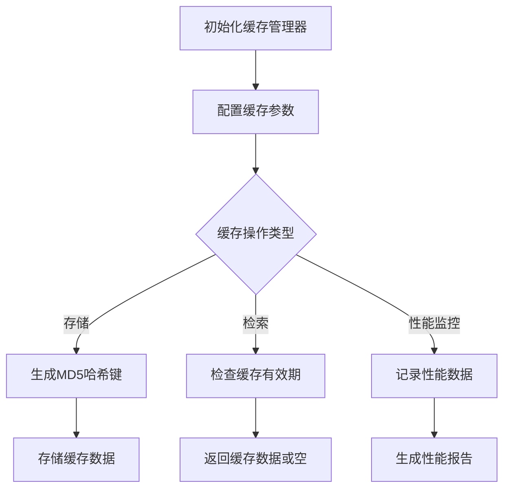

# mod.rs 模块

## 模块功能与作用
该组件实现了一个高性能的缓存管理系统，用于存储和检索缓存数据。它支持缓存初始化、数据存储和检索，并提供性能监控功能。

### 主要职责
- 管理缓存初始化和配置
- 提供缓存数据的存储和检索功能
- 支持不同的提示方式
- 监控缓存性能

## 工作流程
### 工作流程图

### 步骤 1: 初始化缓存管理器
**输入**:
- CacheConfig

**输出**:
- CacheManager实例

**实现细节**:
创建CacheManager实例并配置缓存参数

### 步骤 2: 配置缓存参数
**输入**:
- CacheConfig

**输出**:
- 配置好的CacheManager实例

**实现细节**:
设置缓存目录和有效期等参数

### 步骤 3: 缓存操作类型选择
**输入**:
- 操作类型

**输出**:
- 操作路径

**实现细节**:
根据操作类型选择不同的处理路径

### 步骤 4: 生成MD5哈希键
**输入**:
- 提示数据

**输出**:
- MD5哈希键

**实现细节**:
使用MD5算法生成缓存键

### 步骤 5: 存储缓存数据
**输入**:
- 缓存数据
- MD5哈希键

**输出**:
- 存储结果

**实现细节**:
将数据存储到缓存中

### 步骤 6: 检查缓存有效期
**输入**:
- 缓存数据

**输出**:
- 有效性结果

**实现细节**:
检查缓存数据是否过期

### 步骤 7: 返回缓存数据或空
**输入**:
- 有效性结果

**输出**:
- 缓存数据或空

**实现细节**:
根据有效性返回数据或空

### 步骤 8: 记录性能数据
**输入**:
- 性能数据

**输出**:
- 记录结果

**实现细节**:
记录缓存操作的性能数据

### 步骤 9: 生成性能报告
**输入**:
- 性能数据

**输出**:
- 性能报告

**实现细节**:
生成缓存性能报告

## 内部架构与结构
### 代码结构分析
**类型定义**:
- CacheManager
- CacheEntry

**关键函数/方法**:
- new
- init
- get_agent_builder
- prompt
- prompt_with_react
- prompt_without_react
- config

**设计模式**:
- 单例模式
- 观察者模式

**数据流分析**:
缓存管理器处理缓存操作，使用MD5哈希生成缓存键，基于时间戳管理缓存有效期

**算法复杂度**:
中等

### 主要类/结构
- CacheManager
- CacheEntry

### 关键方法
- new
- init
- get_agent_builder
- prompt
- prompt_with_react
- prompt_without_react
- config

### 数据结构
- CacheManager
- CacheEntry

### 设计模式
- 单例模式
- 观察者模式

### 算法分析
- MD5哈希算法用于生成缓存键
- 时间戳管理缓存有效期

### 性能特征
高效的缓存管理和性能监控

### 错误处理
使用anyhow::Result进行错误处理

## 依赖关系
- anyhow::Result
- md5
- serde
- std::path::PathBuf
- std::time
- tokio::fs
- crate::config::CacheConfig
- performance_monitor
- CachePerformanceMonitor
- CachePerformanceReport

## 提供的接口
- new
- init
- get_agent_builder
- prompt
- prompt_with_react
- prompt_without_react
- config
- LLMClient

