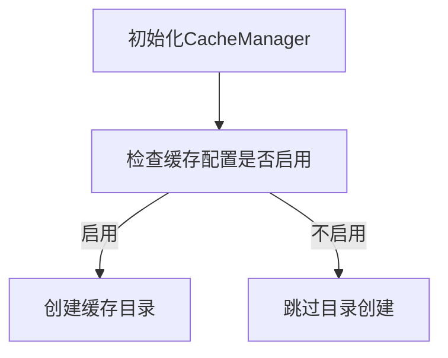

# mod.rs 模块

## 模块功能与作用
缓存管理模块，提供缓存管理功能，包括缓存初始化和性能监控。

### 主要职责
- 管理缓存配置
- 初始化缓存目录
- 监控缓存性能

## 工作流程
### 工作流程图

### 步骤 1: 初始化CacheManager
**输入**:
- CacheConfig

**输出**:
- CacheManager实例

**实现细节**:
创建CacheManager实例，初始化性能监控器

### 步骤 2: 检查缓存配置是否启用
**输入**:
- CacheManager实例

**输出**:
- 布尔值表示是否启用

**实现细节**:
检查config.enabled字段

### 步骤 3: 创建缓存目录
**输入**:
- 缓存目录路径

**输出**:
- Result类型表示操作结果

**实现细节**:
使用tokio::fs::create_dir_all异步创建目录

## 内部架构与结构
### 代码结构分析
**类型定义**:
- CacheManager
- CacheEntry

**关键函数/方法**:
- new
- init

### 主要类/结构
- CacheManager

### 关键方法
- new
- init

### 数据结构
- CacheEntry

### 错误处理
使用 anyhow::Result 进行错误处理

