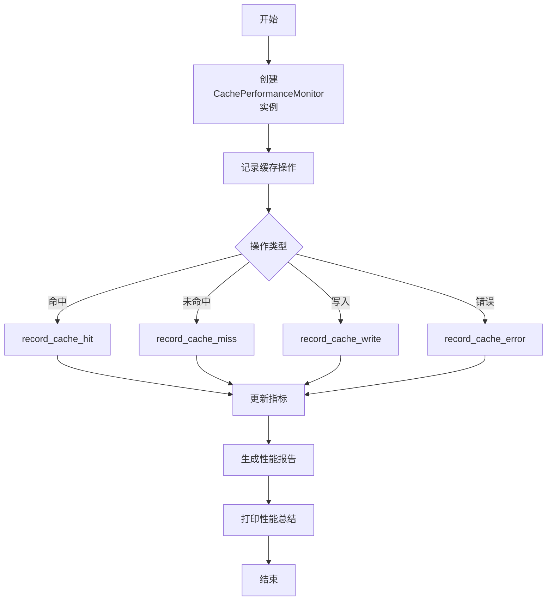

# performance_monitor.rs 模块

## 模块功能与作用
缓存性能监控模块，用于跟踪和报告缓存系统的性能指标，包括命中率、操作次数、错误情况等，并提供性能分析和成本估算功能。

### 主要职责
- 跟踪缓存命中和未命中次数
- 记录缓存写入和错误情况
- 计算和报告缓存性能指标
- 估算缓存节省的成本
- 生成性能报告
- 提供性能总结打印功能

## 工作流程
### 工作流程图

### 步骤 1: 创建CachePerformanceMonitor实例
**输入**:
- 无

**输出**:
- CachePerformanceMonitor实例

**实现细节**:
使用new函数创建实例，初始化指标计数器

### 步骤 2: 记录缓存命中
**输入**:
- 无

**输出**:
- 更新后的缓存命中计数

**实现细节**:
调用record_cache_hit方法增加命中计数

### 步骤 3: 记录缓存未命中
**输入**:
- 无

**输出**:
- 更新后的缓存未命中计数

**实现细节**:
调用record_cache_miss方法增加未命中计数

### 步骤 4: 记录缓存写入
**输入**:
- 无

**输出**:
- 更新后的缓存写入计数

**实现细节**:
调用record_cache_write方法增加写入计数

### 步骤 5: 记录缓存错误
**输入**:
- 无

**输出**:
- 更新后的缓存错误计数

**实现细节**:
调用record_cache_error方法增加错误计数

### 步骤 6: 生成性能报告
**输入**:
- 当前缓存指标

**输出**:
- CachePerformanceReport结构体

**实现细节**:
调用generate_report方法生成性能报告

### 步骤 7: 打印性能总结
**输入**:
- CachePerformanceReport

**输出**:
- 格式化的性能总结输出

**实现细节**:
调用print_performance_summary方法打印性能总结

## 内部架构与结构
### 代码结构分析
**类型定义**:
- CachePerformanceMonitor
- CacheMetrics
- CachePerformanceReport
- CategoryPerformanceStats

**关键函数/方法**:
- new
- record_cache_hit
- record_cache_miss
- record_cache_write
- record_cache_error
- generate_report
- print_performance_summary
- estimate_cost_saved
- reset_metrics

**设计模式**:
- Singleton

**数据流分析**:
null

**算法复杂度**:
null

### 主要类/结构
- CachePerformanceMonitor
- CacheMetrics
- CachePerformanceReport
- CategoryPerformanceStats

### 关键方法
- record_cache_hit
- record_cache_miss
- record_cache_write
- record_cache_error
- generate_report
- print_performance_summary
- estimate_cost_saved
- reset_metrics

### 数据结构
- AtomicU64
- HashMap
- Arc

### 设计模式
- Singleton

### 算法分析
- 原子操作用于线程安全计数
- 哈希映射用于性能分类统计

### 性能特征
高性能原子操作和线程安全设计

### 错误处理
使用anyhow::Result进行错误处理

## 依赖关系
- anyhow::Result
- serde::{Deserialize, Serialize}
- std::collections::HashMap
- std::sync::atomic::{AtomicU64, Ordering}
- std::sync::Arc
- std::time::{Duration, Instant}
- super::*
- std::time::Duration

## 提供的接口
- new
- record_cache_hit
- record_cache_miss
- record_cache_write
- record_cache_error
- generate_report
- print_performance_summary
- reset_metrics

