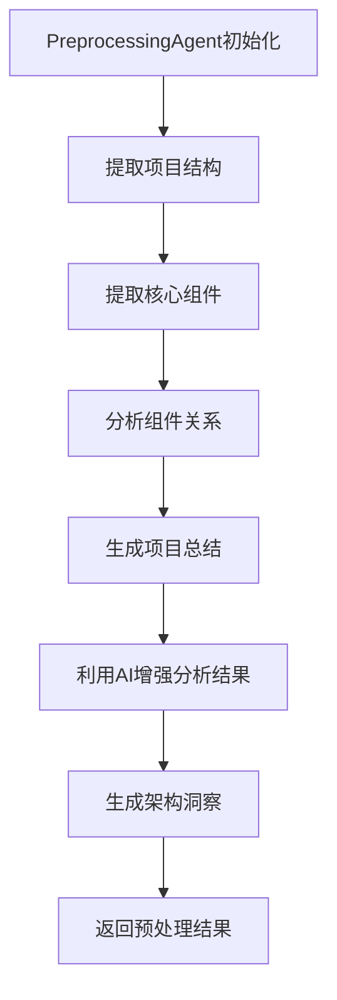

# preprocessing_agent.rs 模块

## 模块功能与作用
该组件是一个智能预处理Agent，主要负责分析项目结构、提取核心组件、分析组件关系以及生成项目总结。它利用AI技术增强分析结果，并提供详细的架构洞察。

### 主要职责
- 分析项目结构
- 提取核心组件
- 分析组件关系
- 生成项目总结
- 利用AI技术增强分析结果
- 提供详细的架构洞察

## 工作流程
### 工作流程图

### 步骤 1: 初始化PreprocessingAgent
**输入**:
- LLMClient
- CacheManager
- StructureExtractor
- ComponentExtractor
- LanguageProcessorManager

**输出**:
- PreprocessingAgent实例

**实现细节**:
创建PreprocessingAgent实例，初始化LLMClient、CacheManager、StructureExtractor、ComponentExtractor和LanguageProcessorManager。

### 步骤 2: 提取项目结构
**输入**:
- 项目路径

**输出**:
- ProjectStructure

**实现细节**:
使用StructureExtractor提取项目结构，包括文件和目录信息。

### 步骤 3: 提取核心组件
**输入**:
- ProjectStructure

**输出**:
- Vec<CoreComponent>

**实现细节**:
使用ComponentExtractor提取核心组件，包括类、结构体、接口等。

### 步骤 4: 分析组件关系
**输入**:
- Vec<CoreComponent>

**输出**:
- Vec<RelationshipInfo>

**实现细节**:
分析组件之间的静态和动态关系，包括依赖关系、调用关系等。

### 步骤 5: 生成项目总结
**输入**:
- ProjectStructure
- Vec<CoreComponent>
- Vec<RelationshipInfo>

**输出**:
- 项目总结

**实现细节**:
生成项目的总结信息，包括项目概述、技术栈、架构风格等。

### 步骤 6: 利用AI增强分析结果
**输入**:
- ProjectStructure
- Vec<CoreComponent>
- Vec<RelationshipInfo>

**输出**:
- 增强后的分析结果

**实现细节**:
使用LLMClient和LanguageProcessorManager增强分析结果，提供更深入的洞察。

### 步骤 7: 生成架构洞察
**输入**:
- 增强后的分析结果

**输出**:
- 架构洞察

**实现细节**:
生成项目的架构洞察，包括架构模式、设计模式、潜在问题等。

### 步骤 8: 返回预处理结果
**输入**:
- ProjectStructure
- Vec<CoreComponent>
- Vec<RelationshipInfo>
- 项目总结
- 增强后的分析结果
- 架构洞察

**输出**:
- PreprocessingResult

**实现细节**:
将所有分析结果和洞察整合成PreprocessingResult并返回。

## 内部架构与结构
### 代码结构分析
**类型定义**:
- PreprocessingAgent
- PreprocessingResult
- RelationshipInfo

**枚举/常量定义**:
- PreprocessingResult
- RelationshipInfo

**接口实现/继承关系**:
- LLMClient
- CacheManager
- StructureExtractor
- ComponentExtractor
- LanguageProcessorManager

**关键函数/方法**:
- new
- get_llm_client
- get_cache_manager
- preprocess
- analyze_components_with_ai
- enhance_component_analysis_with_ai
- build_component_analysis_prompt
- read_component_source_code
- read_dependency_source_code
- find_dependency_file
- recursive_find_file
- search_directory
- truncate_source_code
- is_important_line
- merge_ai_analysis_results
- analyze_relationships
- analyze_static_relationships
- analyze_relationships_with_ai
- build_relationship_analysis_prompt
- generate_architecture_insights
- build_architecture_analysis_prompt
- generate_summary
- build_project_summary_prompt

**设计模式**:
- 单例模式
- 工厂模式
- 策略模式

**数据流分析**:
数据流主要从文件系统开始，通过各种提取和分析方法处理，最终生成分析结果。数据在各个方法之间流动，经过多次转换和增强。

**算法复杂度**:
由于组件涉及多个复杂的AI分析任务和文件处理操作，算法复杂度较高。特别是涉及AI分析的方法，如analyze_components_with_ai、analyze_relationships_with_ai等，可能具有较高的时间复杂度。

### 主要类/结构
- PreprocessingAgent
- PreprocessingResult
- RelationshipInfo

### 关键方法
- new
- get_llm_client
- get_cache_manager
- preprocess
- analyze_components_with_ai
- enhance_component_analysis_with_ai
- build_component_analysis_prompt
- read_component_source_code
- read_dependency_source_code
- find_dependency_file
- recursive_find_file
- search_directory
- truncate_source_code
- is_important_line
- merge_ai_analysis_results
- analyze_relationships
- analyze_static_relationships
- analyze_relationships_with_ai
- build_relationship_analysis_prompt
- generate_architecture_insights
- build_architecture_analysis_prompt
- generate_summary
- build_project_summary_prompt

### 数据结构
- ProjectStructure
- CoreComponent
- ComponentAnalysis
- RelationshipInfo

### 设计模式
- 单例模式
- 工厂模式
- 策略模式

### 算法分析
- 文件搜索算法
- 源码截断算法
- AI分析算法

### 性能特征
组件性能特征包括高内存使用和较高的CPU使用率，特别是在处理大型项目或复杂分析任务时。

### 错误处理
使用anyhow::Result进行错误处理，提供了统一的错误处理机制。

## 依赖关系
- crate::llm::LLMClient
- anyhow::Result
- serde::{Deserialize, Serialize}
- std::time::Instant
- crate::cache::CacheManager
- crate::config::Config
- crate::extractors::{ComponentAnalysis, ComponentExtractor, CoreComponent, ProjectStructure, StructureExtractor, LanguageProcessorManager, AIComponentAnalysis, AIArchitectureInsights, AIProjectSummary, AIRelationshipAnalysis}
- crate::tools::{DependencyAnalyzerTool}
- std::fs

## 提供的接口
- new
- get_llm_client
- get_cache_manager
- preprocess
- analyze_components_with_ai
- enhance_component_analysis_with_ai
- build_component_analysis_prompt
- read_component_source_code
- read_dependency_source_code
- find_dependency_file
- recursive_find_file
- search_directory
- truncate_source_code
- is_important_line
- merge_ai_analysis_results
- analyze_relationships
- analyze_static_relationships
- analyze_relationships_with_ai
- build_relationship_analysis_prompt
- generate_architecture_insights
- build_architecture_analysis_prompt
- generate_summary
- build_project_summary_prompt

