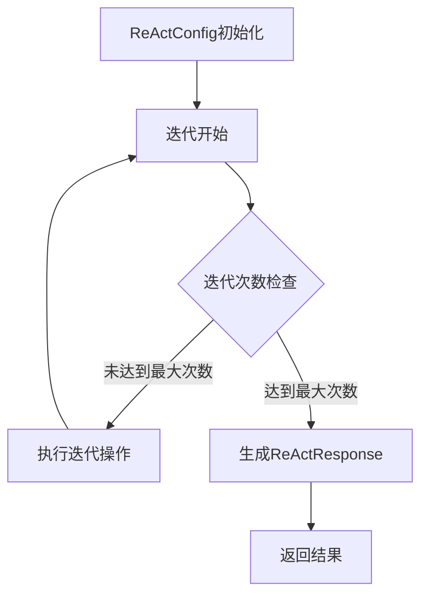

# react.rs 模块

## 模块功能与作用
ReAct模式配置和响应处理组件，实现基于配置的迭代处理过程

### 主要职责
- 定义ReAct模式的配置参数
- 处理ReAct模式的响应结果
- 管理迭代过程的配置和结果

## 工作流程
### 工作流程图

### 步骤 1: 初始化ReAct配置
**输入**:
- max_iterations
- verbose
- return_partial_on_max_depth

**输出**:
- ReActConfig实例

**实现细节**:
通过ReActConfig结构体定义配置参数

### 步骤 2: 开始迭代过程
**输入**:
- ReActConfig

**输出**:
- 中间结果

**实现细节**:
根据配置参数执行迭代操作

### 步骤 3: 检查迭代次数
**输入**:
- 当前迭代次数
- max_iterations

**输出**:
- 是否继续迭代

**实现细节**:
比较当前迭代次数与max_iterations

### 步骤 4: 执行迭代操作
**输入**:
- 中间结果

**输出**:
- 更新后的中间结果

**实现细节**:
执行具体的迭代逻辑

### 步骤 5: 生成ReAct响应
**输入**:
- 中间结果
- 是否达到最大次数

**输出**:
- ReActResponse实例

**实现细节**:
将中间结果转换为ReActResponse结构

### 步骤 6: 返回结果
**输入**:
- ReActResponse

**输出**:
- 最终结果

**实现细节**:
返回最终的ReActResponse

## 内部架构与结构
### 代码结构分析
**类型定义**:
- ReActConfig
- ReActResponse

**接口实现/继承关系**:
- Default
- Debug
- Clone

**关键函数/方法**:
- default
- new
- success
- max_depth_reached

**设计模式**:
- 配置模式
- 响应模式

**数据流分析**:
数据流从ReActConfig配置开始，通过迭代过程生成ReActResponse结果

**算法复杂度**:
O(n)

### 主要类/结构
- ReActConfig
- ReActResponse

### 关键方法
- default
- new

### 数据结构
- Vec<String>

### 设计模式
- 配置模式
- 响应模式

### 算法分析
- 迭代算法

### 性能特征
低圈复杂度(2.0)表明代码结构简单，易于维护

### 错误处理
通过stopped_by_max_depth字段处理达到最大迭代次数的情况

## 提供的接口
- default
- new
- success
- max_depth_reached
- ReActConfig
- ReActResponse

