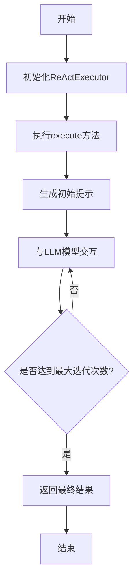

# react_executor.rs 模块

## 模块功能与作用
ReActExecutor组件实现了ReAct模式的多轮对话逻辑，通过与LLM模型的交互完成任务执行。

### 主要职责
- 实现ReAct模式的多轮对话逻辑
- 与LLM模型交互执行任务
- 管理对话历史和工具调用

## 工作流程
### 工作流程图

### 步骤 1: 初始化ReActExecutor
**输入**:
- agent
- user_prompt
- config

**输出**:
- ReActExecutor实例

**实现细节**:
创建ReActExecutor实例

### 步骤 2: 执行execute方法
**输入**:
- agent
- user_prompt
- config

**输出**:
- ReActResponse或错误

**实现细节**:
调用execute方法开始ReAct循环

### 步骤 3: 生成初始提示
**输入**:
- user_prompt

**输出**:
- 初始提示

**实现细节**:
基于用户输入生成初始提示

### 步骤 4: 与LLM模型交互
**输入**:
- agent
- 提示

**输出**:
- LLM响应

**实现细节**:
通过agent与LLM模型交互获取响应

### 步骤 5: 检查是否达到最大迭代次数
**输入**:
- 当前迭代次数
- max_iterations

**输出**:
- 布尔值

**实现细节**:
检查当前迭代次数是否达到配置的最大值

### 步骤 6: 返回最终结果
**输入**:
- 多轮对话结果

**输出**:
- ReActResponse

**实现细节**:
将多轮对话结果封装为ReActResponse

## 内部架构与结构
### 代码结构分析
**类型定义**:
- ReActExecutor

**枚举/常量定义**:
- ReActConfig
- ReActResponse

**接口实现/继承关系**:
- ReActExecutor

**关键函数/方法**:
- execute
- extract_partial_result

**设计模式**:
- 策略模式
- 迭代器模式

**数据流分析**:
数据流从用户提示开始，通过多轮对话生成响应

**算法复杂度**:
O(n), 其中n是最大迭代次数

### 主要类/结构
- ReActExecutor

### 关键方法
- execute
- extract_partial_result

### 数据结构
- Vec<ToolCall>
- ReActConfig
- ReActResponse

### 设计模式
- 策略模式
- 迭代器模式

### 算法分析
- 多轮对话算法
- 任务执行算法

### 性能特征
性能依赖于LLM模型的响应时间和最大迭代次数

### 错误处理
使用anyhow::Result进行错误处理

## 依赖关系
- anyhow
- rig
- mistral

## 提供的接口
- ReActExecutor
- execute
- extract_partial_result

