# DeepWiki-RS 系统架构与开发指南

## 1. 项目概述

### 1.1 项目背景

- **项目文件数**: 56
- **核心组件数**: 40
- **调研报告数**: 4
- **主要技术栈**: Rust, TOML, Markdown

### 1.2 项目目标

DeepWiki-RS 是一个基于Rust语言的文档分析和生成系统，旨在通过自动化技术提升文档质量和开发效率。该系统采用模块化架构，核心组件职责分离明确，主要功能包括文件分析、架构检测、依赖分析、代码分析、文档生成等。

## 2. 系统架构

### 2.1 架构概览

DeepWiki-RS 采用模块化架构，主要分为以下几个核心模块：

- **架构检测模块**: 负责分析项目架构，识别架构模式和设计原则
- **文件探索模块**: 负责文件系统的遍历和分析
- **依赖分析模块**: 负责分析项目依赖关系，识别循环依赖和模块耦合
- **代码分析模块**: 负责分析代码质量和复杂度
- **文档生成模块**: 负责生成技术文档和架构图

### 2.2 架构图

```mermaid
classDiagram
    class ArchitectureDetector {
        +new(project_root: PathBuf) Result<Self>
        +detect_patterns(args: &ArchitectureDetectorArgs) Result<ArchitectureDetectorResult>
        +detect_project_type(result: &mut ArchitectureDetectorResult) Result<()>
        +analyze_config_content(content: &str, file_name: &str, tech_stack: &mut Vec<String>)
        +detect_languages_from_files(tech_stack: &mut Vec<String>) Result<()>
        +detect_architecture_patterns(result: &mut ArchitectureDetectorResult) Result<()>
        +has_mvc_structure() Result<bool>
        +has_microservices_structure() Result<bool>
        +has_layered_structure() Result<bool>
        +has_modular_structure() Result<bool>
        +analyze_component_types(result: &mut ArchitectureDetectorResult) Result<()>
        +analyze_rust_components(components: &mut Vec<ComponentType>) Result<()>
        +analyze_js_components(components: &mut Vec<ComponentType>) Result<()>
        +analyze_python_components(components: &mut Vec<ComponentType>) Result<()>
        +analyze_java_components(components: &mut Vec<ComponentType>) Result<()>
        +analyze_architecture_layers(result: &mut ArchitectureDetectorResult) Result<()>
        +detect_design_principles(result: &mut ArchitectureDetectorResult) Result<()>
        +has_single_responsibility() Result<bool>
        +has_dependency_injection() Result<bool>
        +has_separation_of_concerns() Result<bool>
        +generate_recommendations(result: &mut ArchitectureDetectorResult)
        +generate_insights(result: &mut ArchitectureDetectorResult)
        +execute(args: ArchitectureDetectorArgs) Result<ArchitectureDetectorResult>
    }

    class FileExplorer {
        +new(project_root: PathBuf, config: Config) Result<Self>
        +list_directory(args: &FileExplorerArgs) Result<FileExplorerResult>
        +find_files(args: &FileExplorerArgs) Result<FileExplorerResult>
        +analyze_structure(_args: &FileExplorerArgs) Result<FileExplorerResult>
        +create_file_info(path: &Path) Result<FileInfo>
        +calculate_importance_score(path: &Path, size: u64) f64
        +is_ignored(path: &Path) bool
        +generate_insights(files: &[FileInfo], directories: &[String], file_types: &HashMap<String, usize>) Vec<String>
        +generate_structure_insights(files: &[FileInfo], directories: &[String], file_types: &HashMap<String, usize>) Vec<String>
        +generate_structure_summary(files: &[FileInfo], directories: &[String], file_types: &HashMap<String, usize>) String
        +execute(args: FileExplorerArgs) Result<FileExplorerResult>
    }

    class DependencyAnalyzer {
        +new(project_root: PathBuf) Result<Self>
        +analyze_dependencies(args: &DependencyAnalyzerArgs) Result<DependencyAnalyzerResult>
        +discover_source_files() Result<Vec<String>>
        +analyze_file_dependencies(file_path: &PathBuf, relative_path: &str) Result<Vec<Dependency>>
        +detect_language(file_path: &PathBuf) String
        +analyze_rust_dependencies(content: &str, source_file: &str, dependencies: &mut Vec<Dependency>)
        +analyze_python_dependencies(content: &str, source_file: &str, dependencies: &mut Vec<Dependency>)
        +analyze_js_dependencies(content: &str, source_file: &str, dependencies: &mut Vec<Dependency>)
        +analyze_java_dependencies(content: &str, source_file: &str, dependencies: &mut Vec<Dependency>)
        +build_dependency_graph(dependencies: &[Dependency]) HashMap<String, Vec<String>>
        +analyze_modules(dependencies: &[Dependency], file_paths: &[String]) Vec<ModuleInfo>
        +find_circular_dependencies(graph: &HashMap<String, Vec<String>>) Vec<Vec<String>>
        +dfs_find_cycles(node: &str, graph: &HashMap<String, Vec<String>>, visited: &mut HashSet<String>, rec_stack: &mut HashSet<String>, path: &mut Vec<String>, cycles: &mut Vec<Vec<String>>)
        +extract_external_dependencies(dependencies: &[Dependency]) Vec<String>
        +calculate_dependency_metrics(result: &DependencyAnalyzerResult) HashMap<String, f64>
        +generate_dependency_insights(result: &DependencyAnalyzerResult) Vec<String>
        +execute(args: DependencyAnalyzerArgs) Result<DependencyAnalyzerResult>
    }

    class CodeAnalyzer {
        +new(project_root: PathBuf) Result<Self>
        +analyze_file(args: &CodeAnalyzerArgs) Result<CodeAnalyzerResult>
        +detect_language(file_path: &Path, hint: Option<&str>) String
        +analyze_basic_metrics(content: &str, result: &mut CodeAnalyzerResult)
        +analyze_rust_code(content: &str, result: &mut CodeAnalyzerResult)
        +analyze_python_code(content: &str, result: &mut CodeAnalyzerResult)
        +analyze_js_ts_code(content: &str, result: &mut CodeAnalyzerResult)
        +analyze_java_code(content: &str, result: &mut CodeAnalyzerResult)
        +analyze_generic_code(content: &str, result: &mut CodeAnalyzerResult)
        +extract_js_function_name(line: &str) Option<String>
        +generate_code_insights(result: &mut CodeAnalyzerResult)
        +execute(args: CodeAnalyzerArgs) Result<CodeAnalyzerResult>
    }

    class DocumentationGenerator {
        +new(project_root: PathBuf) Result<Self>
        +generate_documentation(preprocessing_result: &PreprocessingResult, research_result: &ResearchResult) Result<DocumentationResult>
        +enhance_document_with_ai(document: &DocumentInfo, preprocessing_result: &PreprocessingResult, research_result: &ResearchResult) Result<DocumentInfo>
        +build_documentation_enhancement_prompt(document: &DocumentInfo, preprocessing_result: &PreprocessingResult, research_result: &ResearchResult) String
        +apply_ai_enhancement_results(document: &DocumentInfo, ai_enhancement: &AIDocumentEnhancement) DocumentInfo
        +build_technical_specification_prompt(preprocessing_result: &PreprocessingResult, research_result: &ResearchResult) String
        +generate_technical_specification_content(ai_spec: &AITechnicalSpecification, preprocessing_result: &PreprocessingResult) String
        +generate_basic_technical_specification(preprocessing_result: &PreprocessingResult) Result<DocumentInfo>
        +generate_professional_documents(preprocessing_result: &PreprocessingResult, research_result: &ResearchResult) Result<Vec<DocumentInfo>>
        +generate_technical_specification(preprocessing_result: &PreprocessingResult, research_result: &ResearchResult) Result<DocumentInfo>
        +generate_testing_guide(preprocessing_result: &PreprocessingResult) Result<DocumentInfo>
        +generate_performance_analysis(preprocessing_result: &PreprocessingResult) Result<DocumentInfo>
        +generate_security_analysis(preprocessing_result: &PreprocessingResult) Result<DocumentInfo>
        +save_documents(documents: &[DocumentInfo]) Result<()>
        +generate_documentation_summary(documents: &[DocumentInfo], _c4_documentation: &C4Documentation) String
        +build_testing_guide_prompt(preprocessing_result: &PreprocessingResult) String
        +generate_testing_guide_content(ai_guide: &AITestingGuide, preprocessing_result: &PreprocessingResult) String
        +generate_basic_testing_guide(preprocessing_result: &PreprocessingResult) Result<DocumentInfo>
        +build_performance_analysis_prompt(preprocessing_result: &PreprocessingResult) String
        +generate_performance_analysis_content(ai_analysis: &AIPerformanceAnalysis, _preprocessing_result: &PreprocessingResult) String
        +generate_basic_performance_analysis(preprocessing_result: &PreprocessingResult) Result<DocumentInfo>
        +build_security_analysis_prompt(preprocessing_result: &PreprocessingResult) String
        +generate_security_analysis_content(ai_analysis: &AISecurityAnalysis, _preprocessing_result: &PreprocessingResult) String
        +generate_basic_security_analysis(preprocessing_result: &PreprocessingResult) Result<DocumentInfo>
    }

    ArchitectureDetector --> FileExplorer: 使用
    ArchitectureDetector --> DependencyAnalyzer: 使用
    ArchitectureDetector --> CodeAnalyzer: 使用
    FileExplorer --> DependencyAnalyzer: 使用
    FileExplorer --> CodeAnalyzer: 使用
    DependencyAnalyzer --> CodeAnalyzer: 使用
    CodeAnalyzer --> DocumentationGenerator: 使用
    DocumentationGenerator --> ArchitectureDetector: 使用

```



### 2.3 架构模式

DeepWiki-RS 采用以下架构模式：

- **模块化架构**: 系统被划分为多个独立的模块，每个模块负责特定的功能
- **分层架构**: 系统采用分层设计，不同层次负责不同的职责
- **微服务架构**: 系统的某些功能可以独立部署和扩展

## 3. 核心组件

### 3.1 架构检测组件

```rust
pub struct ArchitectureDetector {
    // 组件属性
}

impl ArchitectureDetector {
    // 组件方法
    pub fn new(project_root: PathBuf) -> Result<Self> {
        // 组件初始化逻辑
        Ok(Self { /* 初始化属性 */ })
    }
    
    // 其他方法实现...
}
```

### 3.2 文件探索组件

```rust
pub struct FileExplorer {
    // 组件属性
}

impl FileExplorer {
    // 组件方法
    pub fn new(project_root: PathBuf, config: Config) -> Result<Self> {
        // 组件初始化逻辑
        Ok(Self { /* 初始化属性 */ })
    }
    
    // 其他方法实现...
}
```

### 3.3 依赖分析组件

```rust
pub struct DependencyAnalyzer {
    // 组件属性
}

impl DependencyAnalyzer {
    // 组件方法
    pub fn new(project_root: PathBuf) -> Result<Self> {
        // 组件初始化逻辑
        Ok(Self { /* 初始化属性 */ })
    }
    
    // 其他方法实现...
}
```

### 3.4 代码分析组件

```rust
pub struct CodeAnalyzer {
    // 组件属性
}

impl CodeAnalyzer {
    // 组件方法
    pub fn new(project_root: PathBuf) -> Result<Self> {
        // 组件初始化逻辑
        Ok(Self { /* 初始化属性 */ })
    }
    
    // 其他方法实现...
}
```

### 3.5 文档生成组件

```rust
pub struct DocumentationGenerator {
    // 组件属性
}

impl DocumentationGenerator {
    // 组件方法
    pub fn new(project_root: PathBuf) -> Result<Self> {
        // 组件初始化逻辑
        Ok(Self { /* 初始化属性 */ })
    }
    
    // 其他方法实现...
}
```

## 4. 设计原则

### 4.1 单一职责原则

DeepWiki-RS 中的组件遵循单一职责原则，每个组件负责特定的功能，例如：

- `ArchitectureDetector` 负责架构检测
- `FileExplorer` 负责文件探索
- `DependencyAnalyzer` 负责依赖分析
- `CodeAnalyzer` 负责代码分析
- `DocumentationGenerator` 负责文档生成

### 4.2 开闭原则

DeepWiki-RS 的设计遵循开闭原则，系统可以通过扩展现有组件或添加新组件来实现新功能，而不需要修改现有代码。例如：

- 可以通过实现新的 `LanguageProcessor` 来支持新的编程语言
- 可以通过扩展 `DocumentationGenerator` 来支持新的文档格式

### 4.3 依赖倒置原则

DeepWiki-RS 通过接口和抽象来减少直接依赖，提高系统的灵活性和可维护性。例如：

- 使用 `LanguageProcessor` trait 来定义语言处理器的通用接口
- 使用 `Config` 结构体来管理配置信息

### 4.4 接口隔离原则

DeepWiki-RS 中的接口设计遵循接口隔离原则，每个接口只包含必要的方法。例如：

- `LanguageProcessor` trait 只包含与语言处理相关的方法
- `FileExplorerArgs` 结构体只包含文件探索相关的参数

### 4.5 里氏替换原则

DeepWiki-RS 的设计遵循里氏替换原则，子类可以替换父类而不影响系统的正确性。例如：

- 可以通过实现 `LanguageProcessor` trait 来创建新的语言处理器
- 可以通过扩展 `DocumentationGenerator` 来创建新的文档生成器

## 5. 代码质量

### 5.1 代码复杂度

DeepWiki-RS 的代码复杂度较低，平均圈复杂度为17.9，表明代码结构清晰，易于理解和维护。

### 5.2 代码可读性

DeepWiki-RS 的代码可读性较高，采用清晰的命名规范和注释，便于开发者理解和维护。

### 5.3 代码可维护性

DeepWiki-RS 的代码可维护性较高，采用模块化设计，职责分离明确，便于团队协作和维护。

## 6. 技术栈

### 6.1 主要技术

- **Rust**: 系统的主要开发语言，提供内存安全和性能保障
- **TOML**: 配置文件格式，用于管理系统配置
- **Markdown**: 文档格式，用于生成技术文档

### 6.2 辅助工具

- **Mermaid**: 用于生成架构图
- **CodeMirror**: 用于代码高亮

## 7. 文档生成

### 7.1 文档结构

DeepWiki-RS 生成的文档采用标准的结构，包括：

- 项目概述
- 系统架构
- 核心组件
- 设计原则
- 代码质量
- 技术栈
- 文档生成

### 7.2 文档格式

DeepWiki-RS 生成的文档采用 Markdown 格式，便于阅读和维护。

### 7.3 文档生成流程

DeepWiki-RS 的文档生成流程包括以下步骤：

1. 分析项目结构和代码
2. 提取架构信息和设计原则
3. 分析代码质量和复杂度
4. 生成技术文档
5. 保存文档

## 8. 使用指南

### 8.1 安装和配置

1. 克隆项目仓库
2. 安装 Rust 编译器
3. 运行 `cargo build` 编译项目
4. 运行 `cargo run` 启动系统

### 8.2 使用系统

1. 使用 `ArchitectureDetector` 分析项目架构
2. 使用 `FileExplorer` 探索文件系统
3. 使用 `DependencyAnalyzer` 分析依赖关系
4. 使用 `CodeAnalyzer` 分析代码质量
5. 使用 `DocumentationGenerator` 生成技术文档

### 8.3 扩展系统

1. 实现 `LanguageProcessor` trait 来支持新的编程语言
2. 扩展 `DocumentationGenerator` 来支持新的文档格式
3. 添加新的组件来实现新的功能

## 9. 最佳实践

### 9.1 代码编写

- 遵循 Rust 编码规范
- 使用清晰的命名规范
- 添加适当的注释
- 保持代码复杂度低

### 9.2 架构设计

- 采用模块化设计
- 遵循设计原则
- 保持组件职责分离
- 使用接口和抽象减少直接依赖

### 9.3 文档编写

- 采用标准的文档结构
- 使用 Markdown 格式
- 保持文档清晰和简洁
- 定期更新文档

## 10. 常见问题

### 10.1 系统安装

- 如何安装 Rust 编译器？
- 如何克隆项目仓库？
- 如何编译和运行项目？

### 10.2 系统使用

- 如何使用 `ArchitectureDetector` 分析项目架构？
- 如何使用 `FileExplorer` 探索文件系统？
- 如何使用 `DependencyAnalyzer` 分析依赖关系？
- 如何使用 `CodeAnalyzer` 分析代码质量？
- 如何使用 `DocumentationGenerator` 生成技术文档？

### 10.3 系统扩展

- 如何实现 `LanguageProcessor` trait 来支持新的编程语言？
- 如何扩展 `DocumentationGenerator` 来支持新的文档格式？
- 如何添加新的组件来实现新的功能？

## 11. 联系方式

如果您有任何问题或建议，请通过以下方式联系我们：

- 电子邮件: support@example.com
- 问题追踪器: https://github.com/yourusername/deepwiki-rs/issues
- 社区论坛: https://community.example.com

