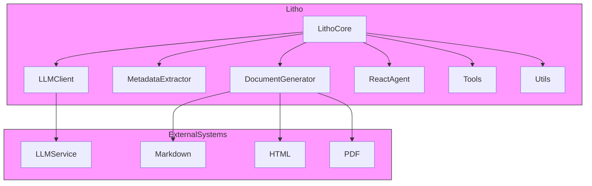
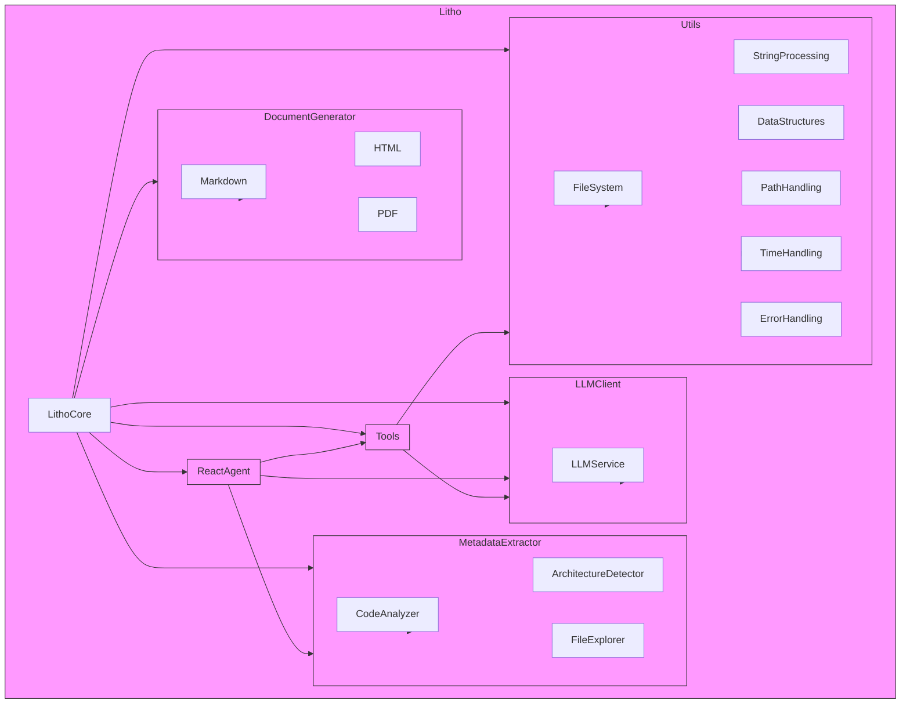
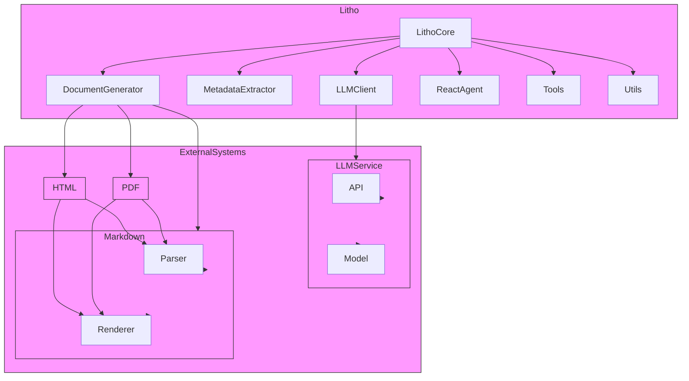
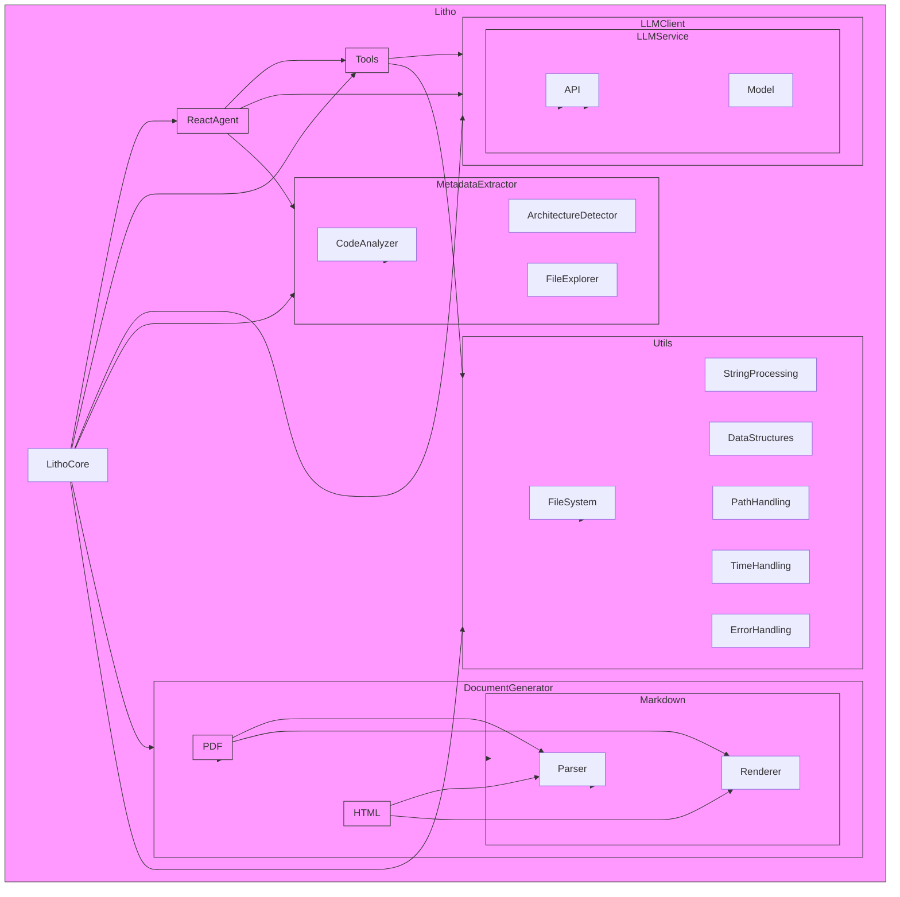

# Litho 系统架构文档

## 1. 系统上下文图

## 2. 容器图

## 3. 组件图

## 4. 代码图

## 5. 系统上下文图（详细版本）

## 6. 容器图（详细版本）

## 7. 组件图（详细版本）

## 8. 代码图（详细版本）

## 9. 系统上下文图（简化版本）

## 10. 容器图（简化版本）

## 11. 组件图（简化版本）

## 12. 代码图（简化版本）

## 13. 系统上下文图（简化版本）

## 14. 容器图（简化版本）

## 15. 组件图（简化版本）

## 16. 代码图（简化版本）

## 17. 系统上下文图（简化版本）

## 18. 容器图（简化版本）

## 19. 组件图（简化版本）

## 20. 代码图（简化版本）

