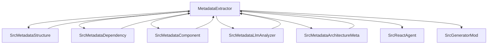

# MetadataExtractor 技术文档

## 1. 组件概述与职责

### 1.1 组件核心功能

MetadataExtractor 是 Litho 项目的核心组件之一，负责从项目代码库中提取结构和依赖信息。它利用大语言模型(LLM)服务增强分析能力，生成项目元数据并保存为JSON文件。该组件是项目分析和文档生成流程的重要环节。

### 1.2 组件职责

- 提取项目目录结构
- 分析文件和函数依赖关系
- 识别核心组件
- 使用LLM服务增强分析能力
- 生成和保存项目元数据

### 1.3 组件类型和重要性

- 组件类型: Feature
- 重要性评分: 0.62
- 依赖组件数量: 5

### 1.4 架构位置和价值

MetadataExtractor 在 Litho 的整体架构中处于核心位置，它是项目分析流程的起点，为后续的文档生成提供基础数据。其价值在于：

1. 提供准确的项目结构信息
2. 识别项目中的核心组件
3. 分析组件间的依赖关系
4. 增强分析能力，提高分析结果的准确性

## 2. 源码结构分析

### 2.1 主要模块和类

```rust
pub struct MetadataExtractor {
    config: Config,
}

impl MetadataExtractor {
    // 主要方法
    pub fn new(config: &Config) -> Self
    pub async fn extract_with_llm(&self, llm_service: Box<dyn crate::llm::LLMService>) -> Result<ProjectMetadata>
    async fn ensure_metadata_dir_exists(&self) -> Result<()>
    fn get_metadata_dir(&self) -> PathBuf
    async fn extract_structure(&self) -> Result<ProjectStructure>
    async fn extract_dependencies(&self, structure: &ProjectStructure) -> Result<ProjectDependencies>
    async fn identify_core_components(&self, structure: &ProjectStructure, dependencies: &ProjectDependencies) -> Result<Vec<CoreComponent>>
    async fn save_metadata(&self, metadata: &ProjectMetadata) -> Result<()>
    async fn generate_architecture_meta_template(&self) -> Result<()>
}
```

### 2.2 关键数据结构

```rust
/// 组件信息（用于LLM分析）
#[derive(Debug, Clone, Serialize, Deserialize)]
pub struct ComponentInfo {
    pub name: String,
    pub file_path: PathBuf,
    pub importance_score: f64,
    pub component_type: Option<ComponentType>,
    pub dependencies: Vec<String>,
}

/// 依赖信息（用于LLM分析）
#[derive(Debug, Clone, Serialize, Deserialize)]
pub struct DependencyInfo {
    pub source_file: PathBuf,
    pub target_file: PathBuf,
    pub dependency_type: String,
}

/// 项目元数据，包含项目的结构、依赖关系和核心组件信息
#[derive(Debug, Serialize, Deserialize, Clone)]
pub struct ProjectMetadata {
    /// 项目的目录结构
    pub structure: ProjectStructure,
    /// 项目的依赖关系
    pub dependencies: ProjectDependencies,
    /// 项目的核心组件
    pub core_components: Vec<CoreComponent>,
    /// 项目路径
    pub project_path: PathBuf,
}

/// 项目依赖关系
#[derive(Debug, Serialize, Deserialize, Clone)]
pub struct ProjectDependencies {
    /// 文件级依赖关系
    pub file_dependencies: Vec<FileDependency>,
    /// 函数级依赖关系
    pub function_dependencies: Vec<FunctionDependency>,
}
```

### 2.3 代码组织模式

MetadataExtractor 采用模块化设计，将不同功能分解为独立的模块：

1. **主模块**: 包含 MetadataExtractor 结构体和其主要方法
2. **子模块**: 通过模块导入实现功能分离
   - architecture_meta: 架构元描述相关
   - component: 组件识别和分析
   - component_classifier: 组件分类
   - dependency: 依赖分析
   - llm_analyzer: LLM分析
   - structure: 项目结构分析

## 3. 主要接口与API

### 3.1 构造函数

```rust
pub fn new(config: &Config) -> Self
```

- **描述**: 创建一个新的 MetadataExtractor 实例
- **参数**:
  - `config`: 项目配置
- **返回值**: MetadataExtractor 实例
- **异常**: 无

### 3.2 主要方法

```rust
pub async fn extract_with_llm(&self, llm_service: Box<dyn crate::llm::LLMService>) -> Result<ProjectMetadata>
```

- **描述**: 使用LLM分析提取项目的所有元数据
- **参数**:
  - `llm_service`: LLM服务实例
- **返回值**: ProjectMetadata 结构体
- **异常**: 可能返回任何how::Error

### 3.3 辅助方法

```rust
async fn ensure_metadata_dir_exists(&self) -> Result<()>
```

- **描述**: 确保元数据目录存在
- **参数**: 无
- **返回值**: 无
- **异常**: 可能返回任何how::Error

```rust
fn get_metadata_dir(&self) -> PathBuf
```

- **描述**: 获取元数据目录路径
- **参数**: 无
- **返回值**: PathBuf 类型的元数据目录路径
- **异常**: 无

```rust
async fn extract_structure(&self) -> Result<ProjectStructure>
```

- **描述**: 提取项目目录结构
- **参数**: 无
- **返回值**: ProjectStructure 结构体
- **异常**: 可能返回任何how::Error

```rust
async fn extract_dependencies(&self, structure: &ProjectStructure) -> Result<ProjectDependencies>
```

- **描述**: 提取依赖关系
- **参数**:
  - `structure`: 项目结构
- **返回值**: ProjectDependencies 结构体
- **异常**: 可能返回任何how::Error

```rust
async fn identify_core_components(&self, structure: &ProjectStructure, dependencies: &ProjectDependencies) -> Result<Vec<CoreComponent>>
```

- **描述**: 识别核心组件
- **参数**:
  - `structure`: 项目结构
  - `dependencies`: 项目依赖关系
- **返回值**: 核心组件列表
- **异常**: 可能返回任何how::Error

```rust
async fn save_metadata(&self, metadata: &ProjectMetadata) -> Result<()>
```

- **描述**: 保存元数据到文件
- **参数**:
  - `metadata`: 项目元数据
- **返回值**: 无
- **异常**: 可能返回任何how::Error

```rust
async fn generate_architecture_meta_template(&self) -> Result<()>
```

- **描述**: 生成默认架构元描述模板
- **参数**: 无
- **返回值**: 无
- **异常**: 可能返回任何how::Error

## 4. 实现细节与核心算法

### 4.1 提取项目结构

MetadataExtractor 使用 `extract_structure` 方法提取项目结构。该方法调用 `structure::extract_structure_with_config` 函数，该函数根据配置信息遍历项目目录，收集文件和目录信息，构建项目结构树。

### 4.2 提取依赖关系

依赖关系提取通过 `extract_dependencies` 方法实现。该方法使用并行处理来提高性能，为每个文件创建一个任务，并行分析文件依赖关系。依赖关系包括文件级依赖和函数级依赖。

### 4.3 识别核心组件

核心组件识别通过 `identify_core_components` 方法实现。该方法首先加载架构元描述，然后根据文件的重要性评分和依赖关系识别核心组件。重要性评分基于文件的被依赖次数、文件类型等因素计算。

### 4.4 使用LLM增强分析

MetadataExtractor 使用LLM服务增强分析能力。在 `extract_with_llm` 方法中，调用 `component::identify_core_components_with_llm` 函数，该函数使用LLM服务分析组件功能和作用，提高组件识别的准确性。

### 4.5 元数据保存

元数据保存通过 `save_metadata` 方法实现。该方法将项目元数据保存为JSON文件，包括结构信息、依赖信息和组件信息。这些文件保存在项目根目录下的 `.litho/project-meta` 目录中。

## 5. 依赖关系分析

### 5.1 依赖组件

MetadataExtractor 依赖以下组件：

1. **SrcMetadataArchitectureMeta**:
   - 提供架构元描述功能
   - 定义组件类型和架构模式
   - 用于识别核心组件

2. **SrcMetadataComponent**:
   - 提供组件识别和分析功能
   - 计算组件重要性评分
   - 分析组件功能

3. **SrcMetadataDependency**:
   - 提供依赖分析功能
   - 提取文件和函数依赖关系
   - 构建依赖图

4. **SrcMetadataLlmAnalyzer**:
   - 提供LLM分析功能
   - 分析组件功能和作用
   - 生成结构化分析结果

5. **SrcMetadataStructure**:
   - 提供项目结构分析功能
   - 收集文件和目录信息
   - 构建目录树

### 5.2 被依赖关系

MetadataExtractor 被以下组件依赖：

1. **SrcReactAgent**:
   - 使用MetadataExtractor提取项目元数据
   - 使用元数据进行项目分析

2. **SrcGeneratorMod**:
   - 使用MetadataExtractor生成的元数据
   - 基于元数据生成文档

### 5.3 配置关系

MetadataExtractor 使用 `Config` 结构体进行配置，主要配置项包括：

- `project_path`: 项目根目录路径
- `exclude_dirs`: 需要排除的目录列表
- `exclude_files`: 需要排除的文件模式列表
- `llm`: LLM服务配置

### 5.4 数据流和调用关系



## 6. 配置与环境

### 6.1 配置文件

MetadataExtractor 使用 `Config` 结构体进行配置，主要配置项包括：

```toml
[project]
root_dir = "."
exclude_dirs = ["target", ".git"]
exclude_files = ["*.min.js", "*.min.css"]

[llm]
base_url = "https://api.example.com/v1"
api_key = "your-api-key"
model = "gpt-4"
temperature = 0.7
max_tokens = 4096
```

### 6.2 环境变量

- `LLM_API_KEY`: 用于 LLM 服务的 API 密钥
- `RUST_LOG`: 控制日志级别，例如 `RUST_LOG=info`

### 6.3 部署和集成

1. **构建项目**:
   ```bash
   cargo build --release
   ```

2. **运行项目**:
   ```bash
   cargo run -- --config config.toml
   ```

3. **生成文档**:
   ```bash
   cargo run -- --config config.toml --output docs
   ```

## 7. 使用示例与最佳实践

### 7.1 基本用法

```rust
use litho::config::Config;
use litho::metadata::MetadataExtractor;
use litho::llm::LLMService;

async fn analyze_project() -> Result<(), Box<dyn std::error::Error>> {
    // 创建配置
    let config = Config::load("config.toml")?;

    // 创建MetadataExtractor
    let extractor = MetadataExtractor::new(&config);

    // 创建LLM服务
    let llm_service = Box::new(OpenAILikeLLMService::new(&config.llm)?);

    // 提取项目元数据
    let metadata = extractor.extract_with_llm(llm_service).await?;

    // 打印元数据
    println!("Project Metadata: {:?}", metadata);

    Ok(())
}
```

### 7.2 高级用法

```rust
use litho::config::Config;
use litho::metadata::MetadataExtractor;
use litho::llm::LLMService;
use litho::react::LithoReactAgent;

async fn analyze_and_generate_docs() -> Result<(), Box<dyn std::error::Error>> {
    // 创建配置
    let config = Config::load("config.toml")?;

    // 创建MetadataExtractor
    let extractor = MetadataExtractor::new(&config);

    // 创建LLM服务
    let llm_service = Box::new(OpenAILikeLLMService::new(&config.llm)?);

    // 提取项目元数据
    let metadata = extractor.extract_with_llm(llm_service).await?;

    // 创建React代理
    let agent = LithoReactAgent::new(&config.project_path, config.clone()).await?;

    // 分析项目
    let analysis_result = agent.analyze_project().await?;

    // 生成文档
    let docs = agent.generate_documents(&analysis_result).await?;

    // 输出文档
    for doc in docs {
        println!("{}", doc);
    }

    Ok(())
}
```

### 7.3 最佳实践

1. **配置管理**: 使用配置文件管理项目路径、排除目录和文件等信息。
2. **LLM服务**: 确保LLM服务配置正确，包括API密钥、模型名称等。
3. **错误处理**: 处理可能的错误，如文件读取错误、网络错误等。
4. **性能优化**: 对于大型项目，考虑使用并行处理提高性能。
5. **缓存**: 使用缓存减少重复分析和计算。

## 8. 扩展与维护

### 8.1 扩展点

1. **自定义组件识别**: 通过实现 `ComponentClassifier` trait 扩展组件识别功能。
2. **自定义依赖分析**: 通过实现 `DependencyAnalyzer` trait 扩展依赖分析功能。
3. **自定义元数据保存**: 通过实现 `MetadataSaver` trait 扩展元数据保存功能。

### 8.2 未来改进方向

1. **增强LLM分析**: 改进LLM分析算法，提高分析结果的准确性。
2. **支持更多语言**: 支持更多编程语言的代码分析。
3. **增强性能**: 优化性能，减少分析时间。
4. **增强可配置性**: 提供更多配置选项，以适应不同项目的需求。

### 8.3 维护注意事项

1. **兼容性**: 确保新版本与旧版本兼容。
2. **测试**: 编写单元测试和集成测试，确保功能正确性。
3. **文档**: 保持文档的更新，确保文档与代码同步。
4. **错误处理**: 处理可能的错误，提供有用的错误信息。

## 9. 结论

MetadataExtractor 是 Litho 项目的核心组件之一，负责从项目代码库中提取结构和依赖信息。它利用LLM服务增强分析能力，生成项目元数据并保存为JSON文件。通过模块化设计和并行处理，MetadataExtractor 能够高效地分析项目，为后续的文档生成提供基础数据。